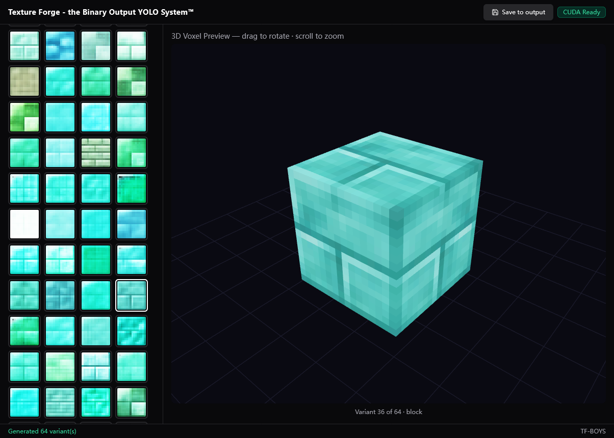
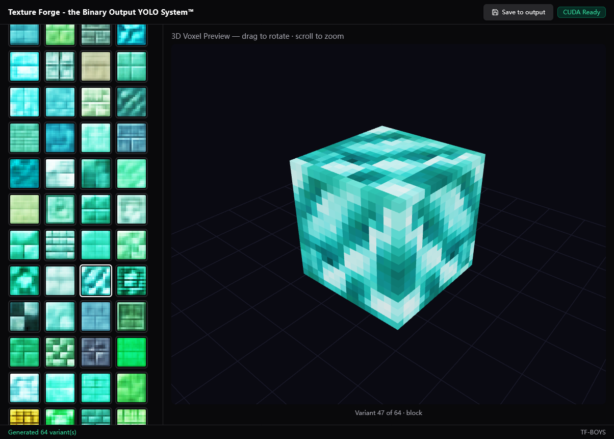
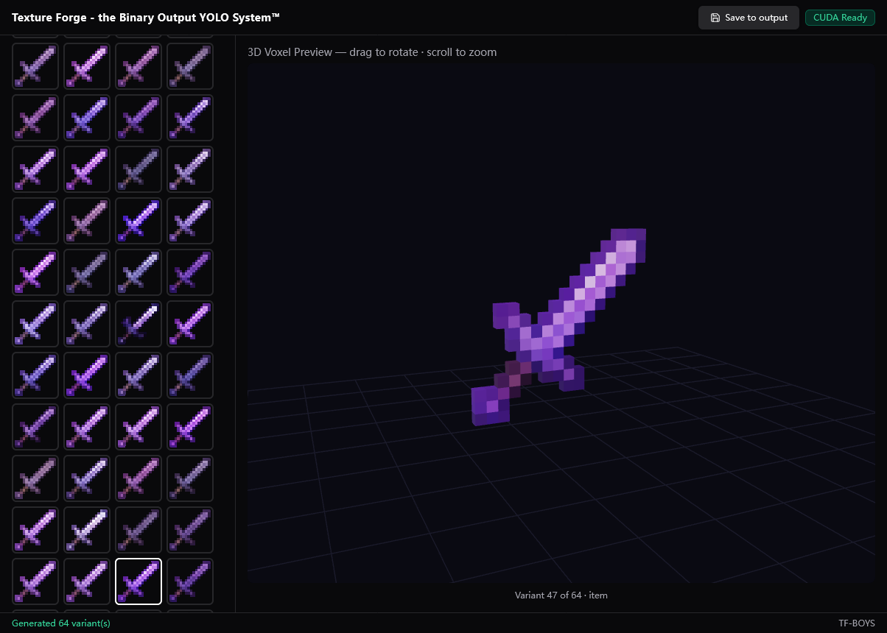
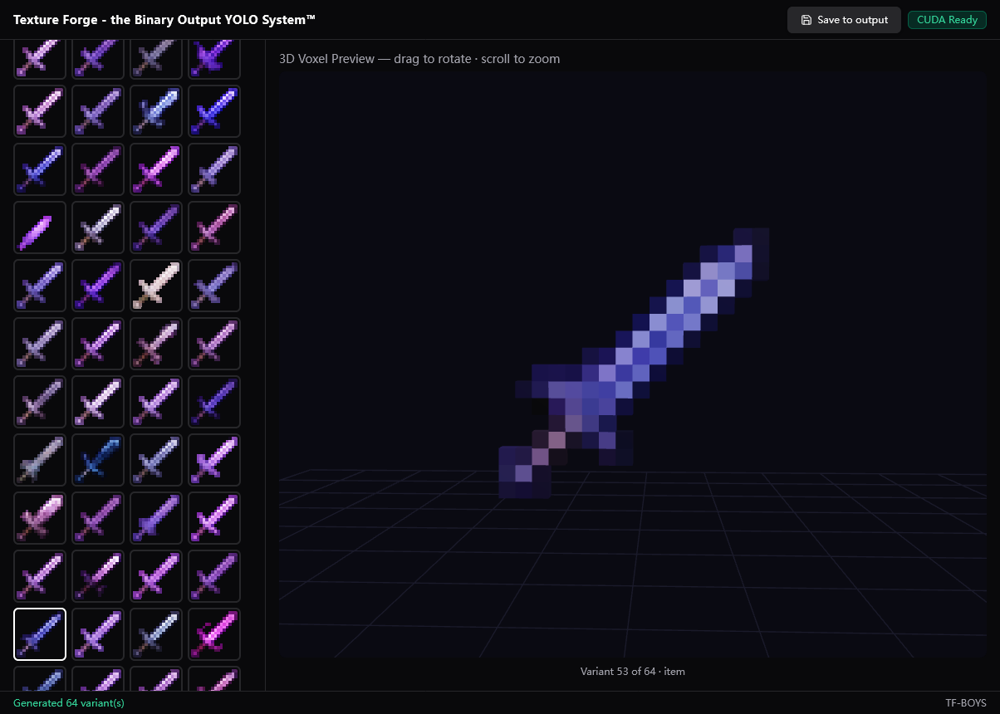
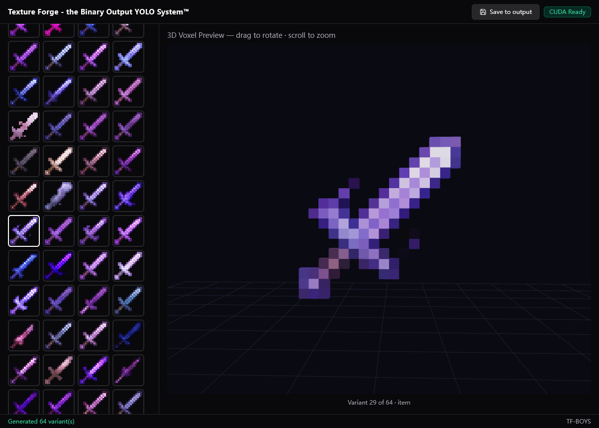
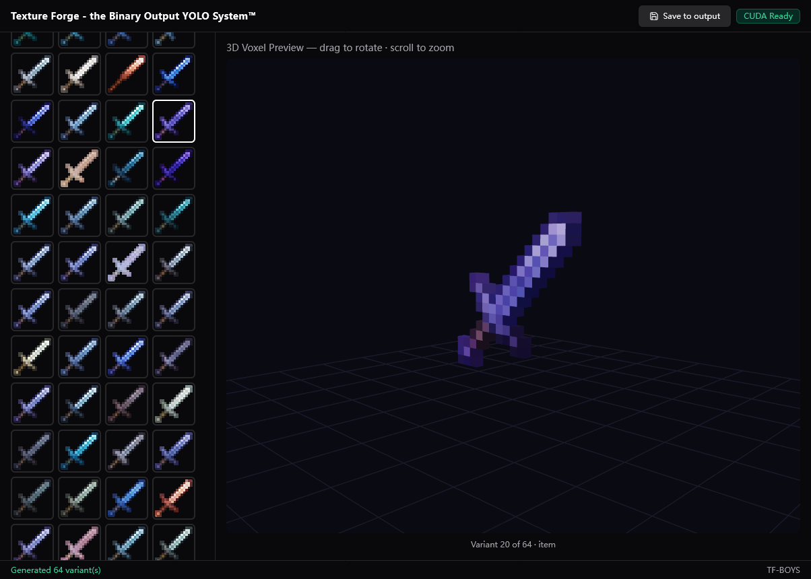

# TF-BOYS

| **Texture Forge - the Texture Forge - the Binary Output YOLO System**

文生Minecraft Mod 16x16贴图AI，基于[Transformer](https://github.com/huggingface/transformers)与[openai/clip-vit-base-patch32](https://huggingface.co/openai/clip-vit-base-patch32)。

<table>
  <tr>
    <td align="center">
      <br/>
      <sub><b>Diamond Brick (保守)</b></sub>
    </td>
    <td align="center">
      <br/>
      <sub><b>Diamond Bricks (激进)</b></sub>
    </td>
    <td align="center">
      <br/>
      <sub><b>Amethyst Sword (保守)</b></sub>
    </td>
  </tr>
  <tr>
    <td align="center">
      <br/>
      <sub><b>Amethyst Sword (中等)</b></sub>
    </td>
    <td align="center">
      <br/>
      <sub><b>Amethyst Sword (激进)</b></sub>
    </td>
    <td align="center">
      <br/>
      <sub><b>Moonlight Sword (保守)</b></sub>
    </td>
    <td></td>
  </tr>
</table>

## 安装

### 1. 安装Python 3.10+

### 2. 根据图形设备安装pytorch

#### NVIDIA GPU 4050+

```bash
pip install torch torchvision --index-url https://download.pytorch.org/whl/cu128
```

#### NVIDIA GPU 30X

```bash
pip install torch torchvision --index-url https://download.pytorch.org/whl/cu118
```

#### 无GPU（纯CPU模式）

```bash
pip install torch torchvision
```

### 3. 安装依赖：

```bash
pip install flask transformers pillow numpy
```

### 4. 启动

```bash
python main.py
```

一次运行时自动从HuggingFace下载模型（约 600MB），大陆网络可能很慢或失败，如果需要从大陆下载请配置代理。

启动后在浏览器打开 http://localhost:7860

## 使用

### GUI

- 在Prompt输入框输入要生成的材质的英文名例如Diamond Sword, Diamond Brick
- 选择类型（Item/Block）
- 设置Batch Size，最高64，也就是一次生成的数量，由于训练使用的mod质量参差不齐，可以尽可能调高一些然后手动挑选你最喜欢的
- 设置Temperature，越高越激进（引用mods风格，但是更容易出错，生成不稳定的图片），越低越接近原版风格。
- 生成之后点击Save to output会保存贴图到`web_output`目录下

### CLI

```bash
# 生成单张
python main.py generate "Diamond Ore"

# 生成 4 个变体
python main.py generate "Iron Sword" --n 4

# 指定类型为方块
python main.py generate "Grass Block" --category block

# 调低随机性（更保守）
python main.py generate "Gold Ore" --temperature 0.8

# 指定输出目录
python main.py generate "Emerald" --out_dir my_textures

# 自定义端口启动 Web 界面
python main.py --port 8080
```

| 如果使用cli，生成的文件保存在`output`目录，同时会输出16×16原图和256×256放大预览图。

## 已知问题

用于分词器限制只有接收英文Prompt时候工作正常，后续可能会训练中文支持版本。

## 鸣谢 & 免责声明

所有训练素材来自网络爬虫搜索的Minecraft Mod Jars，由衷地感谢以下所有Mod的作者。

### 关于训练数据

本项目AI模型通过对Minecraft Mod贴图资源进行机器学习训练而得。
所有用于训练的贴图资源，其版权归原 Mod 作者所有，与本项目无关。
本项目：

- 不包含、不分发、不再现任何原始 Mod 贴图文件
- 仅发布经过训练所得的模型权重（神经网络参数），不含原始训练数据
- 模型生成的贴图为 AI 创作的新内容，并非对任何原始贴图的复制或衍生
- 训练过程仅用于学术研究与非商业目的

本项目生成的贴图仅供个人学习、研究及非商业创作使用。用户应自行判断生成内容的使用合规性，本项目作者不承担因使用生成内容而产生的任何法律责任。

**如果您是 Mod 作者，认为本项目的训练方式侵犯了您的权益，请通过Issue与我联系，我将从训练数据中删除您的作品！**

**请注意：删除可能不是实时的，如果要删除应该会是在下一个权重文件版本发布时候删除，每次重新训练模型可能需要数天！**

训练资源来自：

| 1 | 2 | 3 |
| --- | --- | --- |
| ` rottenflesh-to-leather_1-20-x.jar` | `!!!Graphene-2.1.3-Forge1.19.4-1.20.2.jar` | `!configanytime-3.0.jar` |
| `!mixinbooter-10.7.jar` | `!mod-director-launchwrapper-1.9.1.jar` | `!Red-Core-MC-1.8-1.12-0.7.1.jar` |
| `+unimixins-all-1.7.10-0.2.1.jar` | `000.jar -1.20.1-2.5-multiplayer-fix.jar` | `0Pack2Reload-NeoForge-1.21.1-1.0.1.jar` |
| `1.0.0-better_maces-mod-1.21.11.jar` | `1.1.0-forge-1.16.5.jar` | `1.20-1.8.2.jar` |
| `1.20.1-convenient-hitboxes-1.0.5.jar` | `1.20.1-extensive-diamonds-1.3.6.jar` | `1.20.4-ComicsBubblesChat-1.3.4.jar` |
| `1.21-jains-desserts-2.0.0.jar` | `1.21-more-potions-2.0.1.jar` | `1.21-throwable-fluids-3.0.0.jar` |
| `1.21.11-macrokeybinds-fabric-1.3.1.jar` | `1.21.9-fabric-2.2.0-alpha.13+mc1.21.9.jar` | `1.3.1-TPA_mod-1.21.11.jar` |
| `1.3.5-backpacks_mod-1.21.11.jar` | `2032-world-height-1.2+mod.jar` | `3.1.0-BFT_mod-1.21.2-1.21.3.jar` |
| `3d-armor-0.9.3-mod.jar` | `3d-hands-1.0.0-mod.jar` | `3d_placeable_food-3.0.1-forge-1.21.11.jar` |
| `777-2.0.0d.jar` | `[1.20.1]MidnightMadness-2.0.jar` | `[1.20.6] Legendary Item 24.10.09 (Forge).jar` |
| `[1.21.1-Fabric] Hybrid Aquatic 1.5.5.jar` | `[1.21.5+]-elytrabombing-1.2.0.jar` | `[1.21.5-NeoForge] Additional Placements-2.3.1.jar` |
| `[1.21.8][Fabric] RPG-HUD-3.11.1.jar` | `[1.21.x] Horde Nights v1.3.14.jar` | `[1.21.x] Injured Effects v1.4.16.jar` |
| `[1.8.9] Lunar Keystrokes Mod v3-3.0.jar` | `[1.8.9] Toggle Perspective Fixed-1.0.jar` | `[26.1] SecurityCraft v1.10.1-beta1.jar` |
| `[26.1]witherswrath-1.15.3.jar` | `[___MixinCompat-0.8___].jar` | `[All Loader]Extra Recipe-2.4-26.jar` |
| `[Fabric] Hacker Menu v1 1.16.5.jar` | `[Fabric]ctov-3.6.3.jar` | `[FL]Flaming_NeoForge1.20.X_1.0.3.jar` |
| `[Forge1.20.1]TetraClip-1.0.6.jar` | `[MC 1.8.9] Danker's Skyblock Mod - 2.3.1.jar` | `[MC-1.20] Hide Key Binding v1.0.0.7 - 2025-3-31.jar` |
| `[MC-1.20] Key Binding Patch v1.3.3.5 - 2025-4-1.jar` | `[Neoforge 1.21.1] Better Zoom v2.7.0.jar` | `[NeoForge 1.21.1]MomentariyModder'Applications[8.2.0].jar` |
| `[neoforge-1.21.4]paintings_pack.jar` | `[NeoForge] Armadillo Scute Armor - MC 1.21 - 1.0.2.jar` | `[neoforge]imst-2.2.1c.jar` |
| `[PGC]Primogem Craft-26w11a-1.21.1-NeoForge.jar` | `[匠魂乐事] Tinkers-Delight-1.19.2FORGE-1.0.5.3.jar` | `_MixinBootstrap-1.1.0.jar` |
| `_NTM-Extended-1.12.2-3.0.3.jar` | ``FermiumBooter-1.4.1.jar` | `A Zombie Dinosaur 1.0.4 - 1.20.1 Beta.jar` |
| `a_good_place-1.20-1.2.8.jar` | `a_very_unpleasant_mod-1.1.0-forge-1.20.1.jar` | `aa4-atlas-1.1.2+1.21.jar` |
| `aaa-particles-fabric-1.21-1.4.12.jar` | `aaa_particles_world-neoforge-1.21-1.0.3.jar` | `aaron-mod-3.0.0-beta.3+1.21.11.jar` |
| `abandoned-mod1.21-1.21.4.jar` | `abandoned-villages-v1.0.1.jar` | `ability-upgrade-cobblemon-1.2.jar` |
| `abnormals_delight-1.21.1-6.0.1.jar` | `abridged-2.0.1-fabric-1.21.11.jar` | `absentbydesign-1.20.1-1.9.0.jar` |
| `AbsolutelyUnbreakable-2.0.1-1.20.1.jar` | `abverticaledition-1.0.4-mc1.17.jar` | `AC-Revitalized-1.21.1-4.4NF.jar` |
| `accelerated-decay-neoforge-21.0.0.jar` | `acceleratedrendering-1.0.8-1.20.1-alpha-fabric.3.jar` | `acceleratedrendering-1.0.8-1.20.1-alpha.jar` |
| `accents-forge-1.20.1-1.1.0.jar` | `accessible-step-neoforge-26.1-2.3.0+26.1.jar` | `accessories-fabric-1.1.0-beta.53+1.21.1.jar` |
| `accessories_cclayer-9.3.1-beta.28+1.21.1-neoforge.jar` | `accessories_compat_layer-fabric-0.1.12+1.21.1.jar` | `accessories_tclayer-3.10.0-beta.28+1.21.1.jar` |
| `accessorify-2.4.0-beta.5+1.21.10-fabric.jar` | `accurate_spears 2.2 FIXED - FABRIC 1.21.10.jar` | `AccurateBlockPlacement-Reborn-1.4.2+mc-1.21.9-1.21.11.jar` |
| `ACE_mc1.21.11-4.3.jar` | `aces_spell_utils-1.2.5-1.21.1.jar` | `AchievementOptimizer-neoforge-1.21.11-2.1.2.jar` |
| `aclodgrabber-2.0.2.jar` | `ActionBarInfo-fabric-2.0.0-alpha.2.2+mc1.21.8.jar` | `actually-camel-1.0.0.jar` |
| `actuallyadditions-1.3.25+mc1.21.1.jar` | `actuallyharvest-1.21.11-neoforge-1.1.7.0-NEOFORGE.jar` | `actuallyunbreaking-1.12.2-0.5.2.jar` |
| `Ad-Astra-Giselle-Addon-forge-1.20.1-6.20.jar` | `ad_astra-fabric-1.20.1-1.15.20.jar` | `ad_astra_extra_additions-1.20.1-1.1.1.jar` |
| `ad_astra_rocketed-forge-1.20.1-1.0.3.jar` | `ad_extendra-0.1.1.jar` | `ad_extendra-fabric-1.20.1-1.1.2.jar` |
| `adaptedorigins-1.19-2.3.0-FABRIC.jar` | `adaptive_performance_tweaks_1.21.1-11.6.1.jar` | `adaptive_performance_tweaks_core_1.21.1-11.6.1.jar` |
| `adaptive_performance_tweaks_gamerules_1.21.1-11.6.1.jar` | `adaptive_performance_tweaks_items_1.21.1-11.6.1.jar` | `adaptive_performance_tweaks_player_1.21.1-11.6.1.jar` |
| `adaptive_performance_tweaks_spawn_1.21.1-11.6.1.jar` | `AdaptiveTooltips-1.3.0-fabric-1.20.2.jar` | `additional-armoury-2.0.3+1.21.11.jar` |
| `additional_attributes-1.20.1-1.3.6-all.jar` | `additional_rpg_jewelry-neoforge-2.2.2+1.21.1.jar` | `additionaladditions-neoforge-10.0.2.jar` |
| `AdditionalBanners-Fabric-1.20.4-17.0.4.jar` | `AdditionalEnchantedMiner-1.21.1-neoforge-21.1.152.jar` | `additionalentityattributes-fabric-2.0.2+1.21.1.jar` |
| `additionallanterns-1.1.2a-forge-mc1.21.11.jar` | `AdditionalStructures-1.21.10-(v.8.1.1-NEO).jar` | `additionz-1.3.3.jar` |
| `addonapi-mc1.20.1-2.0.0.jar` | `addonslib-neoforge-1.21.11-1.0.jar` | `AddurDisc-Fabric-1.20.x-1.3.jar` |
| `adorable_eggs-NeoForge-1.21.6-1.0.1.jar` | `adorablehamsterpets-3.5.0-1.20.1+forge.jar` | `adorabuild-structures-2.11.0-fabric-1.21.11.jar` |
| `Adorn-7.2.1+1.21.9-neoforge.jar` | `adtetra-2.1.0 - 1.19.2.jar` | `advanced-hud-fabric-2.1.2+1.21.1.jar` |
| `AdvancedAE-1.3.3-1.20.1.jar` | `AdvancedBackups-spigot-1.21-3.7.1.jar` | `advancedcrosshair-1.2.4.jar` |
| `AdvancedLootInfo-fabric-1.21.11-1.8.2.jar` | `advancednetherite-neoforge-2.3.1-1.21.11.jar` | `AdvancedPeripherals-1.21.1-0.7.60b.jar` |
| `AdvancedReborn-1.21.10-1.3.8.jar` | `AdvancedRocketry-1.12.2-2.1.9-2.jar` | `AdvancedSkillsRe-forge-1.1.0-beta.1.jar` |
| `AdvancedTFCTech-NeoForge-1.21.1-3.1.jar` | `advancedtooltips-1.6.0+1.19.jar` | `advancement-count-v2.0.1.jar` |
| `advancementdisable-fabric-1.0.1+1.21.jar` | `advancementframes-1.20-2.2.8.jar` | `advancementinfo-1.20.4-fabric0.91.2-1.4.jar` |
| `AdvancementPlaques-1.21.4-forge-1.6.9.jar` | `advancements_fullscreen-quilt-2.0.0+mc1.21.11.jar` | `advancements_reloaded-0.12.0-neoforge-1.21.11.jar` |
| `advancements_tracker_1.20.1-6.1.0.jar` | `advancementscreenshot-1.21.11-5.2.jar` | `advancementssearch-mc26.1+1.3.jar` |
| `advdebug-2.3.0.jar` | `adventuredungeons-neoforge-1.21-1.3.1.jar` | `adventurez-1.5.0.jar` |
| `advgenerators-1.6.0.6-mc1.20.1.jar` | `AdvJS-2001forge-2.9.4.jar` | `ae2-emi-crafting-1.3.1.jar` |
| `AE2-MouseTweaks-Fix-2.0.0+1.20.1+fabric.jar` | `ae2importexportcard-1.21.1-1.4.3.jar` | `ae2omnicells-1.20.1-forge-1.1.1.jar` |
| `ae2qolrecipes-fabric-1.17.1-1.3.0.jar` | `ae2wtlib-19.4.1.jar` | `AEAdditions-1.21.1-6.0.2.jar` |
| `aeinfinitybooster-neoforge-1.21.1-1.0.0.54.jar` | `aeroblender-1.21.1-1.0.0-neoforge.jar` | `Aether Gravitation-1.1.6-1.20.1.jar` |
| `aether-1.21.1-1.5.11-fabric.jar` | `aether-redux-2.0.19-1.20.1-neoforge.jar` | `aether_emissivity-1.21.1-1.0.2-neoforge.jar` |
| `aether_enhanced_extinguishing-1.21.1-1.0.0-fabric.jar` | `aether_protect_your_moa-1.21.1-1.0.0-fabric.jar` | `aether_treasure_reforging-1.21.1-1.0.1-fabric.jar` |
| `aetherial-islands-2.0.2.jar` | `aethermobs-1.5.0-forge-1.20.1.jar` | `aethersdelight-0.1.4.2-1.21.1.jar` |
| `Aethersteel-v5.6-1.21.4.jar` | `AetherVillages-1.20.1-1.0.7-forge.jar` | `aetherworks-1.20.1-1.1.8.jar` |
| `afc-1.0.21-1.20.1.jar` | `affinity-0.1.13+1.21.1.jar` | `AFKFish-0.16.jar` |
| `aftershock-connector-1.20.1-0.0.8.jar` | `age_of_steam-1.21.1-1.0.19.jar` | `AgeingSpawners-1.21.11-10.0.0.jar` |
| `AgeOfWeapons - Reforged v.1.3.2c.jar` | `aggrofix-1.20.1-v2.0.1.jar` | `aggroindicator-neoforge-1.21.11-2.1.1.jar` |
| `ags_modernmarkings-0.4.4-1.20.1.jar` | `AI-Improvements-1.21.11-0.5.4.jar` | `ai-player-1.0.5.3-release+1.21.1.jar` |
| `aileron-1.21.1-fabric-1.1.4.jar` | `aiotbotania-1.20.1-4.0.8.jar` | `AirHop-v21.11.0-mc1.21.11-Fabric.jar` |
| `ait-1.2.12-release+mc.1.20.1.jar` | `aiutd-2.1.2+1.21.11-neoforge.jar` | `AkashicTome-1.8-30.jar` |
| `Alan's Unified Ui v-0.2.2 [Forge 1.20.1].jar` | `alcocraftplus-1.20-2.1.0-forge.jar` | `alekiNiftyShips-FORGE-1.20.1-1.0.14.jar` |
| `alekiRoofs-FORGE-1.20.1-1.0.4.jar` | `alexs-mobs-extra-music-1.1.0.jar` | `alexs_caves_delight-1.0.0-forge-1.20.1.jar` |
| `alexscaves-2.0.2.jar` | `alexscaves-2.0.9.jar` | `alexscaves_adventure-1.0.1-forge-1.20.1.jar` |
| `alexscaves_torpedoes-1.0.4.jar` | `alexscavesbettercombat.jar` | `alexsmobs-1.22.17.jar` |
| `alexsmobs-1.22.9.jar` | `alexsmobsinteraction-5.4-all.jar` | `Alfheim-1.6.jar` |
| `AlienEvo-1.1.2-fabric.jar` | `AlinLib-fabric-2.1.0-rc.6+mc1.21.9.jar` | `AliveAndWell-mc1.19.2-fabric-2.5.18-dev.jar` |
| `allarrowsinfinityfix-1.8.7-neoforge-mc1.21.11.jar` | `allay_upgrades-2.5.0.jar` | `alllootdrops-1.21.11-3.6.jar` |
| `allow-portal-guis-1.1.6.jar` | `alloy-forgery-neoforge-3.0.7+1.21.10.jar` | `alloy_smelter-neoforge-1.21.1-1.2.1.jar` |
| `alloyed-3.0.2+1.21.1-neoforge.jar` | `AllStackable-v2.1.0-1.21.jar` | `AllTheTrims-5.0.1-neoforge+1.21.jar` |
| `allurement-1.21.1-5.0.1.jar` | `Almanac-1.21.11-x-neoforge-1.6.2.jar` | `almostunified-fabric-1.20.1-0.11.0.jar` |
| `Alpha's Rise V3.3.1.jar` | `alphaskins-1.21-1.0.0.jar` | `alshanex_familiars-1.21.1_v2.0_HotFix.jar` |
| `alternate-current-mc26.1-1.9.0.jar` | `alternategunpowder-1.0.0-1.20.1.jar` | `alternative_twilight-1.20.1-1.1.0.jar` |
| `alternativeworldsavelocation-1.21.11-3.7.jar` | `altorigingui-1.1.3.jar` | `always-sprint-1.0.0-1.21.10.jar` |
| `always_eat-neoforge-1.1.0.jar` | `alwaysawitherskull-1.21.11-3.6.jar` | `AM2.5-LTS-1.6.7.jar` |
| `amarite-1.6.5-public+1.19.2.jar` | `amazingtrading-1.20.1-0.1.9-universal.jar` | `amber-neoforge-8.3.6+1.21.10.jar` |
| `AmbienceV2-1.21.jar` | `ambient_fireflies-mc1.20.1-v1.4.0.jar` | `ambientadditions-1.20.1-1.1.2.jar` |
| `AmbientEnvironment-neoforge-1.21.10-27.0.0.3.jar` | `AmbientSounds_FABRIC_v6.3.5_mc1.21.11.jar` | `amble-1.1.14-1.20.1+forge-beta.jar` |
| `amecs-bundle-1.6.3+mc26.1-rc-1.jar` | `Amecs-Reborn-2.0.2+mc1.21.6.jar` | `amendments-1.20-2.2.5.jar` |
| `amethyst_core-1.5.0+1.20.1.jar` | `amethyst_imbuement-1.20.1-19.8.jar` | `amethystequipment-v1.0.4-fabric-1.21.jar` |
| `amplifiednetherheight-1.3+1.21.11-mod.jar` | `amwplushies-fabric-1.21.8-5.0.3.jar` | `amyshield-2.5.1.jar` |
| `analog-1.2.2+1.21.jar` | `AnchorOptimizer-1.21.11.jar` | `ancient_aether-0.10.2.jar` |
| `ancient_manuscripts-1.1.8-1.20.1.jar` | `ancientreforging-1.8.4.jar` | `ancientsand-forge-1.0.8-1.21.jar` |
| `ancientstructures-fabric-1.20.1-0.0.14.jar` | `andromeda-2.0.0-1.20.1-build.107.jar` | `angelblockrenewed-forge-1.3-1.20.jar` |
| `angelica-2.1.9.jar` | `angling-1.0.1.jar` | `AngryMobs-26.1-9.0.0.jar` |
| `animageddon-0.3.3-1.21.1.jar` | `animal_armor_trims-merged-1.20.1-2.0.1.jar` | `animal_feeding_trough-1.2.0+1.21.11.jar` |
| `animal_pen-neoforge-1.21.11-2.3.1.jar` | `animalgarden-bullshark-1.1.1-fabric-1.20.1-0.92.7.jar` | `animalgarden-commonraven-1.0.0-fabric-1.21.5-0.128.2.jar` |
| `animalgarden-meerkat-1.0.5-neoforge-1.21.11-21.11.10-b.jar` | `animalgarden-owl-1.2.7-neoforge-1.21.11-21.11.10-b.jar` | `animalgarden-porcupine-1.0.4-fabric-26.1-0.142.2.jar` |
| `animalgarden-seaotter-1.1.0-fabric-1.21.5-0.128.2.jar` | `animalgarden_fennecfox-1.0.1-fabric-1.21.5-0.128.2.jar` | `animalgarden_manatee-1.0.0-fabric-1.20.1-0.92.6.jar` |
| `animalgarden_mouse-1.0.5-fabric-1.21.11-0.140.0.jar` | `animalgarden_redpanda-1.1.2-fabric-1.21.5-0.128.2.jar` | `animalhatmod-1.1.1-neoforge-1.21.1.jar` |
| `animated-logo-2.0.jar` | `animated-mojang-logo-2.1.jar` | `AnimatedTyping-1.21.11+1.0.0.jar` |
| `animatica-0.6.1+1.21.5.jar` | `animaticareforged-1.20.2-0.1.2.jar` | `Animation_Overhaul-fabric-1.20.x-1.3.1.jar` |
| `animatium-3.0+1.21.11-fabric.jar` | `anitensura-1.19.2-0.4.0.jar` | `annoyingdifficulty-1.0.4.jar` |
| `AnnoyingVillagers-0.2-forge.jar` | `AnnoyingVillagers-1.20.1-beta-1.4.4.jar` | `anomaly-2.1.0-forge-1.20.1.jar` |
| `anomaly_rephased-2.0.0b30.1-forge-1.19.2.jar` | `another_furniture-neoforge-4.0.2.jar` | `anti_creeper-4.0.jar` |
| `Anti_Mob_Farm-1.20.1-1.3.11.jar` | `antiblocksrechiseled-neo-26.1.1.1.jar` | `antighost-1.20.4-fabric0.91.2-1.1.5.jar` |
| `AntiGhost.jar` | `antiportals-neoforge-1.21.1-2.2.jar` | `antique-atlas-3.1.2+1.21.jar` |
| `antiqueatlas-7.1.1-forge-mc1.18.2.jar` | `antiquetradingship-1.0.0-Fabric 1.21.1.jar` | `antishulkerdupe-1.0.0.jar` |
| `antixray-neoforge-1.4.15+26.1-all.jar` | `anvianslib-forge-1.21-1.4.2.jar` | `anvilcraft-neoforge-1.21.1-1.6.0+snapshot.1656.jar` |
| `AnvilFix-19.2.1.jar` | `AnvilNeverTooExpensive-neoforge-1.21.5+-1.2.1.jar` | `AnvilRepairing-Fabric-1.20.4-7.0.9.jar` |
| `anvilrestoration-1.21.11-2.5.jar` | `anyfps-fabric-2.1.0.jar` | `anytag-1.0.1.jar` |
| `AoA3-1.21.1-3.7.16.1.jar` | `Aoneconfigbootstrap-1.12.2-forge-1.0.3.jar` | `aos_basic_fluid-1.21.1-1.0.3.jar` |
| `aos_workshop_expansion-1.21.1-1.3.2.jar` | `apathy-neoforge-1.21.1-2.7.2.jar` | `apec-1.5.0+mc1.21.9.jar` |
| `apexcore-26.1.0.jar` | `apocalypse-1.1.1_1.20.3-1.20.4.jar` | `Apocalypse-Rebooted-1.20.1-2.8.8-r-all.jar` |
| `apocalypsedrops-1.0.1-1.21.3.jar` | `apocalypsenow-3.0.5-forge-1.20.1.jar` | `apothiccombat-1.2.1.jar` |
| `AppleCore-3.3.9.jar` | `appleskin-fabric-mc1.21.11-3.0.8.jar` | `applied-botanics-fabric-1.5.2.jar` |
| `Applied-Mekanistics-1.4.3.jar` | `appliedcooking-4.0.0.jar` | `appliede-1.0.8-beta.jar` |
| `appliedenergistics2-26.1.5-alpha.jar` | `Apugli-2.10.4+1.20.1-forge.jar` | `aquacombat-1.2-1.19.4.jar` |
| `Aquaculture-1.21.11-2.8.7.jar` | `aquaculture_delight_1.0.1_forge_1.19.2.jar` | `Aquamirae Mod Boss Music Tweaks 1.20.1 v1.1.0 [FABRIC].jar` |
| `aquamirae-forge-1.20.1-6.2.0.jar` | `aquamirae_delight-2.0-forge-1.20.1.jar` | `aquatic_frontiers-1.7-neoforge-1.21.1.jar` |
| `aquatictorches-1.20.1-forge-1.1.1.jar` | `arachnids-connector-1.20.1-0.0.33.jar` | `arc-19.1.1-neoforge.jar` |
| `arcane_abilities-0.3.2.jar` | `arcaneessenceblock-1.0.1-neoforge-1.21.1.jar` | `ArcaneLanterns-v21.11.1-mc1.21.11-Fabric.jar` |
| `Arcanus-Fabric-0.112.10.jar` | `arcanus-legacy-2.1.0.jar` | `ArchaeologyBanners-Fabric-1.20.4-8.0.6.jar` |
| `archaicfix-0.7.9.jar` | `Archeological-neoforge-1.21.1-1.2.2.jar` | `archeologyplus-2.0.0.jar` |
| `archers-neoforge-2.7.0+1.21.1.jar` | `archers_expansion-fabric-1.5.1+1.21.1.jar` | `archers_paradox-1.20.1-5.0.0.17.jar` |
| `ArcheryExpansion-forge-1.20.1-1.0.7.3-all.jar` | `archipelagoadditions-2.4.0-1.18.2.jar` | `architects-palette-fabric-3.0.0.jar` |
| `architects_palette-neoforge-1.21.1-1.4.0-beta.5.jar` | `architecture_extensions-3.6.0+1.20.4.jar` | `architectury-19.0.1-neoforge.jar` |
| `archon-0.8.1.jar` | `Arda's Sculks 1.4.3.5 [FORGE] [1.20.1].jar` | `arda-regions-1.0.0.jar` |
| `ArdaGrass-1.2-1.20.1.jar` | `ArdaPaths-1.2.5.jar` | `areaeffectcloud3d-1.0.4.jar` |
| `areas-1.21.11-6.2.jar` | `Argentina's delight 1.20.1 (3.0 beta).jar` | `argonauts-fabric-1.20.1-1.0.10.jar` |
| `arlib-1.0.24.jar` | `armor-hider-fabric-0.8.21+mc-26.1-rc.1-2.jar` | `armor-hud-1.0.3.jar` |
| `armor-hud-numbers-1.1.0+1.21.9.jar` | `armor-indicator-5.0.1+1.21.2.jar` | `armor-stand-arms-v2.5.6.jar` |
| `armor-stand-editor-2.11.1+1.21.11.jar` | `armor_hud-0.8.1-1.21.9-1.21.11.jar` | `Armor_Hud-3.2-1.21.11.jar` |
| `armor_impact-0.3-forge-1.20.1.jar` | `armor_visibility-fabric-21.5.1.jar` | `armorchroma-1.2.11.jar` |
| `ArmorDamageLimit-Fabric-1.20.1-1.0.0.jar` | `armored-elytra-1.12.0.jar` | `armored_elytra-mc1.20.4-1.0.6-build.44.jar` |
| `Armorful-3.1.3+1.20.6.jar` | `ArmorHUD-1.1-1.12.2.jar` | `armorhud-8.1.1.3-1.21.11-neoforge.jar` |
| `armoroftheages-neoforge-1.21.1-1.5.7.jar` | `armorpointspp-neoforge-1.20.3-3.1.5.jar` | `ArmorPoser-neoforge-26.1-14.0.0.jar` |
| `armorstands-2.2.4+1.21.11.jar` | `ArmorStatues-v21.11.1-mc1.21.11-NeoForge.jar` | `armortip-26.1.jar` |
| `ArmorTrimItemFix-neoforge-1.21.11-2.1.5.jar` | `armory-neoforge-1.3.0+1.21.1.jar` | `armour-durability-1.21.11.jar` |
| `armourersworkshop-forge-1.16.5-3.2.7-beta.jar` | `armourweight-1.7.jar` | `Aroma1997DimensionFix-1.1.jar` |
| `ArPhEx-5.0.2-forge-1.19.2.jar` | `arrow-entity-loot-drop-1.2.4+1.21.11.jar` | `arrowcollector-mc1.18-1.20-v0.0.2.jar` |
| `arrp-0.12.1+build.4.jar` | `arrzees-multiverse-v1.3.2-PUBLIC.jar` | `ars_additions-1.21.1-21.3.0.jar` |
| `ars_artifice-1.20.1-2.0.4.jar` | `ars_controle-1.21.1-1.6.15.jar` | `ars_creo-1.20.1-4.3.0.jar` |
| `ars_nouveau-1.21.1-5.11.3.jar` | `ars_ocultas-1.21.1-2.4.0.jar` | `ars_polymorphia-1.0.3.jar` |
| `ars_unification-1.2.18.jar` | `arsdelight-2.1.9.jar` | `arsenal-0.1.5-1.20.1.jar` |
| `arsenal-fabric-1.4.2+1.21.1.jar` | `arseng-2.1.1-beta.jar` | `art_of_forging-1.8.5-1.20.1.jar` |
| `arthropocolypse-1.0.6.jar` | `artifacts-fabric-13.2.0.jar` | `artifactscrafting-1.1.0-RPG.jar` |
| `artifality-0.6.1+1.20.jar` | `arts_and_crafts-neoforge-1.21.1-1.5.3.jar` | `arts_and_crafts_compat-forge-1.20.1-1.4.0.jar` |
| `ascended_quark-1.20.1-1.1.6.jar` | `ash_api-fabric-21.6.0-beta.jar` | `ashvehicle-4.3-8.8-SNAPSHOT.jar` |
| `AsmodeusCore-1.12.2-1.0.5.jar` | `aspects-1.0.9-1.20.x.jar` | `astemirlib-1.20.1-1.25.jar` |
| `asteorbar-neoforge-1.21.11-1.5.3.jar` | `asteroid-0.3.4.jar` | `astikorcarts-1.19.2-1.1.2.jar` |
| `astikorcartsredux-1.2.2.jar` | `Astraeus_mercy-1.2.jar` | `astrocraft-1.5.1+1.20.1.jar` |
| `astronomical-1.0.1+1.19.2.jar` | `async-locator-fabric-1.19.4-1.3.1.jar` | `async-neoforge-0.2.0+alpha-1.21.11.jar` |
| `async-pack-scan-0.2.14.jar` | `AsyncParticles-2.4.0-beta.3+1.20.1.jar` | `ATFMD-0.5.8-1.20.4.jar` |
| `athena-fabric-1.21.6-4.4.1.jar` | `ATi Structures V1.4.4 (1.21+).jar` | `ATi Structures Vanilla V1.4.4 (1.21+).jar` |
| `Atlas-Lib-1.21.0-1.1.14.jar` | `atmosfera-2.5.5+mc1.21.11.jar` | `atmospheric-1.21.1-7.0.1.jar` |
| `attachmentsapi-1.1.4.8.jar` | `attackthroughgrass-forge-2.1.0-1.21.11-all.jar` | `AttributeFix-Fabric-1.20.1-21.0.5.jar` |
| `atum-1.1.3+22w13oneblockatatime.jar` | `audio_engine_tweaks-1.2.14+MC26.1-rc-3 build 5.jar` | `audioplayer-fabric-2.1.1+26.1.jar` |
| `audition-1.0.1-1.20.1.jar` | `auditory-0.0.5-1.19.3.jar` | `auditory-0.0.7-1.21.1.jar` |
| `AureljPaintings-1.0.5-1.21.x-fabric.jar` | `Auroras-1.21.3-1.6.2.jar` | `auth-reauth-0.3.0-1.21.11.jar` |
| `auth-v1.6.2.jar` | `authme-neoforge-9.1.0+1.21.11.jar` | `auto-aim-v1.4.2.jar` |
| `auto-elytra-2.1.3.jar` | `auto-plant-crop-1.4.1.jar` | `auto-totem-1.21.11-1.2.4.jar` |
| `auto_attack-neoforge-3.0.1.jar` | `auto_mod_forge-1.0.0.jar` | `auto_third_person-forge-1.12.2-2.3.jar` |
| `autoattack-mc1.20.4-v1.3.7.jar` | `AutochefsDelight-1.21.1-Fabric-2.1.0.jar` | `autoclicker-neoforge-21.11.0.jar` |
| `autofish-1.1.3.jar` | `autofish-1.20.jar` | `autofishingdeluxe-2.2.3.jar` |
| `AutoGG_Reimagined-1.8.9-forge-1.2.1.jar` | `autohud-8.11+1.21.9-fabric.jar` | `autolec-mc1.21.11-1.0.28.jar` |
| `automaticdoors-1.21.11-5.0.jar` | `AutomaticMemories-1.1.2-1.21.jar` | `automessage-merged-1.21.9-3.0.0.jar` |
| `automobility-0.5.0.h+1.21.1-neoforge.jar` | `automodpack-mc26.1-neoforge-4.0.5.jar` | `autoreconnect-2.2.1.jar` |
| `autoreconnectrf-fabric-3.0.0-beta.1+26.1.jar` | `AutoRegLib-1.8.2-55.jar` | `autorelog-1.0.2+1.21.11.jar` |
| `autorun-mc1.21.9-v1.3.1.jar` | `autoslabs-1.1.3.jar` | `autosprintfix-1.0.0.jar` |
| `autoswitch-neoforge-15.0.0.jar` | `autotag-2.0.2+1.20.jar` | `autotools-fabric-3.4.1.jar` |
| `autototem-1.0.6.jar` | `autototem-1.21.10-1.21.11.jar` | `autowardensubtitles-fabric-2.0.12.jar` |
| `autumnity-1.21.1-6.0.1.jar` | `auudio_fabric_1.0.3_MC_1.20.jar` | `ava-1.21.1-neoforge-2.9.1.jar` |
| `avaritia-0.3.1.jar` | `AvaritiaNeo-1.20.1-1.1.3.jar` | `Aviator Dreams 2.0.1-2 1.20.1-Forge.jar` |
| `aw_generators-1.21.1-1.0.11.jar` | `aw_npc-1.21.1-0.3.6.jar` | `aw_vehicles-1.21.1-1.0.9.jar` |
| `aw_worksite-1.21.1-0.2.3.jar` | `awesoft_technologies-0.3.5.jar` | `awesomedungeon-forge-1.21.9-3.2.0.jar` |
| `awesomedungeonend-forge-1.21.9-3.1.1.jar` | `awesomedungeonnether-forge-1.21.9-3.1.1.jar` | `awesomedungeonocean-forge-1.21.9-3.3.0.jar` |
| `AxesAreWeapons-1.9.5-fabric-1.21.11.jar` | `Axiom-5.3.0-for-MC1.21.8.jar` | `axolotl-item-fix-1.1.11.jar` |
| `axolotlbuckets-1.5.1+1.21.9.jar` | `AxolotlClient-3.1.9+1.8.9.jar` | `aylyth-1.19.2-2.0.1.jar` |
| `azurelib-fabric-1.21.1-3.1.4.jar` | `azurelibarmor-neo-1.21.1-3.1.3.jar` | `azurepaxels-fabric-1.21.1-1.0.4.jar` |
| `baby-legends-cobblemon-2.3.jar` | `backpacked-world-of-color-3.0.1.jar` | `backported_wolves-forge-1.20.x+2.0.0.jar` |
| `backrooms-1.1.0.jar` | `backslot-1.3.0.jar` | `backslotaddon-1.1.2.jar` |
| `backtools-1.19.4-2.jar` | `backupbeds-1.0.0.jar` | `BackupManager-neoforge-1.21.5-1.0.1.jar` |
| `bactromod-3.6.jar` | `Bad Dreams V1.0.9 NeoFORGE(1.21.1).jar` | `badgebox-neoforge-1.3.0.jar` |
| `badhorsefix-neoforge-3.0.1.jar` | `badmobs-neoforge-1.21.1-21.1.1.jar` | `BadOptimizations-2.4.1-1.21.11.jar` |
| `badpackets-neo-0.12.1.jar` | `BagOfHolding-v21.11.0-mc1.21.11-NeoForge.jar` | `baguettelib-1.20.1-Forge-1.1.6.jar` |
| `bagus_lib-26.1-25.0.0.jar` | `ball-stickers-1.3.1.jar` | `Ballistix-1.20.1-1.0.1-0.jar` |
| `balm-forge-26.1-26.1.0.2.jar` | `bambooeverything-neoforge-21.1.2+mc1.21.1.jar` | `banhammer-0.16.2+1.21.11.jar` |
| `banner-bedsheets-1.9.1.jar` | `banner-flags-3.0.1.jar` | `barbeques-delight-1.1.0.jar` |
| `barbequesdelight-1.2.2.jar` | `barebackhorseriding-1.21.11-2.4.jar` | `BareRuins-1.7.10.jar` |
| `Barrels_2012-NeoForge-1.21.1-3.0.0.jar` | `barriers-dont-block-rain-1.0.6.jar` | `Barsita-1.20-1.1.2-Forge.jar` |
| `BarteringStation-v21.11.0-mc1.21.11-Fabric.jar` | `base-1.12.2-3.14.0.jar` | `BasicShields-1.4.1-1.20.2.jar` |
| `basicweapons-1.2.13+1.21.4.jar` | `Basket-Fabric 1.20.1.jar` | `batsgalore-forge-1.20.1-1.2.3.jar` |
| `battle-towers-1.3.0.jar` | `BattleArts-20.10.7.10.jar` | `battlearts_api-21.15.8.2a.jar` |
| `battlemusic-1.21-1.1.1.jar` | `BaublesExpanded-2.2.1.jar` | `baublesreforked-1.0.3.jar` |
| `baubley-heart-canisters-1.21.11-1.6.0.jar` | `bazaarutils-0.6.2-beta.1+mc1.21.10.jar` | `bbb-fabric-2.0pre4.jar` |
| `bbe-1.3.1.jar` | `BBOutlineReloaded-2.6-1.21-fabric.jar` | `bbs-1.20.1-0.1.3-quilt.jar` |
| `bbs-1.7.7-1.20.1.jar` | `bc_particle-0.0.4-fabric-1.20.1.jar` | `bcgmusic-1.1.0-1.20.1.jar` |
| `bclib-21.0.13.jar` | `bdlib-1.27.0.8-mc1.20.1.jar` | `bdo-1.0.0.jar` |
| `BeaconOverhaul-1.8.4+1.20.jar` | `beansbackpacks-1.21-f-0.12-beta.jar` | `BeansBackpacks-fabric-1.20.1-2.0.2.jar` |
| `beautifiedchatclient-1.21.11-2.8.jar` | `beautifiedchatserver-1.21.11-3.1.jar` | `beautify-2.0.0+1.20.1.jar` |
| `beautify-neoforge-1.21.1-2.0.2.jar` | `BEB-NeoForge-1.21.10-6.0.0.jar` | `BedBenefits-Fabric-1.20.1-13.0.4.jar` |
| `BedBreakBegone-1.0.2.jar` | `Bedrock Plus Mod-forge-1.21.10-1.9.2.jar` | `bedrock-miner-v1.4.8-mc1.21.11.jar` |
| `bedrockify-1.11.5+mc1.21.11.jar` | `bedrockoid-0.1.1.jar` | `bedrockwaters-1.8.0+1.20.1.jar` |
| `Bedrodium-0.4.0.jar` | `bedspreads-neoforge-9.0.0+1.21.5.jar` | `BedWar-0.1.7.Pre.1.jar` |
| `beekeeperhut-fabric-3.0.2+mc1.21.11.jar` | `beekeeperhut-neoforge-3.0.2+mc1.21.11.jar` | `beenfo-1.18.2-fabric0.47.10-1.3.3-spigot.jar` |
| `BehindYouV3-1.12.2-forge-3.2.2.jar` | `bellsandwhistles-0.4.7-1.21.1.jar` | `beltborne_lanterns-1.2.5-fabric+1.21.jar` |
| `BendableCuboidsForge-2.0.1+mc.1.21.11.jar` | `bending-fabric-mc1.21.11-3.15.0.jar` | `bendy-lib-fabric-4.0.0.jar` |
| `Beneath-NeoForge-1.21.1-2.0.1.jar` | `benssharks-1.3.0-forge-1.20.1.jar` | `bento_box-0.1.0+1.21.jar` |
| `beproud-0.1.1.jar` | `berezka_api-1.2.8.1-lite-fabric-1.21.x.jar` | `berry_good-1.21.1-8.0.1.jar` |
| `berrypouch-neoforge-1.21.1-0.5.4-beta.jar` | `berserker_rpg-neoforge-2.6.0+1.21.1.jar` | `bestylewither-fabric-mc1.21.1-1.8.0.jar` |
| `beta-nether-V1-1.20.jar` | `beta-portable-tables-1.0.0.jar` | `Better Cave Dweller-1.20.1-fabric.jar` |
| `Better Crafting Recipes.jar` | `better-babies-0.8.5.jar` | `better-boat-movement-2.5.4-1.21.9+neoforge.jar` |
| `better-bundle-1.5.3-mc1.21.11.jar` | `better-cave-worlds-1.1.9.jar` | `better-clouds-1.12.0-alpha+26.1-fabric.rev.a919419.jar` |
| `Better-Combat-Bewitchment-Compat.jar` | `better-compatability-checker-neoforge-26.1.0-0.jar` | `Better-Crossbows-Neoforge-1.21.1-1.0.0.jar` |
| `better-deepslate-ore-drops-2.jar` | `better-enchanted-books-1.20.6-2.0.6-beta.jar` | `better-end-21.0.11.jar` |
| `better-end-sky-0.3.0+1.21.10.jar` | `better-hanging-signs-6.0.jar` | `better-lush-caves-1.3.3.jar` |
| `better-mipmaps-0.2-1.21.11.jar` | `better-nether-21.0.11.jar` | `better-pie-chart-1.1.0+1.21.9.jar` |
| `better-ping-display-fabric-1.21.11-1.2.0.jar` | `Better-Renames-2.0.0.jar` | `better-respawn-forge-2.0.6+26.1.jar` |
| `better-selection-1.8.jar` | `better-sniffers-4.5.jar` | `better-snow-coverage-0.4.2+mc1.21.11.jar` |
| `better-snowy-biome-v2.5.1.jar` | `better-suggestions-1.21.1-1.2.7.1.jar` | `better-trees-1.9.2.jar` |
| `better-trim-tooltips-1.0.1.jar` | `better-underground-caves-v0.2.jar` | `better-waypoints-v2.2.0.jar` |
| `better_client-neoforge-8.4.1.jar` | `better_climbing-fabric-5.jar` | `Better_Dogs_X_Doggy_Talents_Next_v1.2.2 [Fabric] - [1.20-1.20.1].jar` |
| `better_experience-1.2.1.jar` | `better_farming_right_click-fabric-1.0.1.jar` | `better_hp-2.0.5-1.21.1.jar` |
| `better_log4j_config-1.2.0-fabric.jar` | `better_mcdonalds_mod-neoforge-4.5.0+1.21.11.jar` | `better_modlist-1.1.22.jar` |
| `better_resource_pack_sorting-mc1.20.4-1.0.1-build.10.jar` | `better_smithing_table-2.1.0+1.21.6-neoforge.jar` | `Better_Sword_Trims-Neoforge-1.21.1-1.0.0.jar` |
| `better_tooltips-1.0.3.jar` | `better_weaponry-1.1.3-forge-1.20.1.jar` | `better_with_time-2.0.2.jar` |
| `BetterAddServer-1.21.9-neoforge-1.3.0.jar` | `BetterAdvancements-NeoForge-1.21.11-0.4.8.51.jar` | `BetterAnimationsCollection-v21.11.0-mc1.21.11-Fabric.jar` |
| `betterarcheology-neoforge-1.21.1-1.3.4.jar` | `betterbeaconplacement-1.21.11-3.5.jar` | `BetterBeacons-NeoForge-1.21.1-2.1.1.jar` |
| `BetterBeds-1.0.0.jar` | `betterbeds-fabric-1.4.1.jar` | `betterbiomeblend-1.19.0-1.3.6-forge.jar` |
| `betterbiomereblend-1.6.0.jar` | `betterblockz-0.2.7-1.20.1-forge.jar` | `BetterBuildersWands-1.10.2-0.11.1.220+f8232fe.jar` |
| `BetterBurning-Forge-1.20.1-9.0.3.jar` | `BetterCapes-1.5+1.21.11.jar` | `betterchat-1.0fix.jar` |
| `betterchat-1.5-for-1.12.2.jar` | `bettercombat-extension-2.11.0.jar` | `bettercombat-fabric-3.0.1+1.21.11.jar` |
| `BetterCommandBlockUI-0.5.3-1.21.11.jar` | `betterconduitplacement-1.21.11-3.4.jar` | `BetterControls-1.21.11+v1.6.4.jar` |
| `BetterCopper 1.20.1-1.3.jar` | `BetterCraftables_v7.0.0+mod_mc26.1.jar` | `betterdays-1.21.11-neoforge-3.3.6.3-NEOFORGE.jar` |
| `BetterEnd-20.0.8.jar` | `betterend-crashed-ships-1.0.0.jar` | `betterendcities-vanilla-1.21.3.jar` |
| `betterendcitiesvanilla-1.21.5-1.0.0.jar` | `betterendelytrafix-fabric-1.0.0-1.21.1.jar` | `betterf1-fabric-26.1-1.1.jar` |
| `betterf3-1.20-1.0.0.jar` | `BetterF3-17.0.0-NeoForge-1.21.11.jar` | `betterf3plus-1.20.2-1.0.0.jar` |
| `BetterFlight-1.20.1-forge-2.2.0.jar` | `betterfog-1.19.2-1.1.2.jar` | `BetterFoliageRenewed-NeoForge-1.21-6.0.jar` |
| `BetterFullscreen-v2.3.0_01-mc1.20.1.jar` | `BetterFurnacesReforged-1.20.1-1.1.2518.1-fabric.jar` | `BetterFusionReactor-1.21.1-1.5.9rc1.jar` |
| `BetterGrassify-1.8.3+fabric.1.21.11.jar` | `BetterHeroPackReloading-1.7.10-1.0.2.jar` | `betterhiddenchat-1.2.0.jar` |
| `BetterHitboxes-1.0+1.21.8.jar` | `BetterHitreg-1.0.5+1.21.11.jar` | `BetterHud-fabric+1.21.11-1.14.2-SNAPSHOT-441.jar` |
| `betterhurtcam-1.12.0+mc1.21.11.jar` | `BetterHurtCam-2.2.0.jar` | `betterimpaling-4.0+1.21.11.jar` |
| `betterinvisibility-1.21.11-1.0.6.jar` | `betterladdersmod-0.0.3.1.21.jar` | `betterleads-1.2.3+1.20.4.jar` |
| `betterlightning-1.1.0-1.20.4.jar` | `betterlily-1.20-1.3.2-fabric.jar` | `bettermobcombat-fabric-1.20.1-1.3.0.jar` |
| `BetterModsButton-v21.11.0-mc1.21.11-NeoForge.jar` | `bettermounthud-1.3.0.jar` | `betternightvision-1.0.4+1.21.1-fabric.jar` |
| `betterp2p-1.5.2.jar` | `betterpets-v.4.3.2.jar` | `betterpickaxetrims-fabric-1.20.1-1.0.0.jar` |
| `BetterPingDisplay-1.21.11-1.2.0.jar` | `betterpipes-1.21.1-3.0.2.jar` | `betterplayeranimations-1.20.x-1.0.0.jar` |
| `bettersafebed-neoforge-1.21.3-1.jar` | `BetterSavedHotbars-1.3.9.jar` | `betterscreens-2.0.11+1.21.11-fabric.jar` |
| `bettershieldsounds-1.9.2+mc1.21.11.jar` | `bettersleeping-0.6.2+1.19.jar` | `betterspawnercontrol-1.21.11-4.7.jar` |
| `BetterSprint-1.0.1.jar` | `BetterSprinting-1.16.3-v3.2.0.jar` | `betterstats-5.0.0+neoforge-1.21.11.jar` |
| `bettertab-2.1.5+1.21.11.jar` | `BetterTab-neoforge-1.21.8-1.0.0+build.13.jar` | `BetterTabs-1.0.4.jar` |
| `bettertaskbar-neoforge-mc1.20.2-1.8.0.jar` | `BetterThanMending-2.2.5.jar` | `BetterThirdPerson-neoforge-1.21.5-1.9.0.jar` |
| `BetterTitleScreen-fabric-1.21.10-1.14.3.jar` | `BetterTotemOfUndying-NeoForge-1.20.4-2.1.1.jar` | `BetterTridents-v21.11.0-mc1.21.11-Fabric.jar` |
| `bettertrims-4.0.4+1.21.10-fabric.jar` | `bettervillage-forge-1.21.9-3.3.1-all.jar` | `betterwithminecolonies-1.20.0-1.21.1.jar` |
| `betterworldloading20-1.0.jar` | `bewisclient-3.1.3-1.21.5.jar` | `bewitchment-1.20-10.jar` |
| `bewitchment-tweaks-1.0.0.jar` | `Beyond-Earth-1.20.1-7.0-PRERELEASE.jar` | `beyonddimensions-26.1-neoforge-0.7.8.jar` |
| `BeyondEnchant-1.7.0.jar` | `BHMenu-NeoForge-1.21.11-2.4.4.jar` | `bia-1.0.1-1.21-neoforge.jar` |
| `bibliobiomes-1.21.1-1.6.1.jar` | `bibliocraft-1.21.1-1.6.5.jar` | `bibliowoods-1.21.1-1.6.2.jar` |
| `Big Globe-5.2.1-MC1.21.11.jar` | `big-globe-yungs-better-desert-temples-compatibility-1.0.jar` | `big-globe-yungs-better-dungeons-compatibility-1.0.jar` |
| `big-globe-yungs-better-jungle-temples-compatibility-1.0.jar` | `big-globe-yungs-better-nether-fortresses-compatibility-1.1.jar` | `big-globe-yungs-better-ocean-monuments-compatibility-1.0.jar` |
| `big-globe-yungs-better-strongholds-compatibility-1.1.jar` | `big-globe-yungs-better-witch-huts-compatibility-1.0.jar` | `bigbrain-1.20.1-1.7.6.jar` |
| `bigcontraptions-neoforge-1.0.jar` | `bigger-stack-size-v2.3.3.jar` | `bigger_ae2-1.20.1-1.3.7.jar` |
| `bigger_end_cities-1.21.5-1.1.1.jar` | `biggerspongeabsorptionradius-1.21.11-3.7.jar` | `biggerstacks-1.20.1-2026.02.27-all.jar` |
| `bigpony-1.13.1+1.21.11.jar` | `BigShot-neoforge-1.21.11-18.0.2.jar` | `bigsignwriter-1.6.4+26.1-fabric.jar` |
| `bind-1.5.2-1.21.1.jar` | `bingo-2.9.7+mc1.21.11.jar` | `binocularsmod-1.02.jar` |
| `bio_delight-1.0.1.jar` | `biobutchers-delight-2.10(DP).jar` | `biofactory-forge-1.20.1-0.6.0.jar` |
| `biolith-neoforge-3.6.0-alpha.1.jar` | `biomancy-forge-1.20.1-2.9.0.1-alpha.0.jar` | `biome_golems-neoforge-2.0.jar` |
| `biomeinfo-1.21.11-21.jar` | `biomemakeover-FORGE-1.20.1-1.11.4.jar` | `biomemoss-1.2.2.jar` |
| `BiomeParticleWeather-5.3.4.jar` | `biomereplacer-2.2.1-pinkeen-neo.jar` | `BiomesOPlenty-fabric-1.21.11-21.11.0.32.jar` |
| `biomespawnpoint-1.21.11-2.5.jar` | `biomespy-neoforge-1.21.1-1.3.3.jar` | `biomestats-v1.0.1.jar` |
| `birds-boids-1.3.1+1.21.5.jar` | `bits_n_bobs-0.0.44.jar` | `bitsandchisels-2.7.3.jar` |
| `bl_accessories_layer-1.2.2-fabric+1.21.jar` | `blabber-1.6.2-mc1.20.1-standalone.jar` | `BlackwolfLibrary-neoforge-1.21.11-1.1.3.jar` |
| `blades_derby-1.0.3.jar` | `blahaj-quilt-1.20.4-0.3.0.jar` | `blahaj-replushed-4.0.0+1.21.11.jar` |
| `blahaj-totem-1.7.4+1.21.11.jar` | `blahaj_1.19-0.6.3.jar` | `blanket-client-tweaks-1.1.4.jar` |
| `blast-1.13.5-1.21.11.jar` | `Blastcraft-1.20.1-0.6.0-1.jar` | `blasting-plus-1.4.1.jar` |
| `blastingclay-1.21.11-neoforge-1.2.jar` | `blastingraw-1.21.11-neoforge-3.2.jar` | `blastingsand-neoforge-1.21.10-12.4.jar` |
| `blastingstone-1.21.11-neoforge-2.2.jar` | `Blaze-1.21.4-d5512be.jar` | `blaze-attack-animation-1.0.jar` |
| `BlazingBamboo-Forge-1.20.1-1.0.1.jar` | `blended-compat-1.1.2.jar` | `blendium-1.0.1+mc1.20.x.jar` |
| `blinkload-forge-1.2.1+mc1.20-1.20.1.jar` | `Block Swap-forge-1.19.2-2.0.0.1.jar` | `Block-Crafting-1.19.2-1.0.1.jar` |
| `block-entity-extended-rendering-3.1.0.jar` | `block-factory-s-biomes-1.0.5b-1.20.1.jar` | `block_factorys_bosses-2.0.11-neo-1.21.1.jar` |
| `BlockFront-1.21.1-0.8.0.7b-RELEASE.jar` | `blockhighlight-1.21.4-2.6.jar` | `BlockMeter-1.19-1.21.11.jar` |
| `blockofsky-quilt-1.20.1-0.3.0.jar` | `blockomorph-1.21.11-fabric-10.0.1.jar` | `BlockRunner-v21.11.0-mc1.21.11-Fabric.jar` |
| `blockus-2.16.0+26.1.jar` | `blocky-bubbles-2.0.0+1.21.11.jar` | `Blood N' Particles v1.4.0 - Fabric 1.21.6.jar` |
| `bloodmagic-1.20.1-3.3.5-47.jar` | `bloodybits-1.3.2-1.20.1.jar` | `blooming-biosphere-v1.1.12.jar` |
| `blossom-blade-1.2.jar` | `blossom-forge-1.20.1-1.0.7.jar` | `blossom-homes-2.2.11+1.21.11.jar` |
| `blossom-lib-2.5.18+1.21.11.jar` | `blossom-tpa-2.2.12+1.21.9.jar` | `bloxysstructures-1.17.2-neoforge-1.21.4.jar` |
| `blue-archive-halo-2.0.0-alpha.8+1.20.1+forge.jar` | `blue_skies-1.20.4-1.3.32.jar` | `blueflame-1.21.1-1.1.1.jar` |
| `bluemap-5.17-sponge.jar` | `blueprint-1.21.1-8.0.8.jar` | `blur-fabric-6.2.0+1.21.8.jar` |
| `blur-forge-3.1.1+mc1.18.2.jar` | `blurperfected-neoforge-5.3.2-rev.3+1.21.11.jar` | `BN-Blood-Particles-1.20.1-2.0.0.jar` |
| `boat-fall-1.2.1.jar` | `BoatBreakFix-Universal-1.0.2.jar` | `BoatCam-0.1.1-1.21.4.jar` |
| `boathud-1.2.1.jar` | `boatiview-neoforge-0.0.8-1.21.11.jar` | `boatload-1.21.1-6.0.2.jar` |
| `boats-up-stairs-3.2.jar` | `boatview360-v1.0.5-mc1.19.4-forge.jar` | `bobberbegone-1.0.0+1.16.5-1.19.x.jar` |
| `bobby-5.2.11+mc1.21.11.jar` | `bocchud-0.4.0+mc1.21.11.jar` | `bodacious-berries-2.1.4+mc1.21.1.jar` |
| `BodiesBodies-1.0.1.jar` | `bodyhealthsystem-0.3.6.jar` | `boggedspawn-1.21.11-1.1.jar` |
| `boh-0.0.9-forge-1.20.1.jar` | `boids-2.0.1+1.21.11.jar` | `boiled_reimagined-1.0.12-forge-1.20.1.jar` |
| `bombbarrage-2.0-1.20.1.jar` | `BOMD-1.10.2-1.21.1.jar` | `BOMD-Forge-1.21-1.3.2.jar` |
| `Bonfires-1.21.1-1.2.20b-neoforge-88de527.jar` | `bookofdragons-1.21-1.20.1.jar` | `Bookshelf-Fabric-1.20.1-20.2.15.jar` |
| `bookshelfinspector-fabric-2.3+26.1-pre.2.jar` | `bookwyrms-1.20.1-1.2.0.jar` | `boosted-brightness-2.2.0+1.20.1.jar` |
| `borderless-mining-1.1.9+1.20.2.jar` | `borderless-neoforge-1.21.1-1.7.5_1-all.jar` | `BorderlessWindowedVulkan-1.0.0+1.21.11.jar` |
| `Born In A Barn 1.8-1.12-1.2.jar` | `born_in_chaos_[Neoforge]_1.21.1_1.7.4.jar` | `borninconfiguration-3.1.3-all[FORGE].jar` |
| `boss_checklist-neoforge-4.1.0.jar` | `bossominium-18.6.jar` | `Botania-1.20.1-451-FORGE.jar` |
| `botanical-pots-2.3.jar` | `BotanicalMachinery-1.20.1-3.0.9.jar` | `BotanyPots-Fabric-1.20.1-13.0.43.jar` |
| `botanypotsmystical-neoforge-1.21.1-21.1.11.jar` | `BotanyPotsOrePlanting-Fabric-15.16.0+1.18.2-1.20.4.jar` | `botanypotstiers-fabric-1.21.1-7.0.10.jar` |
| `BotanyTrees-Fabric-1.20.1-9.0.20.jar` | `botarium-fabric-1.20.1-2.3.4.jar` | `bots_lib-4.1.1.jar` |
| `bottledair-1.21.11-2.5.jar` | `bottleyourxp-1.21.11-3.5.jar` | `bounced-4.1.4-neoforge.1.21.1.jar` |
| `bouncierbeds-1.21.11-2.5.jar` | `Bountiful-6.0.4+1.20.1-fabric.jar` | `Bountiful-Critters-1.20.1-1.5.0.jar` |
| `bountifulbaubles-1.6.3.jar` | `bountifulfares-neoforge-1.21.1-3.0.5.jar` | `bovinesandbuttercups-2.2.12+1.21.1-fabric.jar` |
| `BowInfinityFix-1.21.9-fabric-3.1.2.jar` | `BoxLib-neoforge-20.0.0-20.0.0.jar` | `boy_and_the_bath-3.4.0-neoforge-1.21.1.jar` |
| `BQ_Multiblock_Structure_Integration-1.0.9.jar` | `BQTweaker-1.3.5.jar` | `brainierbees-1.9.jar` |
| `brainrot-5.0.jar` | `brandedlogs-neoforge-2.2.0+1.21.3.jar` | `BrandonsCore-1.21.1-3.2.1.309.jar` |
| `brazier-forge-6.1.1.jar` | `brazil_legends-1.7.0-neoforge-1.21.1.jar` | `braziliandelight-fabric-3.0.0+1.21.1.jar` |
| `brb-1.10.0-rc5+1.21.jar` | `breakfree-1.5.0.jar` | `breedablekillerrabbit-1.21.11-3.8.jar` |
| `breezy-1.20.1-1.2.2.jar` | `bren-0.4.2-1.20.1.jar` | `Brendon's Bottlecaps-neoforge-1.2.2.jar` |
| `brewery-0.14.0+1.21.11-rc2.jar` | `brewinandchewin-3.0.6+1.20.1.jar` | `BrewinAndChewin-fabric-4.4.2+1.21.1.jar` |
| `BridgingMod-2.6.4+1.21.11.neoforge-release.jar` | `brightness-aura-1.5.2+1.21.11.jar` | `brightness-plus-1.21.11.jar` |
| `brightnessslider-forge-1.0-1.20.jar` | `brigo_ornithe-1.1.1+1.12.x.jar` | `brokenleadwarner-1.2.0+1.21.6.jar` |
| `bronze-neoforge-2.1.6+1.21.11.jar` | `BroomsModUnofficial-Fabric-1.21.1-1.2.0.jar` | `brrp-fabric-1.0.4-1.20.6.jar` |
| `Brutal_Nightmare-5.6.jar` | `brutality-0.8.4-1.20.1.jar` | `BruteForceRenderingCulling-fabric-1.20.6-0.5.12.jar` |
| `BRVSB-1.0.1-mc1.20.jar` | `BS_addon_neoforge-1.21.1-1.2.0.jar` | `bsvsb-2.0.5.jar` |
| `BTP-Forge-1.20.1-2.0.0.jar` | `btwce-3.0.2.jar` | `btwr-core-0.33.5-1.21.1.jar` |
| `btwr-shared-library-0.8.2.jar` | `bubusteinmoneymod-NeoForge-mc1.21.8-11.0.12.jar` | `bucketable-3.3.jar` |
| `bucketlib-neoforge-1.21-4.1.6.0.jar` | `BuckshotRoulette-1.1.5.jar` | `BugJump-1.2.0-1.20.1.jar` |
| `bugtorch-1.2.14.jar` | `build_tools-1.0.1+1.21.jar` | `buildcraft-A-1.5.2-3.7.4.jar` |
| `buildcraft-compat-8.0.0.jar` | `buildersaddition2-neoforge-1.21.1-2.1.1.jar` | `BuildersDelight-1.20.1-v.1.3.jar` |
| `BuildGuide-1.21.11-0.4.8.jar` | `BuildingWands-neoforge-MC1.21.11-3.0.2.jar` | `BuildPaste_Fabric-1.21.11v1.8.1.jar` |
| `builtin-servers-2.1+1.20-fabric.jar` | `bulktrade-1.0.0.jar` | `bulletarmorenchant-1.1-1.20.1 .jar` |
| `bundle-api-neoforge-1.1.0.jar` | `bundle-crafting-backport-1.1.jar` | `bundle-recipe-1.21.1-v1.1.0.jar` |
| `BundleInventory-Fabric-1.7.3.jar` | `bundles-beyond-1.6.0+1.21.8+fabric.jar` | `burnt-1.9.1.4-forge-1.20.1.jar` |
| `burnt-basic-1.9.4-neoforge-1.21.1.jar` | `burrowers-1.3-1.20.1.jar` | `bushierflowers-0.0.3-1.21.jar` |
| `butchercraft-2.6.5.jar` | `Butchersdelight beta 1.20.1 2.1.0.jar` | `Butchersdelight Foods beta 1.20.1 1.0.3.jar` |
| `butchery-4.7.1-forge-1.20.1.jar` | `butterflies-7.3.1.jar` | `Butters-CreateQuarkRecipe-1.16.5.jar` |
| `buzzier_bees-1.21.1-7.0.1.jar` | `bwncr-neoforge-1.21.1-3.20.3.jar` | `bwt-hc-tweaks-1.4.5.jar` |
| `byg-1.3.6.jar` | `bygonenether-1.20-1.3.2.jar` | `c2me-fabric-mc26.1-0.3.7+alpha.0.59.jar` |
| `c2me-neoforge-mc26.1-0.3.7+alpha.0.84.jar` | `c2meF-0.2.0+alpha.12-all.jar` | `c3me-fabric-mc1.20.1-0.2.0-c3me-alpha.11.61.jar` |
| `cable_facades-1.21.1-NeoForge-1.6.5.jar` | `cabletiers-fabric-1.21.1-0.6.9.jar` | `cadmus-fabric-1.20.1-1.0.8.jar` |
| `caelum-1.1.1+ArdaCraft.jar` | `caelum-1.20.1-2.0.0.0.jar` | `caelus-neoforge-8.0.1+1.21.4.jar` |
| `caerula_arbor-0.10.8-forge-1.20.1.jar` | `cagedmobs-1.20.2-neoforge-2.0.7.jar` | `cakechomps-neoforge-12.2.0+1.21.10.jar` |
| `CakeDelight-fabric-1.21.5-v4.0.0.jar` | `cakescosmetics-1.21.1-0.3.0.jar` | `calcmod-1.5.0+paper.1.21.10.jar` |
| `Call to Battle 3.jar` | `Call to Battle Vehicles.jar` | `call-your-horse-v1.6.3.jar` |
| `call_of_drowner-0.1.1-forge-1.20.1.jar` | `call_of_yucutan-1.0.13-forge-1.20.1.jar` | `calmdowndog-1.1.0-1.21.jar` |
| `camera-neoforge-1.1.8+26.1.jar` | `CameraEnhancements-0.2.13.jar` | `CameraOverhaul-v2.0.6-neoforge+mc[1.21.9-1.21.10].jar` |
| `cameraoverhaulneoforge-1.5.2.jar` | `Camerapture-1.10.12+mc1.20.1-forge.jar` | `CameraTweaks-1.11.2-1.21.11.jar` |
| `camerautils-fabric-1.1.2+26.1.jar` | `cammies-minecart-tweaks-1.12.jar` | `camp-fires-cook-mobs-1.8.0+MC1.21.11.jar` |
| `Campanion-forge-1.19.2-4.1.2+forge.jar` | `campfirebackport-1.7.10-1.11.3.jar` | `campfirespawnandtweaks-1.21.11-4.1.jar` |
| `CampfireTime-1.0.2-1.20.1.jar` | `camping-fabric-1.21.1-2.1.4.jar` | `camps_castles_carriages-2.3.4.jar` |
| `can-i-mine-this-block-1.4.0.jar` | `canary-mc1.20.4-0.3.3.jar` | `cannibal-1.0.5-1.20.1.jar` |
| `cant_breathe-1.19.2-2.0.7.jar` | `canvas-fabric-20.2.2641.jar` | `cape-provider-5.2.0.jar` |
| `capes-1.5.10+26.1.jar` | `capet-mace-fix-1.0.jar` | `Capsule-1.21.1-9.0.117.jar` |
| `capturexp-neoforge-1.7.3-1.3.0.jar` | `car-neoforge-1.0.46+26.1.jar` | `caracal-fabric-1.20.4-2.4.0.jar` |
| `caramelChat-mc1.21.9-neoforge-1.2.2.jar` | `caravans-forge-1.20.1-1.5.1.jar` | `CarbonConfig-Neoforge-1.21-1.2.9.6.2.jar` |
| `Cardboard-1.20.jar` | `Cardiac-NEOFORGE-0.5.3.4+1.21.jar` | `Cardinal Sins 1.0.3.jar` |
| `cardinal-components-api-8.0.0-alpha.4+26.1-rc-2.jar` | `carpet-ams-addition-v26.1.2-mc26.1.jar` | `carpet-extra-1.21.6-1.4.176.jar` |
| `carpet-extra-extras-1.21.11-1.3.2.jar` | `carpet-fixes-1.20-1.17.0.jar` | `carpet-mct-addition-1.21.5-0.1.3.jar` |
| `carpet-org-addition-mc1.21.9-v1.41.4-2603062241.jar` | `carpet-pvp-1.21.11-15.7+v260325.jar` | `carpet-pvp-1.21.5-1.4.0+v260116.jar` |
| `carpet-tis-addition-v1.76.0-mc26.1-snapshot-6.jar` | `carpeted-1.20-1.4.jar` | `carpetskyadditions-1.20.6-4.4.2.jar` |
| `CarpetTCTCAddition-all-2.2.212+46263e3-stable.jar` | `carrasconlib-fabric-1.20.1-0.1.jar` | `carrot_rarity-0.3-1.20.1.jar` |
| `carryon-neoforge-1.21.1-2.2.4.4.jar` | `carryonextend-architectury-fabric-1.5.1.jar` | `CarryOnVSCompat-Fabric-1.20.1-1.0.0.jar` |
| `cartoon_dweller-1.19.2.jar` | `Carved Wood-fabric-1.21.1-1.8.2.jar` | `casinorocket-1.0.0.jar` |
| `CastIronGrill-NeoForge-1.21.1-3.1.jar` | `castle_dungeons-4.0.0-1.20-forge.jar` | `CasualnessDelight-0.4.jar` |
| `cat_jam-fabric-mc1.21.2-1.3.1.jar` | `cat_vision-1.4-1.21.11.jar` | `cataclysm_dimension-neoforge1.21.1-1.6.2.jar` |
| `cataclysm_spellbooks-1.1.11-1.21.jar` | `cataclysm_tools-2.0.0-neoforge-1.21.1.jar` | `cataclysm_weaponery-3.0.0-neoforge-1.21.1.jar` |
| `cataclysmic_crab_spawn.jar` | `cataclysmiccombat-1.4.jar` | `catchindicator-fabric-1.4.2.jar` |
| `catchlevelcap-forge-0.3.3.jar` | `catchrate-display-neoforge-2.8.3.jar` | `catenary-0.6.1.jar` |
| `Catharsis-1.0.0-beta.13-1.21.11.jar` | `catloaf-1.1.2-1.21.3-NEOFORGED.jar` | `cauldron-dyeing-1.0.12.jar` |
| `CauldronConcretePowder_quilt_mod.jar` | `Caupona-1.21.1-0.5.3.jar` | `Cave-Delight-1.20.1-2.0.1.jar` |
| `cave_dust-3.0.1.jar` | `cave_dweller-1.19.4.jar` | `cave_dweller-1.20.1-1.7.0.jar` |
| `cavedweller-1.3.0.jar` | `caveoverhaul-nf-1.21.4-1.3.3.1.jar` | `caverns_and_chasms-1.20.1-2.0.0.jar` |
| `caves__canyons-2.0.jar` | `cavespiderspawn-1.21.11-1.2.jar` | `caxton-neoforge-26.1-0.10.0-beta.1.jar` |
| `cbc_at_Forge_1.20.1_0.1.3b.jar` | `cbc_nukes-2.1.1.jar` | `cbcmodernwarfare-0.0.6c+mc.1.20.1-forge.jar` |
| `cbmnfieldlab-fabric-2.0.2.jar` | `CBMultipart-1.21.1-3.5.0.155.jar` | `CC-3.0-beta-1.21.1.jar` |
| `cc-restitched-1.102.0.jar` | `cc-tweaked-1.21.1-fabric-1.117.1.jar` | `cc_vs-1.20.1-fabric-0.6.5.jar` |
| `ccbr-1.2.0-backport-forge-1.20.1.jar` | `cccbridge-mc1.21.1-v1.7.2-neoforge.jar` | `ccw-v1.3.0-mc1.21.1.jar` |
| `ceilingtorch-1.21.10-1.33.jar` | `celesteconfig-forge-1.20.1-1.1.2.jar` | `celestial_1.21_neoforge-2.0.jar` |
| `celestisynth-1.20.1-1.3.4-all.jar` | `celestria-neoforge-2.0.0.jar` | `Cell-Forge-1.19.4.jar` |
| `cem-0.8.0.jar` | `centered-crosshair+1.21.11-1.4.0.jar` | `CerbonsAPI-NeoForge-1.21.6-1.5.0.jar` |
| `certain_questing_additions-neoforge-1.1.5+mc1.21.1.jar` | `cerulean-fabric-1.0.0-1.21.1.jar` | `cfarmersint-1.0.jar` |
| `ChainVein-4.9.0.jar` | `chairsontrains-fabric-1.20.1-1.0.0.jar` | `chalk-1.6.11.jar` |
| `chalk-3.1.0+1.21.10.jar` | `chalk-colorful-addon-2.1.1.jar` | `chamber_clarity-4.0.0-1.20.1.jar` |
| `champions-forge-1.18.2-2.1.6.3.jar` | `champions-neoforge-1.21.5-2.1.11.1.jar` | `ChanceCubes-1.21.1-5.0.2.517.jar` |
| `Changed-m1.20.1-v0.15.2-all.jar` | `ChangedAddon-m1.20.1-2.8.0-all.jar` | `chaosawakens-1.16.5-0.12.1.1.jar` |
| `charge_jump-1.2.jar` | `ChargedExplosives-1.20.1-1.0.0-1.0.0.jar` | `Chargers-1.21.1-7.0.0.3.jar` |
| `charm-fabric-1.20.1-forked-6.0.25.jar` | `charm-fabric-1.21-7.0.28.jar` | `charm_fixer-1.0.0.jar` |
| `charmofundying-neoforge-9.1.0+1.21.1.jar` | `charmonium-fabric-1.21-7.0.0.jar` | `charta-1.1.0-fabric-1.21.1.jar` |
| `chas-1.21-3.0-neoforge.jar` | `chat-binds-1.0.0.jar` | `chat_heads-1.2.2-fabric-1.21.9.jar` |
| `chat_highlight_n_sound-1.0.1.jar` | `chatanimation-fabric-1.21.11-1.1.3.jar` | `chatcalc-4.2.5.jar` |
| `chatcoords-0.4.2338-forge.jar` | `ChatImage-1.4.7+1.21.6+neoforge.jar` | `ChatImpressiveAnimation-neoforge-1.5.0+mc1.20.6.jar` |
| `chatnotify-fabric-3.0.0-beta.2+26.1.jar` | `chatpatches-8.0-alpha.7+1.21.11-fabric.jar` | `chatplus-fabric-2.8.1.jar` |
| `ChatShot (1.21.11-fabric)-1.0.8.jar` | `chatsigninghider-fabric-1.0.5+26.1.jar` | `chatsounds-1.1.11.jar` |
| `Chatting-1.8.9-forge-2.0.6.jar` | `chattools-v2.3.19+1.16.5-fabric.jar` | `cheaper-maps-1.2.jar` |
| `chefs-delight-1.0.4-fabric-1.20.1.jar` | `cherishedworlds-neoforge-15.2.0+1.21.11.jar` | `cherry-villages-1.1.2.jar` |
| `chestcavity-2.17.2.1.jar` | `chestedcompanions-1.3.3-1.21.8-FABRIC.jar` | `chestpack-backpacks-1.51.jar` |
| `chestsearchbar-neoforge-1.21.11-1.7.0.jar` | `chesttracker-2.6.7+1.20.1.jar` | `chesttracker-2.8.1+1.21.11.jar` |
| `chesttracker-2.8.1-beta.1+26.1.jar` | `chicken-nerf-1.5.1+MC1.21.11.jar` | `ChickenChunks-1.21.1-2.12.0.103.jar` |
| `chickensshed-neoforge-1.6.1+mc1.21.jar` | `chime-1.5.0.jar` | `chineseflyingislandtower-1.1.1-fabric-1.21.11.jar` |
| `chipped-fabric-1.20.1-3.0.7.jar` | `ChippedExpress-universal-20x.jar` | `chisel-neoforge-2.2.0+mc1.21.11.jar` |
| `ChiseledBookshelfVisualizer-4.2.2.jar` | `ChiselsBitsTFC-1.0.0-forge-1.20.1.jar` | `chloride-NEOFORGE-mc1.21.1-v1.7.5.jar` |
| `choccos_mobs-0.2.2-neoforge-1.21.8.jar` | `chococraft-1.21.11-fabric-0.16.1.jar` | `chorus-links-1.9.3+1.21.11.jar` |
| `Choups Drakvyrn Mod (v3.0.4) for 1.20.1.jar` | `christmas-culinary-decorations-2.0.0-fabric-1.20.1.jar` | `chrysalis-0.5.7.jar` |
| `chunkactivitytracker-fabric-1.0.1-1.20.1.jar` | `ChunkAnimator-1.21-1.3.7.jar` | `ChunkByChunk-forge-1.19.2-2.2.3.jar` |
| `ChunkDebug-2.7.0+26.1.jar` | `chunkloaders-1.2.9a-forge-mc1.12.jar` | `chunksavefix-fabric-1.0.0-1.20.1.jar` |
| `chunksfadein-forge-3.0.20-1.20.jar` | `chunkumulator-1.1.1+MC1.20.1.jar` | `chunky-extended-3.0.0.jar` |
| `Chunky-Fabric-1.4.55.jar` | `ChunkyBorder-Fabric-1.2.24.jar` | `cicada-cape-fix-1.0.0.jar` |
| `cicada-lib-0.14.3+1.19.4-and-below.jar` | `cinderscapes-5.6.0.jar` | `cit-1.0.0+1.20.4.jar` |
| `citadel-1.21.1-2.7.5.jar` | `citadel-2.7.0-1.21.1.jar` | `cithotfix-1.21.3-neoforge-1.2.jar` |
| `citreforged-mc1.20.6-1.0.2.jar` | `citresewn-1.2.1+1.21.jar` | `citresewn-1.2.2+1.19.4.jar` |
| `citresewn_neopatcher-1.1.0-1.2.2.jar` | `CITResewnJSONLagPatch-1.1.3.2+1.20.jar` | `City Craft-2.1.1-Fabric-1.20.x(ex.5.6).jar` |
| `CityCraft-1.21.1-(v.2.11.2-NEO).jar` | `civilizations-0.2-1.20.1.jar` | `classic-lucky-blocks-1.jar` |
| `classic-minecraft-icon-v1.1.6-mc1.20.6-neoforge.jar` | `classicandsimplestatusbars-Forge-1.1.jar` | `classicpipes-fabric-1.21.11-1.0.11.jar` |
| `Clavis-NEOFORGE-0.2.11+1.21.1.jar` | `clay-neoforge-1.20.6-1.0.0.jar` | `clayworks-1.21.1-4.0.2.jar` |
| `clean_tooltips-1.1-fabric-1.21.10.jar` | `cleancut-7.0-1.21.4-fabric.jar` | `cleaner-menus-1.2.0.jar` |
| `CleanF3-0.4.10.jar` | `CleanView-1.0.5+1.21.11.jar` | `clear-despawn-reworked-1.1.0+1.21.9.jar` |
| `clear-skies-forge-mc119-2.0.96.jar` | `ClearDespawn-neoforge-1.20.2-1.1.15.jar` | `ClearHitboxes-1.20-1.2.3.jar` |
| `clearviews-2.0.6+1.21.11-neoforge.jar` | `clearvoid-mc1.21.2-1.3.1.jar` | `clearwater-fabric-1.21.5-3.2.0.jar` |
| `ClearWaterLava-Fabric-1.21.11.jar` | `click-through-0.1.0+1.21.jar` | `click2pick-1.0.0-1.21.1-FABRIC.jar` |
| `ClickCrystals-1.21.11-1.3.8-modrinth.jar` | `ClickMobs-1.3.1+1.21.8-neoforge.jar` | `clickthrough-1.20.2-fabric0.89.1-0.4.1.jar` |
| `clickthrough-1.21.0+0.jar` | `clickthrough-plus-3.6.3+26.1-snapshot-1-neoforge.jar` | `ClickVillagers-1.6.4+1.21.8-neoforge.jar` |
| `client-time-1.0.2.jar` | `client_maps-1.3.2+1.21.4.jar` | `clientcommands-2.14.jar` |
| `ClienThings 3.0.1 alpha (1.21.11).jar` | `ClientKits-2.0.0-1.21.11.jar` | `ClientSideCrystals-1.21.11.jar` |
| `clientsidedcrystals-1.1.0-1.20.jar` | `clientsidenoteblocks-2.12.jar` | `ClientSideSounds-1.1.jar` |
| `clientsort-fabric-3.0.0-beta.2+26.1.jar` | `clienttweaks-neoforge-26.1-26.1.0.1.jar` | `cliff-face-2.0+1.21.jar` |
| `ClimateRivers-v21.11.0-mc1.21.11-Fabric.jar` | `clockwork-0.5.5.2.jar` | `clockwork-forge-1.20.1-1.0.2.jar` |
| `ClockworkAdditions-forge-1.20.1-0.0.7.jar` | `clockworklib-1.20.1-1.0.0.jar` | `cloth-config-21.11.153-neoforge.jar` |
| `cloth-gamerules-1.2.2+1.21.11.jar` | `cloud-boots-neoforge-1.21.11-3.0.2.jar` | `cloud_tweaks+1.21.11-0.3.0-beta.5-neoforge.jar` |
| `cloudstorage-1.1.0-1.18.2.jar` | `clouser_settingslocker-1.21-0.1.3.jar` | `clumpedindistortionworld-1.0.2.jar` |
| `Clumps-neoforge-1.21.11-29.0.0.1.jar` | `clutter-1.20-0.6.2.jar` | `cluttered-[NeoForge]-3.0.3-1.21.1.jar` |
| `CMDCam_NEOFORGE_v2.2.8_mc1.21.1.jar` | `cmdkeybind-1.6.3-1.20.4.jar` | `cmpackagecouriers-neoforge-2.2.0.jar` |
| `cmparallelpipes-forge-2.0.3.jar` | `CNB-1.19-1.5.2.jar` | `CNPC-Gecko-Addon-1.20.1-1.0.6.jar` |
| `cnpc_items-1.3.jar` | `coalexplosion-neoforge-1.21.11-1.13.0.jar` | `cobble-caf-forms-5.0.0.jar` |
| `cobble_contests-neoforge-1.0.6.jar` | `CobbleBadges-neoforge-4.0.0+Beta-1+1.21.1.jar` | `cobbleboom-neoforge-1.4.jar` |
| `cobblebuilds-leaders-0.1.1.jar` | `cobblecuisine-2.0.1-1.7-rc1.jar` | `cobblecuisine-delight-1.1.jar` |
| `cobbled-armour-trims-3.0.jar` | `cobbled-shiny-particles-1.0.6.1.jar` | `cobbledelight-0.1.jar` |
| `Cobbledex-1.0.0.jar` | `cobbledex-1.20.1-fabric-1.1.0.jar` | `cobbledex-rei-emi-jei-neoforge-1.50.3.jar` |
| `cobbledgacha-fabric-1.21.1-3.0.3.jar` | `CobbledLevels-neoforge-2.0.0.jar` | `CobbleDollars-neoforge-2.0.0+Beta-5.1+1.21.1.jar` |
| `cobbleemi-fabric-1.1.4-for-cobblemon-1.7.3.jar` | `cobblefoods-1.3.3-1.20.1.jar` | `CobbleForDays-1.1.3.jar` |
| `CobbleFurnies-fabric-1.0.jar` | `cobblegen-5.4.8+1.19.4b1383-BETA-fabric.jar` | `cobbleit-1.0.0.jar` |
| `cobbleloots-neoforge-2.2.2.jar` | `cobblemarks+-1.1-release.jar` | `CobblemizerFabric-2.0.1.jar` |
| `Cobblemon AFP 1.9.2-1.21.1-NeoForge-NoGEB.jar` | `Cobblemon MLUM 20.2.jar` | `cobblemon-additions-4.3.0.jar` |
| `cobblemon-alphas-2.2.jar` | `cobblemon-armors-1.6.0+1.7.3.jar` | `cobblemon-armors-feature-1.0.0+1.5.0+1.6.1.jar` |
| `cobblemon-battle-extras-fabric-1.11.37.jar` | `cobblemon-darkrai-1.1.1.jar` | `Cobblemon-fabric-1.7.3+1.21.1.jar` |
| `cobblemon-field-moves-1.6-fabric-1.1.0.jar` | `cobblemon-fight-them-all-1.0.3+cobblemon-1.6.1.jar` | `cobblemon-fossiltweaks-1.6-fabric-1.2.0.jar` |
| `cobblemon-infinite-stamina-1.4.jar` | `cobblemon-journey-mounts-1.7.2.jar` | `cobblemon-legendary-structures-2.2.jar` |
| `cobblemon-mc-swords-for-honedge-line-2.0.jar` | `cobblemon-novalidation-neoforge-1.1.jar` | `cobblemon-paleontologist-0.6.0-Beta.jar` |
| `cobblemon-pasturecollector-1.6-fabric-1.3.0.jar` | `cobblemon-shearems-1.6-fabric-1.1.2.jar` | `cobblemon-trainer-battle-1.11.10+1.7.3.jar` |
| `cobblemon-trainer-doubles-1.1.jar` | `cobblemon-ui-tweaks-1.0.7.jar` | `cobblemon-unimplementeditems-1.6-fabric-1.1.0.jar` |
| `Cobblemon-Utility+-neoforge-1.7.3.jar` | `cobblemon-whiteout-1.6-neoforge-1.2.2.jar` | `cobblemon_industries-neoforge-1.3.2.jar` |
| `cobblemon_knowlogy-neoforge-1.5.0-1.21.1.jar` | `cobblemon_minimons-1.2.5.jar` | `cobblemon_party_extras-fabric-1.7.13.jar` |
| `cobblemon_poke_labs-forge-1.1.1.jar` | `cobblemon_quests-[1.21.1]-neoforge-1.2.0.jar` | `cobblemon_quests-reloaded-[1.21.1]-neoforge-1.3.4.jar` |
| `cobblemon_simple_center-neoforge-1.1.2.jar` | `cobblemon_smartphone-neoforge-1.0.6.jar` | `cobblemon_spawn_alerts-neoforge-1.13.2.jar` |
| `cobblemon_team_preview-1.0.0.jar` | `cobblemonalphas-1.4.1.jar` | `cobblemonarmory-1.4.4-neoforge-1.21.1.jar` |
| `CobblemonAutoTidyUpPC-1.2-SNAPSHOT.jar` | `CobblemonBadges-1.0.0.jar` | `cobblemonboss-5.0.0-neoforge.jar` |
| `cobblemonboxlink-fabric-1.21.1-1.0.6.jar` | `cobblemonchallenge-neoforge-2.4.0.jar` | `CobblemonExtraData-fabric-1.1.0+1.21.1.jar` |
| `CobblemonExtras-neoforge-1.5.0.jar` | `cobblemonextrastructures-1.21.1-1.2.1-neoforge.jar` | `cobblemonintegrations-fabric-1.21.1-1.1.6.jar` |
| `CobblemonIntros-1.0.0.jar` | `CobblemonMoveDex-1.2.jar` | `CobblemonMoveInspector-fabric-1.3.0.jar` |
| `CobblemonNoFullness-2.0.0.jar` | `cobblemonopponents-fabric-1.6.1.jar` | `cobblemonoutbreaks-fabric-1.0.0-1.21.1.jar` |
| `cobblemonpokemonbadges-neoforge-0.1.1.jar` | `cobblemonraiddens-neoforge-0.9.1+1.21.1.jar` | `CobblemonRepel-1.7-1.4.jar` |
| `cobblemonresearchtasks-2.0.jar` | `cobblemonridingfabric-1.3.7.jar` | `cobblemonRIzetweaks-1.2.3.jar` |
| `CobblemonShinyDays-1.1.1-neoforge.jar` | `cobblemonsizechanger-1.0.1+1.20.1.jar` | `CobblemonSizeVariationNeoforge-1.4.0+1.7.0.jar` |
| `CobblemonTrainers-1.1.11+1.5.2-fabric.jar` | `CobblemonTrialsEdition-fabric-1.2.2.jar` | `CobblemonUpdatedEnhanced-0.1.3+1.21.1.jar` |
| `CobblemonWikiGui-neoforge-2.4.2+1.21.1.jar` | `cobblemore-1.4.0.jar` | `cobblemore_lib-fabric-1.2.8.jar` |
| `cobblemounts-1.3.1.jar` | `cobblenav-fabric-2.2.5.jar` | `Cobblepedia-Fabric-0.7.1.jar` |
| `cobbleride-fabric-0.3.3+1.21.1.jar` | `cobblesafari-neoforge-1.21.1-0.1.5.jar` | `cobblestats-fabric-1.9.2+1.21.1.jar` |
| `cobblestructures-1.1.0.jar` | `CobbleThemes-0.9.3-beta.jar` | `CobbleverseBadges-1.3.jar` |
| `cobbleworkers-neoforge-1.8.0+1.7.0.jar` | `Cobbreeding-neoforge-2.2.1.jar` | `cobeffectiveness-neoforge-0.3.jar` |
| `cobgyms-fabric-3.0.1+1.21.1.jar` | `cobweb-neoforge-1.21.11-1.4.0.jar` | `CodeChickenCore-1.10.2-2.4.1.102-universal.jar` |
| `CodeChickenCore-1.4.12.jar` | `CodeChickenLib-1.21.1-4.6.1.526.jar` | `CodeChickenLib-1.3.0.jar` |
| `coffee_delight-1.4.1.jar` | `cofh_core-1.20.1-11.0.2.56.jar` | `Cognition-v2.4.11-1.20.1.jar` |
| `Coins-Fabric-1.20.1-13.0.4.jar` | `ColdSweat-2.4-b06f.jar` | `collective-26.1.0-8.13.jar` |
| `collectorsreap-1.20.1-1.5.5.jar` | `CollisionDamage-1.2.2.jar` | `CollisionFix-1.1.0+1.21.9.jar` |
| `colorblindness-neoforge-1.21-4.0.0.2.jar` | `colored_water-neoforge-1.21.11.jar` | `colorful-trims-1.10.1.jar` |
| `colorfulhearts-neoforge-1.21.1-10.5.9.jar` | `colorfulsubtitles-1.7.0.jar` | `colorize-26.1-fabric-1.13.0.jar` |
| `colormatic-3.1.3+mc.1.20.1.jar` | `ColorSaturation-1.8.9-forge-1.0.0.jar` | `colorwheel-neoforge-1.2.2+mc1.21.1.jar` |
| `colorwheel_patcher-neoforge-1.0.4+mc1.21.1.jar` | `colossalchests-1.21.11-neoforge-1.8.10-229.jar` | `colourfulearth-1.21-1.0.0-NeoForge.jar` |
| `colytra-quilt-6.2.2+1.20.1.jar` | `combat-hitbox-1.0.7.jar` | `combat_effects-neoforge-1.0.0-1.21.1.jar` |
| `combat_roll-neoforge-3.0.0+1.21.11.jar` | `combatamenities-3.1.6-1.21.11.jar` | `CombatBash-1.20.1-1.3.jar` |
| `combatedit-2.1.0+1.21.11.jar` | `combatify-1.21.11-Fabric-1.3.3.release.jar` | `combatlog-fabric-2.6+1.16.5.jar` |
| `CombatNouveau-v21.11.1-mc1.21.11-Fabric.jar` | `combatplus-core-4.0.1+1.21.11.jar` | `comfortable_campfires-2.0.1+26.1-snapshot-7-neoforge.jar` |
| `comforts-neoforge-14.0.2+1.21.11.jar` | `command-block-ide-0.4.13.jar` | `command-config-0.1.0-beta.4+1.20.jar` |
| `commander-0.9.0-1.21-build.24.jar` | `commandkeys-fabric-3.0.0+26.1.jar` | `commandsceptre-1.0.5.jar` |
| `common-networking-neoforge-1.0.22-26.1.jar` | `commoncapabilities-1.21.11-neoforge-2.9.7-330.jar` | `compact-chat-1.21.1-neoforge-3.1.0.jar` |
| `compact-storage-1.20.1-forge-8.2.93.jar` | `compacthelpcommand-1.21.11-2.8.jar` | `compacting-1.1.0+26.1.jar` |
| `Companion-mc26.1-Fabric-26.0.1.jar` | `companions-fabric-1.20.1-1.2.2.jar` | `Compat_AlexsMobs-Naturalist.jar` |
| `Compat_FarmersDelight.jar` | `compatdelight-1.0.1.1.jar` | `compatible-protection-enchantments-2.1.jar` |
| `complete-cobblemon-collection-myths-and-legends-compat-2.0.1.jar` | `complete-cobblemon-collection-w-legendary-spawns-2.0.1.jar` | `completeconfig-2.5.4.jar` |
| `CompletionistsIndex-v21.11.0-mc1.21.11-Fabric.jar` | `compost-neoforge-1.21.4-3.0.1.jar` | `compressed-blocks-1.13.jar` |
| `compressedblocks-fabric-1.20.2-1.6.2-1.20.2.jar` | `compressedcreativity-1.20.1-0.2.0-all.jar` | `Concentration-forge-1.21-2.3.0.jar` |
| `condensed_creative-3.4.1+1.21-fabric.jar` | `conduitspreventdrowned-1.21.11-3.9.jar` | `ConfigManager-fabric-26.1-1.1.2.jar` |
| `configurable-3.3.2+1.21.11-fabric.jar` | `configurabledespawntimer-1.21.11-4.4.jar` | `configurableextramobdrops-1.21.11-3.6.jar` |
| `configurablemobpotioneffects-1.21.11-3.6.jar` | `ConfigurableSplashTexts-1.1-Fabric+1.20.1.jar` | `configuration-fabric-26.1-4.1.0.jar` |
| `Configured-mc1.21.11-v1.9.5.jar` | `ConfiguredDefaults-v21.11.0-mc1.21.11-Fabric.jar` | `Confluence-WeaponModification-1.2.0.jar` |
| `confluencegunanimationfix-1.5.0.jar` | `ConfluenceOtherworld-1.2.4-260226.jar` | `conjuring-1.0.30+1.20.3.jar` |
| `connected-doors-1.3+1.21.2.jar` | `connectedglass-1.1.14-neoforge-mc1.21.11.jar` | `connectedness-1.18.2-2.0.1a.jar` |
| `connectiblechains-2.5.7+1.21.11.jar` | `connector-2.0.0-beta.14+1.21.1-full.jar` | `ConnectorExtras-1.12.1+1.21.1.jar` |
| `connectorlib-fabric-1.0.9.jar` | `ConquestArchitects-1.0.2-1.20.1.jar` | `ConquestReforged-forge-1.20.1-1.4.1.4.jar` |
| `consecration-fabric-7.0.3+1.20.1.jar` | `consistency_plus-forge-0.5.2-rc.5+1.20.1.jar` | `console-adv-sounds-1.0.18.jar` |
| `consolesounds-1.5.0+1.21.11.jar` | `constantmusic-neoforge-1.0.6+mc1.21.8.jar` | `ConstructionSticks-1.21.1-1.3.0.jar` |
| `constructionwand-1.20.2-2.12.jar` | `constructionwand-2.1.1+1.21.11.jar` | `constructs_casting-2.2.2.jar` |
| `constructsarmory-forge-2.0.0-alpha.2+1.16.5.jar` | `ConsumableOptimizer-2.2.2-1.21.4.jar` | `Contagion-1.5.8-Fabric-mc1.20.jar` |
| `ContainerSearcher-0.3.6+mc1.21.11.jar` | `ContentCreatorIntegration-1.21.5-Fabric-1.13.0.jar` | `ContentTweaker-fabric-1.18.2-1.0.0+13.jar` |
| `ContingameIME-1.0.7-1.20.1-fabric.jar` | `continuity-3.0.1-beta.1+1.21.11.jar` | `Control Craft Forge-1.20.1-2.23.2-all.jar` |
| `controlify-3.0.0-beta.3+1.21.4-neoforge.jar` | `Controller Support-1.21.1-10.0.1-NeoForge.jar` | `ControllerX-20.1.5.jar` |
| `Controlling-neoforge-1.21.11-29.0.1.jar` | `convenient-mobgriefing-2.2.0.jar` | `convenientcurioscontainer-3.5-forge-1.20.1.jar` |
| `convenientdecor-0.4.4.jar` | `ConvenientEffects-v21.1.4-1.21.1-NeoForge.jar` | `convenientnametags-1.1.0.jar` |
| `cookedcarrots-1.21.8-neoforge-0.2.jar` | `cookeymod-vanilla-1.7.14+1.21.11.jar` | `cookies-mod-1.4.0+1.21.1.jar` |
| `cookingforblockheads-neoforge-26.1-26.1.0.1.jar` | `cookyourfood--mc1.21.10--fabric--1.14.jar` | `cool_elytra-1.5.3+1.21.11.jar` |
| `cooldown-coordinator-0.9.0-alpha.1.jar` | `coolrain-1.4.0-1.21.11.jar` | `coordfinder-fabric-1.21.10-1.1.0.jar` |
| `coordinatelist-1.8.2-1.21.11.jar` | `coordinatesdisplay-neoforge-19.0.1.jar` | `coordshud-1.2.7-mc1.21.6.jar` |
| `copiesandcats-0.0.2a-1.19.2.jar` | `copper-hopper-0.20.1+1.21.11.jar` | `copper-horns-1.0.5.jar` |
| `copperagebackport-forge-1.20.1-0.1.4.jar` | `coppergolem-1.8.3+1.21.5.jar` | `copperrails-1.1.0+mc26.1.jar` |
| `coppertools-1.0.2.jar` | `copycats-3.0.7+mc.1.20.1-fabric.jar` | `Copyshot.jar` |
| `CoralReef-2.5-1.12.2.jar` | `coralstfc-1.21.1-neoforge-1.0.1.jar` | `Corgilib-NeoForge-1.21.1-5.0.0.9.jar` |
| `corn_delight-1.1.9-1.20.1.jar` | `corndelight-1.21-1.0.0.jar` | `cornexpansion-fabric-1.2.4.jar` |
| `coroutil-fabric-1.21.4-1.3.8.jar` | `corpse-neoforge-1.1.16+26.1.jar` | `corpsecomplex-forge-1.16.5-4.0.2.8.jar` |
| `corpsecurioscompat-1.21.1-NeoForge-3.1.3.jar` | `corundumguardian-2.2.0-forge-1.20.1.jar` | `cosmetica-neoforge-2.0.1-1.21.11.jar` |
| `CosmeticArmor-1.20-1.6.0.jar` | `CosmeticArmor-1.21-1.7.0.jar` | `CosmeticArmours - 1.5.3.1 - 1.21.1 - NeoForge.jar` |
| `Cosmic_Horizons_0.0.7.3-forge-1.20.1.jar` | `cosmopolitan-1.20.1-1.1.0.jar` | `Cosmos Heroes V1.7.0 Forge 1.20.1.jar` |
| `cosycritters-0.3.0+1.20.1-forge.jar` | `counter-neoforge-1.7.3-1.9.0.jar` | `countereds_terrain_slabs-2.3.1.jar` |
| `Couplings-1.9.4+1.20.jar` | `coxinhautilities-1.5+1.21.jar` | `cozy-1.1.1-forge.jar` |
| `cozystudioscore-1.3-1.20.1.jar` | `cpapireforged-neo-1.21.10-1.7.0.jar` | `cpm-osc-compat-1.6.2.jar` |
| `cpm-svc-compat-1.2.1.jar` | `cpsdisplay-3.0.0-a5.jar` | `cr-compass-ribbon-fabric-2.8.8+1.21.11.jar` |
| `cr3stal-1.0.0.jar` | `crab-forge-1.21-1.0.0.jar` | `crabbersdelight-1.21.1-1.2.5.jar` |
| `crabclaws-1.3.0-1.21.11+neoforge.jar` | `craft-elytra-94.1.jar` | `craft-saddle-71.1.jar` |
| `craft-spawn-eggs-v2.3.2-mc1.21.6+.jar` | `craft-tridents-94.1.jar` | `craftable-campfire-1.0.jar` |
| `craftable-gunpower-mod-2.0-1.21.X.jar` | `craftable-horse-items-1.21.5-1.21.6.jar` | `craftable-nametag-94.1.jar` |
| `craftable-qss-2.5.jar` | `craftable_enchanted_golden_apple-1.0.19.jar` | `craftable_gunpowder_fabric-1.1.0.jar` |
| `craftablecapes-1.3.1.jar` | `craftablegunpowder-1.1.jar` | `craftedcore-5.8.2.jar` |
| `crafter-1.0.2-1.20.1.jar` | `craftgr-neoforge-1.10.0-mc26.1.jar` | `Craftify-1.21-1.16.0-fabric.jar` |
| `crafting+-1.21.8.0.jar` | `crafting_on_a_stick-1.21.0.4.jar` | `CraftingPad-fabric-1.20.1-1.0.12.jar` |
| `craftingtweaks-neoforge-26.1-26.1.0.1.jar` | `CraftPresence-Staging-2.7.1+26.1-rc-2-neoforge.jar` | `craftsaddles-v1.0.0-fabric-1.21.5.jar` |
| `CraftTime-mc1.21-fabric-1.0.1.jar` | `CraftTweaker-fabric-1.20.1-14.0.60.jar` | `CrashAssistant-neoforge-26.1-1.11.4.jar` |
| `crashexploitfixer-neoforge-1.2.0+26.1-rc-3.jar` | `CrashfishMod.jar` | `CrashPatch-1.8.9-forge-2.0.2.jar` |
| `crashutilities-8.1.4.jar` | `cratedelight-25.12.11-1.21.11-forge.jar` | `CraterLib-Neoforge-26.1-3.1.0+experimental.2.jar` |
| `crawl-mc1.21.11-fabric-0.15.0.jar` | `crawlondemand-1.20-1.20.1-1.2.0+fabric.jar` | `crazy-diamond-jcraft-0.1.jar` |
| `Crazy_Chocobos-1.20.1-1.2.jar` | `crd_broadcasts-neoforge-1.4.1+1.21.1.jar` | `CreamyKeys-1.21.11.jar` |
| `Create Encased-1.21.1-1.8-ht2.jar` | `Create Quality of Life-1.21.1-1.6.2-fix1.jar` | `create-1.21.1-6.0.9.jar` |
| `create-cardboarded-conveynience-1.20.1-forge-0.1.1.jar` | `create-central-kitchen-2.3.0.jar` | `Create-Cobblemon-Fabric-v0.5.02HOTFIX.jar` |
| `create-cobblestone-deepslate-generators-1.4.6-neoforge+1.21.1.jar` | `create-compat-betterend-betternether-1.1.jar` | `create-confectionery1.21.1_v1.1.2.jar` |
| `create-deco-additions-1.3.2.jar` | `create-dragons-plus-1.8.7.jar` | `create-dyn-light-forge-1.21.1-2.0.1.jar` |
| `create-enchantment-industry-2.3.0.jar` | `create-extended-wrenches-fabric-1.20.1-2.0.0.1.jar` | `create-fabric-6.0.8.1+build.1744-mc1.20.1.jar` |
| `create-fly-26.1-pre-2-6.0.9-1.jar` | `create-food-1.20.1-1.1.13a-forge.jar` | `Create-Guardian-Beam-Defense-1.3.3b-1.21.1-neoforge.jar` |
| `create-gunsmithing-1.20.1-1.4.2.jar` | `create-integrated-farming-1.2.1.jar` | `create-man-of-many-planes-1.1.jar` |
| `create-new-age-1.1.7f+forge-mc1.20.1.jar` | `create-renewable-brass-1.0.2.jar` | `create-renewable-diamonds-1.0.1.jar` |
| `create-renewable-egapples-1.0.1.jar` | `create-renewable-netherite-2.0.1.jar` | `create-renewable-ores-1.jar` |
| `create-shimmer-1.2.8.jar` | `create-sodium-fix-0.5.1-d-build.1161+mc1.20.1.jar` | `create-stones-2.0.1.jar` |
| `create-structures-0.1.1-1.20.1-FABRIC.jar` | `create-stuff-additions1.20.1_v2.1.1.jar` | `create-track-map-1.4+mc1.20.1-fabric.jar` |
| `create-track-map-2.1+mc1.20.1-fabric.jar` | `create-train-perspective-1.0.1+mc1.18.2.jar` | `Create-Unify-1.18.2-1.0a.Release.jar` |
| `create_ad_astra_recipes-1.0.0-forge-1.20.1.jar` | `create_aquatic_ambitions-1.20.1-6.0.8-2.0.2.jar` | `create_armor_trims-1.20.1-2.0.1.jar` |
| `create_basic_additions-1.20.1-1.0.2-forge.jar` | `create_bb-1.0.7-1.21.1-Neoforge.jar` | `create_better_villagers-1.3.2.jar` |
| `create_blazing_hot-0.7.2+neoforge-mc1.21.1.jar` | `create_ca-2.2 - 1.20.1.jar` | `create_cold_sweat-1.1.2.jar` |
| `create_compatible_storage-2.9.3-neoforge.jar` | `create_compressed-2.2.0-neoforge-1.21.1.jar` | `create_connected-1.1.13-mc1.20.1-all.jar` |
| `create_connected-fabric-1.1.13-mc1.20.1.jar` | `create_copper_and_zinc-2.0.0-neoforge-1.21.1.jar` | `create_deep_dark-3.0.2-neoforge-1.21.1.jar` |
| `create_deepfried-forge-1.21.1-0.1.3C.jar` | `create_easy_structures-0.2a-neoforge-1.21.1.jar` | `create_enchantment_industry-1.2.16.jar` |
| `create_factory-0.5a-1.21.1.jar` | `create_factory_logistics-1.21.1-1.4.9.jar` | `create_fully_automated-2.0-forge-1.20.1.jar` |
| `create_generators-1.2.5-neoforge-1.21.1.jar` | `create_high_pressure-1.1.0-1.19.2.jar` | `create_hypertube-0.4.0-NEOFORGE.jar` |
| `create_interactive-1.2.1_1.20.1-forge.jar` | `create_ironworks-4.0.3-neoforge-1.21.1.jar` | `create_jetpack-fabric-4.4.2.jar` |
| `create_jetpack_curios-1.2.0-neoforge-1.21.1.jar` | `create_klinks_n_klangs-2.0.1.jar` | `create_logistics-1.20.1-0.0.1.jar` |
| `create_mechanical_chicken-1.21.1-1.3.3-6.0.6.jar` | `create_mechanical_extruder-1.21.1-2.2.0-6.0.8.jar` | `create_mechanical_spawner-1.21.1-1.3.0-6.0.8.jar` |
| `create_mf-0.9.69-neoforge-1.21.1.jar` | `create_mobile_packages-1.21.1-0.7.0.jar` | `create_more_additions-1.9.0-neoforge-1.21.1.jar` |
| `create_more_automation-0.5.2-neoforge-1.21.1.jar` | `create_netherless-1.18.2-1.3.jar` | `create_nuke-1.1.0-forge-1.20.1.jar` |
| `create_oppenheimered-1.0.5.jar` | `create_optical-0.4.0.jar` | `create_oxidized-0.1.3.jar` |
| `create_pattern_schematics-1.3.3.jar` | `create_power_loader-1.5.4-mc1.19.2-fabric.jar` | `create_power_loader-2.0.3-mc1.20.1.jar` |
| `Create_Questing-FABRIC-1.0.1.jar` | `create_radar-0.4.2+mc1.20.1.jar` | `create_ratatouille-1.21.1-1.3.8.jar` |
| `create_rustic_structures-1.0.0-neoforge-1.21.1.jar` | `create_salt 1.20.1-1.1.0.jar` | `create_simple_ore_doubling-1.6.0-neoforge-1.21.1.jar` |
| `create_snt-2.0 WITH-APPLE-SYRUP.jar` | `create_so-1.6+1.20.1.jar` | `create_sophback_compat-1.0.jar` |
| `create_structures_arise-174.47.46 Release-neoforge-1.21.1.jar` | `create_synthetic_pressure-1.0.1.jar` | `create_tab_fix-1.0.0+fabric-1.20.1.jar` |
| `create_things_and_misc-4.0-neoforge-1.21.1.jar` | `create_train_parts-0.3.6-1.21.1-6.0.9-216.jar` | `create_trimmed.jar` |
| `create_tweaked_controllers-1.20.1-1.2.5.jar` | `create_ultimate_factory-2.2.3-neoforge-1.21.1.jar` | `create_vibrant_vaults-0.3.2+1.20.1.jar` |
| `create_waystones_recipes-3.0.0-NeoForge-1.21.1.jar` | `create_winery-2.0.1-neoforge-1.21.1.jar` | `create_wizardry-1.20.1-0.4.1.jar` |
| `createaddition-fabric+1.20.1-1.3.4.jar` | `createadditionallogistics-1.21.1-1.4.5.jar` | `createaddoncompatibility-neoforge-1.21.1-1.0.0.jar` |
| `createair-1.0.5.jar` | `createairfabric-1.0+1.20.1-26.jar` | `createappliedkinetics-1.5.4-1.21.1.jar` |
| `createarmoryv0.6.1n.jar` | `createarmsrace-1.0.0.jar` | `createbb-1.20.1-1.1.3.jar` |
| `CreateBetterFps-1.1.1.jar` | `createbicbit-forge-1.21.1-1.0.2B.jar` | `createbigcannons-5.11.2+mc.1.21.1.jar` |
| `createcafe-1.4.3.jar` | `createcobblestone-1.4.9+neoforge-1.21.1-130.jar` | `CreateCompression-1.21.1-2.0.0.jar` |
| `createcontraptionterminals-1.21-1.3.0.jar` | `CreateCyberGoggles-1.21.1-7.2.0-NeoForge.jar` | `createdeco-2.1.1-1.20.1-fabric.jar` |
| `createdieselgenerators-1.20.1-1.3.9.jar` | `createdieselgenerators-2.1.4.jar` | `createdieselgenerators-fabric-restitched-rel7.jar` |
| `createenchantablemachinery-3.6.0+mc1.20.1-forge.jar` | `createendertransmission-2.1.1-1.21.1.jar` | `CreateEntityControl-0.3.8.4-0.5.1i-forge-1.19.2.jar` |
| `CreateFabricREIBugFix-0.1.0-create0.5.1-mc1.20.x.jar` | `CreateFastSchematicCannon-1.4.1-neoforge-1.21.1.jar` | `createfisheryindustry-5.0.0.jar` |
| `createframed-1.21.1-1.7.3.jar` | `creategoggles-1.21.1-6.1.1-[NEOFORGE].jar` | `createhorsepower-1.20.1-1.1.0.jar` |
| `createimmersivetacz-1.4-1.20.1.jar` | `CreateLazyTick-2.4.8-6.0.x-neoforge-1.21.1.jar` | `createliquidfuel-2.1.1-1.21.1.jar` |
| `createlowheated-neoforge-1.21.1-6.0.9-1.jar` | `createmechanicalcompanion-1.8-hotfix-neoforge-1.21.1.jar` | `createmetallurgy-1.0.0-1.20.1.jar` |
| `createmetalwork-2.0.0.jar` | `createmoredrillheads-1.2.0-1.21.1.jar` | `createnewbeg-0.1.0-1.21.1.jar` |
| `createnuclear-1.4.1-fabric.jar` | `CreateNumismatics-1.0.19+neoforge-mc1.21.1.jar` | `createoreexcavation-fabric-1.20-1.6.1.jar` |
| `createorigins-1.5.0+1.20.1.jar` | `createpickywheels-neoforge-1.21.1-6.0.9-5.jar` | `createprism-1.20-1.0.2.jar` |
| `createpropulsion-0.3.2.jar` | `createrailwaysnavigator-neoforge-1.21.1-alpha-0.9.0-C6+2.jar` | `CreateSchematicChecker-0.21.18-0.5.1i-forge-1.19.2.jar` |
| `createsifter-1.21.1-2.2.1.jar` | `createstation_decor-0.1.2.jar` | `createstockbridge-1.21.1-0.1.6.jar` |
| `createtaczauto-1.4.8-forge-1.20.1.jar` | `CreateTankDefenses v0.80.jar` | `createteleporters-remastered-1.1.0-neoforge-1.21.1.jar` |
| `createthreadedtrains-neoforge-1.21.1-1.0.0.jar` | `CreateTweaker-fabric-1.20.1-4.0.15.jar` | `createultimine-1.20.1-forge-1.3.0.jar` |
| `CreateUnbreakableTools-1.9-1.20.1-forge-13.jar` | `createunlimited-0.7.1.jar` | `createutilities-0.3.2+1.20.1.jar` |
| `CreativeCore_NEOFORGE_v2.13.36_mc1.21.1.jar` | `CreativeFly-1.9.6-1.21.7-fabric.jar` | `creativemenutweaks-1.2.0.jar` |
| `creatoroverlays-3.1.0-1.21.5.jar` | `creaturechat-3.0.0+1.21.jar` | `creeper-spores-1.13.1.jar` |
| `creeperaiupdated-fabric-1.5.2+1.20.1.jar` | `CreeperFirework-neoforge-3.0.0.jar` | `creeperhealing-2.1.4.jar` |
| `CreeperOverhaul-neoforge-1.21.1-4.0.6.jar` | `creeperrebalance-1.0.0.jar` | `creepycrawlies-1.1.0.jar` |
| `creepydecorations-forge-1.19.2-1.0.4.jar` | `crescentlib_port-1.0.0.jar` | `crimsonstevemutantmobs-1.1.2-forge-1.20.1.jar` |
| `cristellib-fabric-1.21.11-3.1.0.jar` | `critical_strike-fabric-1.0.4+1.21.1.jar` | `critterarmory-1.21.11-0.6.3-neoforge.jar` |
| `Critters n' Crawlers-2.2.5-neo-mc1.21.1.jar` | `crittersandcompanions-fabric-1.20.1-2.3.5.jar` | `croaklib-fabric-1.0.5.jar` |
| `croaks-1.9.6-forge-1.20.1.jar` | `crockpot-1.14.7+1.21.8.jar` | `crop-marker-forge-1.21.3-1.2.3.jar` |
| `crop_growth_modifier-1.20.1-1.1.1.jar` | `croparia-if-1.21.1-neoforge-0.2.10-hotfix-4.jar` | `cropsloverain-3.2.0.jar` |
| `croptopia-chocolaterie-1.2-1.19.jar` | `CroptopiaAdditions-1.19.4-FORGE-2.0.jar` | `croptopiadelight-1.3.2.jar` |
| `Crossbow-Enchants-1.4.0+1.21.11.jar` | `crossbowverhaul-1.20.1-1.7.1.jar` | `CrosshairAddons-2.1.0-1.21.11.jar` |
| `CrosshairBobbing-1.10.jar` | `crosshairindicator-1.0.3.jar` | `crosshairtweaks-1.5.0+1.21.10-fabric.jar` |
| `crumbling-hearts-1.2-1.21.jar` | `crunchy-crunchy-advancements-1.7.2+1.21.jar` | `crushedastra-1.0.6-1.20.1.jar` |
| `crust-1.20.1-3.6.13.jar` | `cryingghasts-1.21.11-3.6.jar` | `cryingportals-1.21.11-2.9.jar` |
| `cryonicconfig-neoforge-1.0.0+mc1.21.11.jar` | `cryptid-1.1.0.2.jar` | `cryptography-0.0.6.jar` |
| `Crystal-Clear-2.1-Beta-fabric.jar` | `crystal-helper-1.0.0.jar` | `CrystalCarpetAddition-v1.12.5-mc1.21.11.jar` |
| `crystallized-1.1-FORGE.jar` | `CRZMovesPokemon-1.0.0.jar` | `csgrenade-1.4.1.jar` |
| `ctjs-2.2.1-1.8.9.jar` | `ctLibMod-0.1.13.jar` | `ctm-refabricated-1.0.1+1.19.jar` |
| `ctov-beautify-compat-2.0.jar` | `ctov-bountiful-compat-1.0.jar` | `ctov-byg-compat-2.0.jar` |
| `ctov-chefs-delight-compat-2.0.jar` | `ctov-create-structures-1.0.jar` | `ctov-croptopia-compat-2.2.jar` |
| `ctov-farmers-delight-compat-2.1.jar` | `ctov-friends-and-foes-compat-2.0.jar` | `ctov-gazebo-compat-1.0.jar` |
| `ctov-incubation-compat-2.0.jar` | `ctov-irons-spells-n-spellbooks-compat-1.2.jar` | `ctov-jellyfishing-compat-1.0.jar` |
| `ctov-more-villagers-compat-2.0.jar` | `ctov-paladins-n-priests-compat-1.0.jar` | `ctov-paragliders-compat-1.0.jar` |
| `ctov-savage-and-ravage-compat-2.0.jar` | `ctov-villagers-plus-compat-2.0.jar` | `ctov-waystone-compat-1.0.jar` |
| `ctov-wizards-compat-2.1.jar` | `ctrlq-fabric-mc1.21.9+-1.9.2.jar` | `CubicChunks-1.12.2-0.0.1208.0-SNAPSHOT-all.jar` |
| `Cucumber-1.21.1-8.0.15.jar` | `Cuffed-1.20.1-1.3.13.jar` | `cuisinedelight-1.2.7.jar` |
| `culinaire-3.0.0.jar` | `culinaryconstruct-forge-6.0.0+1.20.2.jar` | `Cull Less Leaves-1.4.2+1.21-fabric.jar` |
| `cull-fewer-leaves-1.1.1+1.21.11-fabric.jar` | `cullclouds-0.1.1.jar` | `cullleaves-neoforge-4.1.1.1+1.21.11.jar` |
| `CullLessLeaves-Reforged-1.20.1-1.0.5.jar` | `cullparticles-neoforge-1.21.4-1.0.1.jar` | `cultural-delights-fabric-1.0.5+1.20.1.jar` |
| `culturaldelights-0.17.8.jar` | `cumulus_menus-1.21.8-2.0.8-neoforge.jar` | `curios-neoforge-15.0.0-beta.1+26.1.jar` |
| `curios-neoforge-9.0.15+1.21.1.jar` | `curiosbackslot-1.0.3-nc.jar` | `curious_armor_stands-8.0.1.jar` |
| `curiouslanterns-1.20.1-1.3.7.jar` | `currentgamemusictrack-1.21.11-2.5.jar` | `cursed-iron-1.0.0.jar` |
| `cursedfate-1.0.28.jar` | `curseofpandora-3.0.7.jar` | `cursorcenteredfix-1.2.1-neoforge.jar` |
| `cursors_extended-fabric-4.1.6+26.1.jar` | `curtain-mc1.21-1.3.2+build.314.jar` | `curvy_pipes-1.18.2-1.14.1.jar` |
| `custom-client-brand-1.0.1+1.20.5.jar` | `custom-crosshair-mod-v1.6.1-neoforge-mc1.21.11.jar` | `custom-default-world-preset-1.1.0+mc.26.1-snapshot-1.jar` |
| `custom-item-despawn-duration-neoforge-0.1.1-1.21.jar` | `custom-lan-1.21.6-1.21.8-v2.3.2.jar` | `custom-mob-spawns-1.1.0.jar` |
| `custom-portals-3.4.3+1.20.1.jar` | `custom_hud-4.1.3+1.21.9.jar` | `custom_nether_portals-neoforge-1.21.1-1.0.0.jar` |
| `customcredits-1.21.11-1.7.jar` | `customcursor-fabric-3.0.3+1.20.1.jar` | `CustomEntityAttributes-FABRIC-1.20.X-1.0.0.jar` |
| `customfov-neoforge-12.0.0+1.21.11.jar` | `customguns-v2.2.9.jar` | `CustomHitboxes-2.0.7-1.21.11.jar` |
| `CustomItemAttributes-FORGE-1.20.X-2.0.0.jar` | `customizableelytra-neoforge-2.2.8+1.21.11.jar` | `CustomMachinery-neoforge-1.21.1-0.10.58.jar` |
| `customname-fabric-0.4.1-26.1.jar` | `CustomNPC-Plus-1.11.1.jar` | `CustomNPCs-1.20.1-GBPort-Unofficial-1.20.1.20260227.jar` |
| `custompaintings-3.1.1+1.21.9.jar` | `CustomPlayerModelsLexForge-1.21.11-0.6.25c.jar` | `CustomScoreboard-1.1.1.jar` |
| `CustomScoreboard-1.12.2-1.21.11.jar` | `CustomSkinLoader_ForgeV1-14.27.jar` | `customsplashscreen-2.3.0.jar` |
| `CustomTotemParticles-1.21.4-2.91.jar` | `customvillagertrades-forge-20.25.0.jar` | `CustomWindowTitle-1.21.9+v1.4.3.jar` |
| `CutThrough-v21.11.0-mc1.21.11-Fabric.jar` | `cwb-neoforge-3.0.0-build.14+mc1.21.11.jar` | `CWSM V-Sides 1.20.1 1.1.0.jar` |
| `cyanide-neoforge-1.21.1-5.0.0.jar` | `cyanlib-1.0.14+26.1.jar` | `cyansethome-1.1.17+1.19.4.jar` |
| `Cyberspace 3.0.3 (NF1.21.1).jar` | `cyclepaintings-1.21.11-4.1.jar` | `cycletitlescreensplash-1.21.11-1.3.jar` |
| `Cyclic-1.20.1-1.13.5.jar` | `cyclopscore-1.21.11-neoforge-1.25.5-963.jar` | `cynosure-0.1.15-forge.jar` |
| `daffas_arsenal-3.2.0.jar` | `daily_rewards-1.20.1-5.3.1.jar` | `DailyShop-mc1.20.1-v1.0.10-fabric.jar` |
| `Damageful-1.0.4.jar` | `damagenumbers-1.4.1-neoforge.jar` | `DamageTint-1.8.9-forge-3.3.0.jar` |
| `damagevignette-3.0.0.jar` | `danger_close-neoforge-1.21.1-3.1.3.jar` | `darcenos-minecarts-1.4.jar` |
| `dark-graph-1.1.2.jar` | `dark-loading-screen-1.6.17.jar` | `dark-matter-4.1.1-1.21-build.93.jar` |
| `dark-waters-connector-1.20.1-0.0.22.jar` | `dark_dweller-1.19.2-0.4.jar` | `darkbosses-fabric-1.18.2-1.0.2.jar` |
| `darkdoppelganger-3.2.1-1.21.1.jar` | `darkenchanting-neoforge-1.3.3+1.21.7.jar` | `darkerdepths-2.0.2.jar` |
| `darkfear-fabric-26.1-1.0.3.jar` | `DarkKore-0.3.5-1.20.1.jar` | `DarkModeEverywhere-1.20.1-1.2.2.jar` |
| `DarkModeEverywhere-1.20.1-1.2.5.jar` | `darkness-fabric-1.2.0+mc1.21.1.jar` | `darkness-fabric-mc119-2.0.103.jar` |
| `DarkPaintings-Fabric-1.20.1-17.0.6.jar` | `darkquesting-forge-1.20.4-1.2.0.jar` | `darksmelting-fabric-1.21-1.1.5.jar` |
| `darkster-epic-guns-tacz-+-epicfight-0.1.0.jar` | `darktimer-forge-1.19.2-1.1.5.jar` | `DarkTitleBar-1.3.jar` |
| `DarkUtilities-Fabric-1.20.1-17.0.6.jar` | `dashboard-universal-1.20.1-4.0.0.jar` | `dashloader-5.1.0-beta.8+1.21.4.jar` |
| `dashloader-portinglib-compat-0.1+1.20.1.jar` | `data-attributes-neoforge-2.0.4+1.21.1.jar` | `data-loader-1.1.6+1.21.jar` |
| `Data_Anchor-neoforge-1.21.5-3.0.0.2.jar` | `data_api-1.9.7.jar` | `dataattributes-1.4.6+1.19.2.jar` |
| `datapack-injector-fabric-1.0.0+26.1.jar` | `DatapackInstaller-2.0.0.jar` | `datapackloaderrorfix-forge-1.21.6-2.0.1.jar` |
| `datapackportals-1.2.3-1.21.jar` | `davespotioneering-fabric-1.20.1-1.jar` | `dawn-5.0.0.jar` |
| `dawnera_delight-1.0.0.jar` | `dawnoftimebuilder-forge-1.20.1-1.5.47.jar` | `day-counter--101.1.jar` |
| `day-dream-1.0.22.jar` | `day_counter_v5.1_1.21.1_[NEOFORGE].jar` | `daycareplus-1.3.3+1.21.1.jar` |
| `DayCount-1.3.5-mc1.21.9.jar` | `daycounter-3+.jar` | `DaylightChangerStruggle-1.0.1.jar` |
| `DBTools-2.0.3_AX5.3.0_MC1.21.11-1.21.11.jar` | `dcch-1.3.jar` | `dcintegration-neoforge-MC1.21.11-3.1.0.2.jar` |
| `deadly-deadly-dungeon-1.0.6.jar` | `death-count-1.0.jar` | `death_knights-fabric-1.0.0-1.20.1.jar` |
| `death_swap-1.5.jar` | `deathbackup-1.21.11-3.5.jar` | `deathbutthree-fabric-1.20.1-2.0.0.jar` |
| `DeathCounter-1.21.5-Fabric-1.4.0.jar` | `DeathFinder-v21.11.0-mc1.21.11-Fabric.jar` | `DeathKnell-Fabric-1.20.4-13.0.4.jar` |
| `deathlog-0.4.1+1.21.2.jar` | `debugify-1.21.11+1.0.jar` | `DebugKeybind-neoforge-17.0.0-17.0.0.jar` |
| `deco_storage-4.0303-forge-1.20.1.jar` | `decocraft-3.0.10-1.21.1-neoforge.jar` | `decocraft-nature-1.0.7-1.21.11-fabrc.jar` |
| `Decorative Blocks-Fabric-1.20.4-5.0.2.jar` | `Decorative Lamps-1.21.1-1.7.4.jar` | `Decorative+Blocks-fabric-1.19.2-3.1.1.jar` |
| `decorative_core-2.0602-neoforge-1.21.1.jar` | `deep_aether-1.21.1-1.1.4.jar` | `deeper-oceans-2.0.0-neoforge-1.21.11.jar` |
| `deeper_dark-4.3.3.jar` | `DeeperCaves-1.20.1-1.2.7.jar` | `deeperdarker-fabric-1.20-1.3.3-plus-b.jar` |
| `deepresonance-1.21-6.0.1.jar` | `deepslatecutting-neoforge-1.7.0+1.21.4.jar` | `DeepslateInstamine-fabric-2.5.3_release_mc1.21.9.jar` |
| `deepslatetweaks-fabric-2.1-1.21.5.jar` | `default-server-properties-neoforge-21.0.0.jar` | `defaultoptions-neoforge-26.1-26.1.0.1.jar` |
| `defaultserverlist-1.7.3.jar` | `DefaultWorldType-1.20.1-4.0.5.jar` | `defile-1.0.2-1.20.1.jar` |
| `defiledlands-1.12.2-1.4.3.jar` | `dehydration-1.4.1.jar` | `deimos-1.21.11-neoforge-2.5.jar` |
| `DeleteWorldsToTrash-v21.11.0-mc1.21.11-Fabric.jar` | `Delightful-1.20.1-3.7.8.jar` | `delightful-chefs-1.0.3-fabric.jar` |
| `delightfulburgers-1.20.1.jar` | `delightfulcreators-1.2.jar` | `delightfulsandwich-1.20.1.jar` |
| `deltaboxlib-fabric-3.0.1+1.21.1.jar` | `Demogorgon-2.0.1-1.20.1.jar` | `dense-flowers-0.3.0+mc1.21.11.jar` |
| `denseores-1.20.1-1.2.1.jar` | `depression-forge-0.2.2+1.20.1.jar` | `depub.jar` |
| `derelict-2.1.0.jar` | `desert-dungeon-1.0.1.jar` | `desert-scourge-1.2.jar` |
| `Design-n-Decor-1.21.1-2.1.0.jar` | `desiredservers-neoforge-1.21.1-1.6.0.jar` | `desolation-1.10.0.jar` |
| `despawningeggshatch-1.21.11-4.5.jar` | `despawntweaks-fabric-1.0.0-1.21.1.jar` | `destroy-1.20.1-0.1.3-all.jar` |
| `destroying-minecraft-1.0.0.jar` | `detailab_compat-fabric-0.1.2+1.17.1.jar` | `DetailArmorBar-2.6.3+1.21.3-fabric.jar` |
| `DetailArmorBarReconstructed-5.2.1-26.1-SNAPSHOT-NeoForge.jar` | `DEUF_Refabricated-MC1.21-1.1.0.jar` | `devices-fabric-1.21.1-0.9.1.jar` |
| `dew-drop-mod-compat-1.1.jar` | `dew_drop_farmland-1.1.jar` | `dew_drop_watering_cans-1.0.2.jar` |
| `DexRewards-2.0.jar` | `dfc-0.8.1.jar` | `dgconsoles-neoforge-1.21.8-2.0.0.jar` |
| `dhandmod-1.5.0.jar` | `dhpolytonecompat-1.0-SNAPSHOT.jar` | `DiagonalFences-v21.11.1-mc1.21.11-Fabric.jar` |
| `DiagonalWalls-v21.11.1-mc1.21.11-Fabric.jar` | `DiagonalWindows-v21.11.1-mc1.21.11-Fabric.jar` | `Diamond-In-The-Rough-Fabric-1.3.0.jar` |
| `diamond_and_netherite_apples-1.0.0.jar` | `Dice-1.0.0.jar` | `Dice-[MC-1.20.1]-1.0.1.jar` |
| `diet-quilt-2.1.1+1.20.1.jar` | `DietaryStatistics 1.0.2.jar` | `difficultylock-1.21.11-4.8.jar` |
| `diggus-maximus-neoforge-1.7.7+mc1.21.11.jar` | `diggusmaximus-1.5.9-1.20.jar` | `diligentstalker-neoforge-1.21.1-1.1.1.jar` |
| `dimasctetracompat-1.19.2-1.5.0.0.jar` | `dimdoors-6.1.1-1.21.1-neoforge.jar` | `dimdungeons-207-neoforge-1.20.1.jar` |
| `dimensionalsyncfixes-fabric-1.20.1-0.0.2.jar` | `Dimensions-of-Alex's-Caves-1.20.1-1.0.2.jar` | `dimensionviewer-fabric-1.21-2.2.0.jar` |
| `dimlib-1.1.0+mc1.21.1.jar` | `DimStorage-1.21.11-9.4.0.jar` | `dimthread-FORGE-mc1.21.1-v1.2.1.jar` |
| `Ding-1.21.5-Fabric-1.5.0.jar` | `dinos-1.1.0.jar` | `directionhud-fabric-1.8.2.4+1.21.11.jar` |
| `disableaccessibilityscreen-1.2.1+1.21.11.jar` | `DisableCustomWorldsAdvice-6.0.jar` | `disablefog-fabric-1.21.1-1.3.0.jar` |
| `DisableInsecureChatToast-mc1.20.6-1.1.0.jar` | `disableportalchecks-1.0.0.jar` | `DisableStructures-1.20.1-1.0.1.jar` |
| `discerning-furnace-1.2.7+MC1.21.2-1.21.11.jar` | `disconnect-packet-fix-neoforge-2.0.1.jar` | `discontinuous-beacon-beams-1.6.0+MC1.21.11.jar` |
| `Discord-MC-Chat-2.7.1-compat.1.jar` | `disenchanter-0.1.11+1.21.9.jar` | `disenchanting_table-merged-1.21.9-5.1.1.jar` |
| `disguiseheads-fabric-1.3.2-mc1.21.8.jar` | `dismountentity-1.21.11-3.6.jar` | `display-delight-1.6.2-mc1.20.1.jar` |
| `DisplayCase-forge-1.21.6-1.3.jar` | `displaydelight-1.4.0.jar` | `DistantFriends-fabric-1.21.11-0.14.0.jar` |
| `DistantHorizons-2.4.5-b-1.21.11-fabric-neoforge.jar` | `DistantHorizonsApi-5.1.0.jar` | `DistantWorlds-Reborn-1.20.1-v1.1.0.1-Beta-Experimental.jar` |
| `DistinguishedPotions-v21.5.0-1.21.5-NeoForge.jar` | `DistortedDiscs-1.18.2-0.5.1.jar` | `DistractingTrims-Fabric-1.20.1-2.0.5.jar` |
| `distraction_free_recipes-forge-1.2.1-1.20.1.jar` | `divein-0.1.15-1.21.11.jar` | `diversity-neoforge-1.21.11-2.5.4.jar` |
| `divinerpg-1.10.9.3.jar` | `dixtas_armory-1.3.0-1.20.1.jar` | `DnDesires-1.21.1-2.2d-BETA.jar` |
| `dnt-stronghold-overhaul-lite-edition-v1.3.jar` | `do_a_barrel_roll-fabric-3.8.3+1.21.11.jar` | `doaddonfluids-forge-1.3.0.jar` |
| `DoAFlip-fabric-1.21.11-11.0.0.jar` | `doctor_nowhere-2.4.0-forge-1.20.1.jar` | `does_it_tick-fabric-1.1.4-1.21.1.jar` |
| `doggo-mod-overhauled-1.3.1.jar` | `DoggyTalentsNext-1.20.1-1.19.0.jar` | `dokimobs-0.1.9+1.21.1-neoforge.jar` |
| `domesticationinnovation-1.7.1-1.20.1.jar` | `dont_drop_your_compass-1.19.2-1.0-forge.jar` | `dontcuttripwire-0.2.2-1.21.jar` |
| `doom-fabric-1.21.1-8.0.0.jar` | `door_knocking-1.0.1+1.21-fabric.jar` | `doors-closed-1.0.0+1.19.4.jar` |
| `Doppelganger II V1.02_1.20.1.jar` | `dotcoinmod-forge-20.18.1.jar` | `dotf-0.5.2-R-1.20.1.jar` |
| `double-doors-dp-1.1.jar` | `double_hotbar-1.3.4-mc1.21.9-fabric.jar` | `doubledoors-1.21.11-7.2.jar` |
| `DoubleJump-2.9.8.jar` | `dracolotl-1.0.3-neoforge-1.21.jar` | `Draconic-Evolution-1.21.1-3.1.4.632.jar` |
| `draggable_lists-mc1.21.6-1.0.15-build.63.jar` | `DragNs_Livestock_Overhaul-1.20.1-3.5.jar` | `DragNs_Vehicles-1.20.1-1.4.1.jar` |
| `dragnsounds-fabric-1.21.1-alpha-0.2.2-1.jar` | `Dragon Mounts Remastered-1.21.1-1.9.2.jar` | `dragon-finder-1.1.0-1.20.1.jar` |
| `dragon-mounts-datapack-3.1.jar` | `dragon_fire_variants-1.6.1.jar` | `dragon_mounts_patches-1.0.0.jar` |
| `DragonCompass-1.0.0.jar` | `dragondropselytra-1.21.11-3.5.jar` | `DragonFeed-1.0.2.jar` |
| `dragonkind-evolved-1.12.jar` | `dragonlib-fabric-1.21.1-beta-3.0.24.jar` | `dragonloot-1.1.8.jar` |
| `dragonminez-2.0.4.jar` | `dragonmounts-1.21-1.2.5-beta.jar` | `dragonscale-nf-0.0.2-1.21.1.jar` |
| `dragonsteel-nf-0.0.3-1.21.1.jar` | `DramaticDoors-QuiFabrge-1.20.1-3.3.3.jar` | `DrawersTooltip-1.20.1-forge-8.0.0.jar` |
| `dreams-compass-v1.5.2.jar` | `drinkbeer-refill-1.21.1-1.2.0.jar` | `Drip Sounds-0.5.2+1.17.1-Fabric.jar` |
| `drippy_early_loading_module_neoforge_3.1.1_MC_1.21.11.jar` | `drippyloadingscreen_neoforge_3.1.1_MC_1.21.11.jar` | `DripSounds-1.19.4-0.3.2.jar` |
| `drogstyle-1.3.5+1.21.jar` | `Drop Head 2.2 (26.1).jar` | `drop_confirm-6.1.0.jar` |
| `droploottables-fabric-1.7.3-1.7.1.jar` | `droppeditemtweaks-1.2.8+1.21.11-fabric.jar` | `dropspread-1.0.5.jar` |
| `dropthemeat-1.7.jar` | `dropz-fabric-2.2.0+1.20.1.jar` | `druids-1.0.5.0+1.21.1.jar` |
| `dsbg-1.0-1.21.1-fabric.jar` | `dtterralith-1.3.0.jar` | `dual-swords-2.2.0+1.21.11.jar` |
| `duckling-neoforge-1.21-5.0.1.jar` | `duckyperiphs-1.20.1-1.3.1-forge.jar` | `DulkirMod-Fabric-1.1.3.jar` |
| `dummmmmmy-1.21-2.0.11-neoforge.jar` | `Dumplings Delight-1.20.1-Forge-1.3.1.jar` | `DumplingsDelightRewrapped-1.21.1-1.3.0.jar` |
| `Dungeon Now Loading-forge-1.20.1-2.11.jar` | `Dungeon-Realm-1.20.1-1.1.3.jar` | `dungeon_difficulty-fabric-3.6.10+1.21.1.jar` |
| `DungeonCrawl-NeoForge-1.21.5-2.3.16.jar` | `dungeons+-1.11.1.jar` | `dungeons-and-taverns-ancient-city-overhaul-3.2.3.jar` |
| `dungeons-and-taverns-desert-temple-overhaul-v2.1.jar` | `dungeons-and-taverns-end-castle-standalone-v1.3.4.jar` | `dungeons-and-taverns-jungle-temple-overhaul-v2.1.jar` |
| `dungeons-and-taverns-nether-fortress-overhaul-v3.1.jar` | `dungeons-and-taverns-ocean-monument-overhaul-v2.2.jar` | `dungeons-and-taverns-pillager-outpost-overhaul-v3.3.jar` |
| `dungeons-and-taverns-stronghold-overhaul-v2.4.0.jar` | `dungeons-and-taverns-swamp-hut-overhaul-v2.3.jar` | `dungeons-and-taverns-v5.1.0.jar` |
| `dungeons-and-taverns-woodland-mansion-overhaul-v2.jar` | `dungeons_1.19_mc1.21.1.jar` | `dungeons_and_combat-1.2.2-forge-1.20.1.jar` |
| `dungeons_enhanced-1.21.4-6.3.0.jar` | `dungeons_plus-1.20.4-1.6.0.jar` | `DungeonsArise-1.21.1-2.1.68-fabric-release.jar` |
| `DungeonsAriseSevenSeas-1.21.x-1.0.4-fabric.jar` | `dungeonsguide-4.0.0-beta13.2-standalone.jar` | `dungeonsweaponry-1.17.0-1.20.4.jar` |
| `dungeonz-1.3.0.jar` | `dupeme-1.3.2+1.21.11.jar` | `durability-tooltip-1.0.1.jar` |
| `Durability101-forge-1.21.9-0.0.5.jar` | `durabilityplus_1.20.5-1.1.0.jar` | `durabilitytooltip-1.1.6-neoforge-mc1.21.11.jar` |
| `durabilityviewer-1.20.4-fabric0.91.2-1.10.5.jar` | `DurabilityViewer-1.21.11-1.11.2.jar` | `duradisplay-fabric-1.21.10-2.0.0.jar` |
| `DustrialDecor-1.3.5-1.20.jar` | `DustyDecorations_1.20.1Forge_V1.12.jar` | `dwdsb-1.7.0.jar` |
| `dweller_dweller-3.13.1.jar` | `dye_depot-1.2.2-fabric.jar` | `dyed-fabric-1.21.9-1.2.1.jar` |
| `DyedFlames-v21.11.0-mc1.21.11-Fabric.jar` | `Dynamic Difficulty 1.7a.d.jar` | `dynamic-fire-overlay-1.0.6.jar` |
| `dynamic-fps-3.11.5+minecraft-26.1-neoforge.jar` | `dynamic-fullbright-1.3.1+1.21.11.jar` | `dynamic-light-0.7.jar` |
| `dynamic-lights-creepermeyt-v1.4.3-mc1.17.x-1.21.x.jar` | `dynamic-torches-5.3.jar` | `Dynamic-Trim-2.0.0-neoforge+1.21.jar` |
| `dynamic_progression_and_difficulty-neoforge-1.20.4-5.2.1.jar` | `dynamic_resource_bars-fabric-0.8.1-1.20.1.jar` | `dynamicassetgenerator-6.1.2-fabric.jar` |
| `DynamicBrightness-neoforge-1.3.1.jar` | `dynamiccrosshair-9.11+1.21.9-fabric.jar` | `dynamiccrosshaircompat-4.4+1.20.1-fabric.jar` |
| `dynamiclights-v1.9.1-mc1.17-1.21.11-mod.jar` | `DynamicLightsPatch-1.2.jar` | `DynamicSoundFilters-1.4.0+1.21.1.jar` |
| `dynamicsurroundings-neoforge-1.21.1-0.4.2.jar` | `DynamicSurroundings-RemasteredFabric-1.19-0.1.1.jar` | `dynamictrees-fabric-1.21.1-1.7.0-BETA1.jar` |
| `DynamicTreesAether-1.20.1-1.3.3.jar` | `DynamicTreesBOP-1.20.1-3.3.4.jar` | `DynamicTreesPlus-neoforge-1.21.1-1.3.2.jar` |
| `DynamicTreesQuark-1.19.2-2.4.1.jar` | `dynamicvillage-v0.4-1.19.2.jar` | `dynamite-1.0.0.jar` |
| `Dynmap-3.8-forge-1.21.11.jar` | `dynmus-v2.3.2+1.20-forge.jar` | `e4mc-fabric-6.0.6-modern-test-modern.jar` |
| `e4mc-retro_ornithe-1.1.0+1.6.x.jar` | `earlybedtime-fabric-1.0.0-1.20.1.jar` | `earlygame-1.19-1.1.2.jar` |
| `EarlyLoadingBar-1.0.jar` | `earlyloadingscreen-mc1.21.4-0.1.5-all.jar` | `earlystage-1.1.6.jar` |
| `ears-neoforge-1.21.11-1.4.7_02.jar` | `earth2java-fabric-1.11.5+1.21.jar` | `earthmobsmod-26.1-28.0.0.jar` |
| `easaddon-0.16.1.jar` | `easierchests-1.20.4-fabric0.91.2-1.7.1.jar` | `EasierSleeping-1.21.1-4.0.0.jar` |
| `easiervillagertrading-1.20-fabric0.83.0-1.5.4.jar` | `eastersdelight-forge-1.20.1-1.1.1.jar` | `easy-install-neoforge-1.1.8.jar` |
| `easy-piglins-neoforge-1.1.7+26.1.jar` | `easy-villagers-neoforge-1.1.41+26.1.jar` | `easy_gamma-1.0.0-neoforge-1.21.8.jar` |
| `easy_hammers-7.0.2-fabric-1.20.1.jar` | `easy_mob_farm-fabric-1.21.1-10.6.1.jar` | `easy_npc-forge-1.21.11-6.11.0.jar` |
| `easy_npc_bundle-forge-1.21.11-6.11.0.jar` | `easy_npc_config_ui-forge-1.21.11-6.11.0.jar` | `EasyAnvils-v21.11.0-mc1.21.11-Fabric.jar` |
| `easyauth-mc1.21.11-3.4.2.jar` | `easydisenchanting-fabric-1.0.0-1.21.1.jar` | `easyelevators-1.21.11-1.3.jar` |
| `easyelytratakeoff-1.21.11-4.5.jar` | `EasyItemList-0.1.4-1.20.5.jar` | `EasyLAN-v1.5-[1.12.2].jar` |
| `EasyMagic-v21.11.0-mc1.21.11-Fabric.jar` | `EasyPlaceFix-0.5.jar` | `EasyShulkerBoxes-v21.11.0-mc1.21.11-Fabric.jar` |
| `EasyVillagerTrade-1.2.4-1.21.11.jar` | `eat_an_omelette-merged-1.21.1-1.5.0.jar` | `eating-animation-1.21.3+1.9.73.jar` |
| `eatinganimation-1.21.0-6.0.1.jar` | `EBE-1.20-1.20.1-0.9.1B.jar` | `ec_ef_plugin-1.20.1-1.2.5-all.jar` |
| `ec_es_plugin-1.21.1-1.1.5.jar` | `eccentrictome-1.20.1-1.10.3.jar` | `EchoChest-v21.11.1-mc1.21.11-Fabric.jar` |
| `eclipsestweakeroo-0.6.9-1.21.11.jar` | `eco-1.20.x-2.4.6.jar` | `Ecologics-NeoForge-1.21.11-2.4.0.jar` |
| `economical-villager-trading-1.7.0+MC1.21.11.jar` | `eden-ring-20.4.20.jar` | `edf-remastered-5.0.0.jar` |
| `edgelesschatscreen-1.1.5-fabric.1.20.jar` | `edible-rotten-flesh-mod-1.1-1.20.1.jar` | `edibles-1.21.11-4.5.jar` |
| `EditSign-1.19.4-2.8.0.jar` | `EdivadLib-1.21.11-3.5.0.jar` | `eeeabsmobs-1.20.1-0.97-Fix.jar` |
| `efallingtrees-0.6.0-1.20+forge.jar` | `EffectInsights-v21.11.4-mc1.21.11-Fabric.jar` | `effective-2.4.8-1.21.1.jar` |
| `effecttimerplus-fabric-3.0.0-beta.1+26.1.jar` | `EffectTooltips-Fabric-1.20.1-9.0.3.jar` | `effectual-fabric-1.3.1-1.21.11.jar` |
| `efficient_hashing-neoforge-1.0.0+1.21.1-mod.jar` | `effortless-1.21.3-3.4.0.jar` | `effortlessbuilding-1.20.1-3.10.jar` |
| `efiscompat-2.6.0.jar` | `EFMCompat 18.2.0.jar` | `eg_f3_t_everywhere-2.2.0-fabric-mc25w20a.jar` |
| `eg_fix_horizontal_camera_lag-1.1.1-fabric-mc1.20.1.jar` | `eg_inventory_blur-v1.2.1-fabric-mc1.21.8.jar` | `eg_particle_interactions-0.9.5+26.1-neoforge.jar` |
| `eg_particle_interactions-fabric-1.20.1-1.0.0.jar` | `egg-generator-1.0.1+1.20.1.jar` | `EggDelight-v1.2-1.21.1.jar` |
| `eggs-cobblemon-addon-0.8.jar` | `eidolon_repraised-1.20.1-0.3.12.jar` | `eiv-neoforge-6.1.0+1.21.11.jar` |
| `elainalike-1.0.0-fabric1.21.x.jar` | `eldritch-mobs-1.19.0.jar` | `Eldritch_End-FABRIC-MC1.20.1-0.3.4.jar` |
| `electrodynamics-1.21.1-1.0.2.jar` | `elegant_countryside-2025-forge-1.20.1.jar` | `elegantarmour-1.2.0.jar` |
| `elemental_metals-nf-0.0.4-1.21.1.jar` | `elemental_wizards_rpg-neoforge-2.6.2+1.21.1.jar` | `elementalenchantments-2.7.0.jar` |
| `elementalmaces-fabric-1.21-1.0.0.jar` | `elementals-1.47.2.jar` | `elevatorid-fabric-1.21.11-1.15.0.jar` |
| `Elite x Quality Guns Neoforge v5.0 - 1.21.1.jar` | `EliteTactical 1.20x 1.2.jar` | `elixirum-neoforge-1.21.1-0.2.2.jar` |
| `elysium-days-tweaks-7.0.0-1.20.1.jar` | `ElysiumAPI-1.20.1-1.1.3.jar` | `elytra-chestplate-swapper-2.0.1-MC1.21.11.jar` |
| `elytra-drag-0.4-1.21+.jar` | `elytra-recipe-vanilla-1.1.0.jar` | `elytra_chestplate-2.6.1.jar` |
| `elytra_physics-neoforge-2.5_mc1.21.11.jar` | `elytrapitch-1.4.5.jar` | `elytraslot-neoforge-10.0.1+1.21.4.jar` |
| `ElytraSwapper-1.7-1.21.11.jar` | `elytratime-2.2.0.jar` | `elytratrims-extensions-fabric-3.0.jar` |
| `elytratrims-fabric-4.5.7+1.21.10.jar` | `embeddium-1.0.15+mc1.21.1.jar` | `embeddium-chinese-localized-pack-1.0.1.4+mc1.20.1.jar` |
| `embeddiumextras-mc1.16.5_v1.11.9.jar` | `embellishcraft-1.21.1-8.0.0.4.jar` | `embersrekindled-1.20.1-1.4.7.jar` |
| `emberstextapi-fabric-1.20.1-2.9.0.jar` | `emc-interface-1.20.1.1.jar` | `emeraldequipment-v1.1.0-fabric-1.19.4.jar` |
| `emi-1.1.22+1.19.4+forge.jar` | `emi-letsdo-compat-2.0.1+1.21.1+neoforge.jar` | `emi_create_schematics-1.1.0.jar` |
| `emi_enchanting-0.1.2+1.21.jar` | `emi_farmersdelight-1.0.1.jar` | `emi_loot-0.7.9+1.21+fabric.jar` |
| `emi_ores-1.2+1.21.1+neoforge.jar` | `emicompat-2.0.3.jar` | `EMIEnchants-forge-1.19.2-1.0.0.jar` |
| `emiffect-neoforge-2.1.6+mc1.21.1.jar` | `EMIProfessions-fabric-1.20.1-1.0.4.jar` | `emissive-plugin-1.21.1-2.0.7-forge.jar` |
| `emitrades-neoforge-1.3.0+mc1.20.4.jar` | `emixx-fabric-1.2.3.jar` | `emized-botany-pots-1.0.0.jar` |
| `emoji-type-3.0.0-1.21.10-neoforge.jar` | `Emojiful-Neoforge-1.21-5.2.2-all.jar` | `emojis+26.1-rc-2-1.0.3.jar` |
| `emotecraft-for-MC26.1-3.3.0-a.build.146.jar` | `emotecraft-recording-addon-1.3.0-1.21.11+.jar` | `EmoteTweaks-4.0.3.37.jar` |
| `emuno-1.1.1.jar` | `enchancement-1.21.11-r7.jar` | `enchanted-bookshelves-1.1+1.21.11.jar` |
| `enchanted-fabric-1.21.1-4.2.3.jar` | `enchanted-golden-apple-addition-2.2.jar` | `enchanted-vertical-slabs-2.6.5-fabric-mc1.21.11.jar` |
| `enchanted_arsenal-1.0.1-forge-1.20.1.jar` | `enchantedshulkers-mc1.20.2-v1.2.4.jar` | `EnchantedToolTips-1.3.7-1.20.jar` |
| `enchanter_fix-1.8+mc1.20-1.21.11.jar` | `Enchanting With TFC 1.20.1-1.0.0.jar` | `enchanting_table_descriptions-0.1.0+1.19.jar` |
| `enchantingcommands-1.21.11-3.5.jar` | `EnchantingInfuser-v21.11.2-mc1.21.11-Fabric.jar` | `EnchantingPlus-1.12.2-5.0.179.jar` |
| `enchantment-glint-outline-1.21.11-3.1.jar` | `enchantment-lore-1.8.0+MC1.21.11.jar` | `Enchantment-Reveal-1.19.2-Forge.jar` |
| `enchantment_decay-forge+1.20.1-1.1.1b.jar` | `enchantmentcompat-1.5.0+1.21.9.jar` | `EnchantmentDescriptions-Fabric-1.20.1-17.1.21.jar` |
| `enchantmentdisabler-3.4.5+26.1-neoforge.jar` | `enchantmentdisabletag-fabric-2.0.0+1.21.1.jar` | `EnchantmentLevelBreak-1.21.11-Fabric-1.6.jar` |
| `enchantmentlevelcapindicator-1.21.11-1.2.jar` | `enchantments-encore-4.3.jar` | `enchantments-plus-fabric-1.2.3+1.20.6.jar` |
| `enchantmenttransfer-0.0.6-1.21.jar` | `enchants-plus-1.6.jar` | `enchanttweaker-1.5.0+mc1.20.4.jar` |
| `enchantwithmob-26.1-31.0.0.jar` | `enchlevel-langpatch-3.7.29.jar` | `end-reborn-1.21.11-v1.3.12.jar` |
| `end_villager_outpost-1.0.0- fabric 1.21.1.jar` | `Ender-Relay-1.19.2-Forge-1.1.0.jar` | `ender_pack-merged-1.21.1-2.2.0.jar` |
| `endercage-1.1.jar` | `enderchests-neoforge-1.21.1-1.0.jar` | `endercon-3.1.jar` |
| `EnderCore-1.12.2-0.5.78.jar` | `endergetic-1.20.1-5.0.1.jar` | `enderio-8.2.3-beta.jar` |
| `enderitemod-neoforge-1.21.11-1.8.1.jar` | `endermanoverhaul-neoforge-1.21.1-2.0.3.jar` | `enderpearlswap-1.19.2-1.0.1.jar` |
| `enderscape-fabric-2.1.0+mc1.21.11.jar` | `endersdelight-1.2.0-1.21.1.jar` | `EnderStorage-1.21.1-2.13.0.191.jar` |
| `endertanks-neoforge-1.21.1-1.0.jar` | `endertrigon-1.20.6-1.0-beta-all.jar` | `endervillages-v3.0.0-1.21.11.jar` |
| `EnderZoology-v21.11.0-mc1.21.11-Fabric.jar` | `EndingLibrary-1.20.1-2.1.11fix-all.jar` | `EndlessBiomes 1.6.0 - 1.20.1.jar` |
| `endlessMusic-v1.2.0+1.21.jar` | `endofherobrine-1.19.2-1.0.8.2.jar` | `endorium-forge-1.1.5.jar` |
| `endportalrecipe-1.21.11-5.7.jar` | `endrem-neoforge-1.21.5-6.1.3.jar` | `EndRespawnAnchor-2.0.1.jar` |
| `ends_delight-2.5.2+refabricated.1.21.1.jar` | `energizedpower-1.21.9-2.15.14-neoforge.jar` | `energymeter-neoforge-1.21.1-0.4.0.jar` |
| `engineeredcompatibility-4.3.0.jar` | `Enhanced-Celestials-forge-1.20.1-5.0.3.2.jar` | `enhanced_attack_indicator-1.2.0+1.21.6-neo.jar` |
| `enhanced_mushrooms-5.0.0.jar` | `enhanced_searchability-mc1.20.4-1.0.5-build.23.jar` | `enhanced_workbenches-fabric-2.1.2+1.21.1.jar` |
| `enhancedai-3.3.6.3.jar` | `enhancedblockentities-0.11.3+1.21.4.jar` | `enhancedbossbars-1.0.0.jar` |
| `EnhancedCatsNeoForge-0.9.2.jar` | `enhancedgroups-fabric-1.7.1+26.1.jar` | `EnhancedTooltips-1.8.0+fabric.1.21.1.jar` |
| `EnhancedVisuals_FABRIC_v1.8.27_mc1.21.11.jar` | `enhancedweather-1.1-Alpha2.jar` | `enigma-origin-2.5.1.jar` |
| `enigmaticaddons-1.2.5.jar` | `EnigmaticLegacy-2.30.1.jar` | `enlightend-5.0.14-1.20.1.jar` |
| `ensorcellation-1.20.1-5.0.2.24.jar` | `entangled-1.3.21-neoforge-mc1.21.11.jar` | `entity-view-distance-1.8.0+26.1.jar` |
| `Entity_Collision_FPS_Fix-fabric-1.19-2.0.0.0.jar` | `entity_model_features-3.0.13-26.1-neoforge.jar` | `entity_pin_cushions-fabric-1.21.4-1.1.jar` |
| `entity_sound_features_1.21.9-forge-0.7.2.jar` | `entity_texture_features-7.0.10-26.1-neoforge.jar` | `entityculling-neoforge-1.9.5-mc1.20.4.jar` |
| `entityjs-1.4.5-1.21.jar` | `environmental-1.21.1-5.0.1.jar` | `environmentalcreepers-fabric-1.20.6-1.6.0.jar` |
| `environmentz-2.1.0.jar` | `ep-custom-capes-fabric-1.0.4-1.21.11.jar` | `EpheroLib-FABRIC-1.2.0-1.21.2.jar` |
| `Epic Dungeons-0.1.04-Forge-1.21.jar` | `Epic Witch Huts v1.2.0 (1.21+).jar` | `epic-fight-21.15.8-mc1.21.1-neoforge.jar` |
| `epic-fight-invincible-lib-20.14.8.2-mc1.20.1-forge.jar` | `epic-fight-x-spartan-weaponry-1.0.0.jar` | `epic-knights-1.21.1-neoforge-10.12.jar` |
| `epic-knights-addon-1.20.x-forge-2.6.jar` | `epic-structures-villages-1.2.0.jar` | `epic-terrain_compatible-1.0.3a.jar` |
| `epic_stats_mod_remastered-2.0.1-forge-1.20.1.jar` | `epicacg-18.5.21.3.fix3.jar` | `epiccompat_parcool-forge-1.20.1-1.0.3.jar` |
| `epicpowerbracelets-neoforge-1.21-1.1.1.jar` | `epicterrain-0.2.5.jar` | `epictweaks-neoforge-1.21.1-1.2.0.jar` |
| `epiczoomer-1.2.4.jar` | `EquipmentCompare-1.21.1-forge-1.3.13.jar` | `erodingstoneentities-1.21.11-4.7.jar` |
| `Error404-1.3.8-forge-1.20.1.jar` | `ERROR422-0.3.0.jar` | `escalated-1.2.1+create.6.0.8-mc.1.21.1-neoforge.jar` |
| `eso-fabric-1.20.4-1.2.2.jar` | `Essential_1-3-10-8_neoforge_1-20-4.jar` | `essential_commands-0.38.6-mc1.21.11.jar` |
| `EssentialAddons-2.3.4+1.21.11.jar` | `EssentialClient-2.5.0+26.1.jar` | `essentialgui-2.2.2+1.21.11.jar` |
| `estrogen-5.0.8+1.20.1-forge.jar` | `Etcetera-1.20.1-1.1.3-Forge.jar` | `etched-3.0.4.jar` |
| `Eternal Tales [Aftermath] [v8.0.1].jar` | `eternal_attributes-fabric-1.0.0-1.20.1.jar` | `eternaljesus-1.4-FORGEr.jar` |
| `EternalNether-v21.11.0-mc1.21.11-Fabric.jar` | `eternalstarlight-0.7.0-hotfix+1.21.1+neoforge.jar` | `eternalwinter-1.20.1-1.1.jar` |
| `eternisstarrysky-1.7FIX.jar` | `etfuturum-2.6.2.jar` | `etstlib-3.0.0-beta.19.jar` |
| `eugenes-wealthy-plains-village-1.0.1.jar` | `eugenes_guan_dao-1.2.2.jar` | `eugenes_horse_whistle-1.1.2.jar` |
| `eugenes_lance-1.2.2.jar` | `eugenes_tents-0.2.1.jar` | `euphonium-1.0.3+1.20.jar` |
| `EuphoriaPatcher-1.8.6-r5.7.1-fabric.jar` | `eureka-1201-1.6.1.jar` | `evenbetterarcheology-2.0.0-beta.6.jar` |
| `evenmoreinstruments-neoforge-1.21-1.21.1-6.1.4.jar` | `eventjar-1.0.jar` | `eventwrapper-forge-1.20.1-1.1.4.jar` |
| `EvergreenHUD-1.12.2-forge-2.1.7.jar` | `everlastingabilities-1.21.11-neoforge-2.5.0-351.jar` | `everlastingutils-1.1.5.jar` |
| `everycomp-1.21-2.11.32-neoforge.jar` | `everythingcopper-1.21.1-2.4.2.jar` | `everyxhotpot-2.0.5-1.21Neo-TeaCon2024.jar` |
| `evil_beetroot-0.14.4.jar` | `evilcraft-1.21.1-neoforge-1.2.83-824.jar` | `evo-plus-3.0.9.jar` |
| `EW-NeoForge-1.21.1-1.0.0.jar` | `ExCap-21.15.8.0.jar` | `Excavar-21.11.2.jar` |
| `excavatedvariants-4.3.1-neoforge.jar` | `excavatorsandhammers-fabric-0.8.1+mc1.21.11.jar` | `exdeorum-1.49.jar` |
| `exlinecopperequipment-v3.2.8-fabric-1.21.8.jar` | `exlinefishing-v1.0.0-forge-1.16.5.jar` | `exlinefurniture-v1.0.7-fabric-1.21.jar` |
| `ExNihiloSequentia-1.21.4-7.0.2-build.3.jar` | `exordium-fabric-1.4.2-mc1.21.4.jar` | `expanded-armor-enchanting-1.0.20.jar` |
| `expanded-axe-enchanting-1.1.10.jar` | `expanded-bow-enchanting-1.1.13.jar` | `expanded-trident-enchanting-1.1.10.jar` |
| `expanded-weapon-enchanting-1.2.10.jar` | `expanded_combat-1.21.1-3.3.12.jar` | `expanded_ecosphere-fabric-3.4.5.jar` |
| `expandeddelight-0.1.4.jar` | `ExpandedEquivalence-1.19.2-19.1.2.jar` | `expandingtechnologies-1.3.3.jar` |
| `expcounter-1.21.8-neoforge-2.5.jar` | `experiencebottler-1.21.11+build.1.jar` | `experienced_crops-1.20.1-1.1.0-forge.jar` |
| `experiencelib-1.21.1-1.2.1.jar` | `experimentalsettingsdisabler-1.20.2-6.0.jar` | `ExploitPreventer-0.1.10.jar` |
| `explorations-forge-1.21.11-1.6.3.jar` | `explore_ruins_aether-1.0.0-neoforge-1.21.1.jar` | `ExplorersCompass-26.1-3.3.0-neoforge.jar` |
| `Explorify v1.6.4 f15-88.mod.jar` | `explosionoverhaul-neoforge-1.1.0.jar` | `explosive-enhancement-1.4.1-1.21.11.jar` |
| `explosiveenhancement-neoforge-1.21.11-1.1.2.jar` | `exporbrecall-1.0.1.jar` | `ExpOre-1.21.11-0.1.jar` |
| `expores-1.0.0+mc1.20.4.jar` | `exposure-fabric-1.20.1-1.9.19.jar` | `exposure_catalog-forge-1.20.1-1.1.1.jar` |
| `exposure_expanded-neoforge-1.0.1.jar` | `exposure_polaroid-forge-1.20.1-1.1.2.jar` | `Exquisito-1.20.1-2.5.3.jar` |
| `extended-industrialization-1.15.33-1.21.1.jar` | `ExtendedAE-1.21-2.2.29-neoforge.jar` | `extendedae_plus-1.5.2-fix.jar` |
| `extendedbonemeal-1.21.11-3.6.jar` | `ExtendedCrafting-1.21.1-7.0.8.jar` | `ExtendedDrawers-4.3.0-beta.3+mc.1.21.11.jar` |
| `extendeddrawersaddon-1.1.0.jar` | `extendedgears-2.1.1-1.20.1-0.5.1.f-forge.jar` | `extendedslabs-1.20.2-3.1.0.jar` |
| `extra-eeveelutions-1.2.jar` | `Extra-Enchantments-and-Curses-1.8.1.jar` | `extra-mod-integrations-all-neoforge-1.0.3+1.21.1.jar` |
| `extra-move-anims-cobblemon-1.7v1.0.2.jar` | `extra_compat-1.5.25 (1).jar` | `extra_details-0.3.1-beta-1.20.1.jar` |
| `extra_gauges-2.0.7.jar` | `extra_shells-1.20.2-1.1.0.jar` | `extra_thicc_packets-1.0.jar` |
| `extraalchemy-fabric-1.21.1-1.13.3.jar` | `extrabotany-forge-1.20.1-1.9.2.jar` | `ExtraBounties-universal.jar` |
| `extractinator-fabric-1.20.1-2.3.0.jar` | `extractpoison-1.21.11-3.5.jar` | `extradelight-2.6.3.jar` |
| `ExtraDisks-1.21.1-4.0.14.jar` | `extrakeybinds-0.5.0+1.17-1.19.4.jar` | `ExtraLib-2.1.4-1.20.1-Fabric.jar` |
| `extraorigins-1.21.1-r1.jar` | `extraplayerrenderer-1.20-1.0.0.jar` | `ExtraPlayerRenderer-1.21-3.0.0.jar` |
| `ExtraQuests-1.6.2-1.21.1-NeoForge.jar` | `extrasounds-1.5.3+1.19.4-forge.jar` | `extrasounds-2.3.1+1.19.2-1.19.1.jar` |
| `extraspellattributes-1.3.2.jar` | `ExtraStorage-1.21.1-5.0.8.jar` | `ExtremeReactors2-1.21.1-2.4.9.jar` |
| `ExtremeSoundMuffler-3.56_Fabric-26.1.jar` | `extshape-fabric-2.2.1.9-mc1.19.2.jar` | `eye-to-city-1.1.jar` |
| `ezbowls-0.1.0.jar` | `fabric-0.18.4-26.1_freecam_by_jasonzli-26.1.0.jar` | `FABRIC-1.0.1+1.20.4.jar` |
| `fabric-api-0.144.1+26.1.jar` | `fabric-bind-cmd-2.0.0-rc.2-26.1.jar` | `fabric-carpet-1.21.11-1.4.194+v251223.jar` |
| `fabric-chunkpregen-0.3.8.jar` | `fabric-cotton-mod-1.0.4.jar` | `fabric-elytra-autopilot-1.21.9-3.3.1.jar` |
| `fabric-experiencebugfix-1.20-2.jar` | `fabric-language-kotlin-1.13.9+kotlin.2.3.10.jar` | `fabric-luckytntlib-1.21-0.100.6.1.jar` |
| `fabric-oreplant-mod-1.0.0.jar` | `fabric-permissions-api-0.6.1.jar` | `fabric-rpg_campfire-1.2.jar` |
| `fabric-runiclib-1.21.1-5.0.6.1.jar` | `fabric-seasons-2.4.2-BETA+1.21.jar` | `fabric-seasons-byg-2.0.1.1-compat-1.0.jar` |
| `fabric-seasons-croptopia-2.2.2-compat-1.0.jar` | `fabric-seasons-delight-1.3.9-compat-1.0.jar` | `fabric-seasons-delight-refabricated-1.21.1-2.2.2+refabricated-compat-1.0.jar` |
| `fabric-seasons-extras-1.3.2-BETA+1.21.jar` | `fabric-seasons-terraformers-compat-1.0.jar` | `fabric-seasons-terralith-2.3.7-compat-1.0.jar` |
| `fabric-tree-chopper-0.8.10.jar` | `Fabric-Version-sereneseasonsplus-1.20.1-0.5.0.0.jar` | `fabric-weeping_angels-mc1.21-v1.0.4.jar` |
| `fabricbridge-1.0.0.jar` | `FabricCustomCursorMod-1.3.2.jar` | `FabricKotlinExtensions-2.0.1.jar` |
| `FabricProxy-Lite-2.11.0.jar` | `fabrictailor-2.8.1.jar` | `fabridge-0.0.4-R-1.20.1.jar` |
| `fabrishot-1.16.4.jar` | `face-of-horror-2.1.1.jar` | `factory_blocks-neoforge-1.4.2+mc1.21.11.jar` |
| `FactoryAPI-1.21.8-2.2.7-neoforge.jar` | `fadeless-2.0.7-26.1.jar` | `FADGhosts-forge1.20.1-1.4.3-entropy.jar` |
| `faewulf_lib-neoforge-1.21.11-1.3.2.jar` | `fair-wage-0.1.jar` | `fairy-origin-2.0.1.jar` |
| `fairylights-1.1.3+1.21.1_fabric.jar` | `fakerlib-0.1.5.jar` | `fallenwizardsmod-nf-0.1.9-1.21.1.jar` |
| `falling-block-particles-1.0.2.jar` | `fallingleaves-2.0.3+1.21.11.jar` | `fallingleaves-3.1.0.jar` |
| `FallingTree-26.1-25.jar` | `fallingtrees-fabric-1.20-0.14.0-APLHA.2.2.jar` | `fallthroughslime-1.21.11-3.5.jar` |
| `falsepatternlib-mc1.7.10-1.10.7.jar` | `falsetweaks-mc1.7.10-4.4.0.jar` | `fancy-door-anim-1.3.0.jar` |
| `fancy-entity-renderer-neoforge-1.21.11-0.5.4.jar` | `fancy-vfx-1.2.7.jar` | `FancyBlockParticles-1.21.11-fabric-21.11.0.0-alpha.jar` |
| `fancydelight-1.21x-1.0.0.jar` | `fancydyes-2.2.2.jar` | `fancyenchantments-1.20.1-1.6.0.jar` |
| `FancyHealthBar-1.21.7-1.2.1.jar` | `fancymenu_neoforge_3.8.4_MC_1.21.11.jar` | `fancytoasts-fabric-1.21.11-1.4.6.jar` |
| `FancyWarpMenu-2.0-beta.1+121.jar` | `fantasy_armor-fabric-1.2.2-1.21.10.jar` | `fantasy_weapons-forge-0.4-1.20.1.jar` |
| `fantasyfurniture-26.1.0.jar` | `farlanders-1.21.4-1.4.2.jar` | `farlandsreborn-neoforge-2.0.0.jar` |
| `farm-3x3-2.3.1.jar` | `farmers-cutting-betterend-1.21.1-2.0-neoforge.jar` | `farmers-cutting-betternether-1.21.1-1.0-neoforge.jar` |
| `farmers-cutting-biomes-o-plenty-1.21.11-4.0-fabric.jar` | `farmers-cutting-eternal-starlight-1.21.1-2.1-neoforge.jar` | `farmers-cutting-oh-the-biomes-weve-gone-1.21.11-2.1-fabric.jar` |
| `farmers-cutting-quark-1.21.1-1.0.jar` | `farmers-cutting-regions-unexplored-1.21.1-1.1b-neoforge.jar` | `farmers-cutting-terrestria-1.21.11-1.0-fabric.jar` |
| `farmers-cutting-the-aether-1.20.1-1.0-fabric.jar` | `farmers-delight-fabric-1.4.3.jar` | `farmers_croptopia-1.21.1-3.2.1.jar` |
| `FarmersDelight-1.21.1-1.2.11.jar` | `FarmersDelight-26.1-3.5.0+refabricated.jar` | `FarmersDelight-Expansion-1.2.2+1.20.1.jar` |
| `farmersdelight-notreepunching-pot-1.0-fabric.jar` | `FarmersDelight_TFC-1.21.1-neoforge-1.0.8.jar` | `farmersknives-fabric-1.21.11-4.0.5.jar` |
| `farmingforblockheads-neoforge-26.1-26.1.0.1.jar` | `farmtweaks-1.8.jar` | `farsighted-mobs-fabric-1.1-1.20.5.jar` |
| `fast-chest-1.6+1.21.9.jar` | `fast-chest-revived-1.4.jar` | `fast-ip-ping-v1.0.8-mc1.21.4-neoforge.jar` |
| `fast_food-3.2.0-forge-1.20.1.jar` | `fastback-0.30.0+1.21.11-fabric.jar` | `fastconfigapi-2.1.2.jar` |
| `Fastcraft+Ruins+Patch-1.1.jar` | `fastercrouching-1.21.11-2.7.jar` | `fasterladderclimbing-0.2.14.jar` |
| `fasterrandom-5.1.0.jar` | `FastEvent-1.16.5-1.2.0.jar` | `fastexp-1.0.0.jar` |
| `FastItemFrames-v21.11.1-mc1.21.11-Fabric.jar` | `fastitems-fabric-1.1.0-fabric+1.20.1.jar` | `Fastload-Reforged-mc1.20.1-3.4.0.jar` |
| `FastMinecart-v1.0.2.jar` | `FastMove-1.20.4-1.0.8.jar` | `fastopenlinksandfolders-1.1.1.jar` |
| `fastpaintings-1.21-1.3.0-fabric.jar` | `fastquit-3.0.1+1.12.2forge.jar` | `fastquit-3.1.3+mc1.21.11.jar` |
| `FastScrolling-3.0.1.jar` | `FastTrading-0.2.3+1.21.11.jar` | `faunify-fabric-1.20.1-1.3.1.jar` |
| `FauxCustomEntityData-fabric-1.21.11-23.0.1.jar` | `fazcraft-5.3.0-neoforge-1.21.1.jar` | `FBND-Java-Build2-NeoForge-1-21-1.jar` |
| `fcgymbadges-1.9.0+1.21.1.jar` | `FCL-12.110b.jar` | `fdbosses-3.1.0.3-1.20.1.jar` |
| `fdlib-1.0.8-1.21.1.jar` | `feather_remake-13.0.1.jar` | `feathermorph_client-fabric-1.21.11-0.17.0-beta.1.jar` |
| `Feature-Recycler-fabric-2.0.1.jar` | `feature_nbt_deadlock_be_gone_quilt-2.0.0+1.18.2.jar` | `FeederHelmet-21.10.0.jar` |
| `Female-Gender-Mod-fabric-5.0.0-Beta.3+26.1.jar` | `fence_on_slab-neoforge-1.0.0+mc1.21.3.jar` | `fennecfox-fabric-1.21.4-1.0.0.jar` |
| `fermiumasm-5.31.jar` | `ferritecore-9.0.0-fabric.jar` | `festival_delicacies-2.0.0-beta+forge.1.20.1.jar` |
| `Festive_Delight_1.3_Forge_1.19.2.jar` | `fetzisasiandeco-neoforge-1.7.3-1.21.jar` | `fetzisdisplays-forge-1.0.1-1.20.1.jar` |
| `feur_dungeon_spawner-1.20.1-forge.jar` | `feur_extension_desert-1.21.1-neoforge.jar` | `feur_extension_fossil-1.20.1-forge.jar` |
| `feur_extension_jungle-1.20.1-forge.jar` | `FeyTweaks-1.21-1.2.8.jar` | `fgsm_1.20.1-2.0.0.jar` |
| `FHG-Forge-1.20.1-1.0.0.jar` | `fightorflight-forge-0.5.3.jar` | `fightorflight-neoforge-0.10.7.jar` |
| `figura-0.1.5b+1.21.4-neoforge-mc.jar` | `figurasvc-2.0.1+1.20.1.jar` | `figurav5addon-fabric-1.2.2+split4.jar` |
| `filament-1.3.22-patch1+1.21.1.jar` | `Files JS-1.20.1-1.3.jar` | `findme-3.3.4-fabric.jar` |
| `finite_water-1.20.1-1.0.0.jar` | `finitewater-1.20.1-0.1.2.jar` | `firearrows-neoforge-1.21.11-13.4.jar` |
| `fireclient-1.8.0+1.21.11.jar` | `firehud-1.4-1.21.11.jar` | `fireoverlaycontroller-1.0+1.21.4.jar` |
| `Fireplace-Lib-Fabric-7.1.6+1.21.7.jar` | `firespreadtweaks-1.21.11-2.8.jar` | `firework-fixed-1.0.0.jar` |
| `fireworkcapsules-neoforge-2.1.3+1.21.1.jar` | `fireworkfrenzy-2.0.0.jar` | `FirmaCivilization-1.20.1-1.0.9.jar` |
| `Firmalife-NeoForge-1.21.1-3.0.7.jar` | `Firmament-44.0.1+mc1.21.11.jar` | `firorize-1.3+1.21.jar` |
| `firstaid-1.11.2.jar` | `firstjoinmessage-1.21.11-3.8.jar` | `firstperson-forge-2.6.3-mc1.21.8.jar` |
| `fish_of_thieves-mc1.21.11-v21.11.0.3-fabric.jar` | `fishermans_haven-3.0103-neoforge-1.21.1.jar` | `fishermens_trap-Neoforge-1.21.1-3.1.0.jar` |
| `Fishing Upgrades & More 1.0.7.jar` | `fishing-frontier-3.0.0.jar` | `fishing_ruler-1.0.6-mc1.21.9+.jar` |
| `fishingoverhaul-1.20.1-1.2.0.jar` | `fishingreal-fabric-1.20.1-1.9.1-backport.jar` | `fishingrodfix-1.21.11-v0.4.jar` |
| `fishnostuck-mc1.21.11-v1.0.6-fabric.jar` | `fishontheline-1.21.11-3.5.jar` | `FishTank-1.0.2-1.20.4-fabric.jar` |
| `FiskHeroes-1.7.10-2.4.0.jar` | `FiveHead-1.21.10-10.0.0.jar` | `fix-keyboard-on-linux-1.0.2.jar` |
| `fix-mc-stats-fabric-1.21.11-2.2.2.jar` | `fix_attack_lag-1.2.0-1.21.1-Neoforge.jar` | `fixbookgui-neoforge-2.0.0+mc1.21.11.jar` |
| `fixed-villager-trades-1.2.2.jar` | `fixedanvilrepaircost-1.21.11-3.5.jar` | `fixedstarterivs-neoforge-1.7.3-1.1.0.jar` |
| `fixelytrabug+1.21.3-1.2.1.jar` | `flame_sweeping-forge-2.1.jar` | `flan-1.21.11-1.12.5-neoforge.jar` |
| `flansmod-1.20.1-0.4.316.jar` | `flash-2.1.1-fabric.1.20.5.jar` | `Flashback-0.39.1-for-MC1.21.1.jar` |
| `flashside-fabric-0.5.0+1.21.6+fb0.35.2.jar` | `flat-lighting-1.3.1.jar` | `flatbedrock-fabric-98.0.0.jar` |
| `flerovium-forge-1.20.1-1.2.18-all.jar` | `fleshz-1.6.1.jar` | `Flexible Painting-1.0-SNAPSHOT.jar` |
| `flib-1.19.2-0.0.3.jar` | `flickerfix-26.1-fabric-7.0.0.jar` | `flightassistant-fabric-3.0.1+mc1.21.6.jar` |
| `Floating_Items_Enchanting_Table_1.21.x.jar` | `Floodgate-Neoforge-2.2.6-b54.jar` | `flora-1.0.3-1.21.11.jar` |
| `Floral Enchantment-forge-1.21.5-1.5.1.jar` | `flourish-fabric-21.5.0.jar` | `flow-2.2.0+1.20.1.jar` |
| `flower-tweaks-3.jar` | `flowermimics-1.21.11-2.1.jar` | `FlowerPatch-fabric-1.21.11-13.0.0.jar` |
| `flowerymooblooms-fabric-3.0.2+mc1.21.11.jar` | `flowerymooblooms-neoforge-3.0.2+mc1.21.11.jar` | `flowing_fluids_1.21.11-fabric-1.0.4.jar` |
| `fluffy_fur-1.20.1-0.2.9.jar` | `fluid-1.20-1.2.2.jar` | `fluidlogged-2.0.1-beta.2-forge-mc1.20.1.jar` |
| `Fluidlogged-API-v3.2.0-mc1.12.2.jar` | `fluidvoidfading-1.5.1+1.21.11-neoforge.jar` | `flying_castles_1.20.6_knight,village,empty_8.1.jar` |
| `flyspeed-1.0.3.jar` | `flywheel-forge-1.19.2-0.6.8.a.jar` | `flywheel_of_terror-1.0.1.jar` |
| `fm_audio_extension_forge_1.1.3_MC_1.20.4.jar` | `fms-1.1.0.jar` | `fmsia_forge_1.0.2_MC_1.20.6.jar` |
| `fnaf_mod-4-6-snapshot-1.jar` | `fnaf_plushie_remastered-1.0.0-neoforge-1.21.1.jar` | `fnp_patcher-26.1.2+1.21.9.jar` |
| `foamfix-0.6.3a-anarchy-1.8.x.jar` | `Fog-fabric-1.11.0-1.21.9.jar` | `FoggyBorder-1.4.1+1.21.11.jar` |
| `foggypalegarden-2.9.1+1.21.6-neoforge.jar` | `foglooksmodernnow-2.0.1+1.20.2.jar` | `fogoverrides-1.21.5-2.3.0.jar` |
| `Foi1ys Lantern CorpsV0.2.jar` | `FokusAPI-4.1.jar` | `followersteleporttoo-1.21.11-2.7.jar` |
| `food-plus-2.31+1.21.jar` | `foodeffecttooltips+neoforge-1.21.10-1.6.0.jar` | `foodeffecttooltips-2.1.2+1.21.11.jar` |
| `foodexpansion-1.10.0.jar` | `foodtxf-1.21.11-1.8.6-fabric.jar` | `footprint-particles-6.jar` |
| `footprintparticle-0.5.4-mc1.21.11.jar` | `forbidden_arcanus-2.6.1.jar` | `forcecloseloadingscreen-2.3.4.jar` |
| `forcecrawl-fabric-1.19.x-1.0.3.jar` | `forcegl20-forge-1.1.0.jar` | `forcemaster_rpg-neoforge-2.6.0+1.21.1.jar` |
| `Forge+1.20.1+Minecraft+Middle+Ages+0.0.5.jar` | `forge-riding_partners-mc1.21-v1.0.0-forge.jar` | `forge-tardis_refined-mc1.20.1-v2.1.6.jar` |
| `FORGE_1.21.11_simpleluckyblock_1.0.0.jar` | `forge_golemfirststonemod-0.0.13-1.20.1.jar` | `forge_soundattract_1.20.1-6.2.0.jar` |
| `ForgeClientResetPacket-0.2.3.jar` | `ForgeConfigAPIPort-v26.1.0.1-mc26.1-Fabric.jar` | `ForgeConfigScreens-v8.0.2-1.20.1-Fabric.jar` |
| `ForgedPaginatedAdvancements-0.0.2+1.20.2.jar` | `Forgelin-Continuous-2.3.10.0.jar` | `forgematica-0.4.2+mc1.21.11.jar` |
| `ForgematicaPrinter-0.1.0+mc1.20.4.jar` | `forgenocturnaldweller1.0.0-1.19.2.jar` | `forgero-fabric-0.13.2+1.20.1.jar` |
| `forgeshot-neoforge-1.21.8-2.0.jar` | `forgeskyboxes-0.0.2-1.19.2.jar` | `forgetmechunk-1.0.4-1.18.X-1.19.X.jar` |
| `forgified-fabric-api-0.116.7+2.2.4+1.21.1.jar` | `forgivingvoid-neoforge-26.1-26.1.0.1.jar` | `forgottengraves-3.2.26+1.20.4.jar` |
| `ForgottenRelics-1.7.10-1.7.4.jar` | `formations-1.0.4-neoforge-mc1.21.11.jar` | `formationsnether-1.0.5-mc1.21+.jar` |
| `formationsoverworld-1.0.5-mc1.21+.jar` | `forsaken_corpses_1.2.0_1.20.2.jar` | `fortunate-ancient-debris-4.1.jar` |
| `fossil-fabric-1.20.1-9.3.2.0.jar` | `fowlplay-1.1.2+1.20.1-forge.jar` | `fps-booster-1.1.2.jar` |
| `FPS-Monitor-1.0.0-dev.jar` | `FPSboost-1.21.1.jar` | `fpsdisplay-5.0.0+26.1.jar` |
| `fpsoverlay-1.9.1-1.21.9.jar` | `FpsReducer2-fabric-26.1-2.16.jar` | `fragmentum-neoforge-1.21.11-3.0.4.jar` |
| `frame-0.26.2+1.19-fabric.jar` | `FramedBlocks-11.0.0.jar` | `frametothetrash-1.0.2+1.jar` |
| `framevoidpatch-1.0.0.jar` | `francium-1.16.5-1.0.1.jar` | `freecam-neoforge-1.3.6+mc1.21.11.jar` |
| `FreedomChat-Paper-1.7.7.jar` | `Freelook-0.1.5+1.12.2-forge.jar` | `freelook-1.2.8.jar` |
| `FreeLook-forge-1.21-1.6.0.jar` | `FriendlyFire-Fabric-1.20.1-18.0.8.jar` | `friendsandfoes-fabric-4.0.23+mc1.21.11.jar` |
| `friendsandfoes-neoforge-4.0.23+mc1.21.11.jar` | `friendsforlife-1.2.1.jar` | `frightsdelight-fabric-1.21.11-1.4.7.jar` |
| `frog_petting-3.0+1.21.5.jar` | `froglegs-v3.0.0-1.21-fabric.jar` | `froglightsreimagined-0.3-1.20.1.jar` |
| `from-another-world-1.2A.1-forge.jar` | `From-The-Fog-Forge-Fabric-1.21.9-1.21.10-v1.11.2.jar` | `from_the_caves-0.6.926-forge-1.20.1.jar` |
| `FromAnotherLibrary-forge-1.20.1-1.0.2.jar` | `frostiful-2.4.0+1.21.11.jar` | `FrozenLib-2.4.2-mc26.1.jar` |
| `FruitfulFun-1.20.1-Fabric-7.8.5.jar` | `fruitsdelight-1.2.12.jar` | `frycmobvariants-4.5.3+1.20.jar` |
| `frycooks_delight-1.20.1-1.0.1.jar` | `FSang18's Heroes v12.1.1.jar` | `FSG-Mod-5.3.0+MC1.16.1.jar` |
| `fsit-3.0.0-beta.1+mc26.1.jar` | `FTBQLocalKeys-fabric-1.0.0+1.20.1.jar` | `ftbquestlocalizer-1.20.4-neoforge-3.2.0.jar` |
| `ftbquestsfreezefix-forge-1.0.0-1.20.1.jar` | `FTBQuestsOptimizer-neoforge-3.2.0-1.21.1.jar` | `fuelgoeshere-1.21.1-1.2.0.jar` |
| `FuelInfo-2.1+1.21.11.jar` | `fuji-fabric-13.10.3-1628035de9-mc1.20.2.jar` | `fullbright-1.4.0.jar` |
| `fullbright-3.1.0+1.21.8.jar` | `fullbright-multiplayer-1.4.jar` | `FullbrightFabric-1.21.11.jar` |
| `fullbrightnesstoggle-1.21.11-4.5.jar` | `fulleng-2.3.2.jar` | `fullerspkcenter-1.0.0.jar` |
| `fullscreeNO-1.0.0.jar` | `fullstackwatchdog-1.1.0+1.20.2-neoforge.jar` | `fullturtlearmor-1.11.1-fabric-mc1.21.5.jar` |
| `fumo-17.2.0-forge-1.20.1.jar` | `Functional TFC 1.18.2-0.0.3.jar` | `functionalstorage-1.19.2-1.1.12.jar` |
| `funny_death_sound-1.1.0-forge-1.20.1.jar` | `furnacerecycle-1.21.11-2.6.jar` | `furnish-30.jar` |
| `Furniture-Beetle-1.20.1-0.7.0.jar` | `furnitureexpanded-neoforge-1.2+1.21.1.jar` | `furnitury-3.0203-neoforge-1.21.1.jar` |
| `fusion-1.2.12c-forge-mc1.12.jar` | `Future-MC-0.2.21.jar` | `fuy.gg-loader-1.0.0.jar` |
| `fwa+26.1-1.1.17.jar` | `fxcontrol-1.19-4.0.16.jar` | `fxntstorage-0.20-1.20.1-FABRIC+1.20.1.jar` |
| `fxntstorage-1.2.3+mc-1.21.1-neoforge.jar` | `fzmm-mc1.21.11-0.2.20.jar` | `fzzy_config-0.7.6+26.1.jar` |
| `fzzy_core-0.5.1+1.20.1.jar` | `g4mespeed-1.4.14-mc1.21.11.jar` | `gaboulibs-forge-1.4.jar` |
| `gachamachine-neoforge-1.21.1-2.0.2.jar` | `gag-neoforge-1.21.1-5.2.0.jar` | `Galacticraft-1.12.2-4.0.6.jar` |
| `GalacticResearch-1.1.3.jar` | `GalaxySpace-1.12.2-2.2.0.jar` | `gallanttirelessaltruist-1.0.4.jar` |
| `gallery-1.21.1-2.0.0.jar` | `Galosphere-1.21.1-1.5.3-Fabrirc.jar` | `galosphere_trimming-1.21.1-1.0-fabric.jar` |
| `galospheric_delight-1.20.1-6.42.jar` | `game_of_reborn-1.1.0-forge-1.20.1.jar` | `GameDiscs-0.3.2-neoforge-1.21.6.jar` |
| `gamemenumodoption-neoforge-mc1.20.2-2.3.0.jar` | `gamemenuremovegfarb-forge-mc1.19.4-2.1.2.jar` | `GameStages-Forge-1.20.1-15.0.2.jar` |
| `gamingbarns-guns-V1.28-data.jar` | `gamingbarns-morphs-v1.15-data.jar` | `GamingDeco+1.8.3+Forge+1.20.1..jar` |
| `Gamma-Utils-2.5.10+mc1.21.11.jar` | `gamma_shifter-1.0.4+mc1.20.4.jar` | `gardeners-dream-2.4.1.jar` |
| `gardenofglass-1.13.jar` | `gardens-of-the-dead-forge-4.0.4.jar` | `garnished-2.1.9.1+1.21.1-neoforged.jar` |
| `garnished_additions-0.8.8+1.21.1-neoforged.jar` | `gazebo-neoforge-2.1.0+1.21.1.jar` | `gd656killicon-1.1.1.001-1.20.1-forge.jar` |
| `gear_core-0.3.8+1.20.1.jar` | `gearifiers-0.7.0+1.20.1.jar` | `gearsaw_palace-1.0.0.jar` |
| `geckolib-neoforge-26.1-5.5.jar` | `GeckoLibOculusCompat-Forge-1.0.1.jar` | `Generations-Core-fabric-1.2.5-1.7.3.jar` |
| `generatorgalore-1.20.1-1.2.5.jar` | `geneticsresequenced-1.21.1-1.12.2-build.239.jar` | `genshincraft-2.11.0.jar` |
| `genshinstrument-neoforge-1.21-1.21.1-5.1.jar` | `geocluster-1.3.6+1.21.jar` | `geode_plus-fabric-1.2.5-1.20.1.jar` |
| `geodes-1.2.3.jar` | `Geophilic v3.4.6.mod.jar` | `GeophilicReforged-v1.2.0B.jar` |
| `GeOre-1.20.1-2.5.0.jar` | `GeOre_Nouveau-1.21.1-0.5.8.jar` | `geotagged_screenshots-1.20.1-0.2.0.jar` |
| `getittogetherdrops-fabric-1.21.11-1.3.2.jar` | `geyser-fabric-Geyser-Fabric-2.9.5-b1103.jar` | `gh-origins-v2.0.0.jar` |
| `GhastCow-fabric-26.1-8.0.0.jar` | `ghosts-forge-1.20.1-1.3.2.jar` | `giantspawn-1.21.11-5.3.jar` |
| `gift_drop-1.0.0-forge-1.20.1.jar` | `gigeresque-fabric-1.21.1-0.8.16.jar` | `gildedarmor-1.10.0+neoforge-1.21.4.jar` |
| `gipples_galore-1.21.6-1.1.11.jar` | `gjeb-neoforge-1.21.1-1.3.0.40.jar` | `GlassArmor-1.0.0+1.20.x.jar` |
| `glassbreaker-2.0.0+1.21+neoforge.jar` | `glassential-fabric-6.0.0.jar` | `glassential-forge-1.20.1-2.0.0.jar` |
| `Glassential-renewed-1.21.11-4.0.0-beta.jar` | `glideaway-1.8.0+1.21.11.jar` | `gliders-forge-1.2.0.jar` |
| `GlintColorizer-1.8.9-forge-2.0.1.jar` | `GlitchCore-neoforge-1.21.11-21.11.0.4.jar` | `global-datapack-1.6.1.jar` |
| `global-server-config-forge-1.18.2+-1.0.jar` | `global_options-1.0.jar` | `GlobalGameRules-1.20.1-8.1.0.12.jar` |
| `globalhealthmod-1.0.jar` | `globalnarrationtoggle-1.21.11-1.4.jar` | `globalpacks-fabric-1.20.1-19.3.7.jar` |
| `globalspawn-3.1.0+1.21.5.jar` | `globalwind-1.3.0-1.20.1-beta-2.jar` | `globalxp-fabric-1.21.11-1.12.2.jar` |
| `Glodium-1.21-2.2-neoforge.jar` | `glore-1.20.3-1.4.2.jar` | `Glow Ink Plus Mod-forge-1.20.4-1.3.jar` |
| `glow_sticks-forge-1.21.11-7.2.0.jar` | `glow_trims-1.0-SNAPSHOT.jar` | `glowing-eyeblossom-1.21.4-1.3.0.jar` |
| `glowing-glow-squids-3.jar` | `glowing-torchflower-1.20-1.3.0.jar` | `glowing_players-1.0.0.jar` |
| `glowingeyes-fabric-1.21.9-2.1.3.jar` | `glowingraidillagers-1.20-1.20.1-1.0.0.jar` | `gml-6.0.2.jar` |
| `Gnetum-4.2.1+1.21.11-neoforge.jar` | `Gnome_Chronicles_Chapter_2.jar` | `goat_man-1.19.2-2.8.jar` |
| `goated-1.21-1.4.3-fabric.jar` | `goblins_tyranny-1.2.3-forge-1.20.1.jar` | `Gods-And-Heroes-PE-1.4.jar` |
| `goety-2.5.50.2.jar` | `goety_cataclysm-1.20-1.7.0.jar` | `goety_spillage-1.20-1.4.6.jar` |
| `goetyawaken-1.3.4.jar` | `goetydelight-1.2.0b+20260225.jar` | `GoetyRevelation-2.3.1.jar` |
| `GokiSkills-neoforge-1.1.3b-1.21.5.jar` | `golden_foods-merged-1.21.9-2.4.0.jar` | `GoldenAgeCombat-v21.11.0-mc1.21.11-Fabric.jar` |
| `golem_spawn_animation-1.1-neoforge-1.21.8.jar` | `golem_spawn_fix-1.0.2-neoforge-1.21.8.jar` | `golemdungeons-2.0.7.jar` |
| `golemoverhaul-neoforge-1.21.1-1.1.0.jar` | `golemsarefriends-1.20.0-1.0.1.jar` | `goml-1.19.1+1.21.11.jar` |
| `goodall-1.2.0-forge.jar` | `GoodEnding-1.21.1-1.1.0-Fabric.jar` | `GooeyLibs-Neoforge-3.1.1-1.21.x.jar` |
| `google-chat-0.10.7.jar` | `goop-0.4.3-1.21.5.jar` | `gotta-ride-em-all.jar` |
| `gottagofast-1.2.0+1.20.jar` | `GPUBooster-1.2.1-1.21.11.jar` | `grabbymobs-1.21.11-1.7.jar` |
| `graph_waypoints_1.21-1.0.6.jar` | `graphutil-fabric-1.0.0-mc1.20.1.jar` | `grapplemod-1.99.0+1.20.1.beta.fabric.jar` |
| `grappling_hook_mod-1.20.1-1.20.1-v13.jar` | `grasskiss-1.20.4-fabric0.91.2-0.5.0.jar` | `GrassOverhaul-Fabric-1.20.1-v25.01.31.jar` |
| `grassseeds-1.21.11-3.4.jar` | `gravecore-1.2.5-forge.jar` | `graveht-0.4.1-forge.jar` |
| `gravelminer-fabric-26.1-26.1.0.1.jar` | `gravelmon-forge-3.0.4.jar` | `gravels_extended_battles-neoforge-1.6.6.jar` |
| `graves-3.11.0-pre.1+26.1.jar` | `gravestone-neoforge-1.0.35+26.1.jar` | `gravestonecurioscompat-1.20.x-Forge-3.0.0.jar` |
| `gravestones-1.3.0+26.1+A.jar` | `gravestones-v1.15.jar` | `gravestonesfix-1.1.0.jar` |
| `gravity-api-1.0.9-1.20.1.jar` | `gravity-changer-1.3.0+mc1.20.4.jar` | `great-scrollable-tooltips-19.0.0+fabric.jar` |
| `greate-0.0.73.jar` | `grieflogger-19.1.0-neoforge.jar` | `grimac-bukkit-2.3.74-740f7f4.jar` |
| `grimac-fabric-2.3.73-0a6ac7a.jar` | `GrimoireOfGaia4-1.20.1-4.0.0-alpha.12.jar` | `grind-enchantments-4.1.0+1.21.11-pre2.jar` |
| `grindable-gravel-1.0.jar` | `grindstonesharpertools-1.21.11-4.0.jar` | `grizzlybear-1.20-1.6.1.jar` |
| `GrowableOres-3.6.2-1.21.1-Forge.jar` | `GT4_Uncomplication_Fix-1.1.jar` | `gtceu-1.20.1-7.5.2.jar` |
| `gtcraft-2.0.1(1.20.1).jar` | `gtnhlib-0.9.45.jar` | `gtnhmixins-2.1.2.jar` |
| `Gts-2.5.1-neoforge.jar` | `gts-3.1.1-neoforge-1.21.1.jar` | `guarding-1.21.1-2.7.4.jar` |
| `GuardRibbits-1.20.1-Fabric-1.0.4.jar` | `guardvillagers-2.1.2-1.21.1.jar` | `guardvillagers-2.1.2-1.21.jar` |
| `guardvillagers-2.4.7-1.21.1.jar` | `guccivuitton-1.20.1-0.2.2.jar` | `gugle-carpet-addition-v2.11.4+build.57.jar` |
| `guiclock-1.21.11-4.7.jar` | `guicompass-1.21.11-4.9.jar` | `Guide-API-1.12-2.1.8-63.jar` |
| `Guide-API-VP-1.21.1-2.3.0.jar` | `guideme-26.1.7-alpha.jar` | `guieffecttimer-1.21.11-1.0.jar` |
| `guifollowers-1.21.11-4.2.jar` | `guild-fabric-0.4.10.jar` | `GuiScaleSplitter-1.2+1.21.10.jar` |
| `Gun Mod 1.20.1.jar` | `gun-core-V1.0.12-data+resource.jar` | `gun-scaling-2.1.0.jar` |
| `guncollection-0.5.5-1.19.2.jar` | `gundurability-1.8.2-all.jar` | `gunpowderore-1.0.1-neoforge-1.21.1.jar` |
| `guns++-5.9.5.jar` | `guns,-gadgetery-mission-editor-v1.7.0.jar` | `GunsAndWeaponsPlusBETAForge1.20.1.jar` |
| `gunswithoutroses-1.20.1-2.5.1.jar` | `GymBadges-1.1.jar` | `habitat-1.3.1.jar` |
| `hadean_breathe-0.24.5-1.20.1-forge.jar` | `HadEnoughItems_1.12.2-4.29.15.jar` | `HammerAnimations-1.12.2-12.2.39.4.jar` |
| `hammering-3.2.1-build.b4+mc1.21.6-fabric.jar` | `HammerLib-1.12.2-12.2.58.jar` | `hamsters-forge-1.0.3-1.19.2.jar` |
| `handcrafted-fabric-1.21.1-4.0.3.jar` | `handoveryouritems-1.21.11-3.6.jar` | `HangGlider-v21.11.0-mc1.21.11-Fabric.jar` |
| `happy_ghast-3.0.0-forge-1.18.2.jar` | `happy_ghast_legacy-1.8.1-1.21.4-neoforge.jar` | `happy_ghasts_boost-merged-1.21.9-1.0.0.jar` |
| `hardcore-fluid-overhaul-1.4-1.21.1.jar` | `hardcore_torches-1.20.1-q.jar` | `hardcorerevival-neoforge-26.1-26.1.0.1.jar` |
| `hardcoreWither-1.10.2-2.2.3-beta-4bd2a01-universal.jar` | `hardcover-9.0.0+1.21.11.jar` | `HarderMonsterBoats-1.16.5-1.36.0.6a.jar` |
| `HarderNaturalHealing-1.16.4-1.42.0.2.jar` | `harmfulsmoke-1.0.7-alpha-forge-1.20.1.jar` | `harpymodloader-1.2.4-h1.3.jar` |
| `harvest-1.3.1.jar` | `harvest-with-ease-neoforge-1.21.11-9.4.0.jar` | `harvestableflowers-1.1.0+1.19.4.jar` |
| `hatlist-1.5.jar` | `hauntedharvest-1.21-3.3.9-fabric.jar` | `hbm-1.8.4a-G.jar` |
| `HBM-NTM-[1.0.27_X5617].jar` | `HBM-NTM-[1.0.27_X5634_H261].jar` | `hdskins-6.15.3+1.21.11.jar` |
| `head-name-fix-1.21.4-1.3.2.jar` | `head_in_the_clouds-neoforge-2.2.1+1.21.11.jar` | `headindex-1.1.14.jar` |
| `headpats-1.0.6+1.21.11.jar` | `Heads-1.21.11-3.1.0.jar` | `Healer-1.2.1.jar` |
| `healingcampfire-1.21.11-6.2.jar` | `health-indicator-4.jar` | `HealthBars-v21.11.0-mc1.21.11-Fabric.jar` |
| `healthindicator-1.7.0+mc1.21.11.jar` | `HealthIndicators-1.21.11-0.0.1.jar` | `HealthIndicators-21.11.1.jar` |
| `healthindicatortxf-1.21.11-1.3.9-neoforge.jar` | `healthy_water-merged-1.21.1-1.0.1.jar` | `heart_crystals-fabric-1.0.1-1.21.jar` |
| `hearth_and_home-forge-1.20.1-2.0.3.jar` | `hearthandharvest-1.21.1-1.1.5.jar` | `Hearthfire-1.0.4-1.20.1.jar` |
| `Hearths v1.0.5.mod.jar` | `heartstone-1.21-1.3.1-neoforge.jar` | `held-item-info-1.9.0.jar` |
| `HeldItemSaver-2.1.0+1.21.1.jar` | `HeldItemTooltips-v21.11.0-mc1.21.11-Fabric.jar` | `Hephaestus-1.18.2-3.5.2.312.jar` |
| `hephaestusexpansion-1.0.2.jar` | `hephaestusplus-1.1.1+1.20.jar` | `Heracles-fabric-1.20.1-1.1.13.jar` |
| `herbaldelight-1.3-patch3-1.20.1.jar` | `herdspanic-1.1.1.jar` | `here-be-no-dragons-1.0.0.jar` |
| `herenthere-fabric-1.0.0-beta.1+26.1.jar` | `hero-proof-5.2.1.jar` | `herobot-1.21.11-1.4.3+v260315.jar` |
| `Heroes_Beta_Forge_Fabric_V.1.1.83.jar` | `HeroesExpansion-1.12.2-1.3.5.jar` | `herosanchoroptimizer-1.1.4.jar` |
| `heroselytraoptimizer-4.5.0.jar` | `hexal-forge-1.20.1-0.3.1.jar` | `hexalia-1.2.82-1.21.1+neoforge.jar` |
| `hexcasting-forge-1.20.1-0.11.3.jar` | `hexerei-0.5.0.3.jar` | `hexgloop-1.19.2-0.2.0-forge.jar` |
| `hextweaks-5.3.3.jar` | `heyberryshutup-1.21.0-2.0.4.jar` | `heywiki-fabric-1.8.6+1.21.11.jar` |
| `hiddenarmour-2.0.0.jar` | `hiddenmons-cobblemon-v0.6.jar` | `hiddennames-1.20.1-1.0.6.jar` |
| `hiddenrecipebook-1.21.11-5.1.jar` | `hide-armour-6.1.0-beta.1+fabric.jar` | `hide-item-frame-neoforge-1.3+1.21.9.jar` |
| `hideexperimentalwarning-1.21.11-1.2.jar` | `hidehands-1.21.11-4.6.jar` | `highlight-fabric-1.21.9-3.9.0.jar` |
| `Highlighter-1.21.4-forge-1.1.11.jar` | `Highlighter.jar` | `highspeed-rail-0.20.0+1.21.11.jar` |
| `Him v1.5.0.jar` | `hisea-client-1.0.2.jar` | `hitboxplus-1.21.4-0.2.4.jar` |
| `hitcolor-1.0.0.jar` | `HitFeedback-1.20.1-1.1.8-forge.jar` | `hitindication-1.18.2-2.0.jar` |
| `hitrange-1.6.0+mc1.21.11.jar` | `HMI 5.1.1 (1.21.11).jar` | `hobbit_hill_village-0.0.3.jar` |
| `hodgepodge-2.7.113.jar` | `hoetweaks-1.21.11-3.6.jar` | `holdmyitems-1.21.1v2.0.jar` |
| `holdthatchunk-2.1.0+1.20.2.jar` | `hole_filler_mod_1.3.3-neoforge-mc_1.21.11.jar` | `holo-utils-1.9.0-Lite.jar` |
| `homeostatic-1.21.1-neoforge-2.11.0.4.jar` | `homyatos_explosives-0.9.6-1.19.3-1.19.4.jar` | `hooked-neoforge-2.0.2.jar` |
| `hookshot-2.1.1.jar` | `HopoBetterRuinedPortals-[1.20-1.20.2]-1.3.7c.jar` | `HopperGadgetry-v21.11.0-mc1.21.11-Fabric.jar` |
| `HopperTheHedgehog-3.0.0-1.26.1.jar` | `horretsextendedmega-neoforge-1.7.5.jar` | `Horror_Cryptid_Sasquatch_1.2.2.jar` |
| `horror_element_mod-1.6.2-forge-1.20.1.jar` | `horse-stats-vanilla-4.3.0.jar` | `horse_colors-1.18.2-11.6.jar` |
| `horsearmorstandmod-1.0.2-1.21.1.jar` | `HorseBuff-1.20.1-2.1.3.jar` | `horsecombatcontrols-1.20.1-1.0.3.jar` |
| `HorseExpert-v21.11.0-mc1.21.11-Fabric.jar` | `horseinboat-neoforge-1.1.6.jar` | `horseman-1.20.1-1.3.15-fabric.jar` |
| `horsescanswim-1.1.2.jar` | `horseshoes-neoforge-1.21.1-1.3.3.jar` | `horsestatsmod-fabric-3.4.0-MC1.21.11+.jar` |
| `horsestonks-forge-1.17+-1.0.1.jar` | `hostile-mobs-improve-over-time-2.0.jar` | `hotkettles-neoforge-1.2.3+mc1.21.11.jar` |
| `hourglass-1.20.2-1.2.1.1.jar` | `HTLib-1.20.1-1.2.0.jar` | `htm-1.2.2.jar` |
| `hud_texts_v3.2_1.21.1_[NEOFORGE].jar` | `hudlib-1.2.1.jar` | `hudmanager-4.0.0.jar` |
| `huge-structure-blocks-neoforge-1.1.7.jar` | `HulisZCrystals-1.2.jar` | `HundredYearsWar-0.5.4r-fix3-1.20.1-forge.jar` |
| `hunger-remover-1.1.11.jar` | `Hunt-1.3.0-neoforge.jar` | `hunters_return-26.1-30.0.0.jar` |
| `HuskHomes-Fabric-4.10-089d883+mc.1.21.11.jar` | `huskspawn-1.21.11-3.6.jar` | `hwg-fabric-1.21.1-3.0.5.jar` |
| `Hwyla-fabric-1.16.2-1.9.23-79.jar` | `hybrid-beta-1.0.5.jar` | `hybridsplus-beyond-berk-edition-2.2.0-forge-1.18.2.jar` |
| `hydrogen-fabric-mc1.17.1-0.3.jar` | `hyper_remaster-final-forge-1.20.1.jar` | `hyperbox-1.20.4-5.0.1.0.jar` |
| `HypixelModAPI-1.0.2+build.1+mc26.1.jar` | `Hytils Reborn-1.8.9-forge-1.7.5.jar` | `Hytools-1.8.jar` |
| `i-see-you-over-there-1.0.4+1.21.10.jar` | `I18nUpdateMod-3.7.0-all.jar` | `I18nUpdateMod-NLTS-Architectury-Forge-1.1.3beta1-1.16.5.jar` |
| `iaf_patcher-1.3-1.19.2.jar` | `iammusicplayer-forge-mc1.20-3.22.0-alpha.5.jar` | `IAS-9.0.6-alpha.2+1.21.11-neoforge.jar` |
| `IAV-1.1.11-1.12.2.jar` | `IBEEditor-1.20-2.2.8-forge.jar` | `ibo-3.1.0-neoforge-1.21.jar` |
| `IC2Classic-1.19.2-2.1.3.1.jar` | `Icarae-Origin-Forge-1.2.0.jar` | `Icarus-Fabric-4.6.4.jar` |
| `icaruswings_transmog_compat-1.0.0.jar` | `ice-boat-nerf-1.2.7+MC1.21.2-1.21.11.jar` | `ice_and_fire_delight-1.1.5-forge-1.20.1.jar` |
| `ice_and_fire_delight-forge-1.20.1-0.2.5.jar` | `ice_and_fire_spellbooks-2.3.2-1.21.1.jar` | `iceandfire-2.1.13-1.20.1-beta-5.jar` |
| `iceandfire_smithing-1.21.1.jar` | `IceAndFireCE-2.0-beta.15-1.21.1-neoforge.jar` | `iceandfirecombat.jar` |
| `Iceberg-1.21.1-forge-1.3.2.jar` | `icepreventscropgrowth-1.21.11-3.5.jar` | `iChunUtil-1.21.5-Fabric-1.0.7.jar` |
| `ICL-1.21.6-fabric-1.5.3.jar` | `iCommon-Fabric-bundle.jar` | `iconexporter-1.21.11-neoforge-1.3.1-180.jar` |
| `Icterine-neoforge-1.20.3-4-1.3.0.jar` | `idas_forge-1.13.0+1.20.1.jar` | `Identifier-Translation-3_1.20-1.20.1.jar` |
| `identity2-fabric-1.3.1.jar` | `idle_boost-fabric-1.2.0+1.21.1.jar` | `IdleTweaks-1.1.0.jar` |
| `idwtialsimmoedm-0.3.3+1.21.6.jar` | `IFPatcher-2.4.0.jar` | `iguanatweaksreborn-4.30.1.0.jar` |
| `ijmtweaks-1.6.1+1.21.11.jar` | `IKnowWhatImDoing-5.1.3-forge.jar` | `ikwid-1.0_1.21.jar` |
| `illageandspillagerespillaged-1.2.8.jar` | `illager_expansion-0.1.5.jar` | `illager_war_trireme-1.0.1-fabric-1.21.11.jar` |
| `illagerblabber-1.20.1-Forge-1.0.2.jar` | `IllagerInvasion-v21.11.1-mc1.21.11-Fabric.jar` | `illagerraidmusic-1.20-1.20.1-1.1.1.jar` |
| `illagersweararmor-1.21-2.3.1.jar` | `illagerwarship-1.0.0 fabric 26.1.jar` | `ilmusuenchantments-1.5.0+fabric_1.20.4.jar` |
| `im-movens-0.8.3-1.21.1.jar` | `image2map-0.12.1+1.21.11.jar` | `imaginebook-fabric-1.2.9+1.20.1.jar` |
| `IMBlocker-7.0.0-alpha.1-fabric-26.1+.jar` | `imblockerfabric-1.0.24.jar` | `imfast-FABRIC-1.21.11-1.0.3.jar` |
| `ImmediatelyFast-NeoForge-1.14.2+1.21.11.jar` | `Immersive Vehicles-1.20.1-23.0.0.jar` | `Immersive-Energistics-1.1.0-beta.jar` |
| `immersive-hotbar-1.1.1-26.1.jar` | `immersive-portals-5.2.0-mc1.20.1-fabric.jar` | `immersive-portals-6.0.7-mc1.21.1-fabric.jar` |
| `immersive-sound-0.2.jar` | `immersive-storms-1.6.0.jar` | `immersive-tooltip-1.21-1.3.1.jar` |
| `immersive-winds-1.21.9-0.9.jar` | `immersive_aircraft-1.4.3+1.21.1-neoforge.jar` | `immersive_armors-1.7.5+1.21.1-neoforge.jar` |
| `immersive_furniture-neoforge-0.1.3+1.21.1.jar` | `immersive_guns-1.3.jar` | `immersive_machinery-0.2.0+1.21.1-neoforge.jar` |
| `immersive_melodies-neoforge-0.6.2+1.21.1.jar` | `immersive_optimization-neoforge-1.21.11-0.1.4.jar` | `immersive_paintings-0.6.11+1.20.1-forge.jar` |
| `immersive_portals-6.0.7-all.jar` | `immersive_weathering-1.20.1-2.0.5-forge.jar` | `immersivearmorhud-fabric-1.0.1-1.21.5.jar` |
| `immersivecavegen-1.2g-hotfix5.jar` | `immersivedamageindicators-fabric-1.0.0-1.20.1.jar` | `ImmersiveEngineering-1.21.1-12.4.2-194.jar` |
| `immersivefixes-1.0.4-all.jar` | `immersivelanterns-fabric-1.0.6-1.20.1.jar` | `immersivemc-1.6.0-alpha2.1-1.21.11-neoforge.jar` |
| `immersivemessages-fabric-1.0.18-1.21.1.jar` | `ImmersiveOres-1.21.1-1.1.7.jar` | `immersiveoverlays-1.5.3+26.1-rc-1-fabric.jar` |
| `ImmersiveRailroading-1.16.5-forge-1.10.0.jar` | `immersivesnow-1.21.4-1.4.0.jar` | `immersivethunder-fabric-1.21.6-1.3.0.jar` |
| `immersivetips-fabric-1.0.2-1.21.1.jar` | `ImmersiveUI-NEOFORGE-0.3.6+1.21.11.jar` | `immersivewater-1.5.3.jar` |
| `impactful-20.6.4.jar` | `Impactor-Fabric-5.2.8+1.20.1.jar` | `impaled-1.2.0.jar` |
| `impersonate-3.4.0-standalone.jar` | `ImproperUI-1.21.11-0.0.7-BETA.jar` | `ImprovableSkills-1.20.1-20.1.13.jar` |
| `improved-inchling-origin-2.4.1.jar` | `improved-signs-1.6.0+mc1.21.11.jar` | `improved-village-placement-1.1.1.jar` |
| `improved-weather-v2.6-mod.jar` | `improvedmobs-1.21.1-1.15.2-fabric.jar` | `improvedsignediting-1.21.11-1.6.jar` |
| `in-the-gloom-1.4.2-1.21.1.jar` | `in_the_corners-5.0.2.jar` | `in_your_world-1.20.1-2.5-multiplayer-fix.jar` |
| `Incantationem-2.0.3+1.21.jar` | `incapacitated-fabric-1.21.1-2.0.0.jar` | `IncineratorsTryHard-1.20.1-1.0.6.jar` |
| `incontrol-1.21-10.2.6.jar` | `increased-rails-recipe-output-1.3.1.jar` | `incubation-1.21.1-5.0.2.jar` |
| `indestructible_blocks-fabric-1.0.5-1.21.11.jar` | `indium-1.0.36+mc1.20.1.jar` | `indrev-1.16.5-BETA.jar` |
| `indrev-emi-plugin-1.0.1.jar` | `industrial-foregoing-souls-1.21.1-1.10.7.jar` | `industrialcraft-2-2.8.222-ex112.jar` |
| `industrialforegoing-1.21-3.6.38.jar` | `industrialization_overdrive-1.10.7+1.21.1.jar` | `IndustrialUpgrade-1.21.1-3.3.2.32.jar` |
| `indypets-1.5.0-1.21.9.jar` | `InertiaAntiCheat-1.1.1.2.jar` | `infernal-expansion-1.19-2.5.2.jar` |
| `infernos-HTTYD-1.7.2.jar` | `Infinite Abyss 1.20.1 version 1.8.5.jar` | `infinite-banner-stack-1.1.0.jar` |
| `infinite-music-0.4.6.jar` | `infinite_night_vision-1.21.4-Forge-1.0.0.jar` | `infinitetrading-1.21.11-4.6.jar` |
| `InfiniteZoom-Fabric-1.21.11.jar` | `infinity-2.7.1+1.21.8-neoforge.jar` | `infinity-cave-0.88.2-neoforge.jar` |
| `infinity-mending-4.jar` | `infinitybuttons-1.20.1-4.0.7.jar` | `infinitygolem-1.0.0-forge-1.20.1.jar` |
| `infusion_table-1.2.0-1.20-forge.jar` | `infwithmend-1.1.0.jar` | `ingotcraft-1.21.11-2.4.11-neoforge.jar` |
| `inline-fabric-1.21.1-1.2.2.jar` | `inmis-2.8.2-1.21.1.jar` | `inmisaddon-1.0.6.jar` |
| `Insane tnt 1.21.1 v1.4.1 (Forge).jar` | `insanelib-2.4.9.2-beta.jar` | `inspecio-1.8.1+1.20.jar` |
| `Inspirations-1.20.1-1.5.0.6.jar` | `integrated_api-1.6.3+1.21.1-neoforge.jar` | `integrated_stronghold-1.1.4+1.21.1-neoforge.jar` |
| `integrated_villages-1.3.0+1.20.1-forge.jar` | `integratedcrafting-1.21.11-neoforge-1.1.13-541.jar` | `integrateddynamics-1.21.11-neoforge-1.24.1-1672.jar` |
| `integratedterminals-1.21.11-neoforge-1.6.6-738.jar` | `integratedtunnels-1.21.11-neoforge-1.8.30-608.jar` | `interactic-0.2.3+1.21.jar` |
| `interactivestuff-0.7.0-SNAPSHOT-3.jar` | `interdimensional-map-markers-1.0.4.jar` | `interdimensionalwirelesstransmitter-neoforge-1.21.1-0.1.5.jar` |
| `interiors-1.21.1-neoforge-0.6.1.jar` | `inv_view_neoforge-3.1.0-1.21.11.jar` | `invasioncodered-2.0.jar` |
| `inventive-inventory-1.3.5.jar` | `inventorio-mc1.21.1-fabric-v1.11.0.jar` | `inventory-1.12.10.jar` |
| `inventory-control-tweaks-1.10.1+MC1.21.11.jar` | `inventory-tabs-1.4.3+1.21.jar` | `inventory_sort-1.2.4+1.20.jar` |
| `inventoryessentials-neoforge-26.1-26.1.0.1.jar` | `inventoryhud.forge.1.21.11-3.4.29.jar` | `InventoryInteractions-1.1.0+1.20.1+forge.jar` |
| `inventorymanagement-1.6.1+1.21.11.jar` | `inventorymending-1.21.11-1.2.jar` | `InventoryParticles-1.5.0+1.21.11+neoforge.jar` |
| `inventorypets-2.2.8.jar` | `InventoryProfilesNext-neoforge-1.21.1-2.2.5.jar` | `inventoryscale-1.2.7+1.21.3-fabric.jar` |
| `inventorysorter-1.20.1-23.1.9.jar` | `inventorysorter-fabric-2.1.4+mc1.21.5.jar` | `inventorytabs-0.9.1-1.19.4-beta.jar` |
| `inventorytotem-1.21.11-3.4.jar` | `InventoryTweaks-3.5.jar` | `invis-item-frame-2.jar` |
| `invisibleframes-1.5.0+1.21.6.jar` | `InvisiblePlayerArmor-mc1.21.11[fabric]-0.9.7.jar` | `InvMove-0.9.3+1.16.5-Fabric.jar` |
| `InvMoveCompats-0.5.0+1.16.5-Fabric.jar` | `invoke-1.0.3.1-1.20.1.jar` | `invtweaks-1.20.1-1.2.0.jar` |
| `InvTweaksEmuForIPN-neoforge-1.21.1-1.3.0.jar` | `InvView-1.4.19-1.21.11+.jar` | `IoBAddons-1.1d.jar` |
| `iobvariantloader-2.5.7-all.jar` | `ipla-mc1.21.11-neoforge-5.2.1.jar` | `iris-flywheel-compat-NeoForge-2.2.0.jar` |
| `iris-neoforge-1.10.7+mc1.21.11.jar` | `iris_shader_folder-1.2.5-fabric.jar` | `iron_ender_chests-1.20.4-1.0.3.jar` |
| `ironbarrels-fabric-1.01-mc1.21.6.jar` | `ironbookshelves-1.21.11-1.4.11-neoforge.jar` | `ironchest-1.21.11-neoforge-16.7.3.jar` |
| `IronChest-6.1.11.jar` | `IronChests-2.0.5.jar` | `ironchests-3.1.3-forge.jar` |
| `ironfurnaces-neoforge-1.21.1-4.3.2.jar` | `IronJetpacks-1.21.1-8.0.11.jar` | `irons_restrictions-1.21.1-5.1.0.jar` |
| `irons_rpg_tweaks-2.2.0.jar` | `irons_spellbooks-1.21.1-3.15.2.jar` | `irons_spells_dynamic_skilltree_1.1.0.jar` |
| `irons_spells_js-1.20.1-6.5-3.14-r2-release.jar` | `ironshulkerbox-1.21-neoforge-7.0.1.jar` | `irritator-1.7.jar` |
| `iseelava-forge-1.20.1-1.1.10.jar` | `islands-1.17.1-1.4.2.jar` | `IslandUtils-1.7.4+1.21.11.jar` |
| `isleofberk-1.2.0.jar` | `ismah-5.4.1+1.21.8-fabric.jar` | `isometric-renders-0.4.9+1.21.4.jar` |
| `iswydt-1.0.4-1.20.x-FABRIC.jar` | `item-components-1.2+1.21.2.jar` | `item-filters-fabric-2001.1.0-build.53.jar` |
| `item-interactions-mod-neoforge+1.21.11-2.2.6.jar` | `item-model-fix-1.0.3+1.16.jar` | `Item-Obliterator-NeoForge-MC1.21.1-2.3.0.jar` |
| `item_descriptions-2.7.3+26.1-rc-1-fabric.jar` | `itemalchemy-1.2.2.jar` | `itemblacklist-1.20.1-1.1.5.jar` |
| `ItemBorders-1.21.4-forge-1.2.5.jar` | `itemcollectors-1.1.12-neoforge-mc1.21.11.jar` | `itemfig-1.20.1-0.2.7-neoforge.jar` |
| `itemflexer-1.3.4.jar` | `ItemLocks-Fabric-1.21.11-1.3.12.jar` | `ItemPhysic_FABRIC_v1.8.11_mc1.20.1.jar` |
| `ItemPhysicLite_FABRIC_v1.6.11_mc1.21.11.jar` | `itemplacer-mc1.21-fabric-3.0.0.jar` | `itemrestrictions-19.1.0-neoforge.jar` |
| `itemscroller-fabric-26.1-0.31.0.jar` | `ItemsDisplayed - v1.3-1.21.1.jar` | `ItemsDisplayed-NeoForge-2.3.0.jar` |
| `ItemStages-Forge-1.20.1-8.0.3.jar` | `itemswapper-fabric-0.9.0-mc1.21.8.jar` | `ITS (1.21.1) 1.2.jar` |
| `ItShallNotTick-1.0.22-build.34.jar` | `itsnotreal-0.0.0.0.0.0.0.0.jar` | `ivespoken-2.2.2-fabric.1.20.jar` |
| `iwannaskate-1.2.0.jar` | `iwtb-1.3.jar` | `Ixeris-4.1.5+1.21.11-forge.jar` |
| `jackmod-0.1-1.20.3.jar` | `Jade-mc26.1-Fabric-26.0.4.jar` | `Jade-VS-forge-1.20.1-1.3.0.jar` |
| `JadeAddons-1.20.1-Fabric-5.5.1.jar` | `JadeAddons-1.21.1-NeoForge-6.1.0.jar` | `Jadens-Nether-Expansion-2.3.5.jar` |
| `jadensnetherexpansiondelight-1.20.1-1.0.4-forge.jar` | `jaggiesbegone-1.0-1.20.1.jar` | `jagmkiwis-neoforge-1.21.11-1.2.3.jar` |
| `jaizmobs-1.0.0.jar` | `jakes-build-tools-v5.0.jar` | `jamlib-fabric-1.3.6+1.20.1.jar` |
| `JAOPCA-1.21.1-5.0.13.21.jar` | `jauml-fabric-1.21.11-1.2.0.jar` | `JCM-forge-2.1.2+1.19.2.jar` |
| `jcraft-fabric-0.17.6.jar` | `jearchaeology-1.21.0-1.1.5.jar` | `jeb_1_21_1-1.0.14-1.21.jar` |
| `jecharacters-1.12.0-3.7.3.jar` | `jeed-1.21-2.3.2-fabric.jar` | `jei-1.21.11-neoforge-27.4.0.17.jar` |
| `jeiintegration_1.18.2-9.0.0.37.jar` | `jeimultiblocks-1.20.1-1.0.6.jar` | `JeiTweaker-forge-1.20.1-8.0.6.jar` |
| `jellyfishingdelight-1.0.6.jar` | `jeremyseqsdamageindicators-2.2.1-1.21.1-fabric.jar` | `Jewelry-1.7.0.jar` |
| `jewelry-fabric-2.3.2+1.21.1.jar` | `jinghui-1.9.6-forge-1.20.1.jar` | `jinxedlib-neoforge-1.21.1-1.0.4.jar` |
| `JJBA-RipplesOfThePast-1.16.5-0.2.2.2.jar` | `jjbamusic-forge-1.20.1-1.0.0 (1).jar` | `jjelytraswap-fabric-2.3.9+1.21.10.jar` |
| `jlme-1.20.1forge-ver1.4b-all.jar` | `jmi-neoforge-1.21.1-1.9.jar` | `jobsaddon-1.2.5.jar` |
| `jobsplus-19.1.0-neoforge.jar` | `jobsplustools-1.3.4-1.21-fabric.jar` | `John_Mod_Reborn_1.0.6_mc1.19.2.jar` |
| `JoinAutoSprintMod-1.0.4.jar` | `JoJoWorldOfStands-v1.3.3.jar` | `journeymap-neoforge-1.21.1-6.0.0-beta.57.jar` |
| `journeymap-neoforge-1.21.11-6.0.0-beta.59.jar` | `JourneyMap-Teams-fabric-1.20.1-1.1.3.jar` | `journeymap-webmap-neoforge-1.21.11-1.0.10.jar` |
| `JourneyPAC-neoforge-1.21.11-1.1.10.jar` | `jrftl-1.21.8-fabric-1.10.0.jar` | `jsconf-1.1.1.jar` |
| `jsmacros-1.21-1.9.3-beta-76ef9d5-forge.jar` | `JSON-Paintings-v1.4.0-mc1.12.2.jar` | `jsonem-0.3+1.21.4.jar` |
| `JujutsuCraft-ver49.1-forge-1.20.1.jar` | `jukeboxcustomdiscfix-0.1.5-1.21.11.jar` | `jumbofurnace-1.20.1-4.0.0.5.jar` |
| `jumpboat-1.21.0-1.0.5.jar` | `jumpoverfences-neoforge-1.21.11-1.13.1.jar` | `jupiter-2.3.7-1.21.10-neoforge.jar` |
| `jurassicreborn-1.3.42.6.jar` | `JurassicWorldCraft-1.20.1-1.0.9.jar` | `just-another-structure-pack-2.4.jar` |
| `just-end-anchor-1.1.jar` | `Just-Enough-Botania-1.20.1-v0.2.1.jar` | `just-hammers-fabric-21.1.4.jar` |
| `JustEnoughAdvancements-21.1.1.jar` | `JustEnoughBeacons-NeoForge-1.21-1.3.0.jar` | `justenoughbreeding-neoforge-1.21.11-1.6.6.jar` |
| `JustEnoughFarmersRecipes-1.20.1-1.0.1.jar` | `JustEnoughGuns-0.13.2-1.20.1.jar` | `JustEnoughMekanismMultiblocks-1.21.1-7.7.jar` |
| `JustEnoughProfessions-fabric-1.21.11-10.0.0.jar` | `JustEnoughResources-Fabric-1.21.10-1.8.1.28.jar` | `justleveling-forge-1.18.2-v1.7.jar` |
| `justmobheads-1.21.11-8.9.jar` | `JustMoreCakes-neoforge-1.21-1.19.2.jar` | `JustOutdoorStuffs-1.20.1-forge-v1.0.2.jar` |
| `justplayerheads-1.21.11-4.3.jar` | `justpotionrings-neoforge-1.21.4-v1.4.jar` | `justzoom_neoforge_2.1.3_MC_1.21.11.jar` |
| `Kaffee's_Dual_Ride-1.1.0.jar` | `kafvalentine-neoforge-1.21.7-4.1.0+1.21.7.jar` | `kaleido-1.21-1.1.4.jar` |
| `kaleidos-3.4.0.jar` | `kaleidoscope_compat-2.4.0-neoforge+mc1.21.1.jar` | `kaleidoscope_nether-1.0.6-neoforge+mc1.21.1.jar` |
| `kaleidoscopecookery-1.2.1-neoforge+mc1.21.1.jar` | `kaleidoscopedoll-1.3.1-neoforge+mc1.21.1.jar` | `Kambrik-7.0.0+1.20.4-neoforge.jar` |
| `kappa-3.0.4.jar` | `katters-structures-2.3.1.jar` | `katters-structures-only-ambient-2.3.1.jar` |
| `katters-structures-only-dungeon-2.3.1.jar` | `kawaiidishes-1.12.0.jar` | `kazeran-eeveelutions-1.2.0.jar` |
| `kebab-1.0-forge-1.20.1.jar` | `keep-some-inventory-v2.0.1.jar` | `keep-that-music-0.0.5 mc(1.16+).jar` |
| `keepinventorypenalty-neoforge-1.21.1-3.0.0.jar` | `KeepInventorySortedSimple-0.5.1.jar` | `keepmysoiltilled-1.21.11-2.5.jar` |
| `KeepTheResourcePack-1.20.3-1.0.jar` | `Keerdm Zombie Apocalypse Essentials (TACZ) 1.4.jar` | `kelka_backpack-1.8-fabric-1.21.8.jar` |
| `kelpfertilizer-1.21.11-3.4.jar` | `ketkets-furnicraft-7.1.jar` | `keybind_fix-1.0.0.jar` |
| `keybind_fix-1.0.2.jar` | `keybindbundles-1.3.1.jar` | `keybindfixplus-2.0.0.jar` |
| `KeybindsPurger-1.4.0-fabric-1.20.1.jar` | `keymap-0.10.0-beta.1+1.20.6-dev.jar` | `keystroke-gui-exit-1.0.jar` |
| `Keystrokes-1.8.9-forge-1.0.0.jar` | `keystrokeshippo-3.1-1.8.9.jar` | `kibe-2.3.1-neoforge-1.21.1.jar` |
| `Kilt-20.1.13.jar` | `KimetsunoYaiba-ver3-forge-1.20.1.jar` | `kirin-1.21.5+1.21.11.jar` |
| `kitchenkarrot-1.20.1-0.6.4b.jar` | `kitchenprojectiles-1.0.8+mc1.21.1+neoforge.jar` | `kits-1.8.0-mc1.21.11.jar` |
| `Kiwi-mc26.1-Fabric-26.0.2.jar` | `kiwiboi-1.20.1-1.0.2.jar` | `kleeslabs-neoforge-26.1-26.1.0.1.jar` |
| `kleiders_custom_renderer-7.4.1-forge-1.20.1.jar` | `knavesneeds-fabric-2.0.1+1.20.1.jar` | `knightlib-fabric-1.20.1-1.4.3.jar` |
| `knightquest-fabric-1.20.1-1.9.3.jar` | `knightsnmages-0.0.7-neo.jar` | `knockbacksync-fabric-1.3.6-dev-b132.jar` |
| `knowlogy-fabric-0.9.1-1.21.1.jar` | `Kobolds-3.2.21.jar` | `kogtyv-TownyAndVillage-1.6-NeoForge-1.21.5+.jar` |
| `konkrete_neoforge_1.9.18_MC_1.21.11.jar` | `kontraption-0.0.5+c9426eb2a6.jar` | `koreanpatch-fabric-1.9.5+mc1.21.11.jar` |
| `koremods-modlauncher-2.0.0.jar` | `korkumodu-0.0.3-forge-1.20.1.jar` | `kotlinforforge-6.2.0-all.jar` |
| `KotlinLangForge-2.11.2-k2.3.20-3.1+neoforge.jar` | `KronHUD-1.20.1-2.2.6.jar` | `Krypt-1.0.2+1.21.10-fabric.jar` |
| `Krypton FNP-forge-1.18.2-26.1.0-1.18.2.jar` | `krypton-0.2.10.jar` | `KryptonFoxified-0.1.1+mc1.20.4.jar` |
| `Ksyxis-1.3.4.jar` | `kube-utils-21.1.3.jar` | `kubejs-create-neoforge-2101.3.1-build.18.jar` |
| `kubejs-mekanism-neoforge-2101.1.7-build.18.jar` | `kubejs-neoforge-2101.7.2-build.348.jar` | `kubejs-thermal-2001.1.10-build.2.jar` |
| `kubejs_enderio-neoforge-1.21.1-0.13.0.jar` | `kubejs_tfc-1.21.1-2.0.0.jar` | `kubejsadditions-forge-4.3.4.jar` |
| `kubejsoffline-5.2.0.27.jar` | `kurolib-0.2-forge-1.20.1.jar` | `Kyoyu-v1.2.0-mc1.20.6.jar` |
| `L&W 0.4.2-1.20.1-Create-6.0.6.jar` | `l2archery-3.0.3.jar` | `l2artifacts-3.0.7.jar` |
| `l2backpack-3.1.1.jar` | `l2complements-3.1.2.jar` | `l2hostility-3.0.17.jar` |
| `l2library-3.0.8.jar` | `l2weaponry-3.1.1.jar` | `L_Ender's Cataclysm 1.21.1-3.24.jar` |
| `labellingcontainers-1.8.2.jar` | `labels-1.21-2.0.3-neoforge.jar` | `lagbgonrevived-1.1.0.jar` |
| `lambda-1.4.0+1.21.11.jar` | `lambdabettergrass-2.6.0+1.21.11.jar` | `lambdynamiclights-3.1.4-neo-0+1.21.1.jar` |
| `lambdynamiclights-4.10.0+26.1.jar` | `Lampcrafting1.0.7_neoforge_minecraft1.21.1.jar` | `lan-properties_fabric-1.0.1+25w14craftmine.jar` |
| `landmines-1.0.7-neoforge-mc1.21.11.jar` | `language-reload-1.7.6+26.1.jar` | `languagefix-1.0.0+1.7_to_1.8.jar` |
| `languagereload-neoforge-1.21.3-1.0.0.jar` | `lankerendagger-1.1.2.jar` | `lanserverproperties-1.13.2-forge.jar` |
| `largefluidtank-fabric-21.11.1.jar` | `larger-biomes-1.0.jar` | `larger-ore-veins-deluxe-1.3.0.jar` |
| `larger-ore-veins-nether-1.1.2.jar` | `larion-fabric-1.21.1-4.3.0.jar` | `laserbridges-1.21.11-neoforge-5.3.jar` |
| `lasers-fakemon-pack-1.5.5.jar` | `last_smith-1.1.10-1.20.1.jar` | `lastofus-2.8-forge-1.20.1.jar` |
| `latiaocraft2-forge-1.20.1-1.3.0.jar` | `LavaClearView-8.0.1.jar` | `lavafishing-1.20.1-1.2.0-all.jar` |
| `lavender-0.1.15+1.21.4.jar` | `Lazr's Lib-1.17.1-1.1.1.jar` | `lazurite-1.0.4+mc1.20.1.jar` |
| `lazy-ai-1.6.1.jar` | `lazy-language-loader-0.3.9.jar` | `lazydfu-0.1.3.jar` |
| `LazyDFU-[UNOFFICIAL]+1.21.9.jar` | `lazyengines-1.2.2-fabric-1.20.1.jar` | `lazyyyyy-lexforge-core-0.14.19.jar` |
| `lcchatlogfilter-1.1.jar` | `lctech-1.21-0.2.2.7.jar` | `ldip-2.0.jar` |
| `ldlib-forge-1.20.1-1.0.50.jar` | `LeafDecayFabric-0.1.0.jar` | `leafmealone-1.2.0.jar` |
| `leash-villager-1.1.1-1.21.6.jar` | `leashmod-1.2.5+1.21.11.jar` | `leather-bundles-1-1.1.jar` |
| `LeaveMyBarsAlone-v21.11.0-mc1.21.11-Fabric.jar` | `leaves-us-in-peace-1.11.2+MC1.21.11.jar` | `LeavesBeGone-v21.11.0-mc1.21.11-Fabric.jar` |
| `leawind_third_person-2.4.0-mc1.21.4-fabric.jar` | `led-1.8.3.jar` | `ledger-1.3.18.jar` |
| `legacies-and-legends-1.21.11-v2.2.27.jar` | `legacy-fabric-api-1.16.0.jar` | `legacy-freecam-neoforge-1.1.2+mc1.21.jar` |
| `legacy-mechanics-1.1.0.jar` | `legacy-mipmaps-1.2.2.jar` | `legacy-nether-extended-2.0.1.jar` |
| `Legacy4J-1.21.10-1.8.7-neoforge.jar` | `legacyskins-1.6.5+fabric+1.20.1.jar` | `legendarymonsters-2.0.6 MC 1.20.1.jar` |
| `LegendaryMonuments-7.8.jar` | `LegendaryTooltips-1.21.1-forge-1.5.5.jar` | `lemoned-1.0.1-1.20.jar` |
| `lendersdelight-1.21.1-1.0.10.jar` | `lenientdeath-1.2.5+1.21.2.jar` | `Leon's Backport Paintings fabric 1.20.1.jar` |
| `lepidodendron-1.12.2-63.02.jar` | `let-me-play-iris-1.0.1-dev.jar` | `LetMeClickAndSend-v1.2.1-mc1.21.11-forge.jar` |
| `LetMeDespawn-1.21.11-x-neoforge-1.6.2.jar` | `LetMeFeedYou-neoforge-1.21.1-1.1.jar` | `lets-do-addon-quest-items-1.0.0-1.20.1-fabric.jar` |
| `Lets_Forge_Pirates_[1_20_1]_3_10_1.jar` | `letsdo-addon-applewood-fabric-1.0.1.jar` | `letsdo-addon-structures-1.7.2.jar` |
| `letsdo-API-forge-1.2.15-forge.jar` | `letsdo-bakery-fabric-2.1.6.jar` | `letsdo-bakery-forge-1.1.15.jar` |
| `letsdo-beachparty-fabric-2.1.4.jar` | `letsdo-bloomingnature-fabric-1.1.9.jar` | `letsdo-brewery-fabric-1.1.9.jar` |
| `letsdo-brewery-fabric-2.1.8.jar` | `letsdo-candlelight-fabric-1.2.13.jar` | `letsdo-candlelight-fabric-2.1.12.jar` |
| `letsdo-farm_and_charm-fabric-1.1.21.jar` | `letsdo-furniture-fabric-1.1.4.jar` | `letsdo-herbalbrews-fabric-1.1.3.jar` |
| `letsdo-lilis_lucky_lures-fabric-1.1.3.jar` | `letsdo-meadow-fabric-1.4.8.jar` | `letsdo-nethervinery-fabric-1.2.19.jar` |
| `letsdo-vinery-fabric-1.5.3.jar` | `letsdo-wildernature-fabric-1.1.4.jar` | `letsdocompat-fabric-2.3.1.jar` |
| `LetSleepingDogsLie-1.19.2-1.1.1.jar` | `LetSleepingDogsLie-1.21.5-Fabric-1.3.0.jar` | `LetYourFriendEating_1.0.0_1.4.7_NilLoader.jar` |
| `level-border-paper-1.3.0-dev.jar` | `levelhearts-1.20.1-2.4.0.jar` | `levelz-2.0.9.jar` |
| `lexiconfig-forge-1.4.18-1.jar` | `liberty-villagers-mod-1.0.15.1+fabric+1.20.1.jar` | `libIPN-forge-1.21.11-6.6.3.jar` |
| `libjf-26.1.0+forge.jar` | `libnine-1.12.2-1.2.2.jar` | `librarianlib-5.0.0-fabric.jar` |
| `librarians-balance-3.8b.jar` | `LibrarianTradeFinder-2.4.0.jar` | `library-forge-20.1.5.jar` |
| `Library_of_Exile-1.20.1-2.1.3.jar` | `libraryferret-forge-1.21.9-4.0.0.jar` | `libreexpfix-0.2.7+1.20.5b14-BETA-neoforge.jar` |
| `LibX-1.21.1-6.0.10.jar` | `liby-3.0.0.0-1.20.1.jar` | `libz-1.1.0.jar` |
| `libzoomer-fabric-0.10.0+1.21.jar` | `lifeseries-1.5.2+1.21.11.jar` | `lifesteal-neoforge-10.0.7-1.21.11.jar` |
| `LifeSteal_quilt_mod.jar` | `light-overlay-13.0.0.jar` | `light-overlay-2.5.0-1.21.11.jar` |
| `LightAura-8.8.9.jar` | `LightingWand-mc26.1-Fabric-26.0.1.jar` | `lightmanscurrency-1.21-2.3.0.4e.jar` |
| `lightspeed-1.16.5-1.0.5.jar` | `lightspeed-1.20.1-1.1.2hotfix.jar` | `lightweight-inventory-sorting-1.1.4+1.21.11.jar` |
| `lighty-neoforge-3.1.3+1.21.11.jar` | `lilac-1.0.0-beta.3.jar` | `limbo-dimension-datapack-4.0.1-1.21.1-portal-fix.jar` |
| `LimitedLives-1.21.5-Fabric-1.4.1.jar` | `limitlessenchantments-neoforge-2.0.0-1.21.11.jar` | `limitlessstructure-1.0-SNAPSHOT.jar` |
| `Linkart-5.4.5-1.20.6-build.29.jar` | `liolib-forge-1.19.2-0.0.2.jar` | `lionfishapi-2.6.jar` |
| `lios_overhauled_villages-0.1.0.jar` | `lios_seafaring_dungeons-1.18.2-1.21.6-v0.0.5.jar` | `liquidburner-fabric-1.20.1-0.5.jar` |
| `ListEntryHighlightFix-1.0.0+1.20.3.jar` | `litematic-downloader-1.1.4.jar` | `litematica-enderchest-materials-1.1.0+1.21.5+.jar` |
| `litematica-fabric-1.21.11-0.26.2.jar` | `litematica-printer-1.21.11-3.2.1B.jar` | `litematica-printer-mc1.21.1-7.2.1.jar` |
| `litematica-server-paster-v1.3.12-mc1.21.1.jar` | `liteminer-fabric-2.0.0+1.21.11.jar` | `litemoretica-1.2.5+mc1.21.1.jar` |
| `lithium-fabric-0.22.0+mc26.1.jar` | `lithosphere-1.7.jar` | `lithostitched-1.6.2.jar` |
| `little-big-redstone-1.5.2-beta-1.21.1.jar` | `LittleFrames_NEOFORGE_v1.4.7_mc1.21.1.jar` | `littlejoys-neoforge-26.1-21.11.5.1.jar` |
| `LittleTiles_BETA_v1.6.0-pre212_mc1.21.1.jar` | `livelierpokemon-neoforge-2.2.0+1.21.1.jar` | `lively-mons-1.9.2.jar` |
| `livingthings-forge-1.19.2-2.3.1.jar` | `llamasteeds-neoforge-2025.10.12.jar` | `lmft-1.1.1+1.21.11-fabric.jar` |
| `lne_archers-fabric-1.1.0+1.21.1.jar` | `lne_paladins-neoforge-1.1.0+1.21.1.jar` | `lne_rogues-neoforge-1.1.0+1.21.1.jar` |
| `lne_wizards-fabric-1.1.0+1.21.1.jar` | `loader-0.18.4.jar` | `Loading-Progress-Bar-v1.0-mc[1.8-1.12.2].jar` |
| `loading-window-1.1.0.jar` | `loadingbackgrounds-2.0.0-neoforge-1.21.2_to_1.21.4.jar` | `loadingscreentips-1.3.6.jar` |
| `loadmychunks-1.2.2.1+1.21+neoforge.jar` | `loadmyresources_fabric_1.0.4_MC_1.20.2.jar` | `loadsupport-neoforge-1.21.6-1.2.2.jar` |
| `LocalizedChat-neoforge-1.21.4-5.3.1.jar` | `locator-1.20.2-1.1.0.jar` | `locator-heads-2.0.0.jar` |
| `locator_lodestones-1.5.2+26.1+A.jar` | `LockAndBlock-0.10.1+1.20.1.jar` | `lodestone-1.21.1-1.8.2.jar` |
| `logarithmic-volume-control-1.0.0-26.1-snapshot-1.jar` | `logbegone-fabric-1.21.1-1.0.3.jar` | `logcleaner-1.0.0.jar` |
| `logical_zoom-0.0.34.jar` | `lone_house-1.0.2.jar` | `longer_following_time-merged-1.21.9-1.1.0.jar` |
| `LongerChatHistory-fabric-1.7.jar` | `Lookin-Sharp-neoforge-1.0.4.jar` | `Loot Beams Refork-forge-1.20.1-3.4.4.jar` |
| `Loot Journal-forge-1.20.1-5.0.1.jar` | `Loot Plus V1.1.3-forge-1.20.1 (FIXED).jar` | `loot-bags-3.1.jar` |
| `loot-randomizer-v1.4.jar` | `loot-table-modifier-neoforge-1.21.2-2.0.0+neoforge+1.21.2.jar` | `loot_n_explore-1.0.19-1.21.1.jar` |
| `lootbags-2.0.2.jar` | `lootbeams-1.0.3.jar` | `lootbeams-1.20.1-1.2.2.jar` |
| `lootbeams-2.1.4+1.21.5.jar` | `lootbeams-3.6.1-mc1.21.4.jar` | `lootbundles-1.21.0-1.1.0.jar` |
| `lootjs-fabric-1.20.1-2.13.1.jar` | `lootr-fabric-1.21.1-1.11.37.118.jar` | `lootrmon-fabric-1.21.1-0.0.0.3.jar` |
| `lost-libraries-1.1.2.jar` | `lost_aether_content-1.20.1-1.2.3.jar` | `lost_lore-fabric-2.1.1.jar` |
| `LostCities-1.21.11-9.4.0.jar` | `LostFeatures-0.7.3-Forge-1.20.1.jar` | `lostrelics-1.21.11-r3.jar` |
| `lostsouls-1.21-5.0.1.jar` | `LoTAS1.20.1-2.1.3.jar` | `lovely_snails-1.2.3+1.21.11.jar` |
| `low-fire-reborn-1.0.10.jar` | `LowDurabilitySwitcher-1.2.1+1.21.9.jar` | `lowfire-fabric-1.19.3-3.0.1.jar` |
| `Loyal Items 1.0.3.jar` | `lradd-1.20.1-0.3.0.jar` | `lrarmor-1.20.1-0.1.4.4.jar` |
| `lrtactical-1.20.1-0.3.0.jar` | `ls_core-1.1.5-NeoForge-1.21.4.jar` | `ls_djl-1.0.0-neoforge-1.21.4.jar` |
| `ls_furniture-1.0.9-NeoForge-1.21.4.jar` | `ls_spooky_foods-1.0.3-fabric-1.21.8.jar` | `ls_spooky_music-1.0.1-neoforge-1.21.8.jar` |
| `lsdc-fabric-5.0.1-snapshot+mc1.21.11-local.jar` | `ltbpvp-1.3.0-Alpha+1.21.10.jar` | `ltrynek-1.6.0-Alpha+1.21.1.jar` |
| `ltxtbfix-1.20.1-fabric-1.0.2.jar` | `lucent-1.20.4-1.7.0.jar` | `LuckPerms-NeoForge-5.5.21.jar` |
| `lucky-block-cobblemon-0.1.5.jar` | `lucky_block-neoforge-0.2.0+1.21.5.jar` | `lucky_cat-2.1.1.jar` |
| `LuckyBlocks-1.6.3.jar` | `LuckyRocks-1.1-1.20-quilt.jar` | `Luckys-Cozyhome-Refurnished-1.1.20.jar` |
| `luckytntmod-1.21-6.0.jar` | `LucraftCore-1.12.2-2.4.17.jar` | `lukis-ancient-cities-v1.2.jar` |
| `lukis-crazy-chambers-1.0.3.jar` | `lukis-grand-capitals-1.1.3.jar` | `lukis-strongholds-v1.0.jar` |
| `lukis-woodland-mansions-v1.0.jar` | `Luminous Halloween V1.1 - NeoForge 1.21.1.jar` | `Luminous Monsters V1.2.8 - NeoForge 1.21.1.jar` |
| `Luminous Nether V1.3.2 - NeoForge 1.21.1.jar` | `Luminous Overworld V1.5.4 - NeoForge 1.21.1.jar` | `Luminous Tag V1.1 - NeoForge 1.20.4.jar` |
| `LuminousBeasts V1.2.6 - NeoForge 1.21.1.jar` | `LumyMon-0.6.4.jar` | `LumyREI-1.1.2.jar` |
| `luna_minecraft-neoforge-5.3.1.jar` | `lunade-fastanim-1.6-1.20.jar` | `Lunar-neoforge-1.21.10-0.2.8.jar` |
| `Lunartweaks-2.1.1-1.21.11.jar` | `LunaSlimes-1.9-Fabric+26.1.jar` | `luncheon-meat-s-delight-1.0.5-Forge-1.20.1.jar` |
| `lvlz-archers-2.0.jar` | `lvlz_rogues_and_warriors-2.0.jar` | `ly-clumps-v1.1.0.jar` |
| `ly-graves-v3.0.1.jar` | `ly-lucky-blocks-v1.3.3.jar` | `ly-veinminer-enchantment-v1.0.4.jar` |
| `Lychee-1.20.1-Forge-5.2.0.jar` | `M'TEG-1.1.2-1.20.1.jar` | `mace3d-1.2.0-1.21.11+neoforge.jar` |
| `mace_port-3.0.4-1.19.2.jar` | `macebut3d-1.21.3-1.0.3.jar` | `macos-input-fixes-1.11.jar` |
| `mae2-2.0.0.jar` | `mafglib-0.4.3+mc1.21.11.jar` | `mafishaimod-1.0.0.jar` |
| `magic_coins-1.1.1.jar` | `magic_origins_1.4.0.1.jar` | `magic_vibe_decorations-2.3.3-neoforge-1.21.11.jar` |
| `MagicLib-mc1.21.8-neoforge-0.8.784-stable.jar` | `MagicLib-mc1.21.8-neoforge-0.8.811-beta.jar` | `magicmirror+1.20.5-1.20.6+1.2.1.jar` |
| `MagicMirror-1.21.11-1.0.0.2601.jar` | `MagicMoon-fabric-1.21.11-1.0.5.jar` | `magitekmechs-neoforge-MC1.20.2-1.0.17.jar` |
| `magnetic-3.12.0-beta1-26.1+fabric.jar` | `MagnumTorch-v21.11.0-mc1.21.11-Fabric.jar` | `mahjongcraft-mc1.20.6-0.3.13.jar` |
| `mahoutsukai-1.21.1-v1.36.8.jar` | `maid_restaurant-0.2.8.jar` | `maidsoulkitchen-1.21.1-beta-v0.1.4.jar` |
| `MaidUseHandCrank_1.5.4-neoforge_21.1.206-1.21.1.jar` | `main-menu-credits-1.2.0.jar` | `MainMenuChanger-1.4.1-mc1.20.2.jar` |
| `majrusz-library-neoforge-1.20.1-7.0.8.jar` | `majruszs-accessories-neoforge-1.20.1-1.5.3.jar` | `majruszs-difficulty-fabric-1.20.1-1.9.10.jar` |
| `majruszs-enchantments-forge-1.20.1-1.10.8.jar` | `make_bubbles_pop-0.3.2-fabric-mc1.21.9-1.21.10.jar` | `malfu-combat-animation-3.1-1.21.1+.jar` |
| `malilib-fabric-26.1-0.28.0.jar` | `malum-1.21.1-1.8.2.jar` | `malum-quilt-b1.1.4.jar` |
| `Mambience-5.5.1+1.21.1.jar` | `man-from-the-fog-0.7.2.jar` | `man_of_many_planes-0.2.1+1.21.1-neoforge.jar` |
| `mana_jade-1.2.1.jar` | `management_wanted-1.3.3-forge-1.20.1.jar` | `ManaitaPlus Legacy-1.9.7-power.jar` |
| `manascore-1.19.2-2.1.4.6.jar` | `manaunification-1.20.1-2.0.0-SNAPSHOT-5.jar` | `manhunt_pack-14.jar` |
| `manors_bounty-0.3.2.1-forge-1.20.1.jar` | `Mantle-0.11.0+1.8.9-forge.jar` | `Mantle-1.20.1-1.11.104.jar` |
| `manure-1.21.11-4.0.jar` | `many_more_ores_and_crafts-fabric-1.21.5-1.1.4.jar` | `ManyIdeasCore-1.21.1-3.0.0.jar` |
| `ManyIdeasDoors-1.21.1-2.0.0.jar` | `map-in-slot-3.4.1.jar` | `map_atlases-1.21-6.5.3-fabric.jar` |
| `map_atlases-1.21-6.5.3-neoforge.jar` | `mapdistancefix-fabric-1.1.0+mc1.21-1.21.11.jar` | `MapFrontiers-1.21.11-2.7.0-beta.19-neoforge.jar` |
| `maplink-fabric-4.4.0-1.21.9-1.21.10.jar` | `mapperbase-1.21.1-7.1.1.0.jar` | `maptooltip-5.0.0+1.21.6-fabric.jar` |
| `marbledsapi-1.20.1-1.0.6.jar` | `marbledsarsenal-1.20.1forge-2.4.0.0.jar` | `marbledsfirstaid-1.21.1neo-1.2.0.1.jar` |
| `marbledsmelees-1.20.1-1.0.0.jar` | `markdown_manual-MC1.20.4-fabric-1.2.6+6bb2558.jar` | `Marlow's Crystal Optimizer-26.1-1.0.6.jar` |
| `MasaGadget-mc1.15.2-fabric-4.0.395-stable.jar` | `MasaGadget-mc1.16.5-fabric-4.0.401-development.jar` | `MasEffects 1.21.10.jar` |
| `maseffects-1.0.0.jar` | `masquerader_mod-1.2.2-1.20.1.jar` | `mastercutter-1.6-mc1.21.11.jar` |
| `matc-1.7.1.jar` | `matmos-1.12.2-36.0.1.jar` | `matmos_tct-7.4-neoforge-1.21.8.jar` |
| `maturidelight-1.20.1-3.0.0.jar` | `mavapi-2.2.1+26.1-neoforge.jar` | `mavm-2.1.0+26.1-neoforge.jar` |
| `MaxEnchantX-Fabric-1.3-1.19.X.jar` | `MaxHealthFix-Fabric-1.20.1-12.0.4.jar` | `maxstuff-1.8.1.jar` |
| `mc-paint-1.7.0.jar` | `mc249136-1.0.2.jar` | `mcda-5.0.2.jar` |
| `mcdar-4.0.5.jar` | `mcde-1.6.4-1.21.jar` | `mcdw-9.0.4.jar` |
| `mcef-neoforge-2.1.6-1.21.4.jar` | `mcinstanceloader-2.7.jar` | `mcjtylib-1.21-9.0.20.jar` |
| `mclo.gs-forge-1.21.11-3.1.1.jar` | `mcmod-splashes-plus-plus-neoforge-4.0.0.jar` | `mcmouser-1.20-neoforge-1.0.1.jar` |
| `mcore-1.19.2-1.0.3.1.jar` | `mcpitanlib-3.5.1-1.21.11-neoforge.jar` | `mcpitanlib-3.5.2-26.1-fabric.jar` |
| `mcqoy-0.4.1+neo-1.21.jar` | `MCreatorMemFix-1.0.4.jar` | `mcrmod-nf-0.0.2-1.21.1.jar` |
| `mcsrranked-5.7.4.jar` | `mcw-bridges-3.1.2-mc26.1fabric.jar` | `mcw-doors-1.1.5-mc26.1neoforge.jar` |
| `mcw-fences-1.2.1-mc26.1neoforge.jar` | `mcw-furniture-3.4.2-mc26.1neoforge.jar` | `mcw-holidays-1.1.2-mc1.21.11fabric.jar` |
| `mcw-lights-1.1.5-mc26.1neoforge.jar` | `mcw-paintings-1.0.5-mc26.1fabric.jar` | `mcw-paths-1.1.1-mc26.1neoforge.jar` |
| `mcw-roofs-2.3.2-mc26.1neoforge.jar` | `mcw-stairs-1.0.2-mc26.1fabric.jar` | `mcw-trapdoors-1.1.5-mc26.1fabric.jar` |
| `mcw-windows-2.4.2-mc26.1neoforge.jar` | `mcwbiomesoplenty-1.21.10-1.5.1.jar` | `mcwbyg-fabric-1.19.3-1.5.1.jar` |
| `mcwfencesbyg-fabric-1.19.3-1.3.jar` | `mcwfurnituresbop-fabric-1.21.1-1.1.jar` | `mcwfurnituresbyg-fabric-1.20.1-1.0.jar` |
| `mcwifipnp-1.9.8-1.21.11-neoforge.jar` | `mcwregionsunexplored-neoforge-1.21.1-1.5.jar` | `mcwterraformersmc-fabric-1.19.3-1.5.1.jar` |
| `mdm-26.1.1-fabric-1.21.8.jar` | `me_beam_former-1.21.1-1.3.0.jar` | `Measurements-fabric-1.21.11-3.7.0.jar` |
| `mebahel-zombie-horde-1.2.0-1.20.1.jar` | `mechanicals-1.21.1-1.1.0.jar` | `Medieval Decoration v.1.2 1.20.1 Fabric.jar` |
| `medieval-neoforge-2.1.5+1.21.1.jar` | `medieval_buildings-1.20.1-1.1.3-forge.jar` | `medieval_buildings_end_edition-1.21.X-1.0.5-neoforge.jar` |
| `medieval_buildings_nether_edition-1.21.11-1.0.2-neoforge.jar` | `medieval_craft_structures-2.0.5-forge-1.20.1.jar` | `medieval_paintings-1.20-7.0.jar` |
| `MedievalArmsCR-forge-2.0.0.jar` | `medievalcraftweapons-1.2.4-forge-1.20.1.jar` | `medievalorigins-forge-1.20.1-6.7.7.jar` |
| `medievalweapons-1.5.1.jar` | `mediumcore-1.0.0.jar` | `meds_and_herbs-1.20.1-2.0.3.jar` |
| `MEED-1.20.1-5.7.jar` | `meetyourfight-1.20.1-1.6.0.jar` | `mega-showdown-item-pack-1.4.2.jar` |
| `mega_showdown-fabric-1.7.1+1.7.3+1.21.1-hotfix.jar` | `megacells-4.10.1.jar` | `MegamonsForge-1.2.1.jar` |
| `megane-fabric-20.1.2.jar` | `Mekanism-1.21.1-10.7.18.84.jar` | `mekanism-ad-astra-ores-forge-1.20.1-1.1.0.jar` |
| `Mekanism-Community-Edition-1.12.2-9.12.12-ALL.jar` | `mekanism_extras-1.21.1-1.3.3.jar` | `mekanism_unleashed-0.3.2.jar` |
| `MekanismAdditions-1.21.1-10.7.18.84.jar` | `mekanismcardboardtooltip-forge-1.16.5-1.4.0.jar` | `mekanismcovers-1.3-BETA+1.20.jar` |
| `MekanismGenerators-1.21.1-10.7.18.84.jar` | `MekanismLasers-1.12.1-1.1.10.2.jar` | `MekanismTools-1.21.1-10.7.18.84.jar` |
| `mekmm-1.21.1-1.3.1.jar` | `melody_neoforge_1.0.15_MC_1.21.11.jar` | `memory_clear-1.0.0-fabric-1.19.2.jar` |
| `memoryleakfix-forge-1.17+-1.1.5.jar` | `memorysweep-1.21.1-1.1.2-neoforge.jar` | `memoryusagescreen-forge-mc1.20-1.9.0.jar` |
| `MenuFPSUnlocker-Fabric-1.1.0.jar` | `menumusic-1.8.0+1.21.11-fabric.jar` | `MerchantMarkers-1.21.1-forge-1.3.6.jar` |
| `merenc-neoforge-1.20.4-v4.2.jar` | `merequester-neoforge-1.21.1-1.4.1.jar` | `mermod-fabric-4.0.1+1.21.11.jar` |
| `MetalBundles-v21.11.0-mc1.21.11-Fabric.jar` | `Meteorite Client  1.0.0-fabric-1.21.8.jar` | `methane-3.8.2.jar` |
| `mexicans_delight-1.3.0-forge-1.20.1.jar` | `mffs-5.7.1.jar` | `mi-tweaks-1.8.20-1.21.1.jar` |
| `mi_sound_addon-1.2.0-1.21.1.jar` | `mib2-1.0.0.jar` | `mica-mc1.21.9-neoforge-1.1.0.jar` |
| `microdurability-0.4.0.jar` | `microoptimizations-1.0.0.jar` | `midas-hunger-2.2.4+1.21.jar` |
| `Middle-earth-1.5.3-1.21.1-alpha.jar` | `midnight-1.20.1-0.6.7.jar` | `midnightcontrols-extra-1.0.0.jar` |
| `midnightcontrols-fabric-1.12.0+1.21.11.jar` | `midnightlib-fabric-1.9.2+26.1.jar` | `midnightlurker-1.21.1-2.0.0.jar` |
| `mifa-neoforge-1.21.x-2.1.0.jar` | `mightyarchitect-1.21.11-0.11.0+63-neoforge.jar` | `milkallthemobs-1.21.11-3.4.jar` |
| `milky_way-1.21.1-3.0.0.jar` | `mimimod-1.21.1-4.3.0-neo.jar` | `MindfulDarkness-v21.11.0-mc1.21.11-Fabric.jar` |
| `mine-mine-no-mi-1.16.5-0.10.10.jar` | `mine-treasure-1.6.2.jar` | `Mine_and_lash-Compatibility-1.20.1-1.0.0.jar` |
| `Mine_and_Slash-1.20.1-6.3.7.jar` | `mine_spawners_forge-1.6.6.jar` | `mineable-spawner-v2.3.6.jar` |
| `minecells-2.0.3.jar` | `minecraft-comes-alive-7.6.15+1.20.1-universal.jar` | `Minecraft-Elytra-Trinket-1.0.11.jar` |
| `MinecraftCapes NeoForge 26.1-1.0.1.jar` | `minefortress-1.17.5-beta.jar` | `minelittlepony-4.15.4+1.21.11.jar` |
| `MinePiece-ver13-forge-1.20.1.jar` | `mineralchance-1.21.11-3.8.jar` | `mineraldelight_port-1.5.jar` |
| `minerally-1.20.2-1.3.jar` | `minersdelight-1.21.1-1.4.2.jar` | `minescript-fabric-1.21.11-5.0b11.jar` |
| `MineTraps-1.21.10-(v.5.1.0-NEO).jar` | `mingen-v6.9.5.jar` | `Mini-boss Boss Bars 1.21.1 1.0.21.jar` |
| `MiniEffects-1.21.1-NeoForge-9.1.0.jar` | `MiniHUD-Extra-0.1.0-mc1.20.6-neoforge.jar` | `minihud-fabric-26.1-0.39.0.jar` |
| `minimalmenu-1.19-0.1.5.jar` | `minimega-4.1.103.jar` | `minimotd-sponge7-2.2.2.jar` |
| `mining_quakes-neoforge-1.1.3.jar` | `miningmaster-1.20.1-4.1.3.jar` | `miningspeedtooltips-fabric-1.0.0-1.21.4.jar` |
| `minopp-1.4.0+1.21.1+fabric.jar` | `Miraculous-a1.11-1.16.5.jar` | `mirage-minecraft-mod-1.1.6.jar` |
| `mischief_illagers-1.2-forge-1.20.1.jar` | `misctweaks-1.3.1+26.1-neoforge.jar` | `mishanguc-1.3.3.1-beta.1-1.19.2.jar` |
| `missiles-0.2.jar` | `missingmons-cobblemon-3.6.1.jar` | `MissingWilds-fabric-1.4.0+beta+1.21.1.jar` |
| `missions-fabric-0.4.9.jar` | `mixin-booster-0.1.3+1.20.1.jar` | `MixinConflictHelper-1.2.0.jar` |
| `mixintrace-1.1.1+1.17.jar` | `mixintracereforged-forge-1.0.0-1.20.1.jar` | `Mixmetica-1.8.9-forge-2.1.1.jar` |
| `mmdskin-neoforge-1.0.4-1.21.1-universal.jar` | `mme-1.2.3.jar` | `mna-forge-1.20.1-3.1.11-all.jar` |
| `Mo'ZombiesWave-1.20.1-0.1.0-fabric.jar` | `Mo-Glass-1.12-MC26.1.jar` | `moarconcrete-1.6.0.jar` |
| `mob-ai-tweaks-1.10.0-1.21.11.jar` | `mob-captains-v3.4.0.jar` | `mob-heads-v4.5.5.jar` |
| `mob-variants-1.0.0.jar` | `mob_drops_recipes_end-merged-1.21.1-2.1.0.jar` | `mob_drops_recipes_nether-merged-1.21.1-2.1.1.jar` |
| `mob_drops_recipes_overworld-merged-1.21.1-2.1.0.jar` | `mob_explosion_griefing-2.0.0+1.21.11.jar` | `mobbattle-1.21.1-2.7.0.b-neoforge.jar` |
| `mobbattlemusic-1.20.1-1.1.1.2-all.jar` | `mobcatalog-1.0.8+1.20.1.jar` | `mobcollisionoff-2.0.jar` |
| `mobcontrol-1.20.1-2.0.0-beta-2.jar` | `MoBends_1.12.2-1.2.2-29.09.25-all.jar` | `mobfilter-fabric-0.24.0+1.21.11.jar` |
| `mobhealthbar-1.21.11-fabric-2.3.2.jar` | `MobHealthIndicators-1.5.4-1.21.10-neoforge.jar` | `MobLassos-v21.11.0-mc1.21.11-Fabric.jar` |
| `moborigins-1.11.2.jar` | `MobPlaques-v21.11.0-mc1.21.11-Fabric.jar` | `mobplayeranimator-fabric-1.20.1-1.3.3.jar` |
| `mobs-always-drop-1.8-1.21.6.jar` | `mobs-attempt-parkour-0.5.2-1.20.jar` | `mobs_of_mythology-fabric-3.0.0.jar` |
| `MobsBeGone-0.0.7.jar` | `mobsonrails-1.0.0 fabric-1.20.5.jar` | `mobsunscreen-neoforge-1.21.11-4.0.3.jar` |
| `mobtimizations-fabric-1.20.1-1.0.0.jar` | `Mocap-FABRIC-1.21.5-1.4-alpha-10.jar` | `Mod Menu (NeoForge Edition) 1.21.11-1.0.3.jar` |
| `mod-loading-screen-1.0.5.jar` | `mod-sets-2.1.3.jar` | `mod_whitelist-1.2.0.jar` |
| `modefite_item_definitions-1.0.1+1.21.1.jar` | `modelfix-1.21.10-1.12-fabric.jar` | `moderate-loading-screen-1.4.3+1.21.3.jar` |
| `Modern-Dynamics-1.0.0-alpha.jar` | `Modern-Elevators-Escalators-forge-1.19.2-3.1.6.jar` | `modern-guns-V1.9-data.jar` |
| `Modern-Industrialization-2.4.2.jar` | `Modern-Warfare-Cubed-0.1.9.jar` | `moderndeco-4.0.2-neoforge-1.21.1.jar` |
| `moderndelight-0.6.5+1.20.1.jar` | `moderner-beta-neoforge-4.1.1+26.1.jar` | `modernfix-5.26.2-build.1.jar` |
| `modernfix-forge-5.26.2+mc1.20.1.jar` | `modernfurniture-e5-x128-fabric-1.21.1.jar` | `ModernKeyBinding-Fabric-1.20.4-1.3.0.jar` |
| `modernlife-1.20.1-1.75.jar` | `modernnetworking-neoforge-1.2.8+1.21.7.jar` | `ModernSound-1.0.0.jar` |
| `modernsplash-1.7.10-1.2.1.jar` | `moderntrainparts-0.1.7-fabric-mc1.20.1-cr0.5.1-f.jar` | `ModernUI-Fabric-1.21.8-3.12.0.4-universal.jar` |
| `ModernUI-MC-3.12.0.5-build.4+mc1.21.11-neoforge.jar` | `modernwarpmenu-0.1.9+1.21.11.jar` | `modernworldcreation_forge_2.0.2_MC_1.20.1.jar` |
| `modflared-1.6.0+release.129.jar` | `modification-of-critical-hit-2.0.0-1.14-1.19.2-fabric.jar` | `modify-camera-collision-1.0.0+1.21.jar` |
| `modifyplayerdata-neoforge-0.4.1-26.1.jar` | `modlistmemory-fabric-1.0.0+1.21.10+mm16.0.0.jar` | `modmenu-17.0.0.jar` |
| `modmenu-badges-lib-2026.2.1.jar` | `modmenucommand-1.0.1.jar` | `modonomicon-26.1-fabric-1.128.0.jar` |
| `modopedia-fabric-1.21.1-1.1.5.jar` | `Modpack Friendly Version V4.jar` | `modpack-update-checker-1.21.6-fabric-0.15.6.jar` |
| `ModpackUtils-1.2.0+neoforge.1.21.1.jar` | `Modrinth Logo Mod 1.0.1.jar` | `mods-command-mc1.21.11-1.1.14.jar` |
| `mods_optimizer-neoforge-1.21.10-4.3.0.jar` | `modsettings-1.2.0+1.21.jar` | `modtweaker-4.0.20.11.jar` |
| `modular-routers-13.2.4+mc1.21.1.jar` | `modular_machinery_reborn-1.21.1-3.0.11.jar` | `modulargolems-2.6.33.jar` |
| `modularui-mc1.20.1-3.1.5.jar` | `modularwarfare-2.4.2f.jar` | `modularwarfare-shining-2024.2.4.6f-fix1.jar` |
| `MoGuns-1.10.0-1.19.2.jar` | `moisturization-1.3.0-1.20.1.jar` | `molten_metals-1.20.1-0.1.4-forge.jar` |
| `molten_vents-1.21.1-2.1.1.jar` | `monkeylib538-fabric-1.21.11-3.1.0+fabric+1.21.11.jar` | `monobank-1.20.1-1.1.5.jar` |
| `monocle-0.2.2.ms.jar` | `monolib-neoforge-1.21.11-3.2.0.jar` | `Monster Hunter Villager 1.2.1-1.20.1.jar` |
| `monsterexpansion-1.20.1-v0.6.3.jar` | `MonsterPlus-Neoforge1.21.1-v1.2.0.0.jar` | `monsters-girls-fabric-1.18.2-1.2.3.jar` |
| `monsters-in-the-closet-1.0.3+1.21.9.jar` | `moogs_structure_lib-1.1.0-1.21.11-fabric.jar` | `MoogsEndStructures-1.21-2.0.1.jar` |
| `MoogsMissingVillages-1.20-2.0.0.jar` | `MoogsNetherStructures-1.20-2.0.3.jar` | `MoogsSoaringStructures-1.20-2.0.2.jar` |
| `MoogsTemplesReimagined-1.21-1.1.0.jar` | `MoogsVoyagerStructures-1.21-5.0.5.jar` | `moonlight-1.21-2.29.21-neoforge.jar` |
| `Moonrise-Fabric-0.9.0-beta.4+d086547.jar` | `moonstone-1.5.7.5-fusion.jar` | `moonsweaponry-1.4.1-1.20.1-neoforge.jar` |
| `mooshroomspawn-1.21.11-3.6.jar` | `mooshroomtweaks-1.21.11-3.6.jar` | `More Crafting Tables-neoforge-1.21.4-9.0.0.jar` |
| `More Critters 1.3.3.jar` | `more-axolotl-2.0.1-1.20.jar` | `More-Berries-1.5.20.jar` |
| `more-chest-variants-1.5.14+1.21.11-fabric.jar` | `more-compatibility-variants-lets-do-1.0.4.jar` | `more-compatibility-variants-ns-1.0.4.jar` |
| `more-compatibility-variants-otbwg-1.0.3+1.21.4(5).jar` | `More-Doors-1.21-1.6-Forge.jar` | `more-enchantment-info-0.3.0-forge-1.20.1.jar` |
| `more-fossils-3.0.2.jar` | `more-geodes-1.9.3.jar` | `more-immersive-wires-1.21.1-1.1.9.jar` |
| `more-radical-trainers-1.8.jar` | `more_armor_trims-1.5.3-1.21.11.jar` | `more_avaritia-neo-1.0fix2.jar` |
| `more_babies-fabric-1.21.1-2.0.0.jar` | `more_beautiful_torches-merged-1.21.9-3.0.0.jar` | `more_bows_and_arrows-merged-1.20.1-5.0.1.jar` |
| `more_heart_types-fabric-1.1.1.0+1.21.11.jar` | `more_mobs-v1.5.8-mc1.14-1.21.11-mod.jar` | `more_relics-neoforge-1.2.1+1.21.1.jar` |
| `more_rpg_library-fabric-2.5.20+1.21.1.jar` | `more_ships_1.20.6_4.2.jar` | `more_spawners-1.1.0.jar` |
| `more_spell_attributes-nf-0.0.9-1.21.1.jar` | `more_useful_copper-merged-1.21.1-2.0.0.jar` | `more_villargers-2.5.8-forge-1.20.1.jar` |
| `MoreArmorStandVariants-1.3.9+1.21.6(-11)-Fabric.jar` | `MoreBannerFeatures-2.1.jar` | `MoreBarrelVariants-2.0.2+26.1-Fabric.jar` |
| `MoreBedVariants-2.1.2+1.21.11-Fabric.jar` | `MoreBeehiveVariants-1.2.2+1.21.4(-10)-Fabric.jar` | `MoreBeeInfo-forge-1.4.1.jar` |
| `MoreBookshelfVariants-1.0.7+1.21.5-Fabric.jar` | `MoreBows-1.0.13+1.20.x.forge.jar` | `MoreCartographyTables-1.8.2+1.21.4(-10)-Fabric.jar` |
| `morechathistory-1.0.0.jar` | `morechathistory-2.0.0.jar` | `morechestsfabric-2.1.jar` |
| `MoreChestVariants-BiomesOPlenty-1.1.0+1.21.1-Fabric.jar` | `MoreChiseledBookshelfVariants-1.7.5+26.1-Fabric.jar` | `MoreCobblemonTweaks-fabric-1.3.3.jar` |
| `MoreComposterVariants-1.8.4+26.1-Fabric.jar` | `moreconcrete-neoforge-1.6.1-1.21.11.jar` | `MoreCosmetics-Fabric-1.21.11.jar` |
| `MoreCraftingTables-1.2.11+1.21.5-Fabric.jar` | `moreculling-fabric-1.21.1-1.0.7.jar` | `MoreCullingExtra-1.1-1.20.1.jar` |
| `MoreDecorativeBlocks-neoforge-1.21.10-1.1.3.1.jar` | `moredelight-25.12.10-1.21.11-fabric.jar` | `moredensityfunctions-neoforge-1.21.10-2.3.0.jar` |
| `morediscs-1.21.11-neoforge-35.1.jar` | `moreenchantments-1.3.7.jar` | `MoreFeedingTroughVariants-1.2.1+1.21.9(-11)-Fabric.jar` |
| `MoreFishingRodVariants-1.1.1+1.21.4-Fabric.jar` | `MoreFletchingTables-1.8.3+1.21.4(-10)-Fabric.jar` | `MoreFood-3.1-1.21.11.jar` |
| `morefrogs-2.0.3-forge-1.20.1.jar` | `MoreFurnaceVariants-1.0.4+1.21-Neo.jar` | `MoreGrindstoneVariants-1.1.4+1.21.4(-11)-Fabric.jar` |
| `morehitboxes-neoforge-1.21.1-1.9.3-alpha.jar` | `moreiotas-forge-1.20.1-0.1.1.jar` | `morejs-neoforge-1.21.1-0.16.0.jar` |
| `MoreJukeboxNoteblockVariants-1.2.2+1.21.5(-9)-Fabric.jar` | `moreladders-neoforge-1.21.1-2.2.0.jar` | `MoreLeads-fabric-1.20.1-1.3.0.jar` |
| `MoreLecternVariants-1.9.0+1.21.5(-8)-Fabric.jar` | `MoreLoomVariants-1.2.1+1.21.4(5)-Fabric.jar` | `moremcmeta-1.21.4-4.5.2-fabric.jar` |
| `MoreMekanismProcessing-1.21.1-6.4.jar` | `MoreMobGriefingOptions-1.21.1-3.0.0.jar` | `moremobility-0.1.2.jar` |
| `moremobvariants-fabric+1.21-1.3.1.1.jar` | `moremousetweaks-fabric-1.1.1+1.21.11.jar` | `moremusic-0.1.5+1.20.2.jar` |
| `moreoverlays-1.23.2-mc1.21-neoforge.jar` | `moreplanets-mc1.12.2-v2.4.1.jar` | `moreprotectables-1.20.1-1.2.3.10.jar` |
| `morered-1.20.1-4.0.0.4.jar` | `morerunesmod-nf-0.0.2-1.21.1.jar` | `MoreShieldVariants-1.3.12+1.21.9-Fabric.jar` |
| `moreslabsstairsandwalls-4.1.1.jar` | `MoreSmithingTables-1.3.2+1.21.4(-11)-Fabric.jar` | `MoreSmokerVariants-1.3.4+26.1-Fabric.jar` |
| `MoreSnifferFlowers-1.21.1-neo-6.6.5.jar` | `MoreSparkles-1.1.jar` | `MoreStickVariants-1.4.13+1.21.11-Fabric.jar` |
| `MoreSwordsLegacy-Fabric-1.20.1-2.0.6.jar` | `MoreTNT NeoForge 1.21 v1.1.3.jar` | `moretools-1.9.0+1.21.11.jar` |
| `MoreToolVariants-1.2.1+1.21.5(-10)-Fabric.jar` | `MoreTorchVariants-1.2.1+1.21.4(-10)-Fabric.jar` | `moretotems-neoforge-1.21.11-2.24.0.jar` |
| `MoreVanillaArmor-1.17.1-2.0.2.jar` | `MoreVillagers-Re-1.21.1-neoforge-1.25.12.4.jar` | `MoreWeaponVariants-1.5.3+1.21.11-Fabric.jar` |
| `morewizardsmod-nf-0.1.8-1.21.1.jar` | `morezombievillagers-1.21.11-3.6.jar` | `Morph-o-Tool-1.8-39.jar` |
| `MosquitoOriginFabric1.0.0.jar` | `mossfix-1.6.1-forge.jar` | `MossyLib-1.1.0+26.1+fabric.jar` |
| `mostructures-fabric-1.6.0+1.21.8.jar` | `moth-origin-2.0.0.jar` | `motionblur-1.0.5+mc1.21.jar` |
| `motorassistancemod-neoforge-3.0.0-MC1.21.11+.jar` | `mountopacity-1.2.1+1.21.11-fabric.jar` | `mouse-wheelie-1.16.1+mc1.21.11.jar` |
| `MouseTweaks-fabric-mc1.21.11-2.30.jar` | `mousetweaks-x-accessories-fix-1.1.0.jar` | `moveboats-1.21.11-3.6.jar` |
| `movement-in-gui-v1.1.0-mc1.21.11+build.11.jar` | `moveminecarts-1.21.11-3.8.jar` | `moveslikemafuyu-1.1.3.jar` |
| `movesubtitles-1.2.jar` | `movingelevators-1.4.12-neoforge-mc1.21.11.jar` | `mowzies_cataclysm-1.2.0.jar` |
| `mowziesmobs-1.21.1-1.8.2.jar` | `moyai-1.21-2.1.7-fabric.jar` | `mrp-1.19.4-0.2.0-indev.jar` |
| `mrpgc_skill_tree-neoforge-1.1.2+1.21.1.jar` | `mrqxs_Slashblade_Core-1.20.1-1.4.0.jar` | `mru-1.0.28+lts+26.1-neoforge.jar` |
| `MSD-forge-1.20.4-4.0.3-1.4.3.jar` | `MTLib-3.0.7.jar` | `MTR-ANTE-1.1.0+1.20.1.jar` |
| `MTR-forge-4.0.3+1.20.4.jar` | `MTR-London-Underground-Addon-forge-2.2.4+1.20.4.jar` | `MTR-London-Underground-Trains-fabric-1.0.4-hotfix+1.16.5.jar` |
| `MTR-NTE-0.5.2+1.20.1.jar` | `MTR-Renfe-Addon-forge-4.0.2-V4.0.1+1.20.4.jar` | `MTR-Russian-Metro-Addon-forge-4.0.0-2.0.0+1.20.4.jar` |
| `MTS Official Pack-1.20.1-V28.2.jar` | `muffins-slimegolem-1.21-1.2.0-fabric-1.2.0.jar` | `muffins-thai-delight-fabric-1.0.0.jar` |
| `mugging_villagers_mod-1.1.4-forge-1.20.1.jar` | `multi-key-bindings-1.2.1+1.21.11.jar` | `multibeds-neoforge-1.21.1-1.0.jar` |
| `multiblocked2-1.20.1-1.0.38.a.jar` | `multiplayerbosses-neoforge-1.21.1-1.0.0.jar` | `MultiplayerServerPause-1.21.5-Fabric-1.3.4.jar` |
| `multitool-v5.1.0.jar` | `Multiworld-Fabric-bundle.jar` | `multiworldborders-1.8.0-fabric-1.21.5.jar` |
| `murasame-1.1.4-fix.jar` | `murder-drones-origins-2.2.1.jar` | `mushroom_survival_house-1.0.2-neoforge-1.21.8.jar` |
| `MushroomQuest-1.21.1-v4.2.0.jar` | `music-sync-1.4-beta.1+1.21.9.jar` | `music_control-1.9.2+1.21.9.jar` |
| `music_delay_reducer-fabric-2.1.1+1.21.5.jar` | `music_player-neoforge-1.21.1-2.7.1.351.jar` | `MusicLayer-1.12.2-12.2.22.jar` |
| `musicnotification-neoforge-3.0.0+mc1.21.11.jar` | `musictriggers-7.0.4.jar` | `musketmod-1.21.1-neoforge-1.5.4.jar` |
| `mutant-skeleton-armor-tweaks-2.1.1.jar` | `MutantMonsters-v21.11.2-mc1.21.11-Fabric.jar` | `mutantmore-1.16.5-1.0.2.jar` |
| `mutantmore-1.20.1-early_access-2.0.0.jar` | `MutantsZombies-1.3.2-Forge-mc1.12.2.jar` | `Mutated-Items-3.0.0-forge-1.20.1.jar` |
| `Mutationcraft_1.19.2_1.0.6.jar` | `Mutationcraft_1.19.4_1.0.2.jar` | `mutil-1.20.1-6.3.0.jar` |
| `myloot-4.0.3-1.20.1.jar` | `myluckyblock-neoforge-26.1-snapshot-2-2.6.1.jar` | `MyNethersDelight-1.21.1-1.9.jar` |
| `MyNethersDelight-1.21.1-2.0.3+1.7.8.refabricated.jar` | `myresourcepack-1.2.7+26.1.jar` | `MyServerIsCompatible-1.21-1.0.jar` |
| `mysterious_mountain_lib-1.6.34-1.20.1.jar` | `mystias_izakaya-neoforge-1.21.1-0.2.6-hf.jar` | `MysticalAdaptations-1.20.1-1.0.1.jar` |
| `MysticalAgradditions-1.21.1-8.0.13.jar` | `MysticalAgriculture-1.21.1-8.0.24.jar` | `MysticalCustomization-1.21.1-6.0.2.jar` |
| `mysticaloaktree-1.21-1.14-neoforge.jar` | `mysticsbiomes-neoforge-1.21.1-3.5.1.jar` | `Mythic-Origins-1.0.2.jar` |
| `mythic_charms-2.0.0.b.jar` | `MythicBotany-1.20.1-4.0.4.jar` | `mythicmetals-0.25.2+1.21.4.jar` |
| `mythicmetals-decorations-0.10.0+1.21.4.jar` | `mythicmounts-18.2-7.2-forge.jar` | `mythicupgrades-4.2.0+mc1.20.1.jar` |
| `mythsandlegends-0.0.8.7.jar` | `MythsAndLegends-neoforge-1.9.0.jar` | `MyTotemDoll-2.4.0+26.1+fabric.jar` |
| `name-visibility-2.0.3.jar` | `namepain-1.5.4 fabric-1.21.6.jar` | `nameplate-1.1.7.jar` |
| `NameTagPing-3.0.1.jar` | `nametagtweaks-1.21.11-4.0.jar` | `nametagtweaks-1.3.13+1.21.11-fabric.jar` |
| `nanhealthfixer-1.12.2-0.0.1.jar` | `NaNny-1.21.1-1.0.1.jar` | `NarrusYeetus-1.12-1.4.0.jar` |
| `NarrusYeetus-1.3.0.jar` | `narutocraft-1.0.6fix+1.21.jar` | `NarutoMod-1.12.2-0.3.1.beta.jar` |
| `NarutoModAddon-0.3.1- V1.3.jar` | `natural-temperature-1.1.1-FABRIC-MC-26.1.jar` | `naturalcharcoal-1.21.11-1.1.jar` |
| `naturalist-5.0pre3+fabric-1.20.1.jar` | `naturally_trimmed-3.2.0+1.21.9-fabric.jar` | `naturallychargedcreepers-1.21.11-3.6.jar` |
| `naturalmotionblur-1.3.0+mc1.21.9.jar` | `NaturalWaters-v21.11.0-mc1.21.11-Fabric.jar` | `Nature_Arise-fabric-1.20.1-0.8.1c.jar` |
| `natures-melody-1.21-v1.1.2.jar` | `NaturesAura-41.9.jar` | `NaturesCompass-26.1-3.3.0-neoforge.jar` |
| `naturesdelight-1.12-1.21.1.jar` | `naturespirit-2.2.5-1.21.1.jar` | `NBArmors-3.1.jar` |
| `nbc-2.3.jar` | `NBTac-FABRIC-1.21.11-1.3.14.jar` | `NBTcopy-FABRIC-1.21.5-1.0.5.jar` |
| `nbtcrafting-2.2.3+mc1.19.jar` | `nbtedit-neoforge-5.2.15+mc1.21.10.jar` | `nbteditor-2.0.3-d80ad62.jar` |
| `nbttooltip-1.2.1.jar` | `neapolitan-1.21.1-6.0.1.jar` | `nearbycrafting-1.0.3.jar` |
| `nears-1.21.11-2.1.5.jar` | `Neat-1.21-47-NEOFORGE.jar` | `nebulus_cherry_blossem_tree-1.0.4.jar` |
| `Necronomicon-Fabric-1.6.0+1.21.jar` | `neepmeat-0.25.3-beta+1.20.1.jar` | `NekosEnchantedBooks-1.21.4-2.0.3.jar` |
| `nekoui-1.0.3-release+mc1.20.6-neoforge.jar` | `nemos-carpentry-1.21.11-4.0.2.jar` | `nemos-inventory-sorting-NeoForge-1.21.11-1.14.8.jar` |
| `nemos-woodcutter-Forge-1.21.11-1.14.1-all.jar` | `neo_startinv-1.0.0-1.21.jar` | `NeoAuth-1.21.1-1.0.1.jar` |
| `neoculus-mc1.21.1-1.8.7.jar` | `neodymium-mc1.7.10-0.4.3-unofficial.jar` | `NeoEnchant-5.14.0.jar` |
| `neoforge-carpet-1.21.1-1.0.8+v251027.jar` | `neoforge-dungeonsdelight-1.21.1-1.4.5.jar` | `neoforge-excessive_building-1.21.1-4.0.1.jar` |
| `neoforge-urban_decor-1.21.1-1.1.0.jar` | `neptune-4.0.0-beta.6.jar` | `neruina-3.2.2+1.21.11-fabric.jar` |
| `net_music_list-2.3.2.jar` | `nether-3.0-3.51.jar` | `Nether-API-v1.4.2-mc1.12.2.jar` |
| `NetherChested-v21.11.0-mc1.21.11-Fabric.jar` | `NetherCoords 2.0.3 for 26.1.jar` | `netherdepthsupgrade-3.1.9+1.21-fabric.jar` |
| `netherdungeons-1.1.0-snapshot4.jar` | `netherite-1.1-[1.12.2].jar` | `netherite_compass-1.14.0.jar` |
| `netherite_horse_armor-0.4.7-1.20.2.jar` | `netherite_horse_armor-fabric-1.20.1-2.0b.jar` | `netheriteextras-0.4.0+mc1.21.jar` |
| `nethermap-4.2.0+1.21.5.jar` | `netherportalfix-forge-1.21.11-21.11.4.jar` | `netherportalspread-1.21.11-8.4.jar` |
| `netherracked-1.0.4.jar` | `nethers_exorcism_reborn-1.1.2Beta.jar` | `nethersdelight-1.20.1-4.0.jar` |
| `NethersDelight-Refabricated-1.20.1-4.1.1.jar` | `netherskeletons-5.0-neoforge-1.21.4.jar` | `nethervillagertrader-2.0.0-neoforge-1.21.8.jar` |
| `netherwartblock-1.21.11-neoforge-7.3.jar` | `netmusic-1.3.1-neoforge+mc1.21.1.jar` | `netprodis-2.0.0+1.21.9.jar` |
| `nets-0.3.6.jar` | `neutral-animals-1.2.18.jar` | `neverenoughanimations-v1.0.8-1-7-10+faadc07653-dirty.jar` |
| `New_Cars4.4(1.16-1.20)cut.jar` | `new_shield_variants-merged-1.20.1-2.1.0.jar` | `new_slab_variants-merged-1.21.1-3.0.1.jar` |
| `new_soviet-0.4.0.jar` | `newagealexscaves-1.20.1-1.0.0.jar` | `NewNPC-Mod-fabric-1.20.1-3.0.0.jar` |
| `newworld-neoforge-1.21.1-1.7.2.jar` | `nexuslib-neoforge-1.21.1-1.1.4.jar` | `NGFD-1.16.5-1.0.0.jar` |
| `nhatjs_furniture_neoforge+1.21.11-1.0.5.jar` | `nice-mobs-2.21.jar` | `nice-mobs-remastered-2.5b.jar` |
| `nice-villagers-remastered-1.0.jar` | `nicemod-1.4.3.jar` | `nicer-skies-1.4.1+1.21.1.jar` |
| `nicerportals-1.6.1+1.21.11.jar` | `niftycarts-21.11.0.jar` | `Night Vision V2-1.20.1.jar` |
| `night-lights-fabric-26.1-1.3.0.jar` | `night-vision-datapack-0.0.0.jar` | `nightautoconfig-1.1.0-alpha.4-neoforge.1.21.1.jar` |
| `NightConfigFixes-v7.0.0-1.20-Fabric.jar` | `nightmarecraft-1.18.2-2.0.6.jar` | `nightosphere-3.0.jar` |
| `nightvision-mod-1.1.jar` | `Nimble-1.20.1-forge-5.0.1.jar` | `ninshuorigins-2.1.4d-1.20.1.jar` |
| `Nirvana Lib-forge-1.20.1-2.1.7.jar` | `Nitor-0.2.0.jar` | `nmc-forge-1.21.11-3.1.jar` |
| `NMPR-fabric-1.21.10-3.5.0.jar` | `nmuk-1.2.4+mc1.21.8.jar` | `nnvf-0.1.5.jar` |
| `no-caves-1.2.1.jar` | `no-collision-0.1.jar` | `no-creeper-grief-v1.2.1.jar` |
| `no-crop-trample-2.jar` | `no-delay-optimizer1.21.8.jar` | `no-enderman-grief-v3.0.2.jar` |
| `no-f3-4.jar` | `no-hurt-cam-1.20.4-1.3.jar` | `no-more-ocean-monuments-1.0.1.jar` |
| `no-more-patrols-1.0.1.jar` | `no-more-phantoms-1.0.3.jar` | `no-more-pillager-outposts-1.0.2.jar` |
| `no-more-purple-1.2.4+1.21.11.jar` | `no-more-ruined-portals-1.0.1.jar` | `no-more-villages-1.1.0.jar` |
| `no-player-nametags-4.jar` | `no-portals-1.21.11-1.1.8.jar` | `no-report-button-fabric-1.6.1.jar` |
| `no-resource-pack-warnings-1.5.0.jar` | `no-shield-delay-1.0.2.jar` | `no-sneaking-over-magma-1.5.1+MC1.21.11.jar` |
| `no-telemetry-1.10.0.jar` | `no-void-structures-2.0.1.jar` | `no_hurt_animation-1.20.1-0.1.jar` |
| `no_moon-1.5.6-forge-1.20.1.jar` | `no_nv_flash-1.20.1-1.6.0.4.jar` | `no_resource_pack_warnings_forge-1.21-1.0.0.jar` |
| `no_villager_cure_discount-1.0.jar` | `NoAISpawnEggs-Fabric-1.20.1-18.0.3.jar` | `noanimaltemptdelay-1.21.11-1.2.jar` |
| `NobrokenArmor-fabric-1.21.11-1.0.0.jar` | `nochathide-1.0.1.jar` | `NoChatReports-NEOFORGE-1.21.11-v2.18.0.jar` |
| `NoChatRestrictions-Fabric-MC1.21.11-v1.0.0.jar` | `noclip-1.4.0+1.21.11.jar` | `nocreeperexplosion-1.21-1.21.5-1.0.0+forge.jar` |
| `nocturnal-bats-1.1.0+1.21.3.jar` | `NoCubes-forge-1.20.1-0.5.2-dev-38904f7.jar` | `NoDeathAnimation-2.0.0-1.21.11.jar` |
| `nodoublesneak-mc26.1-1.1.jar` | `noellesroles-1.6.4-h1.3.jar` | `noemotecraft-bukkit-2.5.2+mc1.21.1.jar` |
| `NoExpensive-26.1-pre-2-1.10.2.jar` | `nofeathertrample-1.21.11-1.3.jar` | `NoFireworkBoosting-v1.0.1-mc1.21.2.jar` |
| `NoFog-1.3.6+1.16.5-1.21.jar` | `NoFog-Fabric-1.21.11.jar` | `nofrills-1.21.11-0.4.10.jar` |
| `nofun-dnt-1.1.jar` | `nohostilesaroundcampfire-1.21.11-7.2.jar` | `nohotbarlooping-1.1.1-1.21.4.jar` |
| `noHurtCam+-2.4.1-1.20.2.jar` | `nohurtcam-1.0.0.jar` | `noHurtCam-1.jar` |
| `noindium-1.1.0+1.20.4.jar` | `noisium-1.0.2.jar` | `noisium-fabric-2.8.4+mc26.1-pre-2.jar` |
| `noixmodapi-1.3.903-fixed.jar` | `nolancheating-neoforge-1.21.7-1.3.jar` | `nolijium-0.5.6.jar` |
| `nomads-rest-1.2.jar` | `nonametag-1.0.0.jar` | `nonarrator-1.0.3.jar` |
| `NonConflictKeys-Forge-1.19.X-1.0.0.jar` | `nonetherportal-1.20.1-1.0.jar` | `NonUpdateReloaded-2.1.2-fabric.jar` |
| `nopackcompatcheck-0.1.0-forge-mc1.20.1-all.jar` | `NoPryingEyes-2.0.0+1.21.10.jar` | `nordic_structures-1.7.3-neoforge-1.21.8.jar` |
| `NoRealmsButton-2.0.2.jar` | `NoRecipeBook-1.0.2.jar` | `norecipebook-4.0+26.1.jar` |
| `norecipebookreborn-1.0.5.jar` | `NoRefreshScroll-1.0.13.jar` | `norendernametags-1.20.2-forge-1.0.jar` |
| `NoRollback 2.1 (26.1).jar` | `NorthernCompass-Fabric-1.21-1.1.3.jar` | `northstar-0.1cb-1.19.2.jar` |
| `Northstar-0.5.4+1.21.1.jar` | `noseenotick-2.0.0.jar` | `NoShade-neoforge-1.21.1-8.0.1.jar` |
| `nostalgic-fishing-1.21.7.0.jar` | `NostalgicTweaks-mc1.21.1-Fabric-2.0.0-beta.922.jar` | `Not Enough Recipe Book-FABRIC-0.4.3+1.21.11.jar` |
| `not_interested-1.0.2--fabric--mc1.21.11.jar` | `notebook-5.0.0.jar` | `notenoughanimations-neoforge-1.11.3-mc1.21.10.jar` |
| `notenoughcrashes-neoforge-4.4.9+1.21.11.jar` | `NotEnoughItems-1.12.2-2.4.3.245-universal.jar` | `NotEnoughItems-2.8.81-GTNH.jar` |
| `NotEnoughPets-1.12.2-2.4.1.jar` | `NotEnoughTrials-1.21.11-v5.1.jar` | `NotEnoughUpdates-2.6.0.jar` |
| `notenoughwands-1.21-7.0.3.jar` | `Notes-26.1-3.1.0-neoforge.jar` | `NoTextureRotations-1.0.4+26.1.jar` |
| `nothing_is_worth_the_risk 0.06 neoforge-1.21.1.jar` | `notreepunching-fabric-1.20-7.1.0.jar` | `NotSoEssential-Forge-1.0.9.jar` |
| `NoTutorialToasts-1.0.0.jar` | `NovaCore-1.21.4-4.0.0-build.5.jar` | `novillagerdm-1.21.1-6.0.0.jar` |
| `nowheel-1.3.2-mcsr+mc1.16.1.jar` | `nowplaying-fabric-1.6.0+1.21.11.jar` | `noxesium-fabric-3.0.0.jar` |
| `npc-variety-1.21-2.3.0.jar` | `npcdbc-1.2.1.jar` | `ns-fd-rc-0.1.0.jar` |
| `ntgl-1.20.1-3.0.6.jar` | `NuclearBombs-1.20.1-1.3.6.jar` | `nuclearcraft-1.12.2-2.19a.jar` |
| `nuclearscience-1.21.1-0.8.1-0.jar` | `nuit-interop-neoforge-1.0.0-beta.1+mc1.21.4.jar` | `nuit-neoforge-1.0.0-beta.1+mc1.21.8.jar` |
| `nukacraft-1.20.1-1.18.3-alpha.jar` | `numeralping-1.2.8.jar` | `numismatic-overhaul-0.3.5+1.21.jar` |
| `numismatic_archeology-1.20.4-1.0.1.jar` | `numismaticclaim-1.0.10.jar` | `nutritionz-1.1.2.jar` |
| `nutritiousmilk-1.21.11-3.5.jar` | `nvidium-0.3.1.jar` | `nyctophobia-dread-5.jar` |
| `Nyctophobia_1.9_(FABRIC)_for_1.20+.jar` | `nyfsquiver-fabric-1.21.1-2.0.3.jar` | `nyfsspiders-Forge-1.20.1-3.0.1.jar` |
| `oauth-1.1.15-1.20.jar` | `obscure_api-18.jar` | `obscure_tooltips-neoforge-1.21.11-5.0.0.jar` |
| `observable-5.4.4.jar` | `obsidianequipment-v1.0.5-fabric-1.21.5.jar` | `ObsidianUI-neoforge-0.2.12+mc1.21.6.jar` |
| `occultism-1.21.1-neoforge-1.205.0.jar` | `occultism_kubejs-1.21.1-neoforge-1.11.0.jar` | `oceanic-2.jar` |
| `oceanic_delight-1.0.3-forge-1.20.1.jar` | `OceanicExpanse-1.2.2.jar` | `oceansdelight-fdrf-fabric-1.0.2-1.21.jar` |
| `ocrenderfix_sodium-forge-1.2.0.jar` | `oculus-mc1.19.2-1.6.9a.jar` | `oculusparticlefix-1.0.jar` |
| `Odin-0.1.7.jar` | `OELib-neoforge-1.21.1-0.1.2-hotfix.jar` | `Off_The_Grid_dragons-1.5.1.jar` |
| `offers-hud-2.0.1+1.20.6-neoforge.jar` | `Oh-The-Biomes-Weve-Gone-NeoForge-3.2.5.jar` | `Oh-The-Trees-Youll-Grow-neoforge-1.21.1-5.2.1.jar` |
| `ok-boomer-0.1.5+1.21.11.jar` | `ok_zoomer-universal-17.0.0-beta.2.jar` | `Old Potions-neoforge-1.21.1-2.7.jar` |
| `old-walking-animation-1.1.0.jar` | `old_combat_mod-neoforge-1.21.11-1.2.jar` | `old_netherite_crafts-1.0.0-26.1-fabric.jar` |
| `oldmclogo-1.1.3.jar` | `omegamute-1.21.11-4.4.jar` | `omgourd-1.20.1-5.0.0.17.jar` |
| `omni_evo_remake_1.0.2.jar` | `omnicrossbow-0.5.3+mc1.21.1.jar` | `omnihopper-2.3.4+1.21.11.jar` |
| `omnilib-0.1.4+1.21.5.jar` | `omnimobs-0.3.5.jar` | `one-click-crafting-2.0.1+1.21.11.jar` |
| `one-click-join-1.21.6-neoforge-1.1.0.jar` | `one-survival-island-2.0.1.jar` | `oneblock-2.3.12.jar` |
| `oneblock-data-pack-0.3.jar` | `OneEnoughBlock-1.1.3.jar` | `oneenoughitem-neoforge-1.21.1-1.0.7-hotfix.jar` |
| `oneitem-1.0.2.jar` | `onekeyminer-1.6.3-1.20.1.jar` | `OneKeyMiner-26.1-pre-2-1.9.4.jar` |
| `oneworldfolder-1.1.2-1.21.11.jar` | `onion_onion-neoforge-3.0.3.jar` | `online-emotes-3.4.7+mc1.21.11-fabric.jar` |
| `Only Bottle Caps-1.3.0.jar` | `onlyexcavators-1.21.11-0.4.jar` | `onlyhammers-1.21.10-0.3.jar` |
| `onlyhammersandexcavators-1.21.11-0.2.jar` | `onlypaxel-1.21.11-0.2.jar` | `onsoulfire-1.21.4-r1.jar` |
| `opac-fabric-create-support-mc1.20-1.7.0.jar` | `opacpvp-fabric-1.0.1-1.21.1.jar` | `open-parties-and-claims-fabric-1.21.11-0.25.10.jar` |
| `openblockselevator-0.0.3-1.20.1.jar` | `OpenBlocksTrophies-1.21-5.1.6.jar` | `OpenBoatUtils-0.4.10_1.21.3-1.21.4.jar` |
| `OpenComputers-MC1.12.2-1.8.9a+8ca336f.jar` | `openlink-forge-1.18.2-1.1.1.jar` | `OpenLoader-Fabric-1.20.1-19.0.5.jar` |
| `OpenSauceToastKiller.jar` | `opensimpleframes-1.1.2.jar` | `optcheck-1.14.4-1.0.2-forge.jar` |
| `Optibye-1.0.0-dep.jar` | `optifine_capes_reborn-1.5.10+1.21.11-fabric.jar` | `optigui-2.3.0-beta.9+1.20.jar` |
| `optimalAim-1.1.2.jar` | `optionscontim-neoforge-1.6.1-1.1.0.jar` | `OptionsEnforcer-1.19-1.4.jar` |
| `optionsprofiles-1.21.4-fabric-v1.4.4.jar` | `oracle_index-fabric-1.1.1.jar` | `orbital-strike-cannon-datapack-8.6.jar` |
| `orbital_railgun-1.1.jar` | `orbital_railgun_sounds-1.4.1.jar` | `orbitalstrike-wemmbuitem-1.0.5.jar` |
| `orbitalstrikewemmbu-1.8.9.jar` | `Ore Creeper-neoforge-1.21.11-2.0.0-alpha.jar` | `ore-vein-miner-1.2.jar` |
| `ore_plus-3.88.94.0_x2.jar` | `OreExcavation-NeoForge-1.21-1.16.14.jar` | `Oreganized 1.20.1-4.3.2.jar` |
| `oregrowth-1.1.7-neoforge-mc1.21.11.jar` | `oreharvester-1.21.11-1.5.jar` | `OreTweaker-1.18.2-3.4.1.jar` |
| `originfur-1.0.11-maybeworks.jar` | `Origins-1.13.0-pre.1+mc.1.21.1.jar` | `Origins-Classes-1.20-1.7.0.jar` |
| `origins-classes-forge-1.2.1.jar` | `origins-dietary-delights-1.9.7.jar` | `origins-enderxolotl-1.6.jar` |
| `origins-forge-1.20.1-1.10.0.9-all.jar` | `origins-kitsune-1.5.jar` | `origins-minus-2.4.0+1.21.jar` |
| `origins-player-scale-3.jar` | `origins-plus-plus-2.4.jar` | `origins-vampire-v2.2.0.jar` |
| `originstweaks-1.18.3.jar` | `originsumbrellas-1.6.1.jar` | `oritech-fabric-1.21.1-1.1.0.jar` |
| `oritechthings-0.0.41.jar` | `ornithe-standard-libraries-0.17.2.jar` | `OrthoCamera-0.1.10+26.1.jar` |
| `osc-dp-V6.3-downgrade.jar` | `ostOverhaul-0.2.6-1.19.4.jar` | `oszoukauas-lb-1.0.jar` |
| `oszoukauas-realistic-spiders-1.4.jar` | `otterlib-0.3.0.0+26.1-fabric.jar` | `otyacraftengine-forge-mc1.20-3.7.0-alpha.2.jar` |
| `our-villager-discounts-1.21.7+build.0-forge.jar` | `out_of_sight-1.20.1-1.0.3.jar` | `overclocked_watches-merged-1.20.1-1.1.0.jar` |
| `OverflowAnimations-1.8.9-forge-2.2.5.jar` | `OverflowingBars-v21.11.0-mc1.21.11-Fabric.jar` | `OverflowParticles-1.8.9-forge-1.0.2.jar` |
| `overlaytweaks-1.12.13+1.21.11-fabric.jar` | `overloadedarmorbar-1.7.10-1.0.0.jar` | `OverweightFarming-1.21.1-2.2.0-NeoForge.jar` |
| `overworld_quartz-1.20.1-1.1.2.jar` | `overworldpiglins-1.21.11-1.6.jar` | `owo-lib-0.13.0+26.1.jar` |
| `oxidized-1.8.4.jar` | `oxirods-1.20.6-7-fabric.jar` | `pack_it_up-0.3.1+1.20.1.jar` |
| `PackagedAuto-1.21.1-4.0.8.21.jar` | `PackagedAvaritia-Re-1.20.1-2.2.2.13.jar` | `PackagedDraconic-1.21.1-4.0.0.1.jar` |
| `PackagedExCrafting-1.12.2-1.0.3.33.jar` | `packanalytics-neoforge-1.0.5-1.21.1.jar` | `packcore-4.1.4+1.21.11.jar` |
| `packed_packs-fabric-2.1.1+26.1.jar` | `packedup-0.5.4-beta.jar` | `packedup-1.1.0-neoforge-mc1.21.11.jar` |
| `packetevents-sponge-2.11.2.jar` | `packetfixer-fabric-3.3.4-1.21.10.jar` | `packmger-fabric-1.20.1-v0.1.0-beta.jar` |
| `packrule-menus-2.2.0+1.21.11.jar` | `paginatedadvancements-2.8.1+1.21.11-neoforge.jar` | `Paintable-fabric-1.20.1-1.8b-1.20.1.jar` |
| `paintbrush-1.2.5.jar` | `pal-1.15.0.jar` | `paladin-furniture-mod-1.4.4-neoforge-mc1.20.2.jar` |
| `paladins-neoforge-2.7.1+1.21.1.jar` | `paladinz-1.0.jar` | `Pale_Hound-1.20.1-1.10.0.jar` |
| `palegardenbackport-fabric-3.0.0+1.21.1.jar` | `Palladium-1.21-1.21.2-1.1.7.3p.jar` | `palladium-4.5.4+1.20.1-fabric.jar` |
| `Pam's+HarvestCraft+1.12.2zg.jar` | `pamhc2crops-NEOFORGE-1.21.1-1.0.0.jar` | `pamhc2foodcore-NEOFORGE-1.21.1-1.0.2.jar` |
| `pamhc2foodextended-NEOFORGE-1.21.1-1.0.0.jar` | `pamhc2trees-NEOFORGE-1.21.1-1.0.4.jar` | `panda-temple-V1-1.21+.jar` |
| `pandalib-fabric-1.20-1.0.0-ALPHA.2.2.jar` | `pandorasbox-1.21.11-Fabric-2.6.3.release.jar` | `panorama-1.3.0.jar` |
| `panorama_screens-1.0+forge+mc1.20.4.jar` | `PanoramaScreenshot-1.1.0-1.21.11.jar` | `panoramica_forge_1.2.1_MC_1.19-1.19.2.jar` |
| `pantheonsent-1.1.1+1.20.1-fabric.jar` | `pantographsandwires-neoforge-1.21.1-alpha-0.2.0-1-C6+2.jar` | `Paper_Kite_Manor-0.0.2.jar` |
| `paperbooks-1.21.11-3.6.jar` | `paperdoll-forge-1.4.0-mc1.21.8.jar` | `PaperDoll-v21.11.0-mc1.21.11-Fabric.jar` |
| `papi-1.20.1-fabric-1.1.1.jar` | `PAPIProxyBridge-Velocity-1.8.4-c4d2079.jar` | `paradise-lost-2.4.0-beta+1.21.1-SINYTRA.jar` |
| `Paraglider-neoforge-26.1.0-beta.jar` | `Paranoia-Forge-1.20.1.jar` | `ParCool-1.21.8-3.4.3.3-NF.jar` |
| `parrochute-1.1.jar` | `partialhearts-fabric-1.1.0-1.21.11.jar` | `particle-blocker-2.jar` |
| `particle_core-0.3.2+1.21.11.jar` | `ParticleCollisionFix-1.1.0.jar` | `particleculling-1.12.2-v1.4.3.jar` |
| `ParticleEffects-1.3.0+26.1+fabric.jar` | `particlemoths-2.2.2.jar` | `particlerain-4.0.0-beta.7+1.21.1-neoforge.jar` |
| `particlerain-4.0.0-beta.8+1.20.1-forge.jar` | `ParticlesEnhanced-1.2.0.jar` | `ParticleTweaks-3.0.1-mc26.1.jar` |
| `particular-1.1.2+1.21.jar` | `particular-1.21.11-NeoForge-1.3.2.jar` | `particulate-1.0.7+1.21.11.jar` |
| `Partly Sane Skies-beta-v0.6.2-prerelease-10.jar` | `partyaddon-1.0.5.jar` | `PartyCreepers-v21.11.0-mc1.21.11-Fabric.jar` |
| `pas-0.9.2-HF3-FBR-26.1-snapshot-2-26.1-snpsht-3.jar` | `PassableFoliage-mc26.1-Fabric-26.0.1.jar` | `passableleaves-1.6.2.jar` |
| `passengersportalfix-forge-0.0.2.jar` | `passiveendermen-1.21.11-4.9.jar` | `passiveshield-1.21.11-3.8.jar` |
| `Pastel-1.1.5.5.jar` | `pastureLoot-1.0.5+1.21.1.jar` | `patapoke.jar` |
| `Patched-9.0.0+26.1-neoforge.jar` | `Patchouli-1.20.1-85-FORGE.jar` | `patchoulibutton-1.0.2.jar` |
| `pathunderfencegates-1.4.1+mc1.19.x.jar` | `PatPat-1.2.6+26.1+fabric.jar` | `PatPatPat-Forge-1.20-1.1.0-hotfix.jar` |
| `paucal-0.6.0+1.20.1-forge.jar` | `Paxi-1.21.1-NeoForge-5.1.3.jar` | `peaceful_hunger-forge-1.20.1-2.2.0.jar` |
| `pearfection-1.21.1-1.3.5.jar` | `peculiars-1.20.1-5.0.0.jar` | `peek-fabric-1.4.10+26.1.jar` |
| `Pehkui-3.8.3+1.21-neoforge.jar` | `Perception-NEOFORGE-0.2.1+1.21.1.jar` | `perfboost-1.0.0.jar` |
| `PerfectAccuracy-1.3.jar` | `perfectplushies-fabric-1.20.1-1.13.3.jar` | `peripheralium-forge-1.20.1-0.7.0.jar` |
| `peripheralworks-fabric-1.20.1-1.7.17.jar` | `PermanentSponges-v21.11.0-mc1.21.11-Fabric.jar` | `persistent-parrots-1.0+1.21.9.jar` |
| `persistentinventorysearch-1.21.11-1.6.jar` | `personality-1.21.1-5.0.1.jar` | `PerspectiveModRedux-1.8.9-0.0.4.jar` |
| `perspektive-1.4.5.jar` | `pet-armor-1.2.2-1.20.X.jar` | `pet-your-cobblemon-1.3.3.jar` |
| `pet_cemetery-1.21.1-3.0.1.jar` | `petnames-1.21.11-3.5.jar` | `PetOwner-1.8.11-1.21.10+.jar` |
| `petprotect-1.1.4.jar` | `petrolpark-1.21.1-1.4.30.jar` | `petrolsparts-1.21.1-1.2.8.jar` |
| `pettransfer-2.0.jar` | `phantasm-1.1.1.jar` | `phases-discord-rich-presence-2.5.1-1.21.11.jar` |
| `PhilipsRuins-1.21.11-1.0-Fabric.jar` | `phosphor-fabric-mc1.19.x-0.8.1.jar` | `phosphor-universal.jar` |
| `PhosphorCrashFix-1.12.2-1.0.0.jar` | `Photography-1.0.4+mc1.21.1.jar` | `photon-neoforge-1.21.1-2.1.4.jar` |
| `Photonics-0.3.1.jar` | `physical-falling-trees-2.4.1.jar` | `physics-mod-3.1.36-mc-26.1-forge.jar` |
| `Pick-Block-Pro-1.11.32-mc1.21.3.jar` | `PickablePets-2.0.3.2+1.21.1-neoforge.jar` | `PickableVillagers-3.3.1+1.21.1-fabric.jar` |
| `pickaxeminigame-2.1.5.jar` | `PickleTweaks-1.21.1-9.0.6.jar` | `pickup-me-1.0.3.1-1.20.jar` |
| `pickupnotifications-2.0.0+1.21.11.jar` | `PickUpNotifier-v21.11.0-mc1.21.11-Fabric.jar` | `pickuptorches-1.1.0-1.19.jar` |
| `pickyourpoison-1.1.1.jar` | `picturesign-fabric-2.1.0.jar` | `piercingpaxels-1.0.12.jar` |
| `piggyback-neoforge-1.21.11-1.1.1.jar` | `piglinnames-1.21.11-1.3.jar` | `piglinproliferation-1.21.1-2.0.12.jar` |
| `piglinsafety-1.18.2-1.0.0.jar` | `PigPen-Forge-1.20.1-15.0.3.jar` | `pigs-have-litters-1.1.3+1.21.11.jar` |
| `pigzilla-1.4.1-forge-1.20.1.jar` | `pillagerqueen-1.0.0.jar` | `PineappleDelight-1.1.2-1.20.1-forge.jar` |
| `ping-1.9-3.0.9.jar` | `Ping-Wheel-1.12.1-fabric-1.21.11.jar` | `PingInTablist-fabric-1.21.11-1.1.0.jar` |
| `pinglist-1.3.4.jar` | `pingview-fabric-1.4.jar` | `pipeblocker-fabric-1.2.0.jar` |
| `pipeorgans-0.8.2+1.21.1.jar` | `pipez-neoforge-1.2.27+26.1.jar` | `pirates-1.20.1-1.9.3-forge.jar` |
| `piratesdoom-1.0.0-forge.jar` | `piseks-cheap-templates-1.0.jar` | `piseks-craftable-saddle-1.0.jar` |
| `pistorder-v1.6.13-mc1.17.1.jar` | `pixelblocks-1.16.5-2.jar` | `Pixelmon-1.21.1-9.3.14-universal.jar` |
| `PixelTweaks-3.0.7.jar` | `pizzacraft-forge-1.20.4-7.4.0.jar` | `pizzadelight-1.1.3-1.21.1.jar` |
| `PKGBadges-6.0.jar` | `Pl3xMap-1.21.11-544.jar` | `Placeables 1.9.2.jar` |
| `placeholder-api-3.0.0-beta.2+26.1.jar` | `Placement+-1.19.2_1.0a.jar` | `plane-neoforge-1.5.8+26.1.jar` |
| `planets+-bv1.7.5-1.20x.jar` | `plantsjunk-1.0.4-1.21.1.jar` | `plasmovoice-neoforge-26.1-2.1.9+9b97125-SNAPSHOT.jar` |
| `Platform-fabric-1.21.1-1.3.jar` | `platforms-neoforge-1.21.1-1.0.jar` | `playdate-2.0.0-forge.jar` |
| `player-animation-lib-fabric-2.0.4+1.21.1.jar` | `player-drops-head-v3.6.1.jar` | `player-graves-1.3.1.jar` |
| `player-locator-plus-2.3.0.jar` | `player-roles-1.8.1.jar` | `player2npc-fabric-1.21.1-1.0.7.jar` |
| `PlayerAnimationLibMerged-1.2.0+mc.26.1.jar` | `playeranimatorapi-neoforge-1.21-2.3.8.jar` | `playerautoma-v1.0.2+1.21.11.jar` |
| `PlayerChains-1.1.jar` | `PlayerCollars-1.6.0+1.21.4.jar` | `playerex-3.5.4+1.19.2.jar` |
| `playerex-directors-cut-4.0.5+1.20.1.jar` | `PlayerHealthIndicators-1.1.1-1.21.jar` | `PlayerHealthIndicators-1.1.3-1.21.11.jar` |
| `PlayerKits-1.21.11.jar` | `playerladder-neoforge-1.21.10-0.7.4.jar` | `PlayerMobs-1.21.1-5.1.2.4.jar` |
| `playerplates-neoforge-21.1.0+mc1.21.1.jar` | `PlayerRevive_NEOFORGE_v2.1.0_mc1.21.11.jar` | `players-drop-heads-94.1.jar` |
| `players-forge-1.20.1-2.0.4.jar` | `playerxp-neoforge-1.0.8+1.21.1.jar` | `playmate 1.1.2 1.20.1.jar` |
| `plenty-of-armors-1.3.0+mc1.20.1.jar` | `PlentyPlates-v21.5.0-1.21.5-NeoForge.jar` | `pling-1.10.0.jar` |
| `plonk-1.21.1-10.0.6-neo.jar` | `plushables-neoforge-2.1.0+1.21.11.jar` | `plushie_buddies-0.1.7-neofroge-1.21.1.jar` |
| `plushies-fabric-1.5.1.jar` | `pluto-mc1.18.2-0.0.6.jar` | `pml-1.0.3c-all.jar` |
| `pmmo-1.21.1-2.8.40.jar` | `pmshaders-1.0.2.jar` | `pmweather-0.16.4-1.21.1-alpha.jar` |
| `pneumaticcraft-repressurized-8.2.18+mc1.21.1.jar` | `pneumonocore-1.3.0+26.1+A.jar` | `Pockets-1.20-1.2.0.jar` |
| `pockettools-1.3.0+1.20.1.jar` | `pocketwatch-1.2.0+1.21.9.jar` | `podium-neoforge-1.1.0.jar` |
| `pointblank-forge-1.21-1.11.1.jar` | `pointblank_recipe-0.7.2-neoforge-1.21.1.jar` | `poke-clothing-1.1.2.jar` |
| `poke-marks-1.0.0+cobblemon-1.6.1.jar` | `pokeblocks-1.4.0-1.21.1.jar` | `pokelucky-11.14.10-reforged-9.2.10(1.20.2).jar` |
| `pokepatch-1.3.4b.jar` | `pokerus-neoforge-1.7.3-1.1.0.jar` | `polaroidcamera-1.8.5.jar` |
| `Polished-GUI-1.0.0.jar` | `PolyBlur-1.12.2-forge-1.0.2.jar` | `PolyCrosshair-1.8.9-forge-1.0.3.jar` |
| `polydecorations-0.10.4+1.21.11.jar` | `polydex-1.9.2+26.1-rc-3.jar` | `polyeng-0.4.1.jar` |
| `polyfactory-0.10.4+1.21.11.jar` | `PolyHitbox-1.8.9-forge-1.0.3.jar` | `polylib-2106.1.0.182-neoforge.jar` |
| `polymer-bundled-0.16.0-pre.2+26.1-rc-2.jar` | `polymorph-neoforge-1.1.0+1.21.1.jar` | `polymorphic-tom-1.0.4.jar` |
| `PolyNametag-1.8.9-forge-1.0.10.jar` | `PolyPatcher-1.12.2-forge-1.10.3.jar` | `PolySprint-1.12.2-forge-1.0.2.jar` |
| `PolyTime-1.12.2-forge-1.0.2.jar` | `polytone-1.21-3.6.5-neoforge.jar` | `PolyWeather-1.12.2-forge-1.0.0.jar` |
| `pomkotsmechs-forge-0.0.1-alpha.7.jar` | `pomkotsmechsextension-forge-0.0.1-alpha.4.jar` | `pommel-held-items-1.4.2+1.20.1.jar` |
| `ponderjs-neoforge-1.21.1-2.4.0.jar` | `Poofsounds5.3-1.20.1FORGE.jar` | `pop-21.1.3.jar` |
| `pop_up_emotes-1.4.3.jar` | `portable-crafting-3.0.3+1.18.jar` | `PortableHole-v21.11.0-mc1.21.11-Fabric.jar` |
| `portablespawner-neoforge-1.21.1-1.0.0.jar` | `PortalDupeBegone-1.0.0.jar` | `portalgun-6.2.1-mc1.20.4-fabric.jar` |
| `portalsgui-1.0.1.jar` | `porting_lib-2.3.15+1.20.1.jar` | `poses-neoforge-1.21.6-1.21.8-1.7.0.jar` |
| `postmortalparticles-1.0.0-1.19.2.jar` | `potacore-1.20.1-0.4.2.jar` | `potentials-neoforge-1.21.11-0.8.8.jar` |
| `potion-cauldron-fabric-1.0.2+mc1.21.11.jar` | `potionbundles-1.20.6-1.8.jar` | `potioncounter-1.10.0+mc1.21.11.jar` |
| `potiondescriptions-1.19.2-1.8-forge.jar` | `potionparticlepack-1.0.2.jar` | `potionring-neoforge-1.21.11-2.0.jar` |
| `potionstacking-1.1.3-1.21.4.jar` | `pottery-1.0.2-neoforge-mc1.21.11.jar` | `Powah-6.2.8.jar` |
| `powergrid-mc1.20.1-0.5.4.1.jar` | `powerless_refinedstorage-1.0.0.jar` | `powershot-1.4.0-1.20.2-fabric.jar` |
| `prefab-neoforge-1.0.4.jar` | `prefabricated-5.2.0.jar` | `preferred-gamerules-2.0.0+1.21.11.jar` |
| `Prehistoric_Fauna-2.3.3.jar` | `prehistoric_paintings-NeoForge-1.21.1-1.1.0.jar` | `preloading-tricks-3.5.8.jar` |
| `Presence Footsteps [NEOFORGE]+1.21-1.1.0.jar` | `PresenceFootsteps-1.12.3+1.21.11.jar` | `PresenceFootsteps-1.21.6-1.21.8-1.12.0-beta.1.jar` |
| `Pretty Rain-1.21.6-NeoForge-1.1.4.jar` | `prettybeaches-neoforge-26.1-26.1.0.1.jar` | `PrettyPipes-1.22.0-all.jar` |
| `PreventCrappyLauncher-2.1-retro.jar` | `prickle-fabric-1.21.11-21.11.1.jar` | `pridemoths-1.9.5+1.21.11.jar` |
| `primalmagick-neoforge-1.21.1-6.0.7.jar` | `primalwinter-fabric-1.21.1-6.0.2.jar` | `Prism-1.21.1-forge-1.0.11.jar` |
| `prma-1.20.1-0.4.4-cr6.0-SIMPLE-beta-all.jar` | `probejs-7.0.0-forge.jar` | `productivebees-1.21.1-13.13.0.jar` |
| `productivetrees-1.21.1-0.7.0.jar` | `profundis-1.7.3_b1-sources.jar` | `progression-reborn-1.21.11-v1.7.17.jar` |
| `progressivebosses-4.3.12.jar` | `project_nightshift-1.0.0-forge-1.20.1.jar` | `ProjectE_Integration-1.21.1-8.2.0.jar` |
| `projectexpansion-1.21.1-1.0.6.jar` | `projectile_damage-fabric-3.2.3+1.20.1.jar` | `Projectiles-1.0.0-1.20.2-NeoForge.jar` |
| `projectjjk-1.2.0-1.21.1-fabric-beta.jar` | `ProjectRed-1.21.1-4.22.0-beta+33-core.jar` | `ProjectRed-1.21.1-4.22.0-beta+33-integration.jar` |
| `ProjectRed-1.21.1-4.22.0-beta+33-transmission.jar` | `projectvibrantjourneys-1.20.1-6.2.1.jar` | `promenade-5.4.0.jar` |
| `prometheus-fabric-1.20.1-1.2.5.jar` | `prometheus-neoforge-1.21.11-1.2.5.jar` | `Prominent_OST-GLOBAL-MC1.20.1-1.0.0.jar` |
| `ProPlacer-v21.11.0-mc1.21.11-Fabric.jar` | `protect-mobs-from-daylight-fabric-1.0.1.jar` | `provihealth-2.4.3+1.21.11.jar` |
| `proxy-compatible-forge-1.2.3.jar` | `Psi-1.21.1-108.jar` | `pswg-0.0.116+1.20.2.jar` |
| `ptp-1.0.28.jar` | `PTRLib-1.0.5.jar` | `puddles-2.0.1.1+1.20.1.jar` |
| `pufferfish_unofficial_additions-1.21.1-2.2.8.jar` | `puffish_attributes-0.8.2-1.19.4-fabric.jar` | `puffish_biome_dither-1.0.0-1.18.2-fabric.jar` |
| `puffish_skills-0.17.3-1.19.4-forge.jar` | `puffish_skills_origins-0.2.1-1.18.2-fabric.jar` | `pumpkillagersquest-1.21.11-4.8.jar` |
| `pumpkin_pie_delight-1.0.2+1.21.jar` | `pumpkinsAccelerated-1.20.1.jar` | `punchy-2.4.2-fabric-26.1.jar` |
| `pureamethysttools-v3.0.0-1.21-fabric.jar` | `purechaos-1.16.5-4.0.0.jar` | `purecoppertools-v2.0.0-1.21-fabric.jar` |
| `purediscstrailstales-v2.0.1-1.21-fabric.jar` | `purediscstrickytrials-v2.0.0-1.21-fabric.jar` | `pureemeraldtools-v4.0.1-1.21-fabric.jar` |
| `pureores-v2.0.1-1.21-fabric.jar` | `purpeille-3.2.3+fabric-1.19.jar` | `purpurclient-1.21.5-43.jar` |
| `purpurpacks-no-template-netherite-armor-upgrades-4.6.jar` | `purpurpacks-pickaxe-effective-glass-3.6.jar` | `purpurpacks-pickaxe-effective-light-source-blocks-3.6.jar` |
| `purpurpacks-pickaxe-effective-reinforced-deepslate-3.6.jar` | `purpurpacks-silk-touch-budding-amethyst-4.6.jar` | `puzzle-neoforge-2.3.0+1.21.5.jar` |
| `PuzzlesLib-v21.11.12-mc1.21.11-Fabric.jar` | `pv-addon-groups-1.1.1.jar` | `pv-addon-lavaplayer-lib-1.1.10.jar` |
| `pv-addon-replaymod-1.21.1-2.1.4.jar` | `pv-addon-sculk-1.1.0.jar` | `pv-addon-soundphysics-1.1.2.jar` |
| `PVP_bot-0.0.14.jar` | `pvpflag-1.3.0+1.20.4.jar` | `pvplegacyutils-1.2.0.jar` |
| `PvZCubed-1.0.4.5+1.19.2.jar` | `pylons-1.21.1-5.4.2.jar` | `PymTech-1.16.4-2.1.1.jar` |
| `pyrofrost-1.0.1.jar` | `pyrotechnic-elytra-neoforge-1.21.11-1.0.1.jar` | `qdaa-neoforge-2.0.jar` |
| `qfapi-7.7.0_qsl-6.3.0_fapi-0.92.2_mc-1.20.1.jar` | `qraftyfied-11.0.0.jar` | `qraftys-bamboo-villages-3.2.jar` |
| `qraftys-end-villages-3.4.jar` | `qraftys-japanese-villages-3.2.jar` | `qraftys-jungle-villages-4.1.jar` |
| `qu-enchantments-1.3.9-1.20.6.jar` | `quad-1.2.14+1.21.11-fabric.jar` | `quality_food-1.21.1-2.3.3.jar` |
| `qualitysounds-forge-1.5.0-1.20.2.jar` | `Quark-4.1-475.jar` | `QuarkOddities-1.21.1.jar` |
| `quarry-reborn-1.20.4-1.2.1.jar` | `quartz-elevator-2.3.7+1.21.11.jar` | `queen-cats-1.0.6-1.20.2-Fabric.jar` |
| `QueenBee-Forge-1.20.1-3.1.3.jar` | `questbook-3.1.1-1.12.jar` | `QuestPlaques-1.16.5-1.0.2.jar` |
| `Quick Skin - NeoForge - 1.21.11-2.6.2.5.jar` | `quick-menu-1.2.6-1.21.4.jar` | `quick-pack-neoforge-1.2.1+26.1-rc-2.jar` |
| `quick_elytra-3.0.2-mc1.19.2.jar` | `quick_elytra_reborn-1.2.5.jar` | `QuickBakcupMulti-Reforged-mc1.20.5-neoforge-3.2.6.jar` |
| `QuickConfig-1.8.9-forge-1.0.0.jar` | `QuickConnectButton-1.3.jar` | `quickcraft-1.2.7.jar` |
| `QuickJoin-26.1-fabric-3.0.5.jar` | `quickpaths-1.21.11-3.8.jar` | `QuickQuit-1.0.1.jar` |
| `quickrightclick-1.21.11-1.8.jar` | `quicksand-1.3.0+fabric-mc1.20.1.jar` | `Quickshot 1.8.0-1.20.1.jar` |
| `quickshulker-1.4.0-1.20.jar` | `quicksort-0.21.0+1.21.11.jar` | `quilt-kotlin-libraries-5.0.0+kt.2.0.21+flk.1.12.3.jar` |
| `quilt_loading_screen-6.1.0+1.20.1.jar` | `raccompat-1.20.1-0.1.3.jar` | `rad-gyms-fabric-0.4.4.jar` |
| `radiantgear-forge-2.2.0+1.20.1.jar` | `Radical Gyms & Structures - RGS.jar` | `radio-2.1+1.21.11.fabric.jar` |
| `radium-mc1.21.1-0.13.1+git.4994e83.jar` | `radon-0.8.2.jar` | `Raided-1.20.1-0.1.6.jar` |
| `railcraft-reborn-1.21.10-1.3.5.jar` | `RailOptimization-1.2.jar` | `railways-0.1.0+neoforge-mc1.21.1.jar` |
| `rain-grow-1.2.jar` | `rainbegoneritual-1.21.11-3.6.jar` | `rainbowcompound-1.20.1-1.3.4c.jar` |
| `rainbowreef-2.4-1.20.1.jar` | `Rainbows-1.20.1-1.5.jar` | `RainCampfiresFabric-1.1.jar` |
| `rainglow-1.3.6+mc1.21.4.jar` | `raised-fabric-1.20.4-5.1.2.jar` | `raknetify-fabric-0.1.0+alpha.5.196-all.jar` |
| `RamadanDelight-1.21.1-1.7.jar` | `ramcompat-1.20.1-0.1.4.jar` | `ramel-fabric-1.2.2+mc1.21.4.jar` |
| `random-fishing-crates-1.4.4.jar` | `random_box_mod-1.20.1.jar` | `randomblockplacement-1.0.5-1.21.9+1.21.10.jar` |
| `randomblockplacement-1.20.4-fabric0.91.2-1.1.4.jar` | `randombonemealflowers-1.21.11-4.7.jar` | `randomcrafting-3.2.0.jar` |
| `randomenchantfix-fabric-1.0.1-1.21.1.jar` | `randomisland-1.9.jar` | `randomium-1.21-1.33.3-neoforge.jar` |
| `randomizer-complete-edition-v0.6.jar` | `randommobsizes-forge-1.21.10-2.2.2.jar` | `randomsheepcolours-1.21.11-3.5.jar` |
| `randomshulkercolours-1.21.11-3.4.jar` | `randomspawn-1.0.jar` | `randomtp-9.0.0+1.21-neoforge.jar` |
| `randomvillagenames-1.21.11-4.0.jar` | `ranged_weapon_api-neoforge-2.3.3+1.21.1.jar` | `RapidLeafDecay-1.21.1-3.0.0.jar` |
| `rare-ice-fabric-0.7.0.jar` | `ratatouille-1.4.3-1.21.1.jar` | `Rats-1.20.1-8.1.3.jar` |
| `ratsmischief-2.0.1.jar` | `ravenclawspingequalizer-1.4.2-obf.jar` | `raw-ores-processing-1.6.jar` |
| `RawInput-0.1.8+1.12.2-forge.jar` | `rawinput-1.8.0.jar` | `rayon-fabric-1.7.2+1.20.1.jar` |
| `rbp-1.20.1-1.0.0.jar` | `RCC-1.0.2-pre-2+1.21.11.jar` | `rch-supplementaries-compat-neoforge-2.0.0+1.21.jar` |
| `rctapi-fabric-1.21.1-0.15.0-beta.jar` | `rctcapturecap-neoforge-1.21.1-1.2.0.jar` | `rctmod-fabric-1.21.1-0.17.7-beta.jar` |
| `Re-Avaritia-forge-1.20.1-1.3.9.8-release.jar` | `reacharound+1.21.11-1.4.2.jar` | `ReachFix-1.12.2-1.1.3.jar` |
| `reactivemusic-neoforge-1.3.0+1.21.1.jar` | `real-arrow-tip-0.3.1+mc26.1.jar` | `realcamera-1.21.8-fabric-0.7.4-beta.jar` |
| `realistic-campfires-5.0.0+1.21.4.jar` | `realistic-item-drops-3.4.jar` | `realisticbees-1.21.11-4.3.jar` |
| `RealisticExplosionPhysics-1.20.1-1.0.0.jar` | `realisticfirespread-1.21.4-r1.jar` | `realisticphysics-1.20.1-1.0.1.jar` |
| `RealisticTorches-1.21-3.2.0.jar` | `realmrpg_skeletons-1.1.0-neoforge-1.21.1.jar` | `realmsfix-2.0.8.jar` |
| `realstars-1.1a.jar` | `reap-neoforge-1.1.3+26.1.jar` | `Reaper-1.0.5.jar` |
| `rearm-2.4.17+26.1-fabric.jar` | `ReBalance-FABRIC-1.2.0.jar` | `rebind-all-the-keys-1.6.0+1.21.jar` |
| `rebind_narrator-1.21.5-neoforge-2025.12.23.jar` | `reblured-1.20.4-1.4.0.jar` | `RebornCore-5.8.15.jar` |
| `RecallBeams-0.1.0-onecolor.jar` | `recast-1.21.11-3.7.jar` | `recast-26.1.0-3.7.jar` |
| `rechiseled-1.2.4a-fabric-mc1.19.2.jar` | `rechiseled_chipped-2.0-1.20.1.jar` | `rechiseledae2-neoforge-1.21-1.21.1-1.0.0.jar` |
| `rechiseledcreate-1.1.0-neoforge-mc1.21.jar` | `recipe-book-delight-0.3.1-1.20.jar` | `recipe-unlocker-1.2.jar` |
| `recipe_book_is_pain-0.11.2-1.21-build.42.jar` | `recipe_generator-1.1.0_beta-neoforge-1.21.1.jar` | `recipe_modification-fabric-1.21.1-0.1.2.jar` |
| `recipebookaccess-1.1.0.jar` | `recipecommands-1.21.11-3.6.jar` | `RecipeCooldown-1.0.0.jar` |
| `reciperemover-1.0.11.jar` | `Recipes For Create-1.2.1.jar` | `recipes-plus-1.7.3.jar` |
| `RecipesLibrary-1.21.1-4.0.0.jar` | `RecipeStages-8.0.0.2.jar` | `recruits-1.20.1-1.14.2.3.jar` |
| `recursive-resources-2.7.2+1.21.7.jar` | `Red Panda-neoforge-1.21.1-1.0.3.jar` | `REDACTION-1.8.9-forge-1.3.9.jar` |
| `redbits-1.16.6.jar` | `reddensstonelantern-1.0.4-neoforge-1.21.4.jar` | `redeco-1.14.1-forge-1.20.1.jar` |
| `reden-0.10.3+1.21.3.jar` | `redirected-fabric-1.0.0-1.21.1.jar` | `redirector-5.0.0.jar` |
| `reds-more-structures-1.1.0.jar` | `Redstone Sound Slider-1.0.8+mc1.21.11-fabric.jar` | `redstone_arsenal-1.20.1-8.0.1.24.jar` |
| `redstonepen-1.21.1-fabric-1.11.43.jar` | `reeses-sodium-options-fabric-2.0.3+mc1.21.11.jar` | `refined_advancements-v1.0.9.jar` |
| `refinedcooking-4.0.0.jar` | `refinedpipes-0.6.2.jar` | `refinedpolymorph-0.1.1-1.19.2.jar` |
| `refinedstorage-fabric-2.0.1.jar` | `refinedstorage-jei-integration-neoforge-1.0.0.jar` | `refinedstorage-quartz-arsenal-fabric-1.0.6.jar` |
| `refinedstorageaddons-0.11.0.jar` | `reflex-neoforge-1.0.4+mc1.21.5.jar` | `Reforged-1.21.1-1.0.12-NeoForge.jar` |
| `reforgium-1.18.2-1.0.12a.jar` | `ReFramed-1.6.6.jar` | `Regeneration-v1.20.1-42.1.1-forge-42.1.1.jar` |
| `ReGhostJump-1.0.jar` | `regions-unexplored-0.6+beta3-neoforge-21.1.jar` | `Regrowth-1.16.4-1.16.5-1.36.0.27.jar` |
| `regs-more-foods-1.3.0b+1.21.11+mod.jar` | `regsyncfix-1.0.3.jar` | `rei-search-bar-calculations-1.1.0+1.21.6-10.jar` |
| `reignofnether-1.3.0.jar` | `reimagined-intro-1.0.0.jar` | `reimagined-trims-1.21.11-v1.2.0.jar` |
| `reimaginedmenus-3.1.1-1.20.4.jar` | `reinforced-barrels-2.7.5+1.21.11.jar` | `reinforced-chests-4.0.0-beta+1.21.11.jar` |
| `reinforced-shulker-boxes-3.5.0-beta+1.21.11.jar` | `reintegrated_chipped-1.0.0.jar` | `REIPluginCompatibilities-forge-11.0.92.jar` |
| `releaserewards-neoforge-3.0.1.jar` | `relicex-3.3.2+1.19.2.jar` | `relics-1.21.1-0.11.9.jar` |
| `relics-neoforge-1.3.0+1.21.1.jar` | `reliquary-1.21.5-2.0.65.1367.jar` | `reliquified_ars_nouveau-1.21.1-0.6.1.jar` |
| `reliquified_artifacts-1.21.1-1.0.jar` | `reliquified_lenders_cataclysm-1.21.1-0.1.1.jar` | `remorphed-neoforge-7.1.1.jar` |
| `removehud-1.3b6.jar` | `removewardeneffect-0.0.2-26.1.FB.jar` | `renderscale-neoforge-1.21.11-1.3.6.jar` |
| `rendertweaks-1.1.6+1.21.11-fabric.jar` | `ReNDI-1.1.jar` | `renewable-blackstone-1.1.1.jar` |
| `rep_ae2_bridge-1.8.0.0.0-neoforge-1.21.1.jar` | `RepairablesAnvil-forge-1.21.11-1.21.11-0.1.jar` | `repeatable_trial_vaults-neoforge-1.21-1.0.2.jar` |
| `RepeaterSound-1.6.0_1.21.4.jar` | `replant-swamp-trees-0.0.3+1.21.11.jar` | `replanter-fabric-1.21.1-1.3.jar` |
| `replanter-plus-2.3.3.jar` | `replantingcrops-1.21.11-5.5.jar` | `replantingcrops-26.1.0-5.5.jar` |
| `replayfps-0.2.1.jar` | `replaymod-1.21.11-2.6.25.jar` | `replayvoicechat-fabric-1.21.11-1.3.12.jar` |
| `Replication-1.21.1-1.2.7.jar` | `reply-mod-1.4+1.21.9.jar` | `repo-heads-1.3.0+26.1.jar` |
| `ReportPlus-1.0.2.jar` | `repurposed_structures-7.1.21+1.20.1-fabric.jar` | `repurposed_structures-7.1.21+1.20.1-forge.jar` |
| `repurposed_structures_farmers_delight_compat_v7.jar` | `repurposed_structures_friends_and_foes_compat_v9.jar` | `ReputationViewer-0.4.3.jar` |
| `requiem-2.0.0-beta.16.jar` | `Rescale-1.0.1-1.21.6-1.21.8-fabric.jar` | `research_station-1.21.1-1.0.6.jar` |
| `reset-keys-confirmation-screen+1.21-1.3.0.jar` | `resharped_renderfix_patch-1.0.1.jar` | `ResistanceBalancer-FABRIC-1.1.0.jar` |
| `resolution-control-plus-1.20.4-3.0.0.jar` | `resolution-control-plus-plus-1.21.3-3.0.3.jar` | `resource_backpacks-neoforge-1.21.1-1.4.0.jar` |
| `resource_gamma_util-neoforge-1.21.1-1.4.0.jar` | `resource_nether_ores-neoforge-1.21.1-2.5.0.jar` | `resourceconfigapi-forge-1.21.1-3.9.2.jar` |
| `ResourcefulConfig-4.0.0.jar` | `ResourcefulLib-4.0.0.jar` | `resourcelibrary-fabric-1.21.1-2.10.0.jar` |
| `resourcepackchecker-fabric-1.2.2+26.1.jar` | `ResourcePackOrganizer-1.16.3-v1.2.0.jar` | `ResourcePackOverrides-v21.11.1-mc1.21.11-Fabric.jar` |
| `Resourcify (26.1-fabric)-1.8.2.jar` | `respackopts-26.1.0.jar` | `respawnablepets-1.21.11-r3.jar` |
| `RespawningAnimals-v21.11.0-mc1.21.11-Fabric.jar` | `respawningshulkers-1.21.11-4.2.jar` | `respawningshulkers-26.1.0-4.2.jar` |
| `respectmytrims-1.1.0+mc1.21.5.jar` | `respite-creators-1.3.0-FDR.jar` | `Respiteful.jar` |
| `responsiveshields-2.4-neoforge-mc1.21.2-5.jar` | `restApi-0.10.1-1.20.2-neoforge.jar` | `RestoreChatLinks-0.2.6+1.20.4.jar` |
| `ReTargetato-1.1.jar` | `retino-1.0.1.jar` | `Retraining-fabric-1.21.11-3.6.1.jar` |
| `retrodamageindicators-1.0.1.jar` | `Revamped Shipwrecks 1.1.0.jar` | `revamped-floating-islands-1.1.6.jar` |
| `revampedphantoms-1.1.2-neoforge.jar` | `revampedpiles-0.4.0.jar` | `revampedwolf-26.1-snapshot-23.0.0.jar` |
| `revault-1.3.1.jar` | `revelationary-1.5.1+1.21.6.jar` | `revelationgoetyfix-1.0.4.jar` |
| `revive-1.1.1.jar` | `rewardclaim-2.3.0.jar` | `rftools-1.12-7.73.jar` |
| `rftoolsbase-1.21-6.0.10.jar` | `rftoolsbuilder-1.21-7.0.4.jar` | `rftoolscontrol-1.21-8.0.1.jar` |
| `rftoolsdim-1.21-12.0.3.jar` | `rftoolspower-1.21-7.0.5.jar` | `rftoolsstorage-1.21-6.0.4.jar` |
| `rftoolsutility-1.21-7.0.11.jar` | `rhino-2101.2.7-build.81.jar` | `riautomobility-1.0.2.jar` |
| `Ribbits-1.21.1-Fabric-4.1.6.jar` | `ridehud-1.4.2+1.21.11.jar` | `ridingmousefix+1.21-1.0.1.jar` |
| `RidingPartners-fabric-1.20.1.jar` | `right_click_get_crops-1.20.1-1.6.0.12.jar` | `rightclickharvest-forge-4.6.1+1.20.1.jar` |
| `RingsOfAscension-1.20.4-2.0.3.jar` | `ritchiesprojectilelib-2.1.2+mc.1.21.1-neoforge.jar` | `RivalVisual-1.0-1.21.11.jar` |
| `riverredux-fabric-0.4.1.jar` | `RLArtifacts-1.1.2.jar` | `RLFoliage-MC1.12-2.5.3.jar` |
| `rlovelyr-forge-1.20.1-1.1.0.jar` | `rnr-1.0.1-1.21.1.jar` | `roadarchitect-1.6.2-fabric+1.21.10.jar` |
| `roadweaver-neoforge-2.2.0-1.21.11.jar` | `rocknroller-0.4.1+mc1.21.11.jar` | `rocks-1.9.4+1.21.11.jar` |
| `ROGContinued-forge-1.2.9.jar` | `roguelike-dungeons-fabric-2.1.2+mc1.21.11.jar` | `rogues-neoforge-2.7.0+1.21.1.jar` |
| `rolling-down-in-the-deep-0.2.1+1.21.1-neoforge.jar` | `RollingGate-neoforge-1.21.8-1.1.0+build.65.jar` | `rootoffear-1.20.1-1.0.10.jar` |
| `RotomPhoneCobblemon-fabric-1.0.0+1.20.1.jar` | `RotP-Bad_Company-1.0.8.jar` | `RotP-CMoon-1.4.3.jar` |
| `RotP-Extra-Stands-1.1.0c.jar` | `RotP-Hermit Purple-1.3.5b.jar` | `RotP-Killer_Queen-1.6.8.jar` |
| `RotP-KingCrimson-1.0.2.jar` | `RotP-MadeInHeaven-1.2.5-1.jar` | `RotP-Mandom-1.1.2.jar` |
| `RotP-MobsWithPowers-1.1.2.jar` | `RotP-Whitesnake-BETA-1.1.1.jar` | `Rotted_1.20.1_1.0.5.jar` |
| `rotten-flesh-leather-v1.1.0.jar` | `rotten_flesh_to_leather-5.0.0-neoforge-1.21.8.jar` | `rottencreatures-neoforge-1.21.1-1.1.2.jar` |
| `Rough_Tweaks_Revamped-1.20.x-1.1.2.jar` | `roughly-enough-config-screens-1.21-neo-1.5.4.jar` | `roughly-searchable-2.8.0+1.21.jar` |
| `RoughlyEnoughIDs-2.3.0.jar` | `RoughlyEnoughItems-21.11.814-neoforge.jar` | `RoughlyEnoughLootTables-1.20.6-1.0.jar` |
| `RoughlyEnoughProfessions-fabric-1.21.11-7.0.0.jar` | `RoughlyEnoughTrades-forge-1.20.1-1.0.jar` | `Roundabout-forge-1.20.1-2.5.5.jar` |
| `rpc-1.2.5+1.20.5-1.21.4-neoforge.jar` | `RPG Origins 1.4.6.jar` | `rpg-inventory-2.10.0.jar` |
| `rpg_attribute_system-fabric-1.21.11-3.0.1_hf.jar` | `RPG_Style_More_Weapons_R_1.0.3_Forge_1.20.1.jar` | `rpgdifficulty-1.3.18.jar` |
| `rpgstats-5.2.3+1.21.jar` | `rpgtitles-1.4.0.jar` | `rpgz-0.7.1.jar` |
| `rpmtw-platform-mod-1.18.2-1.5.8-forge.jar` | `RPRenames-1.21.10-0.10.2.jar` | `rrls-5.2.3+mc.26.1.jar` |
| `rsinfinitybooster-neoforge-1.21.1-1.0.0.48.jar` | `rsinsertexportupgrade-1.20.1-1.4.0.jar` | `rsls-neoforge-1.1.14.jar` |
| `rsrequestify-1.19.2-2.3.1.jar` | `rubidium-extra-0.5.7e+mc1.21-build.132.jar` | `rubidium-mc1.20.1-0.7.1.jar` |
| `rubinated_nether-2.0.1b.jar` | `RUExpansion-1.0.1+1.21.1.jar` | `ruined-equipment-2.3.2.jar` |
| `ruinedghasts-1.0.3-neoforge-1.21.1.jar` | `Runelic-Fabric-1.20.1-18.0.4.jar` | `runes-neoforge-1.2.1+1.21.1.jar` |
| `runic_enchanting-1.1+1.20.1.jar` | `ruok-fabric_1.20.1_Pre-Release_6-1.7.4.jar` | `rustic-1.2.0.jar` |
| `rustic_engineer-1.1.4-forge-1.20.1.jar` | `rusticdelight-forge-1.20.1-1.5.1.jar` | `rusticpancakes-forge-1.20.1-1.1.0.jar` |
| `rustlingspots-neoforge-2.0.jar` | `RyoamicLights-neoforge-0.2.11+mc1.21.1.jar` | `saddle-1.0.0.jar` |
| `saddle-crafting-backport-v1.0.jar` | `SafePastures-1.1.1+1.21.1.jar` | `Sakura-1.1.16-1.20.1.jar` |
| `salt-1.19.2-1.2.4.1.jar` | `samurai_dynasty-0.1.6-1.21.1.jar` | `sandwichable-1.3.1+1.20.1.jar` |
| `sandworm_mod-1.1.0.jar` | `sanitydim-mc1.18-1.1.0.jar` | `saplanting-1.21.11-neoforge-1.3.1.jar` |
| `satin-3.0.0-alpha.1.jar` | `satisfying_buttons-fabric-1.1.2-1.21.1.jar` | `Satsu_iron_man_addon-2.12.5.jar` |
| `saturated-1.1.1p.jar` | `saturn-mc1.21.1-0.1.5.jar` | `savage_and_ravage-1.20.1-6.0.1.jar` |
| `SaveMod-fabric-mc1.21.11-1.4.5.jar` | `sawmill-1.21-1.7.2-fabric.jar` | `sawmillhouse-2.0.2-fabric-1.21.11.jar` |
| `SBO-0.2.1-beta+1.21.11-fabric.jar` | `scaffoldingdropsnearby-1.21.11-3.4.jar` | `scaffoldingdropsnearby-26.1.0-3.4.jar` |
| `ScalableCatsForce-3.7.3-build-12-with-library.jar` | `ScalableLux-0.2.0+neoforge.cd0897f-all.jar` | `scaleme-3.0.0+1.21.11.jar` |
| `scalinganimationsmodnew-1.jar` | `ScalingHealth-1.20.1-8.0.2+9.jar` | `scamscreener-2.1.2+1.21.11.jar` |
| `scannable-MC1.20.4-fabric-1.7.13+2d0b4d6.jar` | `scarecrowsterritory-1.1.11-neoforge-mc1.21.11.jar` | `Scatha-Pro v2.0 - 1.21.9-1.21.10.jar` |
| `schematicpreview-0.0.16+1.21.11.jar` | `scholar-neoforge-1.21.11-1.1.14.jar` | `sciophobia-1.2.5+1.21.11-fabric.jar` |
| `scl-0.2.2-1.20.2.jar` | `scorched-1.1.4e.jar` | `ScorchedGuns-0.5.5-1.20.1.jar` |
| `scorchful-0.15.10+1.21.1.jar` | `scoreboardoverhaul-1.4.2-mc1.21.9.jar` | `scoreboardtweaks-1.3.4+1.21.6-fabric.jar` |
| `Scout-2.0.4+1.20.1.jar` | `SCP Foundation Requisites 3.1.2.jar` | `scpo-3.0.0-forge-1.20.1.jar` |
| `screenfx-1.5.0+26.1.jar` | `screenshot-to-clipboard-fabric-1.0.10.jar` | `screenshot_viewer-1.3.4-neoforge-mc1.21.1.jar` |
| `screenshotcopy-neoforge-1.3.0.jar` | `scribble-2.0.0+mc26.1.jar` | `scriptor-neoforge-1.4.16-sgd.jar` |
| `scroll-for-worldedit-1.1.4.jar` | `Scrollable Tooltips-1.4.1 (1.8.9).jar` | `scrolltweaks-1.0.5+1.21.5-fabric.jar` |
| `scuba_gear-1.20.4-1.0.6.jar` | `sculk_depths-1.21.1-0.0.11.b.jar` | `sculkcatalyticchamber-0.3.0.jar` |
| `sculkhorde-1.20.1-0.11.9.jar` | `SculkHornMod-forge-1.21.5-3.3.1.jar` | `sdm-core-neoforge-1.21.1-2.1.2.jar` |
| `SDMShop-fabric-1.20.1-7.2.0.jar` | `sdmuilibrary-neoforge-1.21-1.9.2.jar` | `seamless-2.3.2-fabric-1.21.4.jar` |
| `seamless-loading-screen-2.2.1+1.21-fabric.jar` | `Searchables-neoforge-1.21.11-1.0.4.jar` | `searchonmcmod-fabric-1.20.x-0.0.8.jar` |
| `searchstats-fabric-1.0.0+26.1.jar` | `seasonal_lets_do-neoforge-1.4.0+1.21.jar` | `seasonals-1.20.1-5.0.2.jar` |
| `seasonhud-fabric-1.21.11-2.0.2.jar` | `seasonhud-neoforge-1.21.11-2.0.2.jar` | `seasonsnaturesspiritcompat-1.0.4.jar` |
| `sebastrnlib-4.0.0.jar` | `secondchanceforge-1.21.1-1.5.1.jar` | `SecretRoutes-1.0.0-beta2+1.21.11-fabric.jar` |
| `securecrops-2.0.1+1.21.5-1.21.10.jar` | `SeedDelight-Fabric-1.21-1.0.1-Fix.jar` | `seedmapper-2.22.0.jar` |
| `SelectablePainting-1.21.1-4.0.0.jar` | `self_sustainable-0.5.2-1.21.1.jar` | `selfexpression-2.22a-forge-1.19.2.jar` |
| `selfexpression_slim-1.5-forge-1.18.2.jar` | `separatedleaves-2.6.1-fabric-1.21.4.jar` | `SereneSeasons-fabric-1.21.11-21.11.0.4.jar` |
| `sereneseasonsfix-1.20.2-1.1.1.0.jar` | `SereneShrubbery-NeoForge-1.21.1-v2.3.1.jar` | `serializationisbad-1.5.2.jar` |
| `seriousplayeranimations-1.2.0.jar` | `ServerAddressSpaceFix-0.2.1 mc1.21+1.21.x.jar` | `serverbrowser-neoforge-1.4.0-1.21.2.jar` |
| `servercore-neoforge-1.5.15+1.21.11.jar` | `servercountryflags-1.10.4-1.21.10-NEOFORGE.jar` | `serverlistbufferfixer-1.0.1.jar` |
| `serverpack-priority-1.0.2-1.21.11.jar` | `serverpingerfixer-1.0.5.jar` | `ServerRedirect-FabricMC20r2-1.4.5.jar` |
| `ServerReplay-3.3.1+1.21.11.jar` | `serversidehorror-1.21.8-neoforge-4.1.jar` | `serversleep-3.jar` |
| `ServerTabInfo-1.20.4-1.3.8.jar` | `servertick-mc1.20.2-1.9.jar` | `servux-fabric-26.1-0.10.0.jar` |
| `settingsmanager-1.1.3+1.21.11.jar` | `settlement-roads-2.1.1.jar` | `setworldspawnpoint-1.21.11-3.8.jar` |
| `setworldspawnpoint-26.1.0-3.8.jar` | `sfcr-2.2.0+1.21.11-neoforge.jar` | `shader-toggle-1.0.jar` |
| `shaderfixer-5.2.jar` | `shadowizardlib-1.20.1-1.2.5.jar` | `shape-shifter-curse-fabric-1.8.3.jar` |
| `shards-1.6.jar` | `sharedhealth-1.2.10.jar` | `sharedinv-1.2.2+1.21.11.jar` |
| `SharinganAddon v1.0.1.jar` | `ShatterLib-NEOFORGE-0.6.0.8+1.21.11.jar` | `shearablevines-1.5.0+1.21.9.jar` |
| `sherdsapi-neoforge-1.21.1-6.0.2.jar` | `shetiphiancore-neoforge-1.21.1-1.1.jar` | `shield_api-neoforge-2.2.0.jar` |
| `shield_overhaul-2.0.4.jar` | `ShieldBannerFix-Fabric-1.20.4-7.0.1.jar` | `ShieldBreak-1.2.3.jar` |
| `shieldexp-forge-1.20.1-1.3.7.jar` | `ShieldFixes-2.0.1-1.21.11.jar` | `ShieldLib-2.0.1+1.21.8-neoforge.jar` |
| `ShieldStatus-4.1.2-1.21.11.jar` | `shifting-wares-3.2.0+1.21.11.jar` | `shifty-hotbar-mc1.20-1.1.jar` |
| `Shimmer-fabric-1.20.1-0.2.4.jar` | `shineals_prehistoric_expansion-1.4.6-forge-1.20.1.jar` | `shingeki-no-craft-2.4.jar` |
| `shiny-boosters-1.6.0+1.21.1.jar` | `shiny-boosters-1.6.7+1.21.1.jar` | `shinyhorses-1.0.0.jar` |
| `ShinyHorses-1.20.1-1.3.jar` | `ships-3.0.4.jar` | `shizuku-blade-3.0.0.jar` |
| `shotsfired-1.20.1-0.2.2.jar` | `ShoulderSurfing-1.8.9-2.2.20.jar` | `show-held-items-0.2.3.jar` |
| `show-me-your-payload-name-v1.0.0-SNAPSHOT.jar` | `show-me-your-skin-2.0.2+1.21.11.jar` | `showcaseitem-1.21.1-1.1.0.jar` |
| `showdurability-1.1.2+1.21.11.jar` | `showmemydps-neoforge-1.1.3.jar` | `ShowMeWhatYouGot-1.21.3-1.2.0.jar` |
| `ShowServerTime-mc1.20.x-fabric-1.0.1.jar` | `Shrines-1.20.1-6.0.2.jar` | `shrink-2.0.1.54-neoforge.jar` |
| `shuffle-fabric-21.5.0.jar` | `shulker-preview-1.8.0+1.21.11.jar` | `shulkerbox-forge-2.0.5+26.1.jar` |
| `shulkerboxslot-neoforge-6.0.0+1.21.1.jar` | `shulkerboxtooltip-neoforge-5.2.16+1.21.11.jar` | `shulkerdropstwo-1.21.11-3.6.jar` |
| `shulkerdropstwo-26.1.0-3.6.jar` | `shulkerplus-mc1.21-v1.3.3-fabric.jar` | `ShulkerTooltip-1.13.1.jar` |
| `shut_up_gl_error-neoforge-2.0.0+1.21.11.jar` | `Shut_Your_Eyes - 1.20.1 - V 2.0.5.jar` | `shutter-2.2.0-1.20.1.jar` |
| `shutupdeadentities-mc26.1+1.2.jar` | `ShutUpMojang-1.4.1.jar` | `siege-machines-1.21.1-fabric-1.39.jar` |
| `signcopy-fabric-3.0.0+26.1.jar` | `signed_paintings-1.2.10-mc1.21.11.jar` | `SignedVelocity-Fabric-1.4.1.jar` |
| `sihywtcamd-1.11.1+1.21.11.jar` | `silent-gear-1.21.11-neoforge-4.1.6.1.jar` | `silent-lib-1.21.11-neoforge-11.1.1.jar` |
| `silentgems-1.21.11-neoforge-5.1.3.jar` | `silentsdelight-fabric-1.0.3-1.20.1.jar` | `SiliconeDolls-neoforge-1.21.8-1.0.0+build.53.jar` |
| `silk-all-1.11.5.jar` | `silk-api-1.0.4+1.21.1.jar` | `silk-touch-spawners-1.4.jar` |
| `silkiertouch-26.1.0-1.1.jar` | `sillytntmod-3.0.0.jar` | `Simple Weapons 1.4.2 - 1.19.2.jar` |
| `simple-armor-hud-1.21.11-1.8.0.jar` | `simple-autoswitch-1.3.1.jar` | `simple-datapacks-neoforge-2.6.2+1.21.9.jar` |
| `simple-health-bar-1.1.3+1.21.11.jar` | `simple-health-indicator-6.0.1+1.21.2.jar` | `simple-hud-enhanced+1.21.11-4.7.5.jar` |
| `simple-item-editor-1.21.11-0.1.8.jar` | `simple-modpack-update-checker-2.1.0.jar` | `simple-night-vision-1.0.1.jar` |
| `simple-voice-chat-group-player-names-1.21.10-1.1.1.jar` | `simple_music_control-1.4.1+26.1-fabric.jar` | `simple_snowy_fix-1.21.1-1.21.11-2.1.9-neoforge.jar` |
| `simple_villager_follow-neoforge-1.21.4-1.0.0.jar` | `simple_voice_broadcast-neoforge-1.21.1-1.0.0.jar` | `simpleautofishing-1.6.12.jar` |
| `SimpleBackups-26.1.0.jar` | `simpleblockoverlay-1.6.3+1.21.11-fabric.jar` | `simpleclouds-0.7.3+1.21.1-all.jar` |
| `SimpleCopperPipes-mc1.21.11-2.1.4.jar` | `SimpleCopperPipes-mc26.1-2.1.5.jar` | `SimpleCoreLib-1.20.6-7.0.5.3.jar` |
| `SimpleDiscordLink-Universal-3.4.0.jar` | `SimpleDiscordRichPresence-fabric-98.0.1-build.55+mc1.21.11.jar` | `simpledivegear-10.0.1.jar` |
| `simpledrills-1.6.2-neoforge-1.21.4.jar` | `simplefog-fabric-1.21.11-2.0.12.jar` | `simplehats-forge-1.20.1-0.4.0a.jar` |
| `SimpleLogin-1.16.2.jar` | `simplemagnets-1.1.12-neoforge-mc1.21.11.jar` | `simplemenu-1.21.11-2.1.jar` |
| `simplemenu-26.1.0-2.1.jar` | `SimpleOres2-1.20.6-7.0.3.1.jar` | `simplepipes-all-0.13.2.jar` |
| `simpleplanes-1.21.1-5.3.7.jar` | `SimplePrivateChest-fabric-1.19-1.0.4.1.jar` | `simpleradio-forge-1.20.1-3.4.6.jar` |
| `simpleresourceloader-1.0.0+1.21.1.jar` | `SimpleRPC-4.1.0.jar` | `simpleshops-1.2.2.jar` |
| `simpleshulkerpreview-2.4.11.jar` | `SimpleSplashScreen-NeoForge-1.21-1.3.2.jar` | `SimpleStorageNetwork-1.20.1-1.12.1.jar` |
| `SimpleTMs-neoforge-2.3.3.jar` | `simpleupdatechecker-1.4.0+1.21.11.jar` | `SimpleVeinminer-1.4.3.jar` |
| `simplevillagers-1.4.7.jar` | `simply-no-shading-8.0.0-alpha.4+mc1.21.11.jar` | `Simply_Create_Model｜简单动力-mod-1.21.1-1.0.1.jar` |
| `SimplyHarvesting-26.1.0.jar` | `simplymore-fabric-1.2.2.jar` | `simplyskills-1.7.2+1.20.1.jar` |
| `simplyswords-fabric-1.63.0-1.21.1.jar` | `simplytea-1.20.1-2.7.0.jar` | `SimplyTools-21.1.3.jar` |
| `simplywalk-1.0.2-1.19.jar` | `Sirdoof-1.7.jar` | `siren_head-1.20.1-2.5.0.jar` |
| `sit!-1.2.5.2+1.21.11.jar` | `sit-1.21.11-29.jar` | `sit-anywhere!-2.3.4.jar` |
| `sit-datapack-1.1.jar` | `sittingplus-2.0.6-1.19.2-FABRIC.jar` | `SizeShiftingPotions-fabric-1.8.0+1.21.jar` |
| `SJAP_Resharpened-1.20.1-1.2.16.jar` | `skeletalremains-1.5.0.jar` | `SkeletonAIFix-v21.11.0-mc1.21.11-Fabric.jar` |
| `skeletonhorsespawn-1.21.11-4.1.jar` | `skeletonhorsespawn-26.1.0-4.1.jar` | `sketch-1.21.1-1.2.1.jar` |
| `skill_tree-fabric-1.4.4+1.21.1.jar` | `skillcloaks-1.20.1-1.2.4.1.jar` | `skillmmo-0.1.11-fabric1.20.1.jar` |
| `skin-swapper-fabric-3.1.4.jar` | `skin_changer-neoforge-1.20.6-0.8.4.jar` | `skin_overrides-2.5.0+26.1.jar` |
| `skinlayers3d-neoforge-1.10.2-mc1.21.8.jar` | `skinrestorer-2.7.0+1.21.11-fabric.jar` | `skinshifter-neoforge-3.0.0.jar` |
| `skinshuffle-2.11.0+26.1-fabric.jar` | `SkinsRestorer-Mod-NeoForge-15.11.0.jar` | `SkipBackupScreen-1.3.jar` |
| `skippy-pearls-1.5+1.20.x+Datapack.jar` | `skiptransitions-1.5.0+mc1.21.3.jar` | `SkniroFurniture-1.5.0-1.20.1-Fabric.jar` |
| `skunk-forge-1.20.1-3.0.0.jar` | `Sky's Overworld Netherite 2.8 1.21.4 NeoForge.jar` | `sky-artifacts-2.3.jar` |
| `sky-void-additions-1.5.1.jar` | `sky_aesthetics-neoforge-2.0.12-beta.jar` | `sky_whale_ship-neoforge-1.21.1.jar` |
| `SkyArena-1.3.2.jar` | `skyblock-advancements-1.0.11.jar` | `skyblock-biome-islands-1.0.7.jar` |
| `skyblock-infinite-1.1.11.jar` | `skyblock-mod-1.10.8+1.21.4.jar` | `skyblock-sand-island-2.0.3.jar` |
| `skyblock_enhancements-0.8.5+1.21.11.jar` | `SkyblockAddons-2.2.6+800-for-MC-1.21.11.jar` | `SkyblockBuilder-1.20.1-5.1.30.jar` |
| `SkyblockCreator-1.3.0-ALPHA+1.19.4.jar` | `skyblocker-6.2.0+1.21.11.jar` | `SkyBlockPv-1.7.3-1.21.11.jar` |
| `SkyblockTweaks-0.1.0-Alpha.19+mc1.21.11.jar` | `SkyblockUtils-1.1.1.jar` | `skyboxify-2.7+26.1-fabric.jar` |
| `SkyClient-Updater-1.8.9-forge-1.3.11.jar` | `SkyClientCosmetics-1.8.9-forge-1.2.4.jar` | `SkyCofl-1.8.6-Fabric-1.21.11.jar` |
| `SkyCubed-1.8.1-1.21.11.jar` | `skyfall-3.0.0-forge-1.20.1.jar` | `SkyGuide (1.8.9-forge)-1.3.0+oneconfig.jar` |
| `SkyGUIs-21.1.8.jar` | `SkyHanni-7.11.0-mc1.21.10.jar` | `SkyLands-0.6.1.jar` |
| `skylorlib-1.5.1.jar` | `SkyOcean-1.13.2-1.21.11.jar` | `Skytils-1.21.11-2.0.0-alpha.6.jar` |
| `SkyVillages-1.0.6-1.21.x-neoforge-release.jar` | `slabsexpanded-1.20.2-0-forge.jar` | `slabstoblocks-neoforge-1.21.11-2.4.jar` |
| `slashblade-fabric-addons-1.2.10+mc1.21.1.jar` | `SlashBlade-Refabricated-1.21.1-1.3.4-Resharped-1.8.61.jar` | `SlashBlade-Skin-1.20.1-1.0.0.jar` |
| `SlashBladeResharped-1.20.1-1.8.62.jar` | `Sledgehammer-1.12.2-2.0.26.jar` | `sleep-v4.3.13.jar` |
| `sleep_tight-1.21-1.4.1-fabric.jar` | `sleepless-datapack-1.1.0+datapack.jar` | `sleepquality-2.0.1.jar` |
| `sleeprework-FABRIC-beta-1.20.1-1.1.0.jar` | `sleepsooner-1.21.11-4.9.jar` | `sleepsooner-26.1.0-4.9.jar` |
| `sleepwarp-2.10.0+1.21.11.jar` | `sleepwarp-2.2.0_rc1+1.20.1.jar` | `sleepy_hollows-1.1.0.jar` |
| `slenderman-1.1.10-forge-1.20.1.jar` | `Slenderman1.4.jar` | `sliceanddice-fabric-3.5.2.jar` |
| `Slideshow-fabric-1.21.1-1.0.3-Enhancement-1.jar` | `slight-gui-modifications-2.3.0.jar` | `Slime-1.21.11.jar` |
| `slimeorigin-0.1.0-alpha+mc.1.21.1.jar` | `slimeorigin-2.0.2-1.20.0.jar` | `slot-customization-api-3.1.0.jar` |
| `slot-swap-1.1.0+mc1.20.1.jar` | `SlotCycler-v21.11.0-mc1.21.11-Fabric.jar` | `slotlock-1.1.1-BETA+1.19.jar` |
| `slotted-armor-hud-1.2.5.jar` | `slower_horror_messages_neoforge-1.0.0-neoforge-1.21.1.jar` | `slugterra-1.3.4-forge-1.20.1.jar` |
| `slumber-1.3.2.jar` | `slyde-1.7.15.jar` | `SlydeMore-1.0.4+mc1.21.9+fabric.jar` |
| `smallernetherportals-1.21.11-4.0.jar` | `smallernetherportals-26.1.0-4.0.jar` | `smallhorsestable-1.2.1-fabric-1.21.11.jar` |
| `smallships-fabric-1.21.4-2.0.0-b2.1.jar` | `smallviewmodel-2.0.1.jar` | `smart-villagers-follow-emeralds-1.0.0.jar` |
| `smart_bounds-1.0.0.jar` | `smart_particles+mc1.7.10-7.10.9a-Forge.jar` | `smart_pot-1.20.1-1.0.4.jar` |
| `SmartBlockPlacement-1.6.jar` | `SmartBrainLib-neoforge-1.21.11-1.16.11.jar` | `smartcrafter-0.2.0.jar` |
| `smarterfarmers-1.21-2.2.4-fabric.jar` | `smelting-enchantment-v1.1.0.jar` | `smelting-plus-1.1.3.jar` |
| `SmeltingTouch-fabric-1.4.0+1.21.jar` | `smitherz-1.0.6.jar` | `smithingtemplateviewer-1.0.4.jar` |
| `smoke-signals-1.1+1.21.9.jar` | `smoke-suppression-1.3.1+MC1.21.11.jar` | `smooth-particles-2.0.0a.jar` |
| `smooth_f5-fabric-1.0.1.jar` | `smoothboot(reloaded)-mc1.20.1-0.0.4.jar` | `SmoothBoot+1.21.11-1.0.0.jar` |
| `smoothboot-fabric-1.19.4-1.7.0.jar` | `SmoothCoasters-1.21.11-v1.jar` | `smoothgui-fabric-1.20.1-1.1.1.jar` |
| `smoothhud-1.21.6-1.21.11.jar` | `smoothmenu-1.1.0.jar` | `smoothscroll-2.7.0.jar` |
| `SmoothScrollingRefurbished+1.21.10-1.5.1.jar` | `SmoothServerCosmetics-fabric-1.21.1-1.0.0.jar` | `smoothskies-2.10.13+1.21.11-fabric.jar` |
| `smoothswapping-0.9.1.1-1.18.2-forge.jar` | `smoothswapping-0.9.2-1.20.1-forge.jar` | `smoothswapping-0.9.2-1.20.4-forge.jar` |
| `Snad-21.4.1.jar` | `snapper-1.1.1+1.21.10.jar` | `sneak_through_berries-fabric-21.5.0.jar` |
| `sneaky_link-3.0.0.jar` | `snekcraft-1.2.2.jar` | `Sniffer+-forge-1.20.1-0.3.0.jar` |
| `snow-pig-4.0.3.jar` | `snowballsfreezemobs-1.21.11-3.9.jar` | `snowpig-1.21-8.0.1.jar` |
| `SnowRealMagic-1.21.1-NeoForge-12.2.1.jar` | `snowundertrees-1.21.11-1.5.jar` | `SnowUnderTrees-2.7.6+26.1.jar` |
| `snowy-weather-1.3+26.1-forge.jar` | `snowy_tents-1.0.0-fabric 1.21.1.jar` | `snowyleavesplus-mc1.21.9.jar` |
| `snowysniffer-fabric-1.21.9-1.0.0.jar` | `snowyspirit-1.21.1-3.1.2-neoforge.jar` | `snuffles-1.2.1.1.jar` |
| `snuffles-1.7.0+1.21.11.jar` | `so-tuff-1.0.1.jar` | `sob-1.20.1-1.1.4.jar` |
| `SOB-NeoForge-1.21.1-1.0.0.jar` | `sodium-extra-fabric-0.8.3+mc1.21.11.jar` | `sodium-extra-information-neoforge-2.7.0.jar` |
| `sodium-fullbright-1.1.0.jar` | `sodium-neoforge-0.8.7+mc1.21.11.jar` | `sodium-shadowy-path-blocks-neoforge-6.0.0.jar` |
| `sodiumcoreshadersupport-1.4.6-mc1.21.11-sodium0.8.6-SodiumCoreShaderSupport-1.4.6.jar` | `sodiumdynamiclights-fabric-1.0.10-1.21.5.jar` | `sodiumextras-neoforge-1.0.8-1.21.5.jar` |
| `sodiumleafculling-fabric-1.0.1-1.21.1.jar` | `sodiumoptionsapi-fabric-1.0.11-1.21.5.jar` | `sodiumoptionsmodcompat-fabric-1.0.0-1.21.1.jar` |
| `soft-wet-jcraft-datapack-0.10.jar` | `softerhaybales-1.21.11-3.5.jar` | `sol_valheim-1.1.1-4.jar` |
| `solapplepie-1.20.1-2.3.0.jar` | `solar-apocalypse-1.9.19.jar` | `SolarFluxReborn-1.21.1-21.1.8.jar` |
| `solid_mobs_fabric.1.21.5-1.8.jar` | `solmaid-1.0.1.jar` | `sololeveling-0.10.7.5.jar` |
| `someassemblyrequired-5.2.8.jar` | `SomeMoreBlocks@neoforge-1.21-1.1.5-HF.jar` | `SomeMusicDiscs-1.4.1.jar` |
| `Somnia-Awoken-1.20.4-3.4.0.jar` | `sonicraft-1.9.1-forge-1.20.1.jar` | `sonicraft-demons-1.20.1-1.2.0.jar` |
| `sons-of-sins-1.20.1-2.1.9.jar` | `soothing-campfires-1.1.0.jar` | `sootychimneys-fabric-1.20.1-1.3.4.jar` |
| `SootyChimneysFabric-1.0.3.jar` | `sophisticated_emerald_upgrade-1.0.3-NeoForge-1.21.1.jar` | `sophisticatedbackpacks-1.20.1-3.23.4.5.110.jar` |
| `sophisticatedbackpacks-1.20.1-3.24.29.1603.jar` | `sophisticatedbackpackscreateintegration-1.20.1-0.1.5.30.jar` | `sophisticatedcore-1.21.1-1.2.9.21.168.jar` |
| `sophisticatedcore-1.21.1-1.4.11.1559.jar` | `sophisticatedsorter-fabric-1.21.1-1.0.6.jar` | `sophisticatedstorage-1.20.1-1.4.29.1536.jar` |
| `sophisticatedstorage-1.21.1-1.3.7.9.139.jar` | `sophisticatedstoragecreateintegration-1.20.1-0.1.15.63.jar` | `sophisticatedstorageinmotion-1.21.1-0.10.5.1.38.jar` |
| `sophisticatedstorageinmotion-1.21.5-0.10.26.203.jar` | `Sorcery-Age-1.5.3.jar` | `sort_it_out-forge-1.2.1+1.20.1.jar` |
| `sorted_enchantments-2.0.0+1.21+neoforge.jar` | `Sortilege-1.20.1-1.7.5.jar` | `soul-fire-d-neoforge-1.21.11-6.1.0.jar` |
| `soulbound-neoforge-1.0.1+1.21.1.jar` | `SoulCandles-1.2.1+mc1.21.5.jar` | `soulslike-weaponry-1.4.1-1.21.1-fabric.jar` |
| `sound-physics-remastered-forge-1.5.1+26.1.jar` | `sound_physics_perfected-1.17.0-alpha+1.21.9-neoforge.jar` | `soundcontroller-1.2.4-mc1.21.11.jar` |
| `soundofrain-0.5.0.jar` | `sounds-2.4.24+lts+26.1-fabric.jar` | `sounds_of_the_forest-1.0.2-forge-1.20.1.jar` |
| `soundsbegone-neoforge-1.4.10+mc1.21.11.jar` | `SoupAPI-3.0.0-beta.jar` | `sp-1.20.1-1.6.5.jar` |
| `spacecatasb-forge-20.14.0.jar` | `spanishdelight-1.21.11-1.0.8a.jar` | `spark-1.10.156-neoforge.jar` |
| `sparkle-3.2.0.jar` | `Sparkweave-NeoForge-0.510.0.jar` | `sparsestructures-neoforge-1.21.11-3.1.1.jar` |
| `sparsestructuresreforged-1.20.1-0.0.1.jar` | `spartanfire-1.19.2-2.1.0.jar` | `spartanfire_rlcraft-1.4.0.jar` |
| `SpartanShields-1.20.1-forge-3.1.1.jar` | `spartantoolkit-1.20.1-1.6.1.jar` | `spartantwilight-1.20.1-3.1.1.jar` |
| `SpartanWeaponry-1.20.1-forge-3.2.1-all.jar` | `spawn-3.3.jar` | `spawn-animations-compats-14.0.jar` |
| `spawnanimations-v1.11.3-mc1.17-1.21.11-mod.jar` | `spawnermod-1.21.1-1.2.8+Fabric.jar` | `spawnersplus-4.3.4-1.20.1.jar` |
| `spawnnotification-neoforge-1.7.3-2.3.0.jar` | `spb-revamped-1.20.1-1.1.7.jar` | `SPBackroomsMod--1.4--1.20.1.jar` |
| `spear-backport-neoforge-1.8.0-1.21.1.jar` | `spears_forge-1.71.jar` | `special-mobs-10.jar` |
| `species-3.5.jar` | `SpectralDecorations-1.7.1.jar` | `spectrum-1.10.4.jar` |
| `spectrum-jetpacks-1.0.4+1.20.1.jar` | `speedometer-1.3.1.jar` | `speedometer-fabric-6.4.2_1.21.11.jar` |
| `SpeedRunIGT-14.2+1.21.11.jar` | `SpeedsterHeroes-1.12.2-2.2.1.jar` | `spell_engine-fabric-1.9.9+1.21.1.jar` |
| `Spell_Engine_OPAC_Compat-1.0.0.jar` | `spell_power-neoforge-1.4.6+1.21.1.jar` | `spellbladenext-2.1.0+1.21.1.jar` |
| `spellbound-1.20.3.jar` | `spellbound-weapons-v4.1.6b.jar` | `spells_and_shields-1.20.1-2.16.0.jar` |
| `spelunker-1.5.3-mc1.20.jar` | `spelunkery-1.20.1-0.3.16-forge.jar` | `Spice of Life Onion_NEOFORGE_v1.5.6_mc1.21.1.jar` |
| `spiceoffabric-1.6.2+mc1.20.4.jar` | `SpiceOfLife-2.2.3-carrot.jar` | `spider mimicer.jar` |
| `spider-caves-forge-20.3.0.jar` | `spidersproducewebs-1.21.11-3.7.jar` | `spidersproducewebs-26.1.0-3.7.jar` |
| `spiffyhud_neoforge_3.1.1_MC_1.21.11.jar` | `SpikySpikes-v21.11.0-mc1.21.11-Fabric.jar` | `spiral_tower_village-0.0.2.jar` |
| `spirit-forge-1.19.2-2.2.7.jar` | `spirit-walker-0.1.6+1.21.1-neoforge.jar` | `splash-1.0.jar` |
| `SplashChanger-1.2.1.jar` | `splasher-6.2.3-neoforge.1.21.1.jar` | `splinecart-0.3.1+1.21.1.jar` |
| `split-self-0.5.02-alpha.jar` | `splitscreen-neoforge-0.3.1+1.20.6.jar` | `Spoiled-neoforge-26.1-12.0.0.jar` |
| `spoiledz-1.1.0.jar` | `spookydoors-forge-1.21.10-21.10.1.jar` | `spookytrees-1.0.1-fabric-1.21.11.jar` |
| `spoornarmorattributes-3.0-1.20.1-fabric.jar` | `spoornweaponattributes-5.0-1.20.1-fabric.jar` | `spore_2.1.9_1.20.1b.jar` |
| `spore_mini_additions_1.3.jar` | `sporeunderground-bunker-spawner-compat-2.jar` | `spreak-0.2.1+1.21.(6+)-Fabric.jar` |
| `spring_to_life-neoforge-1.3.3-1.21.1.jar` | `sprinklerz-0.5.1_fabric.jar` | `sprint-after-death-1.0.2.jar` |
| `sprintindicator-1.5.0+1.21.6.jar` | `sprout-1.5.0.jar` | `spu-1.8-1.20.2.jar` |
| `spudaciousshops-1.10.2-forge-1.20.1.jar` | `spyglass_astronomy-1.0.20-mc1.21.11.jar` | `spyglass_improvements-1.5.12-beta+mc1.21.11+fabric.jar` |
| `spyglass_of_curios-forge-1.20.1-1.7.2.jar` | `squaremap-fabric-mc1.21.11-1.3.12.jar` | `squatgrow-neoforge-21.11.0+mc1.21.11.jar` |
| `squidnoglitch-mc1.21.11-v1.0.6-fabric.jar` | `squish-0.3-1.20.1.jar` | `SRPAddonImmalleableGenerator-1.12.2-1.0.0.jar` |
| `SRParasites-1.10.3.jar` | `srpcotesia-1.12.2-1.3.4h1.jar` | `SRPExtra-1.10.7.5.jar` |
| `srpmeshi-1.8.jar` | `SRPMeteorite-1.6.jar` | `SRPQuark-1.10.4.1.jar` |
| `sss-0.1.3.jar` | `staaaaaaaaaaaack-neoforge-1.21.1-1.8.jar` | `Stabx_Modern_Guns_v8.4_mc1.20.1_optimized Final.jar` |
| `stacc-1.5.2-mc19.2.jar` | `stack-to-nearby-chests-mc1.21.11-0.5.15.jar` | `stackable-neoforge-26.1-2.1.0.jar` |
| `stackable_stew_and_soup-merged-1.21.1-2.0.1.jar` | `stackables-2.0.1+1.20.3.jar` | `StackDeobfuscatorFabric-1.4.3+08e71cc.jar` |
| `stackedblocks-25.07.04-1.21.7-forge.jar` | `stackedblocksfarmersdelight-25.07.31-1.21.7-fabric.jar` | `stackrefill-1.21.11-5.0.jar` |
| `stackrefill-26.1.0-5.0.jar` | `stacksizeedit-1.0.5-1.20.4-fabric.jar` | `staffofbuilding-fabric-1.6.1.jar` |
| `stalkercreepersfabric-1.19.2+.jar` | `stalwart-dungeons-1.20.1-1.2.8.jar` | `Stam1oCreateTweaks-1.0.8+1.21.1-Neo.jar` |
| `standard-skyblock-2.1.4.jar` | `starcatcher-2.2.3-NEOFORGE-1.21.1.jar` | `stardew_fishing-3.6-1.21.11.jar` |
| `Stargate Journey-1.21.1-0.6.44.jar` | `stargazer-origin-2.4.0.jar` | `starhud-1.21.11-2.5.0.jar` |
| `Starlance 1.5.0.jar` | `starlight-1.1.3+fabric.f5dcd1a.jar` | `starlight-1.1.3+forge.c562a3a.jar` |
| `starlightfusion-neoforge-1.6.0.jar` | `StarSourceBlade-mc1.20.1-1.2fix2.jar` | `starterkit-1.21.11-7.6.jar` |
| `starterkit-26.1.0-7.6.jar` | `starterstructure-26.1.0-4.4.jar` | `startup_time-1.1.2-mc1.21.11.jar` |
| `StartupToneFabric-1.0.jar` | `Statement-4.2.9+1.14.4-1.20.4.jar` | `stateobserver-neoforge-1.21.1-1.6.4.jar` |
| `StationAPI-2.0.0-alpha.5.4.jar` | `stattinkerer-neoforge-1.20.4-12.0.0.jar` | `Statues-1.21.10-0.4.17.jar` |
| `status-effect-bars-1.0.10.jar` | `status-fabric-1.1.0+26.1.jar` | `statuseffecttimer-2.0.0+1.20.5.jar` |
| `stdrdc-fabric-1.0.0.jar` | `Steam_Rails-1.7.2+forge-mc1.20.1.jar` | `Stellar View-1.21.1-0.5.2-Fabric.jar` |
| `stellaris-1.21-neoforge-1.4.21.jar` | `Stellarity-5.4.0.jar` | `stendhal-1.4.5-1.21.11.jar` |
| `stepitup-2.0.1-1.20.1-fabric.jar` | `stepup-1.20.4-fabric0.91.2-1.3.jar` | `stevescarts-1.21.7-1.2.20-neoforge.jar` |
| `stevesrealisticsleep-forge-1.11.2+mc1.20-1.20.1.jar` | `stewing_and_baking-1.1.jar` | `Stfu-2.9.0-1.21.1.jar` |
| `stickyenchantinglapis-26.1.0-1.5.jar` | `still-life-0.2.jar` | `stonecutter-damage-mcmeta-88-94_1.21.9-1.21.11.jar` |
| `stonecutter-salvage-1.8.1.jar` | `StonecutterRemastered-1.4.0-1.21.9.jar` | `Stoneworks-v21.11.0-mc1.21.11-Fabric.jar` |
| `stonezone-1.21-2.11.15-neoforge.jar` | `Stony Cliffs FML v1.1.2.jar` | `storage-drawers-create-compat-1.0.1.jar` |
| `storage_shelves-1.1.2-forge-1.20.1.jar` | `storagedelight-25.12.09-1.21.11-forge.jar` | `StorageDrawers-fabric-1.21.11-20.0.0.jar` |
| `strawberrylib-1.21.11-r4.jar` | `strawdummy-1.9.0.jar` | `StrawStatues-v21.11.0-mc1.21.11-Fabric.jar` |
| `strayspawn-26.1.0-3.7.jar` | `streamotes-1.2.14+26.1.jar` | `stringduperfix-1.6.jar` |
| `StringDupersReturn-1.0.12.jar` | `strong-leads-1.1.0+1.21.8.jar` | `Stronger Skill Tree.jar` |
| `StrongerSnowballs-Fabric-1.20.1-13.0.3.jar` | `structure-expansion-neoforge-88.0.1.jar` | `structure_gel-1.21.4-2.20.0.jar` |
| `structure_layout_optimizer-1.1.4+26.1-neoforge.jar` | `structure_pool_api-fabric-1.2.1+1.21.1.jar` | `StructureCompass-26.1-6.0.0.jar` |
| `structurecredits-1.21.1-3.0.jar` | `structures-2.4-all.jar` | `structuresplusII.jar` |
| `structurify-forge-2.0.19+mc1.20.1.jar` | `structurized_reborn-1.21-01.jar` | `sturdy-trees-1.6.6-1.21.1.jar` |
| `stutterfix-1.0.0.jar` | `stutterfix-mc1.21-0.2.3.jar` | `styled-chat-2.12.0-pre.1+26.1.jar` |
| `styled-nicknames-1.11.1+1.21.11.jar` | `styledplayerlist-3.10.0+1.21.11.jar` | `StylishEffects-v21.11.3-mc1.21.11-NeoForge.jar` |
| `substrate-4.2+1.21.11-neoforge.jar` | `subsurface-1.0.4.jar` | `subterrestrial-forge-1.20-2.2.0.jar` |
| `Subtitle-Highlight-11_1.20-1.20.1.jar` | `SubtitleMod-Fabric-1.21.6-1.3.jar` | `SubtleEffects-forge-1.20.1-1.14.0-hotfix.1.jar` |
| `suggestion-tweaker-1.20.6-1.5.3-fabric.jar` | `SuggestionProviderFix-1.21-1.0.0.jar` | `sullysmod-3.2.1-beta-all.jar` |
| `summoningrituals-neoforge-1.21.1-3.4.1.jar` | `sunflowerdelight-1.20.1-1.0.5.1.jar` | `sunken-spires-1.0.jar` |
| `Super Factory Manager (SFM)-MC1.21.1-4.32.0.jar` | `super_block_world-0.0.8-1.20.jar` | `super_resolution-neoforge-1.21.11-0.8.3-alpha.2+opengl.jar` |
| `super_tools-1.2.1-neoforge-1.21.1.jar` | `superbsteeds-1.21.11-r1.jar` | `superbwarfare-1.21.1-0.8.8-final-0cfd00d5.jar` |
| `superfastmath-0.0.3-1.21.11.jar` | `superflat-dimensions-1.4.2.jar` | `superflatworldnoslimes-26.1.0-3.6.jar` |
| `supermartijn642configlib-1.1.8-neoforge-mc1.21.11.jar` | `supermartijn642corelib-1.1.21-neoforge-mc1.21.11.jar` | `supplemental_patches-0.8.0-beta.jar` |
| `supplementaries-1.21-3.5.27-fabric.jar` | `suppress-OpenGL-1280-1.2.5.jar` | `suppsquared-1.20-1.1.29.jar` |
| `surfacemushrooms-26.1.0-3.7.jar` | `Surge-1.12.2-2.0.79.jar` | `surpass-1.0.6.2.jar` |
| `surveyor-1.2.1+1.22.jar` | `surveystones-2.0.3+1.21.jar` | `survival_instinct-1.0.2-forge-1.20.1.jar` |
| `survivality-1.3.1+1.20.4.jar` | `Survive-1.21.1-10.1.11-NeoForge.jar` | `sushigocrafting-1.21-0.6.5.jar` |
| `svc-soundboard-0.7.2+1.21.jar` | `svm-jojo-1.92.jar` | `svm-powers-1.83.jar` |
| `svmm-1.21.6-2.0.0.2.jar` | `swampier_swamps-forge-1.20-4.0.0.jar` | `swashbucklers! 2.6.6B 1.21.4 neoforge.jar` |
| `sweeper_maid-1.2.0.jar` | `sweet_calamity-1.0.1.jar` | `sweety_archaeology-1.0.9c-forge-1.20.1.jar` |
| `swem-forge-1.18.2-1.4.6.jar` | `swinginglanterns-1.20.1-1.20.6-1.4.0.jar` | `swingthrough-1.0.6+1.20.jar` |
| `switchy-3.5.5+1.21.jar` | `sword_soaring-20.14.2.7-mc1.20.1-forge.jar` | `swordblocking-neoforge-2.2.2.jar` |
| `SwordBlockingMechanics-v21.11.0-mc1.21.11-Fabric.jar` | `swplanets-forge-1.20.1-1.4.6.1.jar` | `symbol-chat-1.21.11-1.3.13.jar` |
| `syncmatica-fabric-1.21.11-0.3.18.jar` | `t_and_t-fabric-neoforge-1.13.9.jar` | `TAB v5.5.0 1.19.2.jar` |
| `Tab-Stats-1.20-1.0.5.jar` | `table_top_craft-fabric-1.18.2-1.1.0.jar` | `tabtps-fabric-mc1.21.11-1.3.30.jar` |
| `tabtweaks-1.5.9+1.21.11-fabric.jar` | `tac-release-0.3.14.2-1.16.5.jar` | `tacmove-1.3.0-forge-1.20.1.jar` |
| `tactical_aid-1.20.1-v1.3.9.jar` | `tacz-1.20.1-1.1.7-hotfix2.jar` | `tacz-neoforge-1.21.1-1.1.7-hotfix-r4.jar` |
| `TACZ-Refabricated-1.21.1-0.5.0-forge1.1.7-hotfix2.jar` | `tacz-tweaks-2.13.1-all.jar` | `tacz_npc-1.2.0.jar` |
| `tacz_turrets-1.1.2-all.jar` | `taczaddon-1.20.1-1.1.7.jar` | `taczdd-0.1.1.jar` |
| `taczlabs-1.20.1-1.1.6.jar` | `taczplus-1.1.1-forge-1.20.1.jar` | `taczxgunlightsaddon-1.20.1-1.0.7.jar` |
| `tagtooltips-neoforge-1.21.11-1.3.1.jar` | `takesapillage-1.0.3-1.20.1.jar` | `takesapillage-neoforge-1.0.10+mc1.21.11.jar` |
| `talentium-1.0.5.jar` | `talk_balloons-neoforge-1.4.1+1.21.6.jar` | `talkbubbles-1.0.8.jar` |
| `TalkingHeads-1.1.0+1.21.11+fabric.jar` | `tall-flower-pots-0.1.4+1.21.5.jar` | `tameablebeasts-1.20.1-7.1.3.jar` |
| `tameableminisheep-1.0.jar` | `TameableMossbloom-1.0.jar` | `tarotcards-1.20.4-1.7.0.jar` |
| `taterzens-1.16.2.jar` | `TaxFreeLevels-1.4.16-fabric-1.21.11.jar` | `TaxOceanVillager+M.1.20.1+ForM+3.1.2.jar` |
| `tbcs-fabric-1.21.1-0.13.0-beta.jar` | `tbim-neoforge-2.0.0.jar` | `tbtransmog_compat-1.0.0.jar` |
| `TC-Redstone-1.21-Fabric-3.2.3.jar` | `tcc-1.1.4.jar` | `tcdcommons-5.0.0+fabric-1.21.11.jar` |
| `tcgcobblemon-1.0.1.jar` | `TCIntegrations-1.20.1-2.0.25.18.jar` | `tcompat-1.20.1-1.3.1.jar` |
| `tconjei-1.20.1-1.5.3.jar` | `tconplanner-1.20.1-forge-1.7.1.jar` | `TConstruct-1.20.1-3.11.2.166.jar` |
| `TCTcore-1.21.8.jar` | `tdmon-1.3.1a-gastly.jar` | `techguns-2.1.3.0.jar` |
| `technomodel-1.0.10.jar` | `techreborn-player-ability-lib-compat-0.0.2.1.jar` | `techutils-0.6.3+1.21.11.jar` |
| `tectonic-3.0.19-neoforge-1.21.11.jar` | `Telepistons-1.1.3-1.21.6.jar` | `teleport_commands-1.21.1-v1.3.4.jar` |
| `teleportcraft-1.1.2-1.21.jar` | `tempad-1.21.1-3.0.4-all.jar` | `temperatureapi-2.0.0.jar` |
| `templates-mod-2.5.1+1.21.1.jar` | `temporalapi-1.6.6.jar` | `tenseambience-1.21.6-1.21.8-FORGE-2.0.0.jar` |
| `tenshilib-1.21.1-2.2.5-fabric.jar` | `tensura-1.19.2-1.0.2.6.jar` | `tensura_iron_spell-1.19.2-1.0.0.4.jar` |
| `tensura_neb-1.19.2-1.0.0.5.jar` | `tensura_opac-1.19.2-1.0.0.8.jar` | `tensuraaifix-1.0.1.jar` |
| `tensuraiaf-1.19.2-1.0.0.4.jar` | `Terra-bukkit-6.6.6-BETA+451683aff-shaded.jar` | `TerraBlender-neoforge-1.21.11-21.11.0.0.jar` |
| `TerraBlender-neoforge-26.1-26.1.0.1.jar` | `terrablenderfix-fabric-1.21.1-0.0.1.jar` | `TerracartReloaded-neoforge-1.21.1-1.10.0.jar` |
| `TerraCurio-0.2.0.jar` | `TerraFirmaCraft-Forge-1.20.1-3.2.21.jar` | `terralith-biome-saplings-1.1.6.jar` |
| `Terralith_1.21.11_v2.6.0_Neoforge.jar` | `terramity-0.9.8-forge-1.20.1.jar` | `Terraphilic v1.2.0.jar` |
| `terrarian-slimes-1.3.1-BETA+1.19.jar` | `Terrastorage-1.2.7+1.21.11.jar` | `terrestria-7.6.0-beta.2.jar` |
| `tesseract-1.0.38-neoforge-mc1.21.11.jar` | `tesseract-api-neoforge-1.11.10-1.21.1.jar` | `tetra-1.20.1-6.13.0.jar` |
| `tetracelium-1.20.1-1.3.1.jar` | `tetraextras-0.1.4-1.20.1.jar` | `tetrasdelight-1.20.1-1.jar` |
| `tetratic-combat-expanded-1.20-2.8.2.jar` | `TexFix V-1.12-4.0.jar` | `text-utilities-fabric-1.7.2+1.20.1.jar` |
| `TextAnimator-1.21.1-NeoForge-3.2.2.jar` | `textformattingeverywhere-neoforge-2.0.4.jar` | `textile-2.0.0-b3.2.jar` |
| `textile_backup-3.1.3-1.21.jar` | `textrues_embeddium_options-0.1.2+mc1.20.4.jar` | `TextruesRubidiumOptions-1.0.5+mc1.20.1.jar` |
| `tf_dnv-1.2.3.jar` | `TF_Lost_Blocks-1.21.1-1.5.0.jar` | `TFC Canes-1.21.1-3.0.0.jar` |
| `TFC-IE-Crossover-NeoForge-1.21.1-2.1.1.jar` | `tfc_coldsweat-2.1.1.jar` | `tfc_hammer_time-1.20.1-1.0.3.jar` |
| `tfc_ruins-1.0.1-forge-1.20.1.jar` | `tfc_support_indicator-1.0.7+mc1.18.2.jar` | `tfcambiental-1.20.1-3.4.0.jar` |
| `TFCAstikorCarts-1.21.x-1.2.3.jar` | `TFCCaelum-1.20.1-1.2.jar` | `tfcgenviewer-1.21.1-2.0.3.jar` |
| `tfcgroomer-1.20.1-0.2.3.jar` | `TFCImprovedBadlands-1.20.1-1.0.2.jar` | `TFCRegrowingForests-1.21.1-2.2.jar` |
| `TFCVesselTooltip-NeoForge-1.21.1-2.0.jar` | `TFCVolcanoes-1.21.1-2.0.7.jar` | `TFCWeldButton-NeoForge-1.21.1-2.0.jar` |
| `tfmg-1.2.0.jar` | `tfp-forge-1.20.1-0.5.8.1.jar` | `TFTH 1.1b.jar` |
| `Thaumcraft4Tweaks-1.5.43.jar` | `ThaumicHorizons-1.8.12.jar` | `ThaumicJEI-1.12.2-1.7.0.jar` |
| `thaumon-neoforge-2.3.0+1.21.jar` | `ThDilos.Fox.Origin_V4.5.0_1.21.1-Origins.Pre.1.jar` | `The God v1.2.1(1.20.1).jar` |
| `The Silhouettes First Release [1].jar` | `The Titans MC 1.8 version 0.391.jar` | `The Titans Mod-1.21.4-NeoForge-1.0.0.2-fix.jar` |
| `The-Harvest-1.20.1-1.1.1.jar` | `The-Hordes-1.21-1.6.1b.jar` | `The-Man-From-The-Fog-1.4-1.20.1.jar` |
| `the_afterdark-1.21.5-fabric-1.0.3.1.jar` | `the_bumblezone-7.11.10+1.21.1-fabric.jar` | `the_bumblezone-7.11.10+1.21.1-neoforge.jar` |
| `the_conjurer-1.21.4-1.2.0.jar` | `the_cosmic_spokespersons-1.0.5-forge-1.20.1.jar` | `the_deep_void-1.96.12-forge-1.20.1.jar` |
| `The_Digimod-BETA-1.7.5.jar` | `The_Graveyard_3.1_(FABRIC)_for_1.20.1.jar` | `The_Graveyard_3.3_(NEOFORGE)_for_1.20.4.jar` |
| `the_knocker-1.5.0-forge-1.20.1.jar` | `the_last_sword-1.20.1-forge-1.1.0.jar` | `the_lost_city-1.4.1-lite-forge-1.21.x.jar` |
| `the_midnight_lurker_3.3.7.jar` | `the_obsessed-1.4d-neoforge-1.21.1.jar` | `the_ravenous-2.0.4-forge-1.20.1.jar` |
| `The_Undergarden-1.21.1-0.9.5.jar` | `the_wonderland-2.1.4-1.20.1.jar` | `theaurorian-1.12.2-1.2.jar` |
| `thebrokenscript-1.10.1+mc1.21.1-build.280.jar` | `thedawnera-1.20.1-0.642.jar` | `theducksmod-forge-1.21-1.2.4.jar` |
| `TheFirstCity-1.0.2.jar` | `thehollowstalker-1.3-forge-1.20.1.jar` | `theimpossiblelibrary-0.4.7.jar` |
| `theinkarena-1.3.1-forge-1.20.1.jar` | `TheLegendOfHerobrine-Fabric-1.21.1-0.8.0.jar` | `TheManFromTheFog-1.1.1+fabric.mc.1.20.1.jar` |
| `thenull.jar` | `theoneprobe-1.21_neo-12.0.8.jar` | `TheOneWhoWatches-V1.4.4-1.20.1.jar` |
| `TheOuterEnd-1.0.13.jar` | `thermal_cultivation-1.20.1-11.0.1.24.jar` | `thermal_dynamics-1.20.1-11.0.1.23.jar` |
| `thermal_expansion-1.20.1-11.0.1.29.jar` | `thermal_foundation-1.20.1-11.0.6.70.jar` | `thermal_innovation-1.20.1-11.0.1.23.jar` |
| `thermal_integration-1.20.1-11.0.1.27.jar` | `thermal_locomotion-1.20.1-11.0.1.19.jar` | `thermal_parallel-0.1.0.jar` |
| `thermal_shock-Beta 06.1-forge-1.20.1.jar` | `thermalendergy-1.20.1-1.0.0.jar` | `ThermalExtra-3.3.0-1.20.1.jar` |
| `thermite-5.0.0_mc-1.20.1.jar` | `thermoo-10.0.0-beta.2.jar` | `thermoo-patches-3.7.2.jar` |
| `theslumberingomen4.1.1 (1).jar` | `TheSplashMilk-neoforge-3.0.1.jar` | `thestarvedstalker-1.6.0-1.20.1.jar` |
| `TheTitansNeo-1.21-1.0.6.jar` | `THEUNDEADREVAMPED_1.9J_1.20.1.jar` | `theurgy-26.1-neoforge-1.71.0.jar` |
| `theurgy_kubejs-1.21.1-neoforge-1.5.1.jar` | `thief-fabric-1.21.11-1.2.3.jar` | `thigh_highs_etc-forge-1.0.4.jar` |
| `ThinAir-v8.1.7-1.20.1-Fabric.jar` | `things-0.4.2+1.21.jar` | `third-person-maps-1.5.3+1.21.jar` |
| `thirdpersonnametags-mc26.1-1.7.0.jar` | `thirstcanteen-1.20.1-3.5.jar` | `ThirstWasTaken-1.21.1-2.1.5.jar` |
| `ThisRocks-1.21.11-1.9.5.jar` | `thorium-1.4.0.jar` | `thornybushprotection-26.1.0-1.6.jar` |
| `thorough-keybindings-3.1.1+fabric.jar` | `threadtweak-fabric-0.1.8+mc1.21.11.jar` | `threatengl-quilt-2.0.4-release.10.jar` |
| `threateningly_mobs-1.0.9.92-forge-1.20.1.jar` | `through_the_lilypads_gently--mc1.21.1--neoforge--1.2.3.jar` | `ThrowableExplosives-1.20.1-1.0.0.jar` |
| `tia-neoforge-1.21.7-1.2.3.jar` | `tiab-fabric-6.5.4.jar` | `Tianjin-Metro-1.1.0+1.20.4.jar` |
| `ticex-mc1.20.1-0.5.0-all.jar` | `tidal-0.0.2-beta.jar` | `tidal-towns-1.3.4.jar` |
| `tide-fabric-1.21.1-2.0.3.jar` | `TieFix-1.14.0.jar` | `tiered-1.3.7.jar` |
| `Tierify-FABRIC-1.20.1-1.2.0.jar` | `tiers-0.7.4+26.1+alpha.jar` | `TierTagger-2.4.0+mc1.21.11.jar` |
| `tightfire-1.21.11-1.0-SNAPSHOT.jar` | `TileEntityResetFix-1.0.1-noreq.jar` | `TiltBreak-1.21.11-4.1-NF.jar` |
| `timcore-neoforge-1.7.3-1.31.0.jar` | `time_on_display-merged-1.21-2.0.0.jar` | `timeandwindct-1.4.8-1.20.2-forge.jar` |
| `timechanger-1.3.2.jar` | `timeclock-4.3.5-forge-1.20.1.jar` | `timecontrol-1.20.4-1.6.0.jar` |
| `timeless-1.0.0.29-1.20.1-alpha.jar` | `timeless-1.21.11-1.3.7.jar` | `timeoutout-1.0.5+1.21.10.jar` |
| `timestamp-chat-forge-2.4.0+1.19.1.jar` | `timm-1.1.1-neoforge.jar` | `Tinker Villager-1.0-1.19.2.jar` |
| `Tinker-Things-1.20.1-1.3.3.jar` | `tinker_transplant-2.0.1-1.20.1.jar` | `tinkerers-smithing-2.7.1+1.21.jar` |
| `tinkerers-statures-1.1.3+1.21.jar` | `Tinkers Reforged 1.20.1-2.20.0.6.jar` | `Tinkers-Thinking-0.1.6.6.2.jar` |
| `tinkers_advanced-3.0.0-beta.13.jar` | `TinkersBouncePad-fabric-1.21.3-1.7.0.jar` | `TinkersComplement-1.12.2-0.4.3.jar` |
| `tinkersdelight-1.2.0-forge-1.20.1.jar` | `Tinted Campfires-neoforge-1.21.11-1.0.3.jar` | `tinyallies-1.19.2-1.0.2-forge.jar` |
| `tinycoal-fabric-1.21.1-1.0.3.jar` | `tinyinv-1.20.1-1.1.0.1.jar` | `tinymobfarm-19.1.0-neoforge.jar` |
| `TinySkeletons-v21.11.1-mc1.21.11-Fabric.jar` | `Tips-Fabric-1.20.1-12.1.9.jar` | `tiptapshow-1.6.7+1.21.11.jar` |
| `TipTheScales-neoforge-1.21.11-25.0.0.1.jar` | `tis3d-MC1.20.4-fabric-1.7.7+5b86d63.jar` | `titanium-1.21-4.0.42.jar` |
| `Titanium_Rewrite-1.8.9-forge-V0.3.1.jar` | `title-fix-1.0.2+MC1.21.6.jar` | `title_screen_mobs-1.1.1-1.21.10-neoforge.jar` |
| `titlebarchanger-fabric-1.21.x-0.4.jar` | `titlefixer-1.1+1.21.6.jar` | `titletweaks-1.1.9+1.21.11-fabric.jar` |
| `tlc-fabric-1.20.X-1.2.0-eyeSpy.jar` | `tleveling-1.0.2-1.20.1.jar` | `tlib-fabric-1.4.1-1.21.11.jar` |
| `tmcraft-1.4.18+1.7.3.jar` | `tme-0.2.jar` | `TMFTS v2.1.1 1.20.1.jar` |
| `TMTCF-NF-1.21.1-2.0.3.jar` | `TNT Plus Mod 1.20.1 - 1.12.7.jar` | `tnt-timer-3.0.jar` |
| `tntbreaksbedrock-26.1.0-3.6.jar` | `tnttime-mc1.20.1-1.3.0.jar` | `tntutils-neoforge-26.1-2.0.4.jar` |
| `ToadLib-1.4.4-1.21.11.jar` | `toastbegone-fabric-1.21-1.2.0.jar` | `Toffy'sHooks-fabric-1.21-2.2.0.jar` |
| `tofucraft-26.1-24.0.0.0.jar` | `tofudelight-1.21.1-6.5.0.jar` | `toggle-sprint-display-1.6.0.jar` |
| `toggle-toggle-sprint-1.4.0+26.1.jar` | `toggleable-piechart-2.1+1.21.6-1.21.8.jar` | `toggleableitemframes-5.1.1-1.21.10.jar` |
| `togglehighlightoutlinebox-1.21.11.jar` | `togglenametags-2.7.2+1.21.11.jar` | `togglescoreboard-1.3.0+NeoForge.jar` |
| `togglesneakhotkey-1.0.2.jar` | `Tokusatsu Hero Instrumentality Project-6.5.2 release.jar` | `tomeofblood-1.20.1-0.4.5.jar` |
| `toms_mobs-3.0.2+1.21.11.jar` | `toms_peripherals_fabric-1.21-1.3.0.jar` | `toms_storage_creatified-0.2.0.jar` |
| `toms_storage_fabric-1.21.11-2.8.0.jar` | `toms_trading_network-fabric-1.21.11-0.3.11.jar` | `toneko-fabric-1.8.0.jar` |
| `tonys_structures-1.3.0.jar` | `Too Many Entities 1.21.4 NeoForge v1.2.0b.jar` | `too-cheap-1.4.1+mc1.21.11.jar` |
| `too-expensive-removed-v1.2.5.jar` | `too-many-shortcuts-0.0.16.beta0.jar` | `too_many_bows-forge-4.0.1.jar` |
| `toofast-fabric-1.21.5-3.3.0.jar` | `toolbar-sounds-v1.1.jar` | `ToolKit-neoforge-97.0.0.jar` |
| `toolleveling-forge-1.18.2-1.5.0.jar` | `ToolStats-Fabric-1.20.1-16.0.10.jar` | `ToolSwap-21.11.0.jar` |
| `tooltip-scroll-1.5.1+1.21.1.jar` | `tooltipfix-1.1.1-1.20.jar` | `tooltipicons-neoforge-1.21-1.0.4.jar` |
| `tooltipoverhaul-neoforge-1.21.1-1.4.3.jar` | `tooltiprareness-1.0.10.jar` | `tooltipsplus-1.2.6+1.20.jar` |
| `tooltrims-1.3.0+mc26.1.jar` | `TooManyOrigins-1.1.4+1.20.1-forge.jar` | `toomanypaintings-26.01.14-1.20-fabric.jar` |
| `TooManyPlayers-1.21-1.1.5.jar` | `toomanyrecipeviewers-0.7.2+mc.21.1.jar` | `torch-hit-neoforge-1.21.11-7.2.0.jar` |
| `Torcherino-fabric-1.19.4-19.0.0.jar` | `Torcherino-fabric-26.1-snapshot-6-32.0.0.jar` | `torchesntrinkets-0.2.1-1.20.1-4.jar` |
| `torchflower_relit-1.0.0.jar` | `torchmaster-neoforge-1.21.9-21.9.3-alpha.jar` | `torohealth-1.21.1-fabric-1.jar` |
| `torosautoattack-1.21.11-1.0.jar` | `torosautomine-1.21.11-1.0.jar` | `torture-1.19.2.jar` |
| `totally_lit-1.1.2+1.21.1.jar` | `totemandshieldswitcher-0.1.jar` | `totemcounter-1.11.2+mc1.21.11.jar` |
| `TotemFactory-1.1.0.1+mc1.21.1-NeoForge.jar` | `Totemic-forge-1.20.1-0.12.18.jar` | `TotemOfInfinity_v1.2.1b-1.21.4.jar` |
| `TotemPartyPopper-5.0.0-1.26.1.jar` | `totemtweaks-1.21.11-1.1.0.jar` | `totw_additions-1.3.0-1.20.x-fabric.jar` |
| `totw_modded-fabric-1.21-1.0.9.jar` | `TouchController-0.3.1-alpha05+fabric-1.21.11.jar` | `tough_environment-0.13.7-1.21.1.jar` |
| `ToughAsNails-fabric-1.21.11-21.11.0.4.jar` | `touhou_little_maid_spell-1.7.3.3-forge+mc1.20.1.jar` | `touhoulittlemaid-1.5.0-neoforge+mc1.21.1-release.jar` |
| `touhoulittlemaid-fabric-1.20.1-0.6.4-forge1.5.0.jar` | `touhouorigins-2.0.2+1.20.2.jar` | `tournament-1.18.2-fabric-1.1.0_beta-5.3+e2ebbd37cd.jar` |
| `towers-1.0.1.jar` | `tp_shooting-1.20.1-5.1.0-all.jar` | `TPA++ - 1.6.0-1.20.x-UNTESTED-BETA-3.jar` |
| `tpa-1.7.5.jar` | `tpa-utilities-1.2.0.jar` | `tpmaster-3.0.0.jar` |
| `tps-hud-1.9.0+1.21.9.jar` | `TrackAPI-1.16.4-forge-1.2.1.jar` | `trackwork-1.20.1-1.2.3.jar` |
| `trackwork-fabric-1.2.2+mc1.20.1.jar` | `traddon-1.19.2-1.1.9.jar` | `trade-cycling-forge-1.0.20+26.1.jar` |
| `TradeEnchantmentDisplay-neoforge-1.1.5+1.20.6.jar` | `traderefresh-3.0.1.jar` | `tradeuses-1.2.5-1.21.10-NEOFORGE.jar` |
| `trading_floor-3.0.16.jar` | `TradingPost-v21.11.0-mc1.21.11-Fabric.jar` | `trafficcraft-neoforge-1.21.1-beta-1.2.0+3.jar` |
| `trailandtales_delight-1.3-all.jar` | `TrailierTales-1.2.2-mc26.1.jar` | `trainperspectivefix-1.0.0-universal.jar` |
| `trainutilities-neoforge-3.0.3.jar` | `trajectory_estimation-neoforge-1.0.3.1-1.21.x.jar` | `tram_additions-fabric-1.8.jar` |
| `TrampleNoMore-Fabric-1.20.1-13.0.4.jar` | `transcendingtrident-26.1.0-5.0.jar` | `transfer_labels-0.1.7.jar` |
| `Translocators-1.20.4-2.7.0.90.jar` | `translucencyfix-2.3.0-neoforge.jar` | `translucent-glass-0.2.2.jar` |
| `transmog-neoforge-1.7.2+1.21.11.jar` | `transparent-fabric-21.5.0.jar` | `transparentcapespatch-fabric-1.0.0.jar` |
| `trashcans-1.0.18-neoforge-mc1.21.11.jar` | `trashcompactor-neoforge-1.21.11-1.0.0-rc1.jar` | `trashslot-fabric-1.20.1-15.1.3.jar` |
| `TravelAnchors-1.20.1-5.0.0.jar` | `travelersbackpack-forge-1.20.1-9.1.52.jar` | `travelerscompass-neoforge-26.1-4.3.0.jar` |
| `TravelersTitles-1.21.4-Fabric-5.4.0.jar` | `travelerz-1.0.2.jar` | `TravellersBootsReloaded-1.20.1-2.1.2-neoforge.jar` |
| `Traverse-1.12.2-1.6.0-69.jar` | `traverse-8.6.0-beta.1.jar` | `trbeyond-1.0.1.4.jar` |
| `treasure-bags-1.21.1-neoforge-1.10.1.jar` | `tree-hollows-fabric-3.1.0.jar` | `tree-vein-miner-1.21.1.jar` |
| `TreeBark-1.21.1-4.3.jar` | `TreeChop-1.21.1-fabric-0.19.3a.jar` | `treeharvester-26.1.0-9.3.jar` |
| `Treeplacer Terralith Addon v1.1.0-1.20.jar` | `treeplacer-fabric-1.21.1-1.3.0.jar` | `treetap-1.21.1-0.4.4.jar` |
| `treetimberneo-1.0.2.jar` | `trek-B0.6.1.jar` | `triadtech-1.0.3+1.20.1-fabric.jar` |
| `trial-spawner-timer-1.1.1+mc1.21.11.jar` | `tricky_trials-1.7.0-forge-1.20.1.jar` | `tridents_n_stuff-0.2.0+1.20.1.jar` |
| `trimeffects-forge-mc1.20-2.1.2.jar` | `trimmable-tools-2.1.0-neoforge-1.21.11.jar` | `trimmed-fabric-1.21.3-4.0.1.jar` |
| `trims-expanded-1.4.1.jar` | `trims_overhaul-MOD-v3.2.1.jar` | `trinketlantern-1.0.1.jar` |
| `Trinkets and Baubles-0.32.5.jar` | `trinkets-3.10.0.jar` | `trinkets-3.11.0-beta.1+polymerport.4.jar` |
| `trinkets-3.11.1.jar` | `trinkets-curios-theme-0.2.2+1.19.jar` | `trinketsandbaubles-1.3.1.jar` |
| `triqueapi-1.1.1+mc1.20.4.jar` | `tritium-neoforge-1.21.6-26.10-hotfix.jar` | `trmysticism-1.1.1.jar` |
| `Tropicraft-9.9.1.jar` | `tropics-1.0.3.jar` | `TropiWiki-1.4.0b.jar` |
| `trotting_wagons-21.0.2.jar` | `trowel-1.4.0.jar` | `tru.e-ending-1.1.4d.jar` |
| `True_POWER-1.20.1-1.1.7-hotfix1.jar` | `True_POWER_of_Maid-1.20.1-1.1.0-hotfix2.jar` | `TrueHerobrine_1.1+1.18.2.jar` |
| `Truly-Modular-armory-armory-forge-1.13-1.20.1.jar` | `Truly-Modular-arsenal-arsenal-fabric-2.3-1.21.jar` | `Truly-Modular-miapi-forge-1.1.49-1.20.1.jar` |
| `trulytreasures-1.20-3.0.0-forge.jar` | `tsa-decorations-2.1.14+1.21.11.jar` | `tsfitemcore-1.0.0-fabric.jar` |
| `TslatEntityStatus-neoforge-1.21.11-1.9.2.jar` | `tt20-G122-0.7.2.jar` | `TTIGRAAS_1.16.5.FINAL.jar` |
| `tweakerge-0.4.0+mc1.21.11.jar` | `tweakermore-v3.30.0-mc1.21.10.jar` | `tweakermoreforge-0.0.8-hotfix-mc1.20.1-all.jar` |
| `tweakeroo-fabric-26.1-0.28.0.jar` | `Twigs-1.20.1-3.1.1.jar` | `twilightaether-1.20.1-1.0.0.jar` |
| `twilightdelight-2.1.1.jar` | `TwilightDelight-forge-1.18.2-1.2.0-Beta.jar` | `twilightforest-fabric-1.20.1-1.4.7.jar` |
| `TwilightTreehouses-1.20.1-1.0.2.1-forge.jar` | `twinsession-1.4.2_1.21.9.jar` | `two-shulker-shells-drop-v2.3.3.jar` |
| `twod_projectiles-neoforge-1.1.1.jar` | `twoplayersonehorse-1.12.2-1.0.3.jar` | `txloader-1.8.9.jar` |
| `txnilib-fabric-1.0.24-1.21.5.jar` | `u_framework-1.1.0+mc1.21.jar` | `u_sea-1.2.5+mc1.19-1.21.11.jar` |
| `u_team_core-neoforge-1.21.1-5.6.2.384.jar` | `ubesdelight-fabric-1.21.11-0.4.11.jar` | `ucrashedlol-0.0.4+1.21.1.jar` |
| `uglyscoreboardfix-2.10.1.jar` | `uilib-19.1.0-neoforge.jar` | `ukulib-neoforge-2.0.0+26.1.jar` |
| `ukus-armor-hud-0.10.2+mc1.21.11.jar` | `ukus-armor-hud-0.9.3+mc1.21.10.jar` | `ultimate-bosses-1.0.4.jar` |
| `UltimateSpawn-forge-1.20.1-2.5.0.jar` | `ultimine_rewind-1.21.1-2.0.0.jar` | `ultracraft-1.20.1-2.2.2.jar` |
| `ultramarine-1.21.1-0.6.5.jar` | `ultreonlib-fabric-1.5.1.jar` | `ultris-v5.6.9c.jar` |
| `uma_maid-1.0.3-1.21.1.jar` | `umapyoi-1.4.10-1.21.1.jar` | `umbrellas-1.4.1+1.21.11+A.jar` |
| `umu_little_maid-4.12.jar` | `unchained-neoforge-1.7.3-1.7.1.jar` | `uncrafteverything-2.2.0+26.1-neoforge.jar` |
| `UncraftingTable-neoforge-1.5.4.jar` | `UndeadNights-2.1.4-Fabric-mc1.21.11.jar` | `UndeadUnleashed-1.2.2-forge-1.20.1.jar` |
| `undergardendelight-1.2.1-neoforge-1.21.1.jar` | `underground-rivers-1.0.1-fabric-1.21.11.jar` | `underground_rooms-2.1.8-1.21.jar` |
| `underground_village-fabric-1.21.11-1.5.7.jar` | `undergroundbeacons-26.1.0-1.0.jar` | `UndergroundBiomes-1.14.4-1.0-53.jar` |
| `UndergroundBunkers-1.0.5-1.20.x-forge.jar` | `UndergroundVillages-fabric-1.21.11-10.0.0.jar` | `undergroundworlds-neoforge-21.10.2.jar` |
| `underlay-1.0.0-hotfix.1-fabric-mc1.20.1.jar` | `undertale_death_screen-neoforge-1.3.3+1.21.6.jar` | `underwater_village-1.0.2-neoforge-1.21.4.jar` |
| `underwaterenchanting-1.21.11-2.9.jar` | `unearthed_journey-2.2.3.jar` | `Unfortunate-Developement-Better.jar` |
| `unicopia-1.3.19+1.21.jar` | `unifyeverything-1.20.1-1.0.2.9.jar` | `UniLib-Staging-1.2.1+26.1-rc-2-neoforge.jar` |
| `UnionLib-1.21.11-12.2-NeoForge-all.jar` | `uniqueaccessories-1.3.3-forge-mc1.20.1.jar` | `universal-shortcuts-1.5.jar` |
| `universal_ores-v1.7.0.jar` | `universal_shops-1.14.0+26.1.jar` | `UniversalBoneMeal-v21.11.0-mc1.21.11-Fabric.jar` |
| `UniversalEnchants-v21.11.2-mc1.21.11-Fabric.jar` | `universalgrid-fabric-1.21.1-0.2.4.jar` | `UniversalModCore-1.16.5-forge-1.2.2-d742cf4.jar` |
| `UniversalTrading_Forge_1.18.2.jar` | `UniversalTweaks-1.12.2-1.18.0.jar` | `universe_seventysix-0.2.0.jar` |
| `Unknown5473lib-1.21.4-NeoForge-1.0.0.4-c.jar` | `unlimited-enchantments-1.1.1+26.1-forge.jar` | `unlimited-trading-3.2.jar` |
| `unlitcampfire-fabric-1.21.11-3.6.0.0.jar` | `unloadedactivity-v0.6.10+1.21.11.jar` | `unlock-all-recipes-94.1.jar` |
| `unlocked_typing-merged-1.20.1-1.1.0.jar` | `unluckytnt-1.20.1-1.0.10.jar` | `unoriginal-datapack.jar` |
| `unsafe-world-random-access-detector-1.2.0.jar` | `untitledduckmod-fabric-1.21.11-1.5.3.jar` | `UNU Civilian Pack [MTS] 1.20.1-22.18.0-6.7.1.jar` |
| `UNU Parts Pack [MTS] 1.20.1-22.18.0-6.7.3.jar` | `unusual_furniture-1.1.2c-neoforge-1.21.1.jar` | `unusualend-2.2.1.jar` |
| `unusualfishmod-1.1.9.jar` | `unusualprehistory-1.5.0.3.jar` | `Unwrecked Ships Plus 2.0.6.jar` |
| `UpdateMe-neoforge-2.2.jar` | `upgradable-backpack-11.3.jar` | `upgrade_aquatic-1.21.1-7.0.1.jar` |
| `upgraded-mobs-1.5.1.jar` | `upgradedcore-1.19.4-4.3.0.3-release.jar` | `upgradednetherite-1.19.4-5.3.0.3-release.jar` |
| `uranus-2.2.6-bugfix.2-1.20.1-forge.jar` | `urlmusicdiscs-1.2.0+1.20.4.jar` | `useful_backpacks-neoforge-1.21.1-3.0.2.129.jar` |
| `UsefulFood_Reborn-1.2.11-1.16.5-Fabric.jar` | `UsefulSlime-neoforge-1.21-1.12.1.jar` | `usefulspyglass-fabric-1.21.1-1.0.1.jar` |
| `useless-reptile-0.13.0-26.1.jar` | `useless-sword-1.16.5-V1.3.7.jar` | `utilitarian-1.21.1-0.13.15.jar` |
| `UtilitiX-21.1.3.jar` | `utility-belt-forge-3.0.1+1.20.1.jar` | `v_slab_compat-1.20-2.5.jar` |
| `valarian_conquest-4.2.1.1-neoforge-1.21.1.jar` | `valhelsia_core-neoforge-1.21.11-1.1.5.jar` | `valhelsia_furniture-neoforge-1.21.10-1.1.0.jar` |
| `valhelsia_structures-neoforge-1.21.9-1.1.0.jar` | `valkib-1.1.0.jar` | `valkyrielib-fabric-1.20.1-4.0.4.0.jar` |
| `valkyrien_space_war-0.6.18.jar` | `ValkyrienEngines-1.0.2.jar` | `valkyrienrelogs-0.3.0-forge.jar` |
| `valkyrienskies-120-2.4.10.jar` | `VampiresDelight-1.21.1-0.1.11b.jar` | `VampiresNeedUmbrellas-1.21.1-1.0.3.jar` |
| `Vampirism-1.21-1.10.10.jar` | `vampirism_integrations-1.21.1-1.10.0.jar` | `vampirismco_peculiarities-1.3.jar` |
| `vanilla-fireflies-4.0.1.jar` | `vanilla-one-block-2.0.9.jar` | `vanilla-permissions-0.3.5+26.1.jar` |
| `vanilla-plus-data-pack-22.0.jar` | `vanilla-refresh-1.4.30.jar` | `vanilla-structure-update-v2.9.jar` |
| `VanillaBackport-fabric-1.20.1-1.1.5.4.2.jar` | `vanillaconfig-1.2.15+1.21.9.jar` | `vanillaconstructs-fabric-1.21.10--1.1.6.jar` |
| `VanillaCookbook-2.3.2.jar` | `vanilladelight-1.21.1-1.0.5.jar` | `VanillaFix-1.0.10-150.jar` |
| `VanillaHUD-1.8.9-forge-2.2.12.jar` | `vanillaIcecreamFix-1.0.2-forge-beta.jar` | `vanillaskyvillages-1.0.4.jar` |
| `VanillaTweaks-neoforge-1.20.2-1.5.72.jar` | `vanillazoom-26.1.0-3.0.jar` | `vanillin-forge-1.20.1-1.1.3.jar` |
| `vanimals-0.4.3.jar` | `vanish-1.6.6+26.1.jar` | `Vanishmod-1.21.10-1.1.21.jar` |
| `vanity-fabric-1.21.1-5.0.2.jar` | `vanity_aesthetic_armory-1.1.1.jar` | `vanityslots-neoforge-1.21.1-2.0.1.jar` |
| `variantcraftingtables-6.4.jar` | `variants-cit-5.0.0+26.1-rc-1.jar` | `variantsandventures-forge-1.0.23+mc1.20.1.jar` |
| `vaultpatcher-all-1.5.0-hotfix.jar` | `vcinteraction-fabric-1.0.8+26.1.jar` | `VEB-1.1.11-1.20.1.jar` |
| `vectorientation-1.1-1.21.10.jar` | `Vectorientation-NeoForge-1.21.1-1.0.0.jar` | `vegandelight-neoforge-1.21.1-2.0.0-beta4.jar` |
| `vegehenna-0.5.2-1.21.1.jar` | `VeggiesDelight-1.21.1-1.9.2.jar` | `vehiclefix-5.1.1.jar` |
| `veil-fabric-1.21.1-3.3.3.jar` | `vein_miner-1.0.jar` | `vein_vantage-3.0.0-neoforge-1.21.4.jar` |
| `VeinDigging-1.0.2+1.21.jar` | `Veinmine-neoforge-26.1-1.4.0.jar` | `veinminer-client-2.5.2.jar` |
| `Veinminer-fabric-3.1.2+mc1.21.11.jar` | `veinmining-neoforge-5.0.0-beta.2+1.21.jar` | `veloxcaelo-1.1.0.jar` |
| `verdantvibes-1.0.4-1.20.2.jar` | `VersionCheckerMod-2.5.0.jar` | `Vertigo-1.1.7-MC1.21.11.jar` |
| `veryscuffedcobblemonbreeding-fabric-1.1.1.jar` | `VestigesOfThePresent 1.21.1-1.6.5.jar` | `vesture-1.5.0.jar` |
| `via_romana-2.2.2+1.20.1-forge.jar` | `ViaBackwards-5.7.2.jar` | `ViaFabric-0.4.21+139-1.14-1.21.jar` |
| `ViaFabricPlus-4.4.8.jar` | `viaforge-mc1206-4.3.2.jar` | `ViaRewind-4.1.0-SNAPSHOT.jar` |
| `ViaVersion-5.7.3-SNAPSHOT.jar` | `VibrativeVoice-fabric-1.20.1-1.2.0.jar` | `victus-0.1.15-1+1.20.jar` |
| `VideoPlayer-3.0.5-FABRIC-1.20.X-3.0.5.jar` | `videotape-1.5.1.jar` | `view-model-1.0.1-1.21.10-fabric.jar` |
| `viewbobbingmod-1.6.jar` | `viewboboptions-0.4.1+1.21.11.jar` | `viewdistancefix-fabric-1.0.2+26.1.jar` |
| `viewmodel-1.10.7.jar` | `viewmodel-2.2.0.jar` | `village-hero-plus-6.1.jar` |
| `village-nullifier-1.0.0.jar` | `village_taverns-neoforge-1.1.5+1.21.1.jar` | `villagebellrecipe-26.1.0-3.7.jar` |
| `VillageHealthcare-1.8.0.jar` | `VillageNames-1.12.2-4.4.13.jar` | `Villager-API-1.21.11-neoforge-1.26.1.3.jar` |
| `villager-guards-v1.1.7.jar` | `villager-hats-1.7.2+1.21.jar` | `villager-trading-plus-1.3.0+26.1-snapshot-5-fabric.jar` |
| `villager-transportation-1.3.3.jar` | `villagerconfig-neoforge-4.5.2+1.21.8.jar` | `villagerconverting-1.5.1+1.21.11.jar` |
| `villagerdeathmessages-26.1.0-3.8.jar` | `villagerdrops-v1.0.0-fabric-1.21.10.jar` | `villagerfix-1.0.4.jar` |
| `villagergolemhealer 1.20.1.jar` | `VillagerInABukkit-paper-1.5.0.jar` | `villagerleads-0.0.3.jar` |
| `villagernames-1.21-4.5.4.jar` | `villagernames-26.1.0-8.3.jar` | `villagerpickup-neoforge-1.21.11-1.3.jar` |
| `villagerquests-1.1.4.jar` | `villagersffh-0.5.1-1.20.2.jar` | `VillagersPlus_3.1_(FORGE)_for_1.20.1.jar` |
| `villagertimetable-1.0.2+1.21.11.jar` | `villagertools-1.20.1-1.0.3.jar` | `villages-revamped-v2.8.jar` |
| `villagesandpillages-neoforge-mc1.21.4-1.0.3.jar` | `villagespawnpoint-26.1.0-4.7.jar` | `villainousfishai-neoforge-1.21.1-1.2.jar` |
| `villedit-2.9.jar` | `viner-3.0.1.jar` | `vintage-1.20.1-1.5.7.jar` |
| `vintage_animations-neoforge-1.4.0.jar` | `vintage_kubejs-1.19.2-1.0.0rc-2.jar` | `vintagedelight-0.1.6.jar` |
| `vintagefix-0.6.2.jar` | `vintageimprovements-1.18.2-0.2.0.3.jar` | `vinurl-2.3.0+mc1.21.11.jar` |
| `visible_toggle_sprint-1.9.3+1.21.9-neoforge.jar` | `visiblebarriers-1.21.11-2.0.24.jar` | `VisibleTraders-2.0.0.jar` |
| `vista-1.20-3.0.16-fabric.jar` | `vistas-2.11.2.jar` | `visual-snowy-leaves-0.6.0-beta.7+mc1.21.11.jar` |
| `visual_recipe_editor1.20.1-1.1.0.jar` | `visuality-0.7.13+1.21.11.jar` | `visuality-2.1.1.jar` |
| `visualjukebox-1.0.5+1.21.11.jar` | `VisualKeys-0.0.11-1.21.11.jar` | `visualoverhaul-fabric-6.0.0.jar` |
| `VisualWorkbench-v21.11.1-mc1.21.11-NeoForge.jar` | `vitalityfix-1.0.0.jar` | `vitalize-forge-1.19.2-1.1.1.jar` |
| `vivecraft-1.21.10-1.3.7-forge.jar` | `vivecraftcompatfabric-1.20-1.4.1.jar` | `vkm-v1.0.8-mc26.1.jar` |
| `vlib-1.20.1-0.1.1+forge.jar` | `vminus-3.3.2.jar` | `VMod-Forge-1.20.1-1.9.0.jar` |
| `vmp-fabric-mc26.1-0.2.0+beta.7.230-all.jar` | `vmp-forge-mc1.19.2-0.2.0+beta.7.35-all.jar` | `vmtranslationupdate-neoforge-5.0.3+mc1.21.8.jar` |
| `VNDialog-1.1.2-1.20.1.jar` | `voicechat-broadcast-fabric-1.12.5.jar` | `voicechat-discord-fabric-1.16.5-3.1.3.jar` |
| `voicechat-forge-2.6.12+26.1.jar` | `VoiceChatGroupMsg-1.1+1.21.11.jar` | `Voiceless Survival-forge-1.20.1-2.0.2-beta-v3.jar` |
| `voicemessages-fabric-1.0.12-1.21.11.jar` | `Voices-of-Wynn-fabric-1.13.0-fabric+MC-1.21.11.jar` | `Void-Fog-2.13.2+1.21.11.jar` |
| `void-totem-3.jar` | `VoidFog-1.0.2.jar` | `voidtotem-neoforge-1.21.1-4.0.0.jar` |
| `voidz-1.0.11.jar` | `Voltaic-1.20.1-1.0.2-0.jar` | `volumefix-1.2.0+1.21.6.jar` |
| `voxelmap-fabric-1.21.11-1.16.4.jar` | `Voxy World Gen V2-1.21.11-2.2.2.jar` | `voxy-0.2.12-alpha.jar` |
| `VR-Combat_v1.0.2_Fabric_ALL.jar` | `vr_typewriter_daycounter_v1.1.jar` | `vrapi-3.0.13-1.21.8-neoforge.jar` |
| `vreds-hoplite-weapons-datapack-v8.3.1.jar` | `vs_addition-1.20.1-0.0.10+2fafdfabbc.jar` | `vs_sails-1.20.1-0.2.6-forge.jar` |
| `vt-downloader-2.4.1+1.21.11.jar` | `vtaw_mw-fabric-1.21.7-1.1.0.jar` | `VTweaks-1.20.1-4.0.23.jar` |
| `vulkanbobby-0.1.2+mc1.21.11.jar` | `vulkanmod-extra-0.2.0-beta7+1.21.5.jar` | `VulkanMod_1.21.11-0.6.1.jar` |
| `vvp-beta-1.20.1-0.2.0.jar` | `vzling-0.98.5-1.20.1-forge.jar` | `wab-1.20.1-1.4.1.jar` |
| `Wabi-Sabi Structures 3.0.5-1.21.11.jar` | `waig-1.1.10-mc1.21.9.jar` | `wakes-0.2.2-1.21.4.jar` |
| `wakes-0.5.1+1.21.11.jar` | `wakes-1.21.1-NeoForge-1.0.5.jar` | `walkers-5.8.11.jar` |
| `walkietalkie-forge-1.16.5-1.3.1.jar` | `walksy-shield-fixes-1.20x.jar` | `WalksyLib-0.9.992+1.21.11.jar` |
| `walljump-1.19.2-1.3.7.jar` | `walljump-1.21.11-1.3.5-neoforge.jar` | `walljump-connector-1.20.1-1.4.4.jar` |
| `walllanterns-2.5.0.jar` | `Wallpapers-forge-1.20.1-1.8.0-1.20.1.jar` | `wandering_ribbit-3.0.0-neoforge-1.21.1.jar` |
| `wanderingcollector-1.2.1+mc1.20.4.jar` | `wanteditems-1.1.9+1.7.3.jar` | `warborn-1.20.1-2.3.2.jar` |
| `warden-with-loot-3.3.1.jar` | `wardentools-neoforge-1.21.1-4.1.1.jar` | `wares-1.20.1-1.2.10.jar` |
| `warfare-expanded-1.7.2.0.jar` | `warfare_wings-1.1.4-1.21.1-fabric.jar` | `Warium 1.2.7.jar` |
| `WariumVS 1.0.1.jar` | `warriorrage-fabric-1.21.5-1.0.6.jar` | `water-resistance-potion-1.6.1+26.1.jar` |
| `water_vision-1.5.0+1.21.6.jar` | `waterflasks-3.0.10.jar` | `waterframes-FORGE-mc1.20.1-v2.2.0-beta.2.jar` |
| `watermedia-3.0.0-beta.11.jar` | `watermedia_youtube_plugin-2.1.2.jar` | `WaterPlayer-fabric-2.1.6+mc1.21.8.jar` |
| `watervision-NF-mc1.21.1-v0.1.0-alpha.jar` | `wathe-1.3.2-1.21.1.jar` | `wathe_blood-1.1.4+1.21.1.jar` |
| `watut-neoforge-1.21.0-1.2.7.jar` | `Waves-1.21.x-1.6.jar` | `waveycapes-forge-1.8.2-mc1.21.8.jar` |
| `WAWLA-1.16.5-8.0.9.jar` | `WaxedIcons-1.2+1.21.11.jar` | `way2wayfabric-0.0.6.jar` |
| `waygl-neoforge-1.2.0.jar` | `WaylandFix-1.1.jar` | `waypoint-1.3.2.jar` |
| `waystone_towers-1.21.4-NEOFORGE-1.0.9.jar` | `waystones-neoforge-1.21.11-21.11.9.jar` | `WaystonesTeleportPets-1.19.2-1.19.4--1.2.jar` |
| `wdmgslt-2.1.0.jar` | `weakerspiderwebs-26.1.0-3.9.jar` | `weaponleveling-1.20.1-2.2.2-forge.jar` |
| `weaponmaster-1.4.3-1.20.1.jar` | `weaponmaster-neoforge-1.21.11.jar` | `weaponmod-fabric-1.21.11-1.24.4.jar` |
| `weaponsexpanded_1.21.11_1.8.1_fabric.jar` | `WeaponsOfMiracles-2.0.15-mc1.20.1-forge.jar` | `WearableBackpacks-RLCraft-1.12.2-3.2.6.jar` |
| `wearThat-2.0.1+1.21.5.jar` | `weather-changer-fabric-1.3.0-beta1.jar` | `weather2-neoforge-1.21.0-2.8.6.jar` |
| `weather2_additions-2.4.jar` | `webcam-fabric-4.4.1-1.21.11.jar` | `webdisplays-2.0.2-1.20.1.jar` |
| `wegotrunnners-0.7.1.1.20.1[SPANISH TRANSLATION UPDATE]_modrinth.jar` | `welcomemessage-26.1.0-2.8.jar` | `welcomescreen-1.0.1.jar` |
| `welcomescreen-fabric-1.0.0-1.21.1.jar` | `wemc-candidate6_1.0.0.jar` | `Werewolves-1.21-2.0.3.2.jar` |
| `wetland_whimsy-2.0.3-1.21.1.jar` | `wetlands-1.2-1.20.1.jar` | `whatareyouvotingfor2023-1.20.1-1.2.5.jar` |
| `whatdurability-26.1.0-1.3.jar` | `whats-that-slot-neoforge-1.3.8+1.21.5.jar` | `WhatTheBucket-Fabric-1.20.1-11.0.4.jar` |
| `wherearemytms-2.1.2-hotfix.jar` | `whereisit-2.6.4+1.21.2.jar` | `whimsy_deco-1.0.jar` |
| `WhisperingSpirits-neoforge-1.21.8-v1.4.0.jar` | `Whispers_of_the_Wendigo_0.1.1_1.19.2.jar` | `whisperwoods-1.20.1-2.1.2-fabric.jar` |
| `whoami-1.0.jar` | `whos_there-1.4-forge-1.20.1.jar` | `whyamionfire-1.3.1+mc1.21.9.jar` |
| `WI-Zoom-1.7-MC26.1.jar` | `wide-mining-2.0.jar` | `wider-tab-1.0.0+1.21.11.jar` |
| `wildbackport-1.2.3.jar` | `wilderflowers-1.1.0+26.1-rc-3-fabric.jar` | `wilderness-0.2.0.jar` |
| `wilderness_-1.0.1.jar` | `WilderWild-4.2.5-mc26.1.jar` | `wildlife-1.20.1-2.2.jar` |
| `wind_boost_enchant-2.0.0.jar` | `windchimes-1.2.4+1.20.jar` | `windchimes-1.9.0-26.1.jar` |
| `windmeter-0.0.30.jar` | `Windows Keyboard Fixes-forge-1.17-to-atleast-1.20-1.0.1-all.jar` | `windy-1.1.1+1.21.11-neoforge.jar` |
| `winterly-0.11.2+1.21.jar` | `WinterOverhaul-NeoForge-5.0.2+1.21.8.jar` | `wired-redstone-0.7.8+1.20.1.jar` |
| `wirelesschargers-1.0.10-neoforge-mc1.21.11.jar` | `wirelessredstone-neoforge-1.2.2+1.20.4.jar` | `wiretap-1.3.0+1.21.10.fabric.jar` |
| `witcher-class-mod-neoforge-2.8.0+1.21.1.jar` | `WitcheryPatch-1.7.10-1.0.0-mr.jar` | `wither-skeleton-propagation-1.0.1.jar` |
| `wither_ender_chests-1.21.X-1.0.3-neoforge.jar` | `wither_spawn_animation-1.6.2-neoforge-1.21.1.jar` | `wither_spawn_fix-MC1.21-1.0.0.jar` |
| `withering-heights-v1.1b.jar` | `witheringboon-1.8.3.jar` | `witherreincarnated-1.20.1-1.0.5.jar` |
| `witherstormmod-1.20.1-4.2.1-all.jar` | `wits-1.4.1+26.1-neoforge.jar` | `WizardEx-1.0.4.jar` |
| `wizards-fabric-2.7.1+1.21.1.jar` | `wizards_reborn-1.20.1-0.2.9.jar` | `wizardz-1.0.jar` |
| `wm_binaries-3.0.0-rc.1.jar` | `wmitaf-forge-mc1.19.3-3.2.0.jar` | `wnboi-0.0.4-forge.jar` |
| `wolf_port-1.0.3-1.20.4.jar` | `wolfswordmod-1.0.0.jar` | `wondrouswilds-1.19.2-1.1.6.jar` |
| `wood_cutter-2.1.jar` | `woodarmor-v1.0.1-fabric-1.21.jar` | `wooden_elytra-1.20.1-2.0.1.jar` |
| `woodenshears-fabric-1.21.11-3.7.0.0.jar` | `woodlandfoxverses-1.2.0-neoforge+mc1.21.1.jar` | `Woodlands_Extra-Universal-1.21.1-v1.3.3.jar` |
| `Woodlands_Vanilla-Universal-1.21.1-v1.2.2.jar` | `woodworks-1.21.1-4.0.2.jar` | `woof-4.0.2+1.20.4.jar` |
| `wooledboots-1.9-fabric-mc1.21.4.jar` | `wooltweaks-26.1.0-4.0.jar` | `workers-1.20.1-1.7.9.1.jar` |
| `world-editor-v2.4.0.jar` | `world-host-0.5.2+1.21.5-neoforge.jar` | `world_preview-forge-1.20.1-1.3.1.jar` |
| `worldborder-26.1.0-4.9.jar` | `worlddownloader-1.0.0.jar` | `worldedit-bukkit-7.4.1.jar` |
| `worldedit_items-2.1-neoforge-1.21.5.jar` | `WorldEditCUI-1.21.11+01.jar` | `WorldEditCUI-NeoForge-1.21.1+01-SNAPSHOT.jar` |
| `worldgenfeaturefix-neoforge-1.21-1.0.1.jar` | `worldplaytime-1.2.4-1.21.10-NEOFORGE.jar` | `worldpreview-2.3.3+20w14infinite.jar` |
| `WorldTools-forge-1.2.8+1.21.4.jar` | `worldweaver-21.0.13.jar` | `wormhole-1.1.16a-fabric-mc1.21.11.jar` |
| `wormhole_artifact-1.2.0.jar` | `Worthy-Food-1.3.0-1.20.x-forge.jar` | `wraith-colormeoutlines-1.1.2.jar` |
| `wraith-fabricaeexnihilo-2.0.0+mc1.20.6.jar` | `wraith-harvestscythes-2.5.6+mc1.20.jar` | `wraith-waystones-3.3.3+mc1.20.1.jar` |
| `wscommands-2.0.0-neoforge-1.20.5+.jar` | `wso16-fabric-1.2.jar` | `wthit-26.1-fabric-19.0.0.jar` |
| `wthitharvestability-mc1.20.1-2.2.0.jar` | `wtmi-neoforge-1.1.jar` | `wunderlib-21.0.8.jar` |
| `wunderreich-21.8.0.jar` | `wWaypoints 0.4.3 1.21.11.jar` | `wwoo-fabric-2.6.4.jar` |
| `wynn-weapon-bigger-0.6.0.jar` | `WynnBuild-3.0.1+1.21.11.jar` | `wynncraft-dynamic-weather-1.2.0-beta-1.21.11.jar` |
| `wynncraft-spell-caster-2.2.8.jar` | `WynnLantern-1.6-mc1.21.11-fabric.jar` | `wynntils-4.1.0-beta.4-fabric+MC-1.21.11.jar` |
| `wynnventory-1.4.3-fabric-1.21.4.jar` | `WynnVista-1.0.0.jar` | `wyr-1.0.0.jar` |
| `Wyrmroost-1.14.4-1.1.0.jar` | `X-HP-1.16.5-1.0.3-SNAPSHOT.jar` | `x-ray-v1.1.jar` |
| `x-ray-world-1.0.10.jar` | `xaerolib-forge-1.16.5-1.1.0.jar` | `xaerominimap-fabric-1.21.11-25.3.10.jar` |
| `XaeroPlus-2.30.10+neoforge-1.21.4-WM1.40.11-MM25.3.10.jar` | `xaeros-map-chest-tracker-integration-mc1.21.4-v3.0.3.jar` | `xaeros-map-server-utils-1.1.0.jar` |
| `Xaeros_Minimap_FP24.2.1_Fabric_1.21.jar` | `xaeros_waystones_compatibility-1.1 - 1.20.1.jar` | `xaeroworldmap-fabric-1.21.11-1.40.11.jar` |
| `XaeroZoomout-Fabric-1.21-2.0.0.jar` | `xanders-sodium-options-2.4.2+1.21.1.jar` | `xenon-0.3.31+mc1.20.1.jar` |
| `xercamusic-fabric-1.20.1-1.0.3.jar` | `xercapaint-1.21.1-1.1.0.jar` | `xiangcaomengjia-1.0.0.jar` |
| `XKDeco-1.21.1-Fabric-1.1.9.jar` | `xlpackets-fabric-1.20.1-1.0.5.jar` | `xmxw-2.7.4+1.21.11-fabric.jar` |
| `xnet-1.21-7.0.6.jar` | `xnetgases-1.21.1-6.0.2.jar` | `XP From Harvest-1.20.6-1.2.4.jar` |
| `xp_obelisk-0.4.8-r+1.19.3-Fabric.jar` | `xp_obelisk_additions-0.1.8-r+1.18.2-Fabric.jar` | `xp_storage-1.6+1.21.3.jar` |
| `XPFromHarvest-1.21.4-1.2.2-neo-forge.jar` | `xpgui-fabric-1.21.11-1.0.1.jar` | `XPlus-AutoFish-1.4.2-fabric-mc1.21.11.jar` |
| `XPlusContingameIME-1.2.1-xplus-1.21.x-fabric.jar` | `xpstorage_trinkets-1.0.2+1.21.jar` | `xptome-1.21.11-2.4.2.jar` |
| `xray_snitch-1.3.jar` | `xtraarrows-3.8-fabric-mc1.21.6.jar` | `YamatoGunMod-neoforge-0.0.16.jar` |
| `yamlconfig-19.1.0-neoforge.jar` | `YARCF-0.14(1.12.2).jar` | `yawp-1.21.11-fabric-0.6.2-beta1.jar` |
| `ydms_redpanda-fabric-1.21.7-1.0.4.jar` | `YeehawTowns-1.0.3-1.21.x-neoforge.jar` | `yeetusexperimentus-neoforge-84.0.3.jar` |
| `yet-another-furniture-1.0pre3+forge-1.20.1.jar` | `yet_another_config_lib_v3-3.9.0+26.1-fabric.jar` | `Yggdrasil-6.0.0.jar` |
| `yosbr-0.1.2.jar` | `you-bandit!-2.2.jar` | `YouDied-neoforge-1.21-4.0.0.19.jar` |
| `youkaisfeasts-0.4.7.jar` | `youkaishomecoming-2.6.8.jar` | `your-reputation-0.2.12+jade.1.21.10.jar` |
| `your-reputation-0.2.5+jade.1.20.jar` | `youre-in-grave-danger-neoforge-2.0.13.jar` | `youritemsaresafe-26.1.0-4.7.jar` |
| `YouShallNotSpawn-fabric-1.20.x-2.0.2.jar` | `Youthief-1.4.0-FABRIC.jar` | `youwereslain-1.0.0-1.20.x.jar` |
| `ysm-2.6.4-neoforge+mc1.21.1-release.jar` | `YungsApi-1.21.1-NeoForge-5.1.6.jar` | `YungsBetterCaves-1.20.1-Fabric-2.0.5.jar` |
| `YungsBetterDesertTemples-1.21.4-Fabric-4.4.0.jar` | `YungsBetterDungeons-1.21.4-Fabric-5.4.0.jar` | `YungsBetterEndIsland-1.21.4-Fabric-3.4.0.jar` |
| `YungsBetterJungleTemples-1.21.4-Fabric-3.4.0.jar` | `YungsBetterMineshafts-1.21.4-NeoForge-5.4.0.jar` | `YungsBetterNetherFortresses-1.21.1-Fabric-3.1.5.jar` |
| `YungsBetterOceanMonuments-1.21.4-Fabric-4.4.0.jar` | `YungsBetterStrongholds-1.21.4-Fabric-5.4.0.jar` | `YungsBetterWitchHuts-1.21.4-Fabric-4.4.0.jar` |
| `YungsBridges-1.21.4-Fabric-5.4.0.jar` | `YungsCaveBiomes-1.21.1-Fabric-3.1.1.jar` | `YungsExtras-1.21.4-Fabric-5.4.0.jar` |
| `YungsMenuTweaks-1.21.4-Fabric-2.4.0.jar` | `yuushya-1.21.0-neoforge-2.2.3.jar` | `yuushya_modelling-1.20-forge-2.4.0.jar` |
| `yyzsbackpack-fabric-21.1.7.jar` | `z_mcwroofsbyg-fabric-1.20.1-1.0.jar` | `zamega-neoforge-1.6.1.jar` |
| `zen-1.21.10-1.3.0.jar` | `zenith-1.2.5-1.20.1.jar` | `zenith_attributes-0.2.10.jar` |
| `zephyr-0.5.0+1.20.1.jar` | `ZeroContact-main-build-41-227c077.jar` | `ZeroCore2-1.21.1-2.4.9.jar` |
| `Zeta-1.1-39.jar` | `zetter-1.19.2-0.21.7.jar` | `zfastnoise-1.0.26+26.1.jar` |
| `zgmobs-neo-2.2.0.jar` | `zhipei_dimensions-0.0.4-1.jar` | `zipline-1.2.2+1.21.11.jar` |
| `Zombie-Horsemen-v1.jar` | `zombie_siege-1.1.5.jar` | `zombie_siege_content_pack-1.0.4.jar` |
| `zombie_variants-neoforge-1.0.3-1.21.8.jar` | `zombieapocalypseaddon-2.2.7.jar` | `zombieawareness-neoforge-1.21.0-1.13.2.jar` |
| `zombiehorsespawn-26.1.0-5.2.jar` | `ZombieMoon-1.21.1-fabric-2.0.1.jar` | `zombieproofdoors-26.1.0-3.5.jar` |
| `zombies_plus-2.1.2-1.20-.4(excl.3)-[forge-fabric].jar` | `zombies_reworked-1.20.1-1.1.6.jar` | `zombievillagersfromspawner-26.1.0-3.9.jar` |
| `ZoNiEx-1.2.1-forge-1.20.1.jar` | `zoom-1.5.jar` | `zoomglass-1.6.jar` |
| `Zoomi+1.21.8-1.6.3.jar` | `zoomify-1.21-v1.1.jar` | `zoomify-2.15.2+1.21.9.jar` |
| `zoomx-1.21.11.jar` | `zRemove_SDL_Intro_v1.2.1.jar` | `zume-1.2.1.jar` |
| `zz-Universal_Mod_Localizer_2.0.1.jar` | `凋灵斯拉mc1.20.1-1.7.jar` |  |